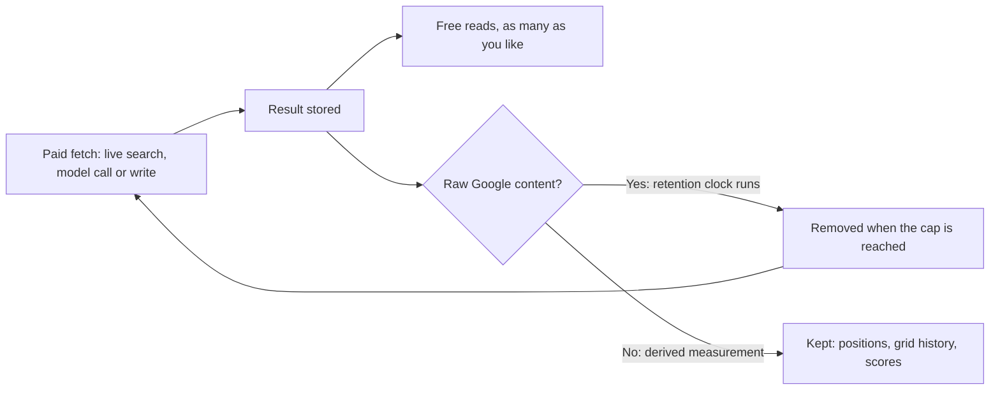

# How the labs work

Theory in this manual is followed by labs. A lab is a short, concrete exercise you run on a real business, with a stated cost and a stated "what good looks like" so you can tell whether you did it right.

Every lab looks like this:

### Lab 0.1 — Read a lab

> **Lab** · Where: this page · Cost: **free** · Time: 1 min
>
> You need: nothing.

1. Read the block above.
2. Note the four facts it always gives you: *where* the work happens, what it *costs*, how long it *takes*, and what you need to have done first.

**What good looks like.** You know, before starting any lab, whether it will cost you anything.

**Why it matters.** Local SEO tools meter live searches against Google. A guide that does not tell you what an action costs is not respecting your money.

---

## The workbench

The labs run in **SEOG** (`app.seog.ai`). Creating an account is free and takes about a minute — you will do it in [Set up your workbench](./set-up-your-workbench.md).

**A new account starts on a time-limited free trial** with a credit balance included; the app shows the balance and how long the trial has left.

**When the trial ends the account goes view-only.** Everything already fetched stays readable, and running a paid action again needs a plan. Work on one business and pace the paid labs accordingly.

We built SEOG, and we wrote this manual. That is worth knowing up front, and it is also why the labs can be precise: we can tell you exactly which screen to open and exactly what you should see, which no tool-agnostic guide can do.

## Reading is free. Fetching is not.

This is the most useful economic fact in local-SEO tooling, and it is not a SEOG quirk. Anything that answers a question about the map pack pays Google — or a model provider — per request, so the same split shows up wherever you work.

**Reading stored data is free.** Once something has been fetched on your behalf it is stored, and looking at it again costs nothing: opening your rankings, scrolling your grid history, comparing snapshots you took last month, as many times as you like. You are never charged twice for the same fetch.

**Fetching new data costs.** A rank check is a live search against Google. A geo-grid scan is one live search *per grid point* — the largest preset is a 7×7 grid, so 49 of them. An AI draft is a call to a language model. Publishing a reply writes to Google's API. These cost real money to run, so they are metered.

**Stored is not the same as permanent, and the limit is Google's, not the tool's.** Google's terms cap how long raw Google content may be kept: Business Profile content at 30 calendar days, and Places content carries no general caching grant at all beyond a short list of exemptions such as place IDs.

So the raw Google material is deleted or stripped on that clock unless a fresh sync re-fetched it, while what the tool *derived* stays:

| Ages out on Google's clock | Survives |
| --- | --- |
| Review text, a competitor's name and rating, profile hours and description | Your rank positions, your grid history, profile scores, the trends built from them |

**It is also why a re-sync is charged:** it is a new fetch, not a re-read. The clauses and their sources are in [Storing Google data legally](../05-reference/storing-google-data-legally.md) — LSM-POLICY-06 for Places, LSM-POLICY-27 for Business Profile.

*Both halves of the rule on one screen. The position, the summary tiles and the rivals list are stored results — open this page fifty times today and it costs nothing. "Checked 2h ago" tells you when the data was last fetched. Only the buttons that go and get something new spend anything — **Track** and **Check now** run a live search, **Suggest keywords** calls a model — and each shows its price on the button before you click it.*

Two habits follow from this, and they are worth forming early:

1. **Look at what you already have before fetching more.** Most questions a beginner tries to answer with a fresh scan are answerable from last week's scan. This is the biggest difference between someone whose tooling bill stays small and someone who keeps paying for a number they already had.
2. **Fetch on a schedule that matches how fast the thing actually moves.** Map-pack positions drift over weeks rather than hours *(inference — Google publishes no update cadence for local results; this is what repeated scans of the same keyword show)*. Scanning daily mostly tells you what scanning fortnightly would, and costs fourteen times as much to find out.

> **Note** · SEOG shows the exact price on the button before you run anything, and refunds automatically if the action fails. Nothing in this manual will surprise you with a charge. Costs in labs are marked **free** (reads stored data) or **paid** (fetches new data) rather than with hard numbers, because prices change and a manual should not lie to you six months from now.

## Doing the labs without SEOG

Every lab names the underlying concept and where the raw data comes from, so nothing here is locked to one tool. The long form — every lab with its by-hand equivalent, and what each substitute does and does not give you — is [Doing it without SEOG](../99-appendix/doing-it-without-seog.md). The short version:

| Lab type | Do it manually with |
| --- | --- |
| Rank checks | An incognito search made from the location you care about (see the caveat below) |
| Geo-grid | Repeat the above from a dozen coordinates, record in a spreadsheet |
| Profile audit | The Google Business Profile dashboard, read every field |
| Citations | Search `"Business Name" "Phone"` and check each result by hand |
| Reviews | The GBP dashboard review tab |
| AI visibility | Ask ChatGPT, Gemini or Perplexity the question yourself, record the answer |

**The caveat on faking a location.** Chrome's DevTools location override changes what the Geolocation API reports, which Maps uses — but Google web search derives location from several signals and does not always use that API, so the override can change everything on Maps and nothing on the results page.

Test it on your own machine before you trust it, and treat the undocumented URL parameter people circulate for the same purpose as what it is: unsupported, and it has broken before.

**It all works. It is simply slow, and it does not keep history** — which turns out to matter enormously, because local SEO is judged on movement over weeks, and you cannot see movement you did not record. That is the real argument for tooling, and it is worth understanding rather than taking on faith.

## Conventions used throughout

| Convention | Meaning |
| --- | --- |
| `/b/{businessId}/rankings` | A page inside the SEOG app. `{businessId}` is your business — the app fills it in. |
| **Bold UI names** | Something you click, exactly as it is labelled on screen |
| *Inference* | Not documented by Google; our reading of observed behaviour |
| Cost: **free** | Reads stored data; run it as often as you like |
| Cost: **paid** | Fetches new data; the exact price is shown before you confirm |

---

**Next:** [Set up your workbench →](./set-up-your-workbench.md)
