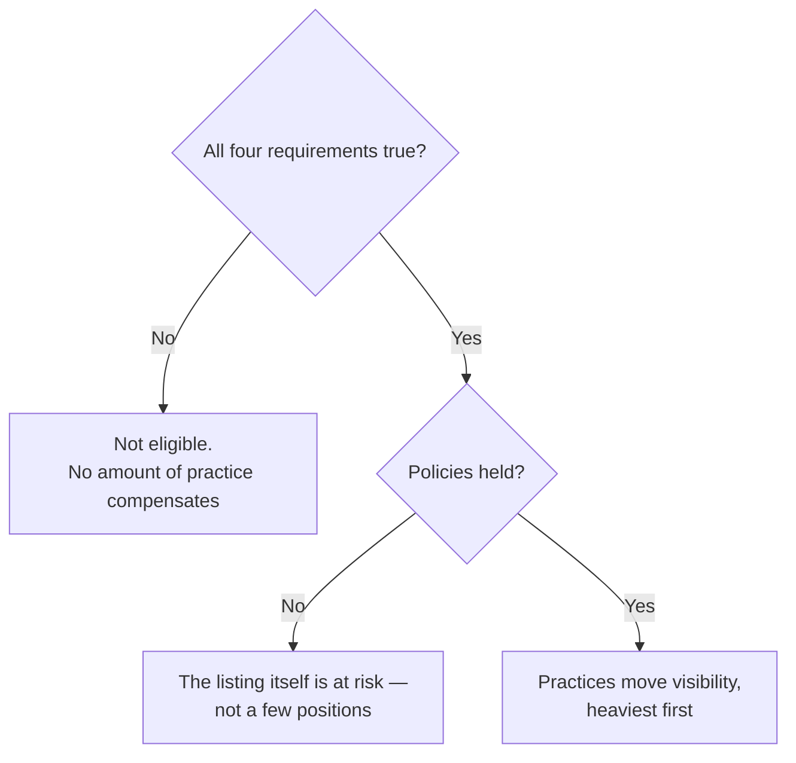

# Local SEO Essentials

Local SEO has three parts, and they are not equally negotiable.

**Requirements** are conditions that must hold before anything else matters. **Policies** are rules that, when broken, cost you the listing rather than a few positions. **Practices** are the work that moves visibility once the first two are satisfied.

Meeting the requirements does not guarantee you appear in the map pack — no one can promise that, and anyone who does is selling something. It guarantees only that you are eligible to.

This page is the short version. Every line links to the chapter that explains it.

*The order is the argument. Work spent on practices while a requirement is false buys nothing, and a policy breach does not cost you positions — it costs you the listing that the positions were on.*

## Requirements

Four conditions. If any is false, no amount of optimisation compensates.

- **The business serves a place.** Local ranking is computed against a searcher's coordinate. A business with no premises and no defined service area is not eligible for the map pack at all — see [what local SEO actually is](../01-foundations/what-is-local-seo/index.md).
- **A Google Business Profile exists and is verified.** The profile, not your website, is the thing that ranks. [Google is not ranking your website](../01-foundations/the-business-entity/index.md) explains why that distinction changes everything downstream.
- **The profile is not suspended, and its status is not "temporarily closed".** A closed status is close to invisibility, and it is the single most under-weighted failure in most audits — [suspensions and reinstatement](../03-advanced/suspensions-and-reinstatement/index.md).
- **The primary category is right.** A wrong primary category is not a small loss of relevance; you are not a candidate for the query at all. [The profile is the product](../02-core-practice/the-profile-is-the-product/index.md).

One category of business fails a requirement it cannot fix: a **pure service-area business**, which hides its address, has no public coordinate. Map-pack rank tracking is structurally impossible for it — in any tool. [Why rank tracking cannot work for service-area businesses](../03-advanced/service-area-businesses/index.md).

## Policies

Breaking these risks the listing itself, not your position.

- **The name field is the real-world name.** Adding keywords to it works and is against the guidelines, and it is the easiest thing for a competitor to report. Both halves are true — [the profile is the product](../02-core-practice/the-profile-is-the-product/index.md).
- **Categories describe what you actually sell.** A category for something you do not provide is a violation with a real enforcement path.
- **One profile per real location.** A second profile at the same address is a duplicate, not a tactic — [spam and fake listings](../03-advanced/spam-and-fake-listings/index.md).
- **Review solicitation is constrained**, and the constraints changed in April 2026 without announcement. Do not automate replies without prior consent — [reviews](../02-core-practice/reviews/index.md).
- **Media must be yours.** Google's media policy requires imagery you captured; stock, collages and generated images are a rejection risk — [photos](../02-core-practice/photos-and-the-visual-profile/index.md).
- **Stored Google data has a retention limit**, and it is shorter than most tools imply — [storing Google data legally](../05-reference/storing-google-data-legally.md). That chapter is our reading of published terms, not legal advice.

## Practices

Ordered by how much they move visibility, heaviest first.

- **Complete the profile.** Categories, services, hours, attributes, description, photos. The cheapest work with the largest effect, and the most commonly half-done.
- **Earn reviews continuously, and reply to them.** Volume, rating and recency all feed prominence, and the aggregate clock cannot be compressed — plan a quarter, not a week ([the ninety-day plan](../04-operating/the-ninety-day-plan/index.md)).
- **Make the name, address and phone identical everywhere.** Inconsistency is an entity-resolution problem before it is a ranking problem — [citations and NAP consistency](../02-core-practice/citations-and-nap/index.md).
- **Give each location its own page**, with that location's details on it — [the website half](../02-core-practice/the-website-half/index.md).
- **Be legible to answer engines.** Assistants read pages *about* your market, not the map pack, so presence there is a separate problem with separate levers — [how an AI assistant answers a local question](../01-foundations/how-ai-answers-a-local-question/index.md) and [changing the answer](../03-advanced/changing-the-ai-answer/index.md).

## What this page deliberately does not say

It gives no ranking-factor weights and no "top 200 factors" list. Google publishes almost nothing about local ranking, and most published weightings are practitioner surveys — opinion aggregated, not measurement.

It also gives no timelines. Nobody outside Google knows how long a change takes to affect ranking, and a confident number is a guess wearing a decimal point.

Where this manual states something as inference rather than documented fact, it says so. Where a fact can go stale, it carries the date it was last checked.

**Start here:** [How the labs work](./how-the-labs-work.md) · **Or diagnose a business now:** [Diagnosing a business in thirty minutes](../02-core-practice/analyzing-business-visibility/index.md)
