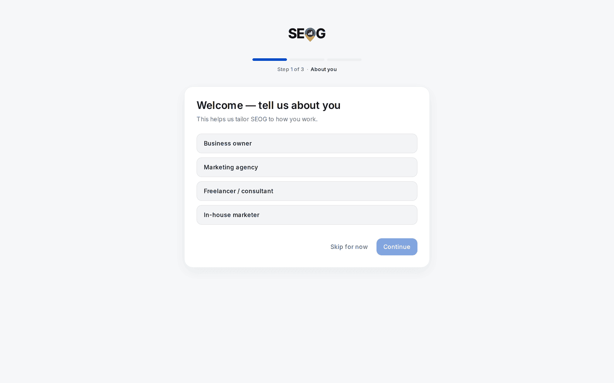
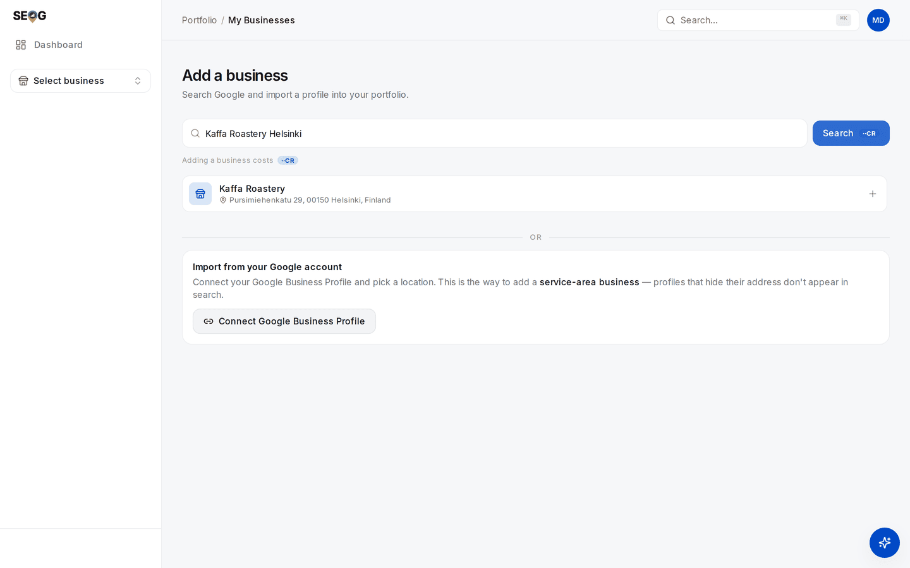
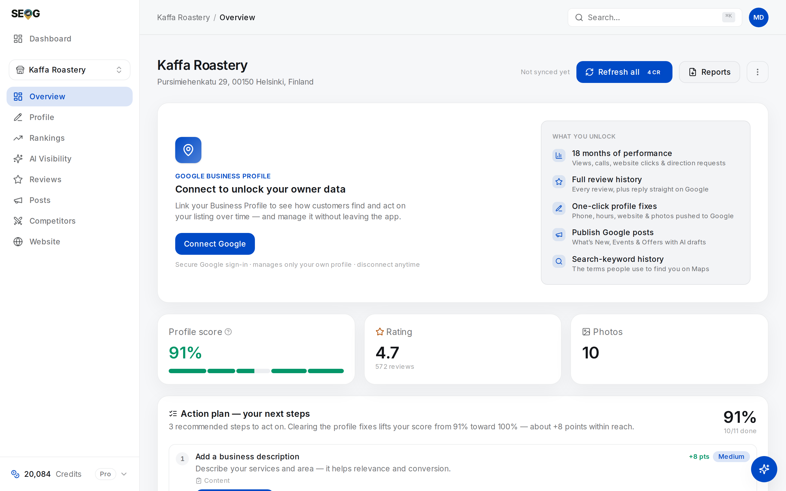

# Set up your workbench

You need one real business to work on. Everything from here forward is done against it, so this choice matters more than it looks.

## Choose your practice business

There are two ways to work through this manual, and they open different halves of it.

| | **A business you control** | **A business you only observe** |
| --- | --- | --- |
| Examples | Yours, your employer's, a client's, a friend's shop | Any local business you can find on Google Maps |
| Can you *measure*? | Yes | Yes — rankings, grid, competitors, citations, AI visibility all work |
| Can you *change* anything? | Yes — profile fields, review replies, posts, photos | No |
| Needs Google Business Profile access? | Yes, for the write labs | No |
| Which chapters fully work | All of them | Roughly two thirds |

**Take the first option if you possibly can.** The chapters that change something — fixing a profile, replying to reviews, publishing posts — are where local SEO stops being theory. If you have any route to a real business (a family shop, a friend's studio, your own side project), use it. Ask for "manager" access on their Google Business Profile; it takes them two minutes to grant and does not give you control of their Google account.

If you genuinely have none, pick a local business you find interesting and work the read-only path. You will still learn to diagnose, which is most of the skill. Do the write chapters as reading, then come back when you have access to something.

> **A word on ethics.** Measuring a business you do not own is entirely normal — every agency does it before a pitch, and it uses only public data. *Changing* one you do not own is not. Do not attempt write actions on a profile you have not been given access to.

### What makes a good practice business

- **It has a physical location or a defined service area.** Online-only businesses do not appear in the map pack and most of this manual will not apply.
- **It is not ranking #1 for everything already.** You want room to see movement.
- **It is in a real market with competitors.** A business with no local rivals teaches you nothing about competition.
- **It gets some reviews.** Even a handful. A profile with zero reviews cannot demonstrate the review chapters.

A small dentist, restaurant, gym, salon, plumber, law office or auto shop in a mid-sized city is close to perfect.

## Create your account

### Lab 0.2 — Create an account and complete onboarding

> **Lab** · Where: [app.seog.ai/sign-up](https://app.seog.ai/sign-up) · Cost: **free** · Time: ~3 min
>
> You need: an email address.

1. Go to **app.seog.ai** and sign up. Signup does **not** log you straight in — it creates the account and emails you a verification link, then shows a *check your email* screen.
2. Open the email and click the link. It both verifies your address and signs you in, so you land in the app without re-entering your password.
3. You will arrive at the **onboarding wizard**, not the dashboard. It is three short steps and it is mandatory — the app sends you back until it is done.

| Step | What it asks |
| --- | --- |
| About you | Which role fits you: business owner, agency, freelancer, in-house marketer |
| Your goals | What you want to focus on: rankings, reviews, competitors |
| How you found us | Optional; finish or skip |

4. Finishing drops you on **Add a business** (`/businesses/new`).

*Step 1 of 3. The wizard is mandatory, but every step carries a "Skip for now" — the answers only tune what the app puts in front of you, and nothing here gates a feature later.*

**What good looks like.** You are signed in, onboarding is complete, and you are looking at the add-business screen.

**If the email never arrives.** Check spam first. The sign-in screen has a resend option. Verification is required before a session will open, so there is no way around it.

---

## Add the business

### Lab 0.3 — Add your practice business

> **Lab** · Where: **Add a business** (`/businesses/new`) · Cost: **paid** (searching Google and importing a profile are live lookups) · Time: ~2 min
>
> You need: Lab 0.2 done, and a business chosen.

1. Start typing the business name and its city — for example `pergola coffee helsinki`. SEOG searches Google Places and returns matching profiles. The search is biased toward your approximate location, so a bare brand name usually still resolves.
2. Pick the right listing from the results. Check the address carefully; chains and similarly-named businesses are easy to confuse.
3. SEOG imports it, pulling in the real profile: name, address, category, rating, review count.
4. You land on the business overview at `/b/{businessId}/overview`.

*Results come back as Google holds them — name plus full street address. Match the address, not the name; that is how you avoid importing the wrong branch of a chain. The "Import from your Google account" panel underneath is the other path — see **If search cannot find it**, below.*

**What good looks like.** The overview shows the business's actual name, address, star rating and review count — the same values you see on Google Maps. If a field is empty, that is because Google does not expose it, not because something failed. SEOG shows fields empty rather than inventing plausible-looking values, which matters more than it sounds: a tool that fabricates one field will fabricate a ranking.

*Everything on this screen came from Google, not from you: the address, the 4.7 rating over 572 reviews, the photo count. The panel at the top is the boundary the next section is about — without an owner connection, this is the whole of what a searcher can see.*

**If search cannot find it.** Service-area businesses — mobile and at-home services that hide their street address — are deliberately kept out of public search results by Google, so no search tool can find them. Use **Import from your Google account** on the same page instead: connect the Google Business Profile that owns the listing and pick the location. This path only works for profiles you have access to. [Service-area businesses](../03-advanced/service-area-businesses.md) covers why this whole category behaves differently.

---

## Connect Google Business Profile (if you control the business)

Importing gives SEOG the *public* view of the business — the same thing any searcher sees. Connecting the Google Business Profile account that owns the listing gives it the *owner* view, and they are not the same data at all.

| | Public view (import) | Owner view (connected) |
| --- | --- | --- |
| Name, address, category, hours | Yes | Yes |
| Rating and review count | Yes | Yes |
| Full review history | Recent sample only | Complete |
| Reply to reviews | No | Yes, published to Google |
| Profile description | Not visible | Yes |
| Edit profile fields | No | Yes |
| Publish posts and photos | No | Yes |
| Views, calls, direction requests | No | Yes, about 18 months of daily history |
| Search terms people used to find it | No | Yes |

That bottom half is the data local SEO is actually judged on, and Google gives it to nobody but the owner. If you have access, connect it now.

### Lab 0.4 — Connect the Google Business Profile

> **Lab** · Where: `/b/{businessId}/overview` · Cost: **free** to connect · Time: ~2 min
>
> You need: manager or owner access to the business's Google Business Profile. Skip if you are on the observe-only path.

1. From the business overview, start the Google connection and sign in with the Google account that manages the profile.
2. Grant access when prompted.
3. Confirm the connection is live — owner-only panels (performance, full review history, the profile description) become available once it is.

**What good looks like.** The overview shows owner data it could not show before: real performance numbers and complete review history.

*A different business, this one connected. The quickest tell is what is missing: no "Connect to unlock your owner data" panel at the top. The score is also honest about the state of the profile — 36%, in red, with each recommended fix carrying the points it is worth. That list is the raw material for Part II.*

**What you just learned.** Most of what people call "local SEO data" splits cleanly into public and owner-only. When you evaluate any tool in this industry, the first question is which half it can see — and any tool claiming owner-grade metrics without an owner connection is guessing.

---

## You are ready

You now have an account, a business, and — if you were able — the owner connection.

Part I explains what you are looking at before you start changing things. If you are impatient to *do* something, [Part II](../02-core-practice/analyzing-business-visibility.md) starts with a full diagnostic of the business you just added, and you can read Part I when something there surprises you.

---

**Next:** [Part I — What local SEO actually is →](../01-foundations/what-is-local-seo.md)
