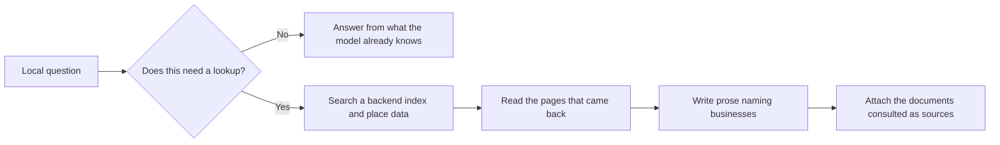

# How an AI assistant answers a local question

Ask Google for a plumber and you get a ranked list of places. Ask ChatGPT the same thing and you get three names in a paragraph, with links underneath.

These look like the same answer in different clothing. They are not. They are produced by different machinery, from different data, with location entering at a completely different point.

This chapter is about that machinery. Not how to change the answer — that is [Part III](../../03-advanced/changing-the-ai-answer/index.md) — but what the answer actually *is*, so that when you measure it later you know what you are measuring.

## The four steps

Every assistant answering a local question does roughly the same four things. The differences between engines live inside step two.

**1. It decides whether to look anything up.** Asked "what is a French drain", a model answers from what it already knows. Asked "best plumber in Leeds", it cannot — that is a fact about the world that changes weekly. So it calls a search tool. The decision is made by the model, not by a rule, which is the first place variance creeps in.

**2. It searches.** This is the step that decides who gets named, and the step nobody looks at. The model issues text queries to a search backend and gets back pages.

Different assistants are wired to different backends: Google's assistant grounds in Google Search and Google's own place data; others call a web-search tool over a different index, sometimes supplemented by a third-party place provider. Same question, different result sets, before a word of the answer is written.

**3. It reads and writes.** The model reads what came back — a Yelp category page, a "10 best plumbers in Leeds" listicle, two business homepages, a Reddit thread — and composes prose grounded in it. The businesses it names are, overwhelmingly, businesses that appeared in the text of those pages.

**4. It attaches sources.** The links underneath are the documents consulted. They are not a ranking, and not proof that a given source caused a given name. They are a bibliography — and the most useful part of the output for your purposes, because they tell you which pages the machine was reading when it chose who to recommend.

The consequence of step three is the most important thing in this chapter:

> **An AI assistant does not read the map pack.** It reads pages *about* your market.

Your map-pack position and your presence in an AI answer are outputs of two retrieval systems reading two different corpora. They correlate — both favour well-reviewed, well-established businesses — but they are not the same question, and a business can be strong in one and absent from the other.

## Where location enters, and where it does not

In the map pack, location *is* the query. The search happens at a coordinate, the results are computed for that coordinate, and distance is a first-class ranking force — which is why rank is [a map rather than a number](../rank-is-a-map-not-a-number/index.md), and why [proximity dominates](../relevance-distance-prominence/index.md) at short range.

In an AI answer, location is a *string*. It arrives one of three ways:

- you typed a place name;
- the assistant inferred one from context;
- the assistant had your device location and put it into the search query.

Then it is passed to a text search, and from there the system is doing retrieval over documents. Nothing in the pipeline computes the distance from you to a business and weighs it.

Two things follow.

**First: proximity decay is much weaker inside an AI answer than inside a map pack.**

The only published measurement points the same way. Local Falcon's whitepaper on AI Overviews (May 2025, roughly 60,000 simulated searches) reported a correlation of **0.001** between distance and position *inside* an AI Overview — effectively none. It is quoted with its limits in [the three forces](../relevance-distance-prominence/index.md).

Note carefully what that does *not* say. The same study found proximity still moved **whether a business was included at all** — a different question from where it sits once it is in. And the mechanism offered above is ours *(inference — our reading, not a controlled test)*.

> The consequence holds either way: a business that vanishes from the map pack two miles from its door can still be named by an assistant, because the assistant is not measuring the two miles.

**Second: location handling in these products is young, and it changes under you.**

ChatGPT did not share device location with its search tool by default. OpenAI shipped an opt-in location-sharing setting on 26 March 2026 — off by default, under Settings → Data Controls.

That single change invalidates much of the published "we tested AI local search" writing, because those earlier tests were measuring an engine that often had no reliable idea where the user was standing. **Check anything you read on this subject against its publication date before you act on it.** *(Stated as of 2026-07; re-check before citing.)*

This is why probe design matters. To learn what an assistant says about your market, the question must carry the location explicitly and must not name the business:

> Someone near latitude `lat`, longitude `lng` asks: "`keyword`". Recommend the specific local businesses that best answer this, by name, citing your sources.

(Substitute your own coordinates and your own keyword for the three placeholders.)

Three properties do the work:

- **Unbranded**, so the answer is not begged.
- **Geo-anchored** with coordinates rather than a place name, so the same prompt can be run from different points and compared.
- **Explicitly asking for sources**, so step four produces something readable.

You will meet this prompt again as the basis of a real method in [Part III](../../03-advanced/ai-visibility/index.md); for now the point is that "I asked ChatGPT if I'm the best plumber in Leeds and it said yes" is not data.

---

**Next:** [What an AI visibility number actually measures →](./what-the-numbers-mean.md)
