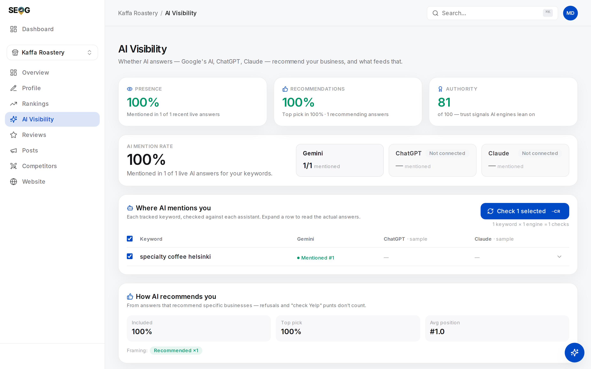

# What an AI visibility number actually measures

The machinery is settled: retrieval over documents, location arriving as a string, a bibliography at the end. What remains is what you are allowed to claim from it. This page separates the three axes people collapse into "the AI mentions us", and grades the claims already in circulation.

## Named, cited, and recommended are three different things

When people say "the AI mentions us", they usually mean one of three things, and conflating them makes the number meaningless.

| Axis | What it means | Why it matters |
| --- | --- | --- |
| **Named** | Your business name appears in the answer text | The customer-visible outcome |
| **Cited** | Your own domain appears in the source list | Evidence the model read *your* content, not someone's page about you |
| **Stance** | *Recommended*, *listed*, *hedged*, or *negative* | "Also worth a look, though reviews are mixed" is not a recommendation |

**These come apart constantly.** The common case is **named but not cited**: the assistant read your Yelp page and your Google profile, named you off those, and cited Yelp. You got the customer; your website contributed nothing.

The inverse — cited but not named — happens when the model reads your site for background and recommends someone else.

**Stance is the axis people skip**, and the one a naive keyword search over the answer text gets wrong. A string match for your name cannot tell "the standout choice" from "a popular option, though several reviews mention delays". Both contain your name. Only one sells anything.

## A chatbot always answers, so "presence" is a category error

A Google AI Overview genuinely does or does not appear on a results page. Whether it appears is a real, measurable quantity.

Ask an assistant a question and it *always* answers — there is no state in which ChatGPT declines to produce text. So a metric called "AI presence", built by asking a chat assistant a question and checking whether an answer came back, is 100% by construction, for every business, forever.

Two things on the panel you are about to open share the word, and they are not the same quantity.

**The per-check flag.** Behind every individual check there is a flag for whether an AI answer appeared at all — a leftover from an earlier design that read real AI Overviews off a results page. On the chat engines that flag is always true, so it carries no information; all it drives is the sentence under a checked cell.

**The tile labelled Presence.** Something else entirely: a mention rate over recent live checks, the share in which you were named or your own domain was cited. That one is a measurement.

Keep them apart, and treat any dashboard reporting a chat-engine "presence rate" as owing you an answer to which of the two it is reporting.

*The panel cold, before any check. Presence, Recommendations and AI mention rate each carry an **Example** pill — those percentages are the interface's own placeholders, not this business. Two of the three engine tiles read **Not connected**. Authority is the only number here without a pill, because it is computed rather than illustrated — a weighted blend of five signals, from which any factor not yet measurable drops out with the remaining weights renormalised. On a cold profile that leaves the review factor carrying the whole score, so the number is real but narrow.*

For chat engines, the axes that carry information are **named** and **cited**. Everything else is decoration.

## One run is not a measurement

Ask the same assistant the same local question twice and you will often get a different set of businesses. Not a different ordering — a different set. Sampling temperature, tool-call variation and a moving index all contribute.

One hard consequence: a screenshot is an anecdote. The only stable quantity is a *rate over runs* — of the last N checks of this keyword on this engine, in how many were you named?

[Part III](../../03-advanced/ai-visibility/index.md) makes that rigorous, including how large the window needs to be and what leaves the denominator. In Part I, learn the reflex: **one AI answer is not evidence of anything.**

## Claims you will see repeated, and what they are worth

Local AI visibility is a young discipline and already has folklore. Some of it may be true. Each row below states what we could and could not trace to a source, so you know which is which before repeating it to a client.

| Claim in circulation | Evidentiary status |
| --- | --- |
| "70% of ChatGPT's local results come from Foursquare" | There is an attribution, but not a primary one. The figure traces to independent analyses circulated in the SEO trade (usually credited to Natzir Turrado / Yaggoseo), not to OpenAI or Foursquare, neither of whom publishes the share. Secondary write-ups disagree on the number itself — reported variously as 60–70% and as "over 70%". The method behind it is not published. Do not put a percentage in a client deck. *(open question)* |
| "Google's assistant is near-perfect on profile details; others are around two-thirds accurate" | SOCi's 2026 Local Visibility Index reports figures of this shape — roughly 68% profile accuracy on ChatGPT and Perplexity against near-100% on Gemini — and [chapter 1](../what-is-local-seo/index.md) quotes it with its caveats; the method behind it is not fully published, so treat the percentages as soft. The *mechanism* is real — an assistant grounded in Google's own place data reads the profile itself, one grounded in general web search reads pages about the business — but a mechanism is not a measurement. *(inference)* |
| "An `llms.txt` file makes AI engines cite you" | As a file engines fetch, a measurable non-signal: Ahrefs' June 2026 log study across ~137,000 domains found the great majority of `llms.txt` files were never requested at all, and that AI crawlers did not go looking for one where it was absent. Separately, Google's own site-quality tooling now scores whether one exists — the Agentic Browsing category added to Lighthouse and PageSpeed Insights in 2026 checks for a valid `llms.txt` at the domain root, alongside a clean accessibility tree and a stable layout. Both are true at once; the manual names the contradiction rather than resolving it — see [Making the site readable by an AI agent](../../02-core-practice/making-the-site-readable-by-agents/index.md). *(Verified 2026-07-27.)* |
| "Schema markup causes AI mentions" | Correlated with visibility; no published work shows causation. Worth doing for other reasons. |
| "Backlinks and domain authority drive AI recommendations" | Reported correlations for classic authority metrics sit close to noise; brand and reputation signals sit far above them. Ranked properly in [Changing the answer](../../03-advanced/changing-the-ai-answer/index.md). |

Nobody outside these vendors knows how retrieval is weighted, and anyone quoting a precise figure for it is guessing or repeating a guess. What you *can* know is what a given engine actually said, on a given day, for a given question — because you can ask it and write the answer down.

---

**Next:** [Checking what assistants say about you →](./checking-what-assistants-say.md)
