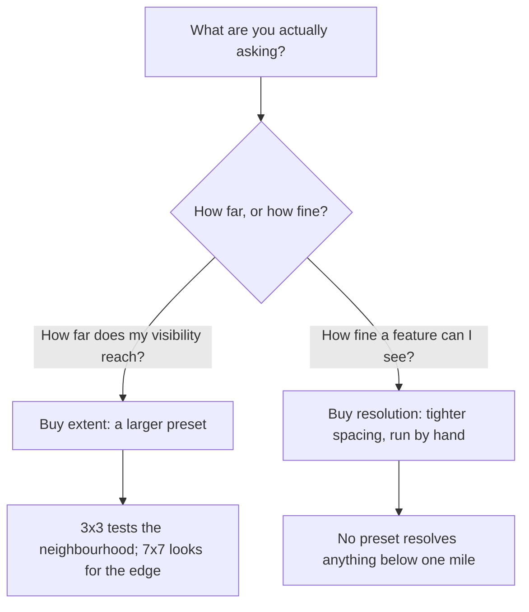

# Choosing a grid size and reading the heatmap

You now know what a grid is and what its two parameters do. The next two questions are which grid to run, and how to read what comes back without flattering yourself.

## Resolution is a statistical choice, not a budget one

**Grid size is usually taught as a spending decision:** small grid cheap, big grid expensive, choose by the client's budget. That framing is mostly wrong, and it is worth understanding why before you form the habit.

A rank measurement needs exactly one thing from Google: **which places came back, in what order.** Not their ratings, not their phone numbers, not their hours — you are looking for your own entry in a list and reading off its index.

**Google prices description, not results.** It charges a place search by *how much it tells you about each result*, not by how many results come back. Ask for the rich profile of every result and you are in an expensive tier; ask for less and you are in a cheaper one.

What does not change is the result set or its order — the field mask governs how much each result is described, not which results Google returns. The position is the index either way.

So the search half of a geo-grid scan has a wholesale cost of zero, at any grid size, at any volume. What remains genuinely chargeable is drawing the result on a real Google map, which happens once per scan and does not depend on n. The derivation — which requested fields push a call into which billed tier, with the tier prices — is [What the Places API will and will not give you](../../05-reference/what-places-returns.md).

The consequence is not "grids are free" — every tool prices its own work, this one included, and you should read the price on the button before pressing it. The consequence is about *reasoning*:

> **Choose the grid for the question, not for the invoice.** If the question is "do I hold my immediate neighbourhood", 3×3 answers it and 7×7 adds noise. If the question is "where does my visibility stop", 3×3 cannot answer it at any price, because the answer is outside the grid.

## Reading your first heatmap

Read the shape first. Read the numbers second, and read them suspiciously.

### The legend

**Pins are coloured by position.** The legend under the map carries five swatches:

- **Green** — top 3
- **Yellow** — 4–10
- **Orange** — 11–20
- **Red** — 20+
- **Grey** — not found

The red one is vestigial. A grid reads exactly twenty deep, so a point either comes back with a position of 20 or better or comes back with nothing, and in a real scan you will only ever see the other four. The distinction that matters is **coloured versus grey**.

### Five shapes

Five shapes cover most real grids. The causes below are inference from repeated reading, not documented behaviour.

| Shape | What it looks like | Usual cause |
| --- | --- | --- |
| **Smooth decay** | Green centre fading outward in rings | Healthy and proximity-dominated. The normal case. |
| **Plateau** | The same colour nearly everywhere | Strong prominence across the area, or a thin market. Check which. |
| **Cliff** | Good on one side, grey on the other, sharp edge | A boundary: competitor cluster, city line, river or motorway. |
| **Ring** | Weak at the centre, better further out | A dominant near neighbour sitting on top of you, or a centre point that is not really your address. |
| **Scatter** | No spatial structure at all | Low prominence. Position is decided by tie-breaks, not geography. |

### The two readings around the map

**Above the map: a written second opinion.** The app prints a plain-language reading of the same thing — coverage, the average, the found rate ("you appear in the top 20 at 9 of 9 points"), and the compass direction you are strongest and weakest in ("strongest to the west and weakest to the south-east").

Treat that as a second opinion to check your own reading against. It only claims a direction when the gap between the best and worst side is large enough to mean something, so a genuine plateau produces no direction claim at all.

**Beneath the map** sit the two summary figures, which have **different denominators** and are routinely misread because of it:

- **Avg rank** — your average position *across the points where you appear*. Grey pins are not in it.
- **Top-3 coverage** — the share of *all* points where you rank in the top 3.

A business found at 2 of 25 points, at #1 in both, shows an average rank of 1.0 and top-3 coverage of 8%. The first number is true and nearly useless.

> **Never quote the average without the found rate beside it** — how many of the points you appeared at, out of how many were checked.

## Two properties to carry forward

Part III makes both of these rigorous. Learn them now as habits.

### Rank is ordinal

Position is a label of order, not a measured quantity. The step from #1 to #2 is enormous — the map pack shows three results, so it moves you down inside the only box anyone sees. The step from #11 to #12 is nothing; both are invisible. Arithmetic treats those two steps as identical, which is why "improved by 4.2 positions on average" sounds like a result and means very little.

You are allowed to do arithmetic on ordinals. You are not allowed to believe the answer without saying what you did.

### Not found is censored, not bad

A grey pin does not mean rank 21. It does not mean 25, or 50, or 100. It means the measurement ran out of depth before it found you: your true position is *somewhere worse than 20*, and the instrument cannot say where.

Statisticians call this right-censoring. It matters because every average over a grid must do *something* with those pins, and whatever it does is a choice that moves the result — [Reading a geo-grid without fooling yourself](../../03-advanced/reading-a-geo-grid/index.md) has you score one grid four ways and watch the number travel. For now, one rule: [when you report a grid](../../04-operating/reporting-to-a-client/index.md), give the found rate alongside anything else, and never let a grey pin quietly become a number.

---

**Next:** [Labs: run and read your first grid →](./labs-run-and-read-a-grid.md)
