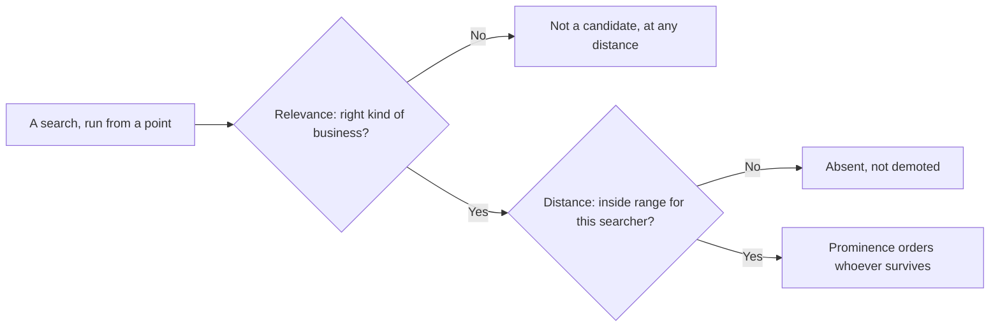

# The three forces: relevance, distance, prominence

Google publishes almost nothing about local ranking, with one exception: it names the three things local results are built from. Relevance, distance, prominence. That help page runs a few hundred words and is the closest thing this discipline has to a spec.

Most of the industry treats it as a slogan. It is more useful than that: once you can see which of the three a problem belongs to, you know whether it is fixable and how fast. This chapter takes the triad seriously, then interrogates it — starting with the force everyone quotes a number for and nobody can defend.

## What Google actually says

From Google Business Profile Help, *Tips to improve your local ranking on Google* (read 2026-07-27):

> "Relevance is how well a Business Profile matches what someone is searching for."

> "Distance refers to how far each business is from the customer who's searching."

> "Prominence means how well-known a business is. Prominent places are more likely to show up in search results."

> "More reviews and positive ratings can help your business's local ranking."

That is the whole documented model. Everything else you read about local ranking — factor lists, weightings, percentages — is inference or opinion. Some of it is good inference, none of it is documentation, and this manual marks the difference every time.

Note the object: the three forces apply to a *Business Profile*, not a website. If that surprises you, read [Google is not ranking your website](./the-business-entity.md) first.

## Relevance: does this profile answer this query

Relevance is a match between a query and an entity. The entity's fields are the raw material: primary and additional categories, name, services, description, attributes, and the linked website's content.

**Category does most of the work.** It tells Google what *kind* of thing the business is, and it is picked from Google's own fixed list rather than typed freely — machine-readable in a way a description never is.

A dentist whose primary category is "Dental clinic" is a candidate for dentist queries. The same business filed as "Medical clinic" is a weaker one, whatever the website says.

*(Inference: Google does not document the field's weight. The observation is that pack members for a query overwhelmingly share one or two primary categories — which you verify in Lab 3.3.)*

**Below category the signals get softer and the evidence thinner.** Sterling Sky, one of the few practitioners publishing controlled experiments rather than assertions, has tested the Services fields directly and found they do move rank — custom services included, and even with the price and description left blank, though by less than Google's own pre-defined ones.

**What that testing does not publish is a *magnitude*.** The write-ups say "measurable" and "significant"; they give no percentage, no average position gain, no share of grid points improved.

A figure of "2–5%" circulates with Sterling Sky's name attached to it — it comes from a reader's comment under one of those posts, not from the test. Do not repeat it, and be suspicious of anyone who does. Treat Services as small, real, cheap and unquantified.

Relevance is the force you control most directly and most quickly. It is also the one people break by over-reaching: adding categories the business does not serve, to widen the net. [The profile is the product](../02-core-practice/the-profile-is-the-product.md) covers that, with the risk attached.

## Distance: the force you do not control

Distance is measured from the searcher — or from the place named in the query — to the business. Not the reverse. Two consequences that beginners consistently get wrong:

**There is no single distance.** Every search happens somewhere, so every search has its own distance to you. A business does not have "a rank"; it has a rank *at a point*. That is the whole argument of the next chapter, [Rank is a map, not a number](./rank-is-a-map-not-a-number.md).

**You cannot optimise it.** No profile edit, review campaign or content programme moves your building. What you can change is structural: where you open the next location, how the service area is defined. Real levers, but business decisions rather than SEO tasks.

The illegitimate version — renting a virtual office, listing a residential address you do not operate from — is common, effective in the short term, and the fastest route to a suspended listing. [Spam, fake listings and the competitive underworld](../03-advanced/spam-and-fake-listings.md) covers what it looks like from outside; [Suspensions and reinstatement](../03-advanced/suspensions-and-reinstatement.md) covers the aftermath.

## Prominence: how well known the business is

Prominence is the messiest of the three and has the most room to work in. Google describes it as fame — how well known the business is, including offline. The observable inputs:

- **Reviews** — count, average rating, recency, and whether the owner responds.
- **Web presence** — being mentioned, linked and listed across the web, including directories.
- **Web ranking** — where the business's own site ranks organically for related terms.

Prominence is slow. A profile does not become well known in a fortnight, which is why every honest plan front-loads relevance fixes (days) and treats reputation work as a quarter-long programme. [The first ninety days](../04-operating/the-ninety-day-plan.md) sequences it.

It also has the best proxies. You cannot see prominence, but review count, rating and photo count are public for every business in your market. That is Lab 3.2: rank the market on the proxies before looking at a single position.

*Nobody here has owner access — this is a coffee roastery someone else runs. Rating, review count and photo count are public for every business on Maps, which is why prominence is the one force you can size up for a competitor as easily as for yourself.*

## The three are not three dials

The triad reads like a formula with three inputs. The behaviour looks more like a pipeline *(inference, from the shape of grid scans — see [Reading a geo-grid without fooling yourself](../03-advanced/reading-a-geo-grid.md) for the evidence and its limits)*:

1. **Relevance decides candidacy.** Wrong category, wrong kind of business: you are not in the running for that phrase at any distance.
2. **Distance decides eligibility at a point.** Past some market-dependent range you stop being a candidate for that searcher — not demoted, absent.
3. **Prominence orders whoever survives.**

This is why "improve my ranking" is under-specified. A business invisible everywhere has a relevance problem. One that is #1 at its door and gone two miles out has a distance problem whose only real fix is prominence — prominence buys range. One sitting at #7 everywhere has a prominence problem and no distance problem at all.

## Proximity, quantified — and then corrected

### The 55% is a poll, not a measurement

Everyone quotes a number for proximity. The most-repeated one — roughly 55% — comes from Whitespark's *Local Search Ranking Factors* (2026 edition, published 6 November 2025): 47 practitioners ranking 187 factors. It is an opinion survey: no experiment, no confidence interval, no stated method for turning votes into percentages. The industry's best consensus, and not a measurement.

**It is also not on the same scale** as the other figures from that survey you will meet later in this manual — profile signals at 32% of local-pack weight, reviews at 20%, citations somewhere in the single digits ([citations and NAP consistency](../02-core-practice/citations-and-nap.md)). Those are shares of a whole; the 55% is proximity's standing as a single named factor, quoted outside that split. Do not add them together, and do not let anyone else.

**Treat the small shares as approximate.** The report itself sits behind a form, and the second-hand summaries of it disagree with each other — citations appear as 6% in some and 7% in others, with wider disagreement still on on-page and links. When two write-ups of one survey cannot agree on a number to the percentage point, the number was never precise enough to carry an argument.

### The largest dataset, and its censored tail

**The largest actual dataset is different in kind.** rankings.io's [Google Maps proximity study](https://rankings.io/data-studies/proximity-data-study/) scanned roughly 1,100 law firms — 20 in each of the 50 largest US cities, plus a second pass at a 5-mile radius in the ten largest — on 15×15 grids of 225 points at a 10-mile radius, for the single keyword *car accident lawyer*. It reports:

| Finding | Value |
| --- | --- |
| Firms ranking #1 at their own address | 56% |
| Average change across the first mile | −8 positions (−5 to −12 depending on the city) |
| Fitted exponential decay constant | λ = 2.3 (the study's own worked example: −9.4 positions at 0.59 mi) |
| Firms out of the top 20 at the grid's outer edge | 27% (Pittsburgh) to 92% (Queens) |

That last row is the one people misquote by attaching a mileage to it. The study says only "at the largest distance", and notes that the largest distance is not identical in every city — so it means the edge of a 10-mile-radius grid, not a specific number of miles.

Read the first row again: barely more than half ranked first *at their own front door*, for their own core term. Proximity is enormous and still not sufficient.

**Now the correction, which matters more than the numbers.** The study measured with a tracker that only sees the top 20 and **imputed a constant value of 25 for every observation past that ceiling** — the authors say so themselves. A business genuinely 400th, or absent altogether, was recorded as 25.

That pulls the tail toward the centre, so the curve is biased optimistic exactly where decay is steepest. The real drop-off past the first mile is worse than λ ≈ 2.3 says, by an unknown amount.

**The other limits are ordinary but disqualifying** if you quote the study as a law:

- One keyword ("car accident lawyer"), one vertical.
- One point in time, no repeat measurement.
- No confidence intervals.
- Grids centred on the firm rather than on demand.
- Never replicated.

> **Carry the *shape*, not the constant.** Decay is steep in the first mile, and how far your visibility reaches is mostly a function of how crowded your market is — the 27%-versus-92% spread is the real finding.

That censoring problem is not a quirk of one study; it is the defect underneath every "average map rank" figure in the category, and Part III takes it apart.

## Proximity in an AI answer: almost nothing

Here the triad stops holding, and no local SEO curriculum has caught up with it.

Local Falcon's May 2025 whitepaper on AI Overviews and local visibility ran 60,000 queries across 4,423 businesses in 20 countries, including 430 US businesses on 7×7 grids at roughly 0.67-mile spacing — about 21,000 geographic data points. Its central finding: **the correlation between distance and rank inside an AI Overview is 0.001**. Effectively zero.

Distance still affected inclusion, barely: businesses within a mile of the search point appeared in 72.0% of answers, against 68.5% for those one to two miles out; average position 3.39 versus 3.49. Once you are in the answer, where the searcher stands has no detectable bearing on your place in it.

**Treat that as directional, not settled.** It covers Google's AI Overviews only — no ChatGPT, no Perplexity, no AI Mode. The data runs to 7 May 2025, over a year stale, and predates both AI Mode's rollout and ChatGPT shipping opt-in device-location sharing on 26 March 2026. Vendor-published, unreplicated.

The direction is at least coherent with how assistants appear to assemble a local answer: retrieval on entity and reputation signals, not a distance sort *(inference)*. So the force that dominates the map pack is close to irrelevant one surface over, and the two slow, hard forces carry across both. [How an AI assistant answers a local question](./how-ai-answers-a-local-question.md) is the mechanism; [Does the AI recommend this business?](../03-advanced/ai-visibility.md) is the measurement.

## What you actually control

| Force | Control | Speed | Where the work is |
| --- | --- | --- | --- |
| Relevance | High | Days | Category, services, description, attributes, site content |
| Distance | Almost none | n/a | Location and service-area decisions only |
| Prominence | High, indirectly | Months | Reviews, listings, mentions, organic ranking |

Two of the three are yours. The one that is not is where most people spend their frustration.

## Labs

### Lab 3.1 — Add one keyword and check it once

> **Lab** · Where: **Rankings** (`/b/{businessId}/rankings`) · Cost: **paid** · Time: ~5 min
>
> You need: Lab 0.3 — a business added.

1. Open **Rankings**. In the add form, type one keyword a real customer would use — a service plus a place, e.g. `emergency plumber tampere`. Not your business name.
2. Leave **Search from**, **Language** and **Radius** at their defaults (business address, 3-mile radius). Note that the three options exist; they are why two tools report different ranks for "the same" keyword.
3. Press **Track**. The price shown on the button is for adding the keyword; the app then runs the first rank check straight after it, which is a *second* metered action with its own price. Two charges, one press — worth knowing before you press it a dozen times.
4. Read the result on the detail panel: a position (`#4`) or `Not ranked`, and a movement line reading `First check`. Then read the **Who ranks above you** card — Lab 3.2 uses it.
5. Now press **Check now** once. This time a one-sentence outcome appears under the button, which the initial **Track** does not print. That sentence is how you tell "the check ran and found nothing" from "the check failed" — on the panel alone the two look identical.

*The whole lab on one screen. Notice the row under the keyword — **Search from**, **Language**, **Radius** — and the price sitting on **Track** before you commit. The `#1` below belongs to those three settings and to no others.*

**What good looks like.** Either a position, or `Not ranked` with a line naming who holds #1. Both are successful checks. The check is capped at the top 20, so "not ranked" means "not in the top 20 from that point", not "nowhere".

**If it went wrong.** Three realistic causes. The keyword was too broad or too branded. Or the origin defaults to the business address, so a business at the edge of the city it serves looks worse than it is — re-add it with a **Search from** label naming a district. Or it is a pure service-area business with a hidden address, which rank checks structurally cannot find, in any tool ([Service-area businesses](../03-advanced/service-area-businesses.md)).

**What you just learned.** A rank check is a live search from a specific point, in a specific language, at a specific radius — all parameters you chose. A rank quoted without them is not a measurement.

---

### Lab 3.2 — Rank the market on prominence before you look at position

> **Lab** · Where: **Rankings** → your keyword → **Who ranks above you** (`/b/{businessId}/rankings`) · Cost: **free** · Time: ~10 min
>
> You need: Lab 3.1.

1. In a spreadsheet, write down every business in the **Who ranks above you** card: name, star rating, review count. Add your own business as a row.
2. Cover the position column and sort by review count, descending.
3. Write your prediction of the actual pack order from rating and review count alone, then uncover the positions and compare.
4. For every business ranking higher than its prominence predicts, write one sentence naming the likely reason — usually distance (closer to the search point) or relevance (tighter category match).

**What good looks like.** A short table where most of the order is explained by review volume and rating, and the exceptions have a named cause. You should now be able to say which force is holding you back.

**If it went wrong.** A missing card means the last check found nobody above you, or returned nothing. If every review count in the market is in single digits, the ordering is noise — prominence differentiates weakly in thin markets.

> **Going further.** Once you track competitors, the **Vs local market** strip on the overview plots you against the market average and the best rival on rating, reviews and photos. Until then it shows a clearly-labelled example rather than your data — worth knowing about any dashboard. [Reading a competitor off their public data](../02-core-practice/competitors.md) does this properly.

**What you just learned.** Prominence has public proxies, and reading them first stops you misdiagnosing a distance problem as a reputation problem. It is also the method for sizing up any market you have no access to.

---

### Lab 3.3 — Relevance audit: your category against the pack's

> **Lab** · Where: **Profile** (`/b/{businessId}/profile`) plus Google Maps in another tab · Cost: **free** · Time: ~15 min
>
> You need: Lab 3.1.

1. Open **Profile**. At the top, next to the status pill, is your primary category. Write it down exactly.
2. In Google Maps, look up each business from your **Who ranks above you** list and read the category line under its name.
3. Tabulate: business, position, category.
4. Answer in writing: do the top three share a primary category, and is it yours?

*Step 1 on screen: the pill row under the heading — **Open**, then the primary category, **Coffee Shop**. That chip is picked from Google's fixed list rather than typed, which is what makes it legible to a machine in a way a free-text description never is.*

**What good looks like.** A four-row table whose category column is nearly uniform. That uniformity is the point: Google telling you, free, what kind of entity it believes answers this query.

**If it went wrong.** Some listings carry a category that reads oddly — the list is fixed, and the closest option is sometimes a poor fit. If the pack's categories are scattered rather than uniform, your keyword is ambiguous, which is a finding in itself and a reason to reconsider it.

**What you just learned.** Relevance is legible from outside. The pack is a live answer key for what Google thinks the query means, and comparing your primary category against it is the cheapest diagnostic in local SEO. If you are the only pack member with a different category, you have found your first real problem.

---

> **Without SEOG.** All three labs work by hand: an incognito window with a location override in your browser's dev tools for the rank check, Google Maps for categories and review counts. Same data. What you lose is the record — you cannot see movement you did not write down. [Doing it without SEOG](../99-appendix/doing-it-without-seog.md) is the long version.

## Common mistakes

**Quoting "proximity is 55% of local ranking" as if it were measured.** It is a poll of 47 practitioners, repeated everywhere without its method because it has none. Read it as expert consensus. Do not put it in a client deliverable as a statistic.

**Trying to fix distance.** Virtual offices, a colleague's home address, a mailbox in the target suburb. It works until it does not, and the failure mode is losing the listing. If proximity is genuinely the constraint, the honest answers are a real second location or a prominence programme that extends your range.

**Assuming the AI answer obeys the same forces.** A business can be invisible in the map pack two miles out and named in an assistant's answer from across the city, and vice versa. Different machines, different inputs.

**Adding categories to widen relevance.** More categories feels like more coverage. It dilutes the primary signal, and categories that do not describe what the business does are a guideline violation. Fix the primary category first; add secondary ones only where the service is genuinely provided.

## Check yourself

Answer these against your own practice business, in writing.

1. **Which force is your binding constraint right now?** A defensible answer sounds like: "relevance is fine — my category matches the pack; my review count is a third of the market average, so prominence is the constraint."
2. **A competitor ranks above you at your own address. Name the two likeliest explanations and how you would tell them apart.** (Prominence, or a tighter category match. Lab 3.2 separates them; if their review count is comparable to yours, look at category next.)
3. **Why can a business rank #1 at its front door and vanish two miles away with nothing wrong with the profile?** (Distance applies per search point, and prominence sets how far your range extends. In the largest published study only about 56% held #1 even at their own address.)
4. **A tool reports your rank for "dentist" as 4. What three parameters must you know before that number means anything?** (Where the search ran from, in what language, and how deep the tool tracks before calling you "not ranked".)
5. **If proximity barely affects position inside an AI answer, what does?** (Relevance and prominence signals — entity data, reputation, which sources the engine cites. Part III measures it; nobody should have a confident number yet.)

---

**Next:** [Rank is a map, not a number →](./rank-is-a-map-not-a-number.md)
