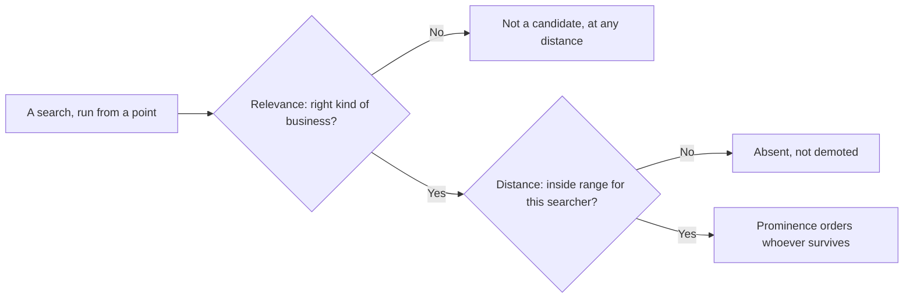

# The three forces: relevance, distance, prominence

Google publishes almost nothing about local ranking, with one exception: it names the three things local results are built from. Relevance, distance, prominence. That help page runs a few hundred words and is the closest thing this discipline has to a spec.

Most of the industry treats it as a slogan. It is more useful than that: once you can see which of the three a problem belongs to, you know whether it is fixable and how fast. This chapter takes the triad seriously, then interrogates it — starting with the force everyone quotes a number for and nobody can defend.

## What Google actually says

From Google Business Profile Help, *Tips to improve your local ranking on Google* (read 2026-07-27):

> "Relevance is how well a Business Profile matches what someone is searching for."

> "Distance refers to how far each business is from the customer who's searching."

> "Prominence means how well-known a business is. Prominent places are more likely to show up in search results."

> "More reviews and positive ratings can help your business's local ranking."

That is the whole documented model. Everything else you read about local ranking — factor lists, weightings, percentages — is inference or opinion. Some of it is good inference, none of it is documentation, and this manual marks the difference every time.

Note the object: the three forces apply to a *Business Profile*, not a website. If that surprises you, read [Google is not ranking your website](../the-business-entity/index.md) first.

## Relevance: does this profile answer this query

Relevance is a match between a query and an entity. The entity's fields are the raw material: primary and additional categories, name, services, description, attributes, and the linked website's content.

**Category does most of the work.** It tells Google what *kind* of thing the business is, and it is picked from Google's own fixed list rather than typed freely — machine-readable in a way a description never is.

A dentist whose primary category is "Dental clinic" is a candidate for dentist queries. The same business filed as "Medical clinic" is a weaker one, whatever the website says.

*(Inference: Google does not document the field's weight. The observation is that pack members for a query overwhelmingly share one or two primary categories — which you verify in Lab 3.3.)*

**Below category the signals get softer and the evidence thinner.** Sterling Sky, one of the few practitioners publishing controlled experiments rather than assertions, has tested the Services fields directly and found they do move rank — custom services included, and even with the price and description left blank, though by less than Google's own pre-defined ones.

**What that testing does not publish is a *magnitude*.** The write-ups say "measurable" and "significant"; they give no percentage, no average position gain, no share of grid points improved.

A figure of "2–5%" circulates with Sterling Sky's name attached to it — it comes from a reader's comment under one of those posts, not from the test. Do not repeat it, and be suspicious of anyone who does. Treat Services as small, real, cheap and unquantified.

Relevance is the force you control most directly and most quickly. It is also the one people break by over-reaching: adding categories the business does not serve, to widen the net. [The profile is the product](../../02-core-practice/the-profile-is-the-product/index.md) covers that, with the risk attached.

## Distance: the force you do not control

Distance is measured from the searcher — or from the place named in the query — to the business. Not the reverse. Two consequences that beginners consistently get wrong:

**There is no single distance.** Every search happens somewhere, so every search has its own distance to you. A business does not have "a rank"; it has a rank *at a point*. That is the whole argument of the next chapter, [Rank is a map, not a number](../rank-is-a-map-not-a-number/index.md).

**You cannot optimise it.** No profile edit, review campaign or content programme moves your building. What you can change is structural: where you open the next location, how the service area is defined. Real levers, but business decisions rather than SEO tasks.

The illegitimate version — renting a virtual office, listing a residential address you do not operate from — is common, effective in the short term, and the fastest route to a suspended listing. [Spam, fake listings and the competitive underworld](../../03-advanced/spam-and-fake-listings/index.md) covers what it looks like from outside; [Suspensions and reinstatement](../../03-advanced/suspensions-and-reinstatement/index.md) covers the aftermath.

## Prominence: how well known the business is

Prominence is the messiest of the three and has the most room to work in. Google describes it as fame — how well known the business is, including offline. The observable inputs:

- **Reviews** — count, average rating, recency, and whether the owner responds.
- **Web presence** — being mentioned, linked and listed across the web, including directories.
- **Web ranking** — where the business's own site ranks organically for related terms.

Prominence is slow. A profile does not become well known in a fortnight, which is why every honest plan front-loads relevance fixes (days) and treats reputation work as a quarter-long programme. [The first ninety days](../../04-operating/the-ninety-day-plan/index.md) sequences it.

It also has the best proxies. You cannot see prominence, but review count, rating and photo count are public for every business in your market. That is Lab 3.2: rank the market on the proxies before looking at a single position.

*Nobody here has owner access — this is a coffee roastery someone else runs. Rating, review count and photo count are public for every business on Maps, which is why prominence is the one force you can size up for a competitor as easily as for yourself.*

## The three are not three dials

The triad reads like a formula with three inputs. The behaviour looks more like a pipeline *(inference, from the shape of grid scans — see [Reading a geo-grid without fooling yourself](../../03-advanced/reading-a-geo-grid/index.md) for the evidence and its limits)*:

1. **Relevance decides candidacy.** Wrong category, wrong kind of business: you are not in the running for that phrase at any distance.
2. **Distance decides eligibility at a point.** Past some market-dependent range you stop being a candidate for that searcher — not demoted, absent.
3. **Prominence orders whoever survives.**

This is why "improve my ranking" is under-specified. A business invisible everywhere has a relevance problem. One that is #1 at its door and gone two miles out has a distance problem whose only real fix is prominence — prominence buys range. One sitting at #7 everywhere has a prominence problem and no distance problem at all.

---

**Next:** [How much proximity really matters →](./how-much-proximity-matters.md)
