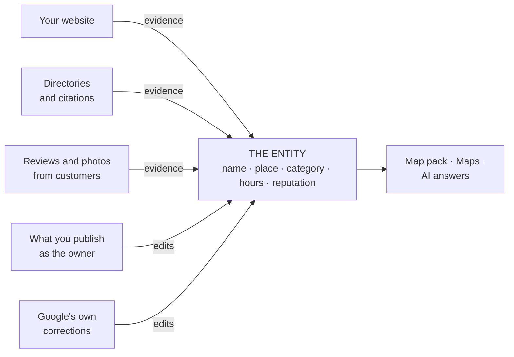

# Google is not ranking your website

Run a local search and click a result in the map pack. You do not land on a website. You land on a panel: name, stars, hours, photos, a call button, a directions button — and the website, if there is one, as a single link a few rows down.

That panel is the thing being ranked. It is a record Google holds about a place, and it exists whether or not the business has a website, has heard of SEO, or has ever logged in. Local SEO is the practice of improving that record and the evidence supporting it. Almost every beginner mistake in this field comes from not knowing that.

## The ranked object is a record, not a page

Google's own account of local ranking names three factors: relevance, distance and prominence. Look at what those are properties *of*. Relevance is how well a **business** matches the search. Distance is how far the **business** is from the searcher. Prominence is how well known the **business** is. Not one of them is a property of a page.

The website has a role, and Google states it plainly: your position in ordinary web search results is one of the inputs to prominence. So the site is evidence about the business. It is not the thing in the ranking.

This is why a beautifully built site can sit invisible in the map pack while a competitor with a one-page template outranks it everywhere. They are not competing on the axis you optimised.

## The fields of the entity

An entity is a set of fields. Group them by what they *are*, because the groups behave differently — different sources, different risks, different rules about who may hold them.

| Group | Fields | Who writes it |
| --- | --- | --- |
| **Identity** | Machine identifier, name, address, coordinates, primary category | Google, from owner input plus its own corrections |
| **Contents** | Hours, attributes, description, services, photos, posts | Mostly the owner; photos also customers |
| **Reputation** | Rating, review count, individual reviews, owner replies | Customers, plus the owner's replies |
| **Links out** | Website URL, phone, booking and ordering links | The owner |

Two things about this table matter more than they look.

First, the machine identifier. Every place in Google's index carries a stable identifier — a **place ID**. It is not the name and not the address. It is the key, and the rest of the record hangs off it. When a tool "tracks your business", the honest description of what it stores is that key plus its own measurements.

Second, notice how many rows are not written by you. Customers add photos and reviews. Google edits fields from other signals it holds — which is why the warning shown before you apply a profile change says Google can reject or change an edit. Your listing is a record you contribute to, not a document you own.

## Identity and contents are different classes of thing

Here is the argument that settles it, and it does not come from a ranking study. It comes from what Google's own terms let you keep.

For public place data the default is that you may not store it at all. There are exactly two express permissions: the **place identifier indefinitely**, and **coordinates for at most 30 consecutive calendar days**, after which they must be deleted. The same terms name copying and saving business names, addresses or user reviews as prohibited scraping. On the owner side, Business Profile content carries a 30-day storage cap of its own. (Read against the Maps terms current in June 2026 and the Business Profile API policies dated 2025-08-28.)

Read that as a description of the data model and it is unambiguous:

> **The pointer is permanent. The contents are a live reading you have to go back for.**

Google's licence treats the identity of a place as a durable key you may hold forever, and everything hanging off it as a current-state snapshot you are borrowing. That is precisely how an entity behaves. It has an identity, and it has a state, and they are not the same kind of fact.

The practical consequences are large:

- **A tool's stored copy of the contents is a photograph, not the record.** Any number you read in any local SEO product is as of the last fetch. Look for the timestamp before you quote it to anyone.
- **Anything built by mass-copying names, addresses and reviews is built on prohibited ground.** That is why nobody sells you a downloadable database of every business in your city.
- **A stored identifier can still go stale.** Place IDs are stable but not immortal — they change as Google's map database is updated, and Google recommends refreshing stored IDs older than 12 months. The refresh is free, because it touches no billable field. Almost nobody implements it, which is why an old prospecting list quietly starts reporting live businesses as "not found".

> The verbatim clauses, with their section numbers and document dates, are in [Storing Google data legally](../05-reference/storing-google-data-legally.md). This chapter is describing the shape of the rules, not quoting them, and none of it is legal advice.

## Two views of the same entity

You met this split in [Lab 0.4](../00-start-here/set-up-your-workbench.md). It pays off here, because the two views are not "more data" and "less data" — they are two different readings of the same record.

| | Public view | Owner view |
| --- | --- | --- |
| Name, address, category, hours, attributes | Yes | Yes |
| Rating and review count | Yes | Yes, and it is Google's authoritative figure for the location |
| Individual reviews | A handful, chosen by relevance | The full history |
| The "from the business" description | Not exposed | Yes |
| Views, calls, direction requests | No | Yes, roughly 18 months of daily history |
| The search terms people used to find it | No | Yes |
| Editing anything, replying, posting | No | Yes |

The review row is the one that catches people out. The public data surface returns only a small sample of reviews — about five — ordered by relevance, not by date. A tool seeing only the public view can honestly show you a rating and a review count. It cannot show you a review history, because it has never had one. Anything longitudinal it shows for a business you have not connected was assembled from its own repeated sampling.

The description row is the tidy proof that these really are two surfaces: the owner-written blurb on your listing is not part of the public place data at all. In SEOG it appears on the **Profile** page only after the Google connection exists, because that is the only door it comes through.

And some entities are invisible to the public view entirely. A pure service-area business — a plumber, a mobile locksmith — hides its street address, and Google excludes hidden-address businesses from public place search by default. The entity exists and the owner sees all of it; the public read simply cannot retrieve it, which has consequences big enough to need [their own chapter](../03-advanced/service-area-businesses.md).

## Why two records for the same shop disagree

Once you see the entity as a record with multiple authors and multiple readers, disagreement stops being mysterious. Five distinct causes, and telling them apart is a real diagnostic skill.

**1. Vocabulary.** The public read surface and the owner write surface do not use the same words for the same state. A business the public reading calls "operational" is a business the owner side calls "open". Two records can be identical in meaning and differ in text. See [Write limits and failure modes](../05-reference/write-limits-and-failure-modes.md) for the full list of these mismatches.

**2. Freshness.** Your copy was taken at a moment; the business changed its hours yesterday. Nothing is wrong — your photograph is old. Every screen in SEOG carries a *Synced …* stamp for exactly this reason.

**3. Retrieval.** Public search results are ranked by prominence, so low-prominence listings — new businesses, thin review counts — can be dropped from a result set that the Maps search box happily autocompletes. That is the mechanism behind the classic complaint, "I can find my business in Maps, so why can't your tool?" Two retrieval paths, two thresholds. [Why two tools disagree](../03-advanced/why-two-tools-disagree.md) takes it apart properly.

**4. Genuine duplicates.** Sometimes there really are two records. A business moves and someone re-adds it. Head office creates a listing the manager already created. Google itself has a notion of duplicate locations and can notify owners about them — which tells you how routine this is. Two records for one shop split reviews and split signals *(inference — the split is observable; how Google weighs it is not documented)*.

**5. Your own website disagrees with your listing.** Old phone number in the footer, an address that was never updated after a move, opening hours in three places that say three things. This one is entirely yours to fix, and it is Lab 2.3.

## What this means for the work

The rest of the manual follows from the model:

1. **Fix the entity first** — categories, name, hours, attributes, description, photos, reviews. That is [The profile is the product](../02-core-practice/the-profile-is-the-product.md).
2. **Then make the supporting evidence agree with it** — your site, your directory listings, everything that describes the business elsewhere. That is [Citations and NAP consistency](../02-core-practice/citations-and-nap.md) and [The website half](../02-core-practice/the-website-half.md).
3. **Measure the entity, not the page.** Map-pack rank is a property of a business at a location, which is why the next two chapters are about forces and maps rather than pages.

## Labs

### Lab 2.1 — Inventory the entity

> **Lab** · Where: **Overview** (`/b/{businessId}/overview`) and **Profile** (`/b/{businessId}/profile`) · Cost: **free** · Time: ~15 min
>
> You need: Lab 0.3 done (a business added). Lab 0.4 (the Google connection) makes this much richer, but the lab works without it.

1. Open **Overview**. Working top to bottom, write down every distinct fact on the page: the **Profile score**, **Rating** and **Photos** cards, then **Action plan — your next steps**, **Rankings at a glance**, **Local visibility**, **Vs local market**, **Review momentum**, **Website support** and **Performance**.
2. Open **Profile**. The **Business profile** card holds the raw fields: status, category, price level, photo count, gallery, phone, website, the Google Maps link, the description, **Opening hours** and **Attributes on Google**.
3. Mark each entry with one of three letters: **P** if it came from the public import, **O** if it appeared only after connecting Google, **S** if it is SEOG's own measurement rather than a field of the entity at all.

**What good looks like.** Most identity and contents fields are **P**. The description, the **Performance** panel, the search-terms card and the whole **Make changes** editor are **O** — without the Google connection the page shows the connect card in place of the editor. The profile score, rankings, grid and competitor comparison are **S**: nothing in Google's record contains them.

**If it went wrong.** A blank field is usually Google not exposing it rather than an error — a business with no description on Google has none here either. If **Performance** shows nothing at all, the Google connection is not live; that panel is owner-only by construction.

**What you just learned.** The difference between a *field of the record* and a *measurement about the record*. Sorting any tool's screens into those two buckets tells you what it knows versus what it estimates.

---

### Lab 2.2 — Watch the identity hold still while the contents move

> **Lab** · Where: **Reviews** (`/b/{businessId}/reviews`) then **Overview** (`/b/{businessId}/overview`) · Cost: **paid** (the refresh re-fetches profile and reviews from Google) · Time: ~10 min
>
> You need: Lab 2.1 done.

1. Go to **Reviews** and click **Request review**. The modal shows a **Review link** — Google's public "write a review" URL for this business. Copy it. The long string after `placeid=` is the entity's identifier. Paste it into your notes.
2. Go back to **Overview** and record four values exactly as they stand: rating, review count, photo count, and the *Synced …* stamp in the page header.
3. Click **Refresh all**. Read the price on the button before you confirm it — that habit is worth forming now.
4. When it finishes, record the same four values again. Then reopen **Request review** and compare the identifier to the one in your notes.

**What good looks like.** The *Synced …* stamp has reset to "just now". Some contents may have moved — a review arrived, the photo count changed, the rating shifted by a tenth. The identifier is character-for-character identical, and will still be next year.

**If it went wrong.** Nothing moving except the timestamp is a correct result, not a failed lab: a quiet business does not change between two refreshes an hour apart. If the modal says there is no place ID, the business came in through the owner connection and Google's public record has not been matched to it — common for service-area businesses.

**What you just learned.** Identity and contents change on completely different timescales, which is why they are stored, licensed and reasoned about differently. It is also the basis of longitudinal measurement: you can compare this month to last month *because* the key did not move underneath you.

---

### Lab 2.3 — Two records, one shop

> **Lab** · Where: **Profile** (`/b/{businessId}/profile`) and the business's own website · Cost: **free** · Time: ~15 min
>
> You need: Lab 2.1 done, and the business to have a website.

1. On **Profile**, write down four things exactly as Google has them: the business name, the full address, the phone number, and the opening hours.
2. Open the business's website. Find the same four things — check the footer, the contact page and any "locations" page. Write each one exactly as it appears, including punctuation and abbreviations.
3. Line them up and mark every difference. "Street" against "St". A local number against a tracking number. Winter hours updated in one place only. A suite number present here, missing there.
4. For each mismatch, decide which is true, and note where else that wrong value is likely repeated — an old directory listing, a Facebook page, a printed flyer.

**What good looks like.** A short list of concrete discrepancies with a decided winner for each. Most businesses have between one and four. Zero usually means you did not look at the footer.

**If it went wrong.** If you find nothing, check whether the site's contact details live inside an image or a map embed rather than as text — that is a mismatch of its own kind, because it is unreadable to everything that is not a human eye.

**What you just learned.** The entity is one record, but the world holds many copies of it and you control only some of them. Consistency work is not superstition about exact string matching; it is the job of making all the evidence about one business tell the same story. [Citations and NAP consistency](../02-core-practice/citations-and-nap.md) turns this list into a work queue.

> **Doing this without SEOG.** All three labs work by hand: the public view is any business's Google Maps listing, the owner view is the Business Profile dashboard, and the identifier comes from Google's own Place ID finder. Nothing is recorded, though — you get today's values and no history. See [Doing it without SEOG](../99-appendix/doing-it-without-seog.md).

## Common mistakes

**Optimising the website and expecting the map pack to move.** Tempting, because it is the part you control completely and the part your web team knows how to do. It costs months. Site work does support the entity — Google says web results position feeds prominence — but it is indirect and no substitute for a profile with the right category and complete fields.

**Treating a stored number as the current one.** A rating you read this morning was fetched at some earlier point. Quoting it as "your rating today" without checking the timestamp is the most common way a competent practitioner says something untrue. Read the *Synced …* stamp first, every time.

**Assuming there is only one record.** People diagnose for weeks — bad categories, weak reviews, a slow site — when the real problem is a duplicate listing splitting the signals. Check for duplicates early; it costs nothing and it is a complete explanation when it is the answer.

**Treating name, address and category as ordinary fields.** They sit in the same editor as the phone number and look equally editable. They are not: they are the identity, and changing them can send the listing back through verification. [The profile is the product](../02-core-practice/the-profile-is-the-product.md) covers which fields are safe and which are not, and the app shows the warning before you apply one.

## Check yourself

Answer these against your own practice business, not in the abstract.

1. **Your website goes offline for a month. What happens to your map-pack position?** It does not vanish, because the entity is still there and still complete. Expect gradual erosion at most *(inference)*: you removed one input to prominence, not the ranked object. If your answer was "we disappear", re-read the first section.

2. **A tool shows a competitor's full review history for a business it has no owner access to. What is it actually showing you?** Its own accumulated sampling, or an estimate. The public data surface returns a handful of reviews ordered by relevance; nobody gets a stranger's full history from it.

3. **Your listing says you close at 6pm; your website says 7pm. Which does Google believe?** Google shows the listing — that is the record it ranks. But the mismatch is itself a signal about how reliable your information is, and the customer who arrives at 6:15 does not care which system was wrong.

4. **You find two listings for the same shop with reviews on both. Which is the "real" one?** Neither, until Google merges or removes one. Both are real records splitting your reputation. This is a duplicate problem, not a ranking problem — solved through Google's duplicate handling, not by optimising either listing harder.

---

**Next:** [The three forces: relevance, distance, prominence →](./relevance-distance-prominence.md)
