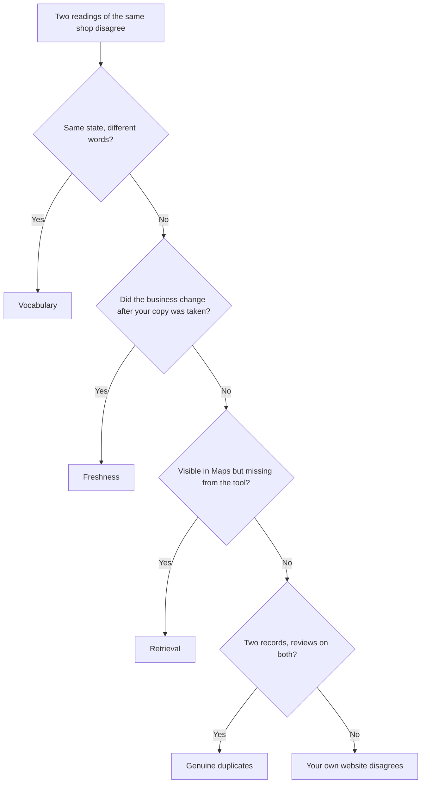

# Two views of the entity, and why records disagree

The fields of the entity are one thing; who can read them is another. The same record answers differently depending on which door you come through, and copies of it drift apart for five distinct reasons.

## Two views of the same entity

You met this split in [Lab 0.4](../../00-start-here/set-up-your-workbench.md). It pays off here, because the two views are not "more data" and "less data" — they are two different readings of the same record.

*The public read of a real coffee roastery. The panel across the top is an inventory of what public place data cannot reach — performance history, the full review history, the search terms, the right to edit anything. What sits below it is genuinely public and genuinely this business: a 91% completeness score, 4.7 stars from 572 reviews.*

*A different business — deliberately, because a healthy profile and a broken one teach different things — with the Google connection live. The connect panel is gone, and the action plan is real diagnosis: seven steps, each with the points it is worth and an impact rating. The 36% belongs to this profile's own thin record, not to the act of connecting; what connecting changed is how much of the record can be read and written.*

| | Public view | Owner view |
| --- | --- | --- |
| Name, address, category, hours, attributes | Yes | Yes |
| Rating and review count | Yes | Yes, and it is Google's authoritative figure for the location |
| Individual reviews | A handful, chosen by relevance | The full history |
| The "from the business" description | Not exposed | Yes |
| Views, calls, direction requests | No | Yes, roughly 18 months of daily history |
| The search terms people used to find it | No | Yes |
| Editing anything, replying, posting | No | Yes |

**The review row is the one that catches people out.** The public data surface returns at most five reviews, ordered by relevance rather than by date.

A tool seeing only the public view can honestly show you a rating and a review count. It cannot show you a review history, because it has never had one. Anything longitudinal it shows for a business you have not connected was assembled from its own repeated sampling.

**The description row is the tidy proof that these really are two surfaces.** The owner-written "from the business" blurb is not part of the public place data at all. Public place data can carry a blurb — but it is Google's own machine-written summary of the place, a different field with a different author.

In SEOG the owner's real description arrives only once the Google connection exists, and it then replaces the machine-written one in the stored record, because that is the only door it comes through.

**And some entities are invisible to the public view entirely.** A pure service-area business — a plumber, a mobile locksmith — hides its street address, and Google excludes hidden-address businesses from public place search by default. The entity exists and the owner sees all of it; the public read simply cannot retrieve it, which has consequences big enough to need [their own chapter](../../03-advanced/service-area-businesses/index.md).

## Why two records for the same shop disagree

Once you see the entity as a record with multiple authors and multiple readers, disagreement stops being mysterious. Five distinct causes, and telling them apart is a real diagnostic skill.

**1. Vocabulary.** The public read surface and the owner write surface do not use the same words for the same state. A business the public reading calls "operational" is a business the owner side calls "open". Two records can be identical in meaning and differ in text. See [Write limits and failure modes](../../05-reference/write-limits-and-failure-modes.md) for the full list of these mismatches.

**2. Freshness.** Your copy was taken at a moment; the business changed its hours yesterday. Nothing is wrong — your photograph is old. Every screen in SEOG carries a *Synced …* stamp for exactly this reason.

**3. Retrieval.** Public search results are ranked by prominence, so low-prominence listings — new businesses, thin review counts — can be dropped from a result set that the Maps search box happily autocompletes. That is the mechanism behind the classic complaint, "I can find my business in Maps, so why can't your tool?" Two retrieval paths, two thresholds. [Why two tools disagree](../../03-advanced/why-two-tools-disagree/index.md) takes it apart properly.

**4. Genuine duplicates.** Sometimes there really are two records. A business moves and someone re-adds it. Head office creates a listing the manager already created. Google itself has a notion of duplicate locations and can notify owners about them — which tells you how routine this is. Two records for one shop split reviews and split signals *(inference — the split is observable; how Google weighs it is not documented)*.

**5. Your own website disagrees with your listing.** Old phone number in the footer, an address that was never updated after a move, opening hours in three places that say three things. This one is entirely yours to fix, and it is Lab 2.3.

## What this means for the work

The rest of the manual follows from the model:

1. **Fix the entity first** — categories, name, hours, attributes, description, photos, reviews. That is [The profile is the product](../../02-core-practice/the-profile-is-the-product/index.md).
2. **Then make the supporting evidence agree with it** — your site, your directory listings, everything that describes the business elsewhere. That is [Citations and NAP consistency](../../02-core-practice/citations-and-nap/index.md) and [The website half](../../02-core-practice/the-website-half/index.md).
3. **Measure the entity, not the page.** Map-pack rank is a property of a business at a location, which is why the next two chapters are about forces and maps rather than pages.

---

**Next:** [Entity labs and common mistakes →](./labs-and-common-mistakes.md)
