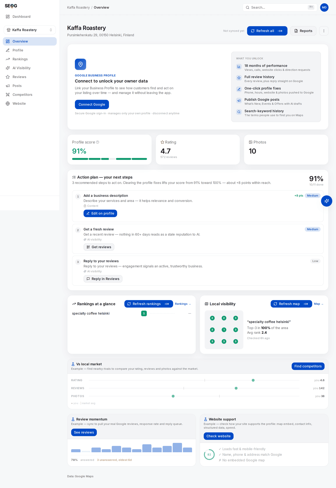

# What local SEO actually is

Local SEO is the practice of making a business appear when someone nearby searches for what it sells. That used to be one job with one target: three results in a box next to a map. It is now at least six targets, chosen by different machines, from partly different data — and a business can own one of them while being invisible on the rest.

This chapter is the map of those surfaces. Every decision later in the manual — which keyword to track, which number to report, whether a change worked — depends on being able to say *which surface* you are talking about.

## What makes a search "local"

A query is local when the answer depends on where the person is standing. That happens two ways.

**Explicitly** — the query names a place. `dentist in Leeds`, `thai food downtown austin`.

**Implicitly** — the query names no place, and the search engine supplies one. `dentist near me`, or just `dentist` typed on a phone. Most local searches are this kind. The searcher never states a location because they assume the machine knows it, and it does.

The consequence is the single most important structural fact in this discipline: **the same words produce different results at different coordinates**. There is no such thing as "our rank for plumber" — only "our rank for plumber, measured from this point, on this surface, on this date". [Rank is a map, not a number](./rank-is-a-map-not-a-number.md) makes that rigorous. For now, just stop trusting any sentence of the form "we rank #3".

*One keyword, nine live searches run from nine coordinates around Helsinki — a real scan, not a mock-up. The pins read #4 in some places and #5 or #7 in others, a couple of kilometres apart, which is exactly what a single "we rank #4" would hide. Ignore the search-volume figure further up that page: it carries a **Test data** badge, because no volume provider was configured on the machine that took the capture.*

Local intent is also a spectrum rather than a switch. `emergency plumber` is almost pure local intent. `how do I stop a dripping tap` is almost none. `best plumber in Bristol for a boiler swap` is both, which is exactly why it gets answered by a different machine than the first one does.

## The six answer surfaces

These are the manual's names for them. Google officially calls the first one "local results"; the rest are industry vocabulary or have no name at all, because Google has not given them one.

| Surface | What you see | Typically triggered by | Who selects the businesses |
| --- | --- | --- | --- |
| **Map pack** | A small map plus three listings with rating, hours, and call/directions/website buttons | A service or product query with local intent | Google's local ranking system |
| **Local finder** | The full scrollable list behind "More places", with filters and its own map | Clicking through from the pack, or searching in Maps directly | The same local ranking system, deeper |
| **Local organic** | Ordinary blue links below the pack — directories, "best X in Y" listicles, business homepages | The same query | Google's web ranking |
| **AI Overview** | A generated answer at the top with cited links | Informational, longer and more conversational phrasings | Google's generative layer over its index |
| **AI local pack** | A generated local answer containing one or two businesses, in place of the pack | A subset of local queries; so far observed only on mobile, and only in the US | Undocumented |
| **Standalone assistant** | A named recommendation in ChatGPT, Gemini, Perplexity or Claude, sometimes with sources | The person asking an assistant instead of a search box | Each vendor's own retrieval and place data |

Three of these are routinely confused, so be precise about them.

**The local finder is not the map pack.** It is the deep list behind "More places", and it is where a business at position 7 actually lives. People who "cannot find themselves anywhere" are usually visible immediately in the finder — which is the difference between a ranking problem and a panic.

**The AI Overview and the AI local pack are different things.** An AI Overview is a generated block that answers a question and links to sources; a business is lucky to be named in one. The AI local pack is a generated *local* result that lists businesses the way the pack does, and the practitioner who has tracked it most closely — Joy Hawkins of Sterling Sky — describes it as **displacing** the traditional 3-pack rather than sitting above it. That is a materially worse outcome for a business than an AI Overview, because there is nothing left underneath to fall back to. Google has published nothing about the surface, so the displacement claim rests on one vendor's observation *(open question)*.

**A standalone assistant is not a search engine with a nicer voice.** It answers from its own retrieval stack. Gemini is grounded in Google Maps data; ChatGPT and Perplexity are grounded in something else. This is why the same question can produce three disjoint answers, which you will see for yourself in Lab 1.3, and why [How an AI assistant answers a local question](./how-ai-answers-a-local-question.md) is a chapter rather than a paragraph.

> **Note** · There is a seventh thing on the page and it is not a ranking surface: ads. Sterling Sky's *The State of Local SEO in 2026* reports local pack ads on 1% of its mobile reports at the start of 2025 and almost 22% by December 2025, and Local Services Ads on roughly 11% of tracked queries at the start of 2025 and 31% by November. That is one agency's tracking sample, not a census. You cannot rank your way into those slots — count them separately when you audit a page, or you will misread how much room is actually available.

## The 2026 inventory, with dates on it

Most "what is local SEO" pages describe a three-result pack and one machine. Here is what has actually been measured, and by whom. Every figure below is vendor-published and observational — useful, but none of it is a controlled experiment, and the methodologies are only partly disclosed.

**The AI local pack surfaces roughly a third as many businesses as the pack it displaces.** Sterling Sky's *The State of Local SEO in 2026* (published June 2026) reports AI local packs surfacing **5,943 unique businesses where regular 3-packs surfaced 18,330** across the same tracked set — about **32% coverage**, so two businesses in three vanish. Read the figure carefully: several write-ups render it as "32% fewer businesses", which is the opposite of what the two counts say. In the same tracking, AI local packs appeared on about **7%** of tracked keywords, showed **one or two** businesses instead of three, and **had no call button**; across 322 markets, 88% had fewer unique businesses in the AI pack than in the traditional one. Nothing is published on which businesses survive the cut or why, and Google's documentation does not acknowledge the surface at all.

**AI Overviews are common on local searches, and much rarer on local-intent ones.** Whitespark's May 2025 study — 540 queries across three US cities and six industries — found AI Overviews on about 68% of the set overall but on only about **15% of queries with clear local intent**, where the local pack appeared in 93%. Local Falcon's May 2025 whitepaper (60,000 queries) put overall incidence at 40.2% with the same gradient: reason 59.9%, informational 58.3%, instructional 54.4%, transactional 47.4%, commercial 17.2%, navigational 10.5%. The two headline rates are not comparable — different query sets, different intent taxonomies — but the gradient is. **The more the query looks like a purchase, the less likely a generated answer is to intercept it, for now.**

**The assistants recommend far fewer businesses than the pack does.** SOCi's 2026 Local Visibility Index (~350,000 locations) reported recommendation rates of 1.2% for ChatGPT, 7.4% for Perplexity and 11% for Gemini, against 35.9% for the Google local 3-pack. The same study reported profile accuracy of roughly 68% on ChatGPT and Perplexity versus ~100% on Gemini — which tracks with Gemini being Maps-grounded — and only 45% overlap in retail between the brands that win Google local and the brands the assistants recommend. Treat the exact percentages as soft; the methodology is not fully published. Treat the *shape* as solid: these are different populations of winners.

**One surface has already been retired.** The questions-and-answers API was switched off on 3 November 2025; on 3 December 2025 Google confirmed it was removing the public Q&A panel from business profiles, rolling out over the following months and replacing it with Gemini-powered "Ask Maps". A capability that a whole category of tooling was built on stopped existing, and a surprising amount of current published advice still describes it as live. Dated facts are in [the local search changelog](../05-reference/local-search-changelog.md).

## Who decides, and why the answers diverge

Each surface has its own selector.

The map pack and the local finder are chosen by Google's local ranking system, described in terms of relevance, distance and prominence — the subject of [the next-but-one chapter](./relevance-distance-prominence.md). Local organic is chosen by ordinary web ranking, which is why directories and listicles beat business homepages there. The AI Overview is generated over Google's index; the AI local pack is generated over something local, and nobody outside Google knows what. Assistants each retrieve from their own stack.

They diverge because they are grounded differently, not because any of them is broken. One measurement worth carrying: Ahrefs, comparing 540,000 query pairs of September 2025 US data, found AI Mode and AI Overview citations — two surfaces from *the same company* — overlapping only 13.7% (16.3% across just the top three citations). If Google cannot agree with itself about which sources to cite, an assistant from a different company disagreeing with your map pack is the normal condition, not an anomaly to be fixed.

Which gives the manual its spine question, and you should ask it before every piece of work you do:

> **Which surface am I trying to appear on, and who decides that surface?**

"Improve our Google ranking" does not survive contact with that question. "Get into the map pack for `emergency plumber` within two miles of the shop" does, and it tells you what to measure.

## What is the same everywhere

The picture above is fragmenting, but not infinitely. Underneath all six surfaces sit a small number of shared inputs, and this is what stops the job from being six jobs.

- **They are all ranking a business entity, not a website.** The profile — name, address, category, hours, attributes — is the object. The website is a supporting signal attached to it. That is [the next chapter](./the-business-entity.md), and it is the single idea that reorganises most people's mental model.
- **Reputation is the heaviest shared input.** Review volume, rating and recency feed both the pack and the assistants' answers. In SEOG's AI-readiness score, review count and rating together are enough to reach the middle tier on their own — a deliberate calibration, defended in [Diagnosing a business in thirty minutes](../02-core-practice/analyzing-business-visibility.md).
- **Consistency of the entity's facts across the web** matters to every surface, and disproportionately to the AI ones. Whitespark's 2026 Local Search Ranking Factors survey puts citation signals at roughly 7% of local-pack weight (write-ups of it quote 6–7%) — small, and a poll of practitioners rather than a measurement. The case for doing the work anyway is now mostly an AI case, and it is a mechanism argument rather than a statistic: [Citations and NAP consistency](../02-core-practice/citations-and-nap.md) sets out what is and is not knowable there.

What does **not** follow is "do good local SEO and the AI surfaces come along". A 45% brand overlap between Google-local winners and AI-recommended winners says the opposite. Shared inputs, different selectors.

## Labs

### Lab 1.1 — Surface census

> **Lab** · Where: your own browser (no SEOG) · Cost: **free** · Time: ~15 min
>
> You need: a practice business chosen in [Set up your workbench](../00-start-here/set-up-your-workbench.md).

1. Pick one keyword a customer would actually type. A service plus nothing else: `emergency plumber`, `thai restaurant`, `family dentist`. **Not** the business name.
2. Open a private/incognito window on a desktop browser. Search the keyword plus the city.
3. Working down from the top of the page, list every block you hit *in order* until you reach the first ordinary blue link. Ads count as blocks — label them.
4. Repeat without the city name in the query.
5. Now do both on your phone, on mobile data rather than the shop's Wi-Fi, ideally standing at or near the business.
6. Screenshot all four. Fill in one row per run: surfaces seen, in order.

**What good looks like.** Four rows, and at least one real difference between desktop and mobile — commonly the pack sitting lower, an AI block appearing on one and not the other, or more ads on mobile. If your four rows are identical, your query is probably too transactional to trigger a generated answer, which is itself a finding worth writing down.

**If it went wrong.** You searched the business name — that is a branded query and returns a knowledge panel, not a competitive pack; use the service term. You are signed in and seeing personalised results — use a private window. You are on a VPN — your results belong to whatever city the exit node is in.

**What you just learned.** A search result page is not a list, it is a stack of independently-selected blocks, and the query decides which blocks exist. A rank without a surface, a query and a location attached to it is not a measurement.

### Lab 1.2 — Read your baseline without touching anything

> **Lab** · Where: **Overview** (`/b/{businessId}/overview`) · Cost: **free** · Time: ~10 min
>
> You need: your practice business added (Lab 0.3).

1. Open the business overview. **Do not press any refresh button** — *Refresh all*, *Refresh rankings*, *Refresh competitors*, *Refresh map*, *Refresh reviews* and *Refresh check* each fetch live data from Google and are priced. Everything in this lab is already stored.
2. Read the three cards along the top: **Profile score**, **Rating** (with its review count), **Photos**.
3. Hover the question mark on **Profile score**. The bar under it is split into five areas — Contact, Visibility, Content, Reputation, Attributes — and the width of each segment is its weight while the fill is your coverage. Note which segments are visibly unfilled.
4. Read **Action plan — your next steps** below it. Do not act on anything yet.
5. Scroll through **Rankings at a glance**, **Local visibility**, **Vs local market**, **Review momentum** and **Website support**. On a new business several of these show a clearly-labelled *Example* preview instead of your data. Write down which ones — that list is your to-do list, not a fault.
6. Write six lines in a note you will keep: today's date, profile score, rating, review count, photo count, number of tracked keywords (zero is a perfectly good answer).

*This is step 5 on one screen. The three cards at the top are real data imported from Google — 91%, 4.7 from 572 reviews, 10 photos. Everything from "Rankings at a glance" downwards is prefixed **Example**: those keyword positions, grid squares and competitor bars are placeholders showing what the panel will look like once you run it, not measurements of this business. Learning to spot that label is the point of the lab.*

**What good looks like.** A dated six-line note, and the ability to say which cards were showing your data and which were showing an example.

**If it went wrong.** The score looks unfairly low: the audit scores completeness of what is *publicly* visible, and several fields are invisible without the owner connection — see the public-versus-owner table in [Set up your workbench](../00-start-here/set-up-your-workbench.md). **Performance** shows nothing at all: that panel is owner-only and stays empty until the Google Business Profile is connected.

**What you just learned.** You never change a profile you have not measured, because you will not be able to prove anything afterwards. And reading stored data costs nothing — a habit worth forming now, because most questions beginners try to answer with a fresh fetch are answerable from data they already have.

### Lab 1.3 — The two-machine test

> **Lab** · Where: your browser and any one AI assistant · Cost: **free** · Time: ~10 min
>
> You need: the keyword from Lab 1.1.

1. Rewrite that keyword as a person would ask another person: *"who's the best emergency plumber near Shoreditch?"* — your own neighbourhood, not mine. Never name your own business in the prompt — a named business begs the answer.
2. Ask one assistant: ChatGPT, Gemini, Perplexity or Claude, whichever you have.
3. Write down every business it names, **in order**, and every source it cites.
4. Put the same question into Google. Write down the businesses in the map pack, in order.
5. Count how many names appear in both lists.
6. Open a fresh chat and ask the assistant the identical question again. Compare with your first answer.

**What good looks like.** Two lists that overlap partially, often by one name or none — and two runs of the *same* assistant that also fail to fully agree. Both are the expected result, not an error.

**If it went wrong.** The assistant refused, answered generically, or told you to check Yelp — record that as a result, because how often an engine punts is real data; [the AI visibility method](../03-advanced/ai-visibility.md) explains why those answers must leave the denominator rather than count as a miss. If the two runs agreed perfectly, run it twice more; a single pair proves nothing either way.

**What you just learned.** The machines are grounded in different data, so winning one predicts little about the others. And one answer is a sample, not a measurement — which is why every serious claim about AI visibility in this manual is a rate over runs.

## Common mistakes

**Saying "we rank #3" and stopping there.** Rank without a surface, a query, a coordinate and a date is not information. It is the most common way a local SEO report lies without anyone lying.

**Assuming the AI surfaces follow the pack.** They share inputs and disagree on outputs. Optimising only for the pack and reporting AI visibility as "coming along" is an unbacked claim, and the published brand overlap is a coin flip.

**Treating one AI screenshot as evidence.** Screenshots of an assistant naming your client circulate in sales decks. Run the same prompt twice and you will usually get a different list; the screenshot was a sample of one.

**Checking your own rank on your own phone at your own desk.** Signed in, personalised, and standing at the one location where you look best. This feels like verification and is closer to the opposite.

**Fixing before measuring.** Tempting, because fixing feels productive and measuring feels like delay. It costs you the ability to demonstrate that anything worked, which is the whole basis of getting paid next month.

## Check yourself

Answer these against your own practice business, not in the abstract.

1. **Which of the six surfaces did your keyword actually produce, and did that set change between desktop and mobile?** If you cannot answer, Lab 1.1 is not done. If the set was identical on both, say why you think so.
2. **Your business is not in the map pack for your main keyword. Name three different explanations, each of which would demand a different fix.** (For example: it ranks 7th and is fine in the local finder; the searcher's location is outside your effective radius; it is a service-area business that public search cannot see at all — see [service-area businesses](../03-advanced/service-area-businesses.md).)
3. **An assistant recommends five businesses and yours is not among them. What is the smallest amount of work that would tell you whether that is a real absence or noise?** (Re-run it. Several times. Then compare rates, not answers.)
4. **Which cards on your overview were showing example data rather than yours, and what would each one need to become real?**
5. **A client asks "are we ranking well?" What do you need to know before that question is answerable?** At minimum: which surface, for which query, measured from where.

---

**Next:** [Google is not ranking your website →](./the-business-entity.md)
