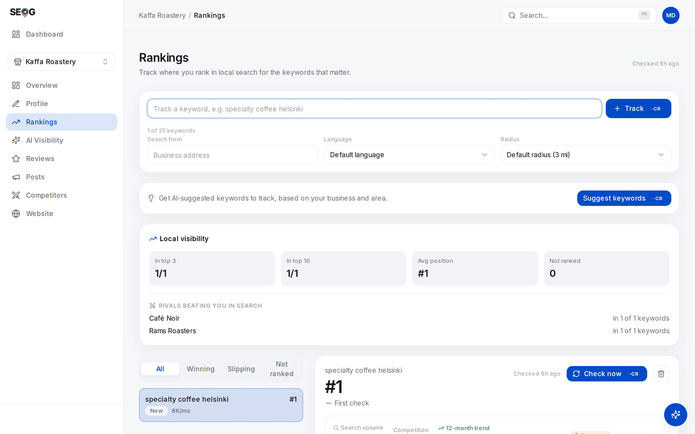
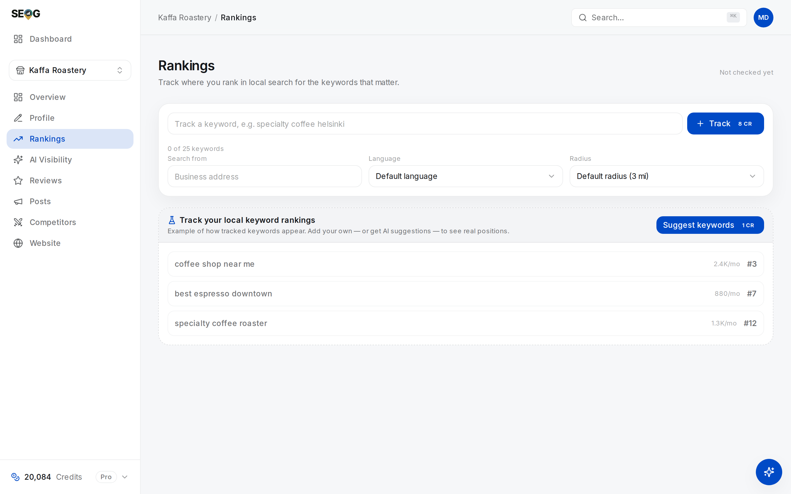
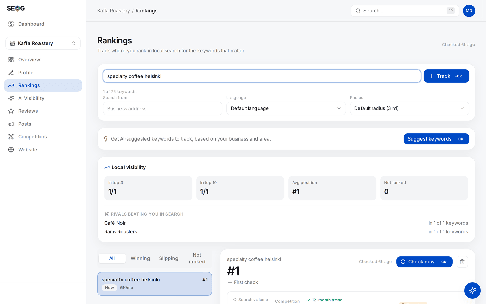

# What people actually search, and how to model it

Open almost any local SEO report and look at the tracked keywords. You will usually find the same word four times: `plumber`, `plumber near me`, `best plumber`, `plumbers in Leeds`. Four rows, four positions, four line items on the invoice — and one question being asked four ways.

Meanwhile nobody is tracking `is Acme Plumbing open on Sunday`, or `Acme Plumbing reviews`, or `Acme vs Riverside Plumbing`. Those are questions real customers type, they are closer to the money than anything on the list, and they are answered by completely different machinery.

This chapter gives you a way to sort local queries so that a keyword set covers the market instead of covering one word. It is also the chapter that stops your rank-tracking work and your AI-visibility work from being two unrelated projects, because — as you will see — they run on the same list.

## The four intents

A person searching for a local business is at one of four points in a decision. The taxonomy below is ours, not Google's: Google publishes no local query-intent classification. The four buckets are chosen because each one is answered by a different surface and fixed by a different lever, which makes them useful rather than merely tidy.

**Discovery — "I need this kind of thing near me, and I don't know who."**
`emergency dentist`, `coffee near me`, `tyre fitting hackney`. Unbranded, category-first, usually short. This is the query the entire map-pack apparatus exists to answer, and it is where relevance, distance and prominence do their work ([the three forces](./relevance-distance-prominence.md)). It is also the only intent most people ever track.

**Comparison — "I have candidates, and I want to pick one."**
`best sushi in shoreditch`, `cheapest emergency locksmith glasgow`, `Acme vs Riverside plumbing`. Evaluative or superlative. The searcher has already accepted that several businesses can do the job; they are now looking for a reason to choose. Comparison queries are answered less by a three-result pack and more by whatever can produce a *judgement* — review-heavy pages, listicles, and increasingly an AI answer that names two or three businesses and says why.

**Trust — "I have a name; should I use them?"**
`Acme Plumbing reviews`, `is Acme Plumbing legit`, `Acme Plumbing complaints`. Branded and subjective. You will almost always "rank" for these — it is your name. Ranking is not the point. What matters is what the searcher finds when they get there: your rating, your recent reviews, your replies, and whatever third-party pages carry your name. This intent is invisible to a rank tracker and decisive at the moment of purchase.

**Logistics — "I have decided; I need one fact."**
`Acme Plumbing opening hours`, `Acme Plumbing phone number`, `does Acme deliver`, `parking at Acme`. Branded and objective. These are answered directly out of your profile's structured fields, frequently with no click to anything. You do not win a logistics query by ranking. You win it by having the field filled in, correctly, and by it being the same everywhere ([the business entity](./the-business-entity.md)).

## Two axes that cut across all four

Two properties cut across the taxonomy and determine what you can do about a query.

**Branded or unbranded.** For a branded query, appearing is free — you are the answer. The work is controlling the *content* of the answer. For an unbranded query, appearing is the whole contest.

**Objective or subjective.** An objective query has a fact answer that lives in a field you control: hours, phone, address, services, attributes. A subjective query is answered from other people's text — reviews, articles, directory pages — and no amount of profile editing produces it.

Put together:

| Intent | Typical form | Branded? | Objective? | Answered by | What moves it |
| --- | --- | --- | --- | --- | --- |
| Discovery | `category near me` | No | — | Map pack, local finder | Proximity, category, prominence |
| Comparison | `best category in area` | Usually not | No | Reviews, listicles, AI answers | Reputation, third-party coverage |
| Trust | `brand reviews` | Yes | No | Your profile + third-party pages | Reviews, ratings, replies |
| Logistics | `brand hours` | Yes | Yes | Profile fields, often zero-click | Profile completeness and accuracy |

Only two of the four intents are *rank* problems at all. The other two are content and profile problems a rank tracker will never show you, which is exactly why they get neglected.

## The intent predicts the surface

Chapter 1 inventoried the surfaces a local answer can appear on ([what local SEO actually is](./what-is-local-seo.md)). Pair it with this chapter and you can usually predict the surface from the intent, before you search:

- Discovery pulls a map result. That is what the pack is for.
- Logistics pulls the profile panel itself, and often ends there.
- Trust pulls a mixture: your profile on one side, third-party pages on the other.
- Comparison is the one that has genuinely moved. It used to pull a listicle; it now frequently pulls a generated answer that names businesses directly.

Make the prediction explicitly: it tells you which instrument to point at each keyword. A logistics query in a rank tracker produces a permanent `#1` that means nothing. A comparison query tracked *only* by rank misses the surface that actually answers it.

## Why a keyword tool can only hand you one intent

Suggestions — in the lab below, and in every tool built the same way — are permutations of three strings the tool already holds: your category, your city, and your business name. `category`, `category near me`, `category in city`, `best category`, `top category`, `best category in city`, `your name`, `your name near me`. That skeleton is topped up with head terms lifted from Google's autocomplete, seeded with the same category. Then a fixed priority ordering decides which ones you see first.

*Read the panel's own description literally: suggestions are built "based on your business and area". That is the entire seed — and it is why the list that comes back can only ever contain one of the four intents.*

Now look at what that machinery can and cannot produce.

| The generator emits | Because the seed contains | Intent it lands in |
| --- | --- | --- |
| `category`, `category near me`, `category in city` | your category and your city | **Discovery** |
| `best category`, `top category in city` | the same two, plus a superlative | Nominally comparison — see below |
| `your name`, `your name near me` | your business name | Neither trust nor logistics |
| Leading words of nearby business names | a places autocomplete top-up | Discovery vocabulary |

| It cannot produce | Because it would need | Intent lost |
| --- | --- | --- |
| `cheapest emergency locksmith glasgow` | the customer's words, not your category name | **Comparison** |
| `Acme vs Riverside` | a rival the customer has in mind | **Comparison** |
| `is Acme Plumbing legit` | a *worry* | **Trust** |
| `does Acme deliver on Sundays` | a *fact about the business* | **Logistics** |

Two of those rows deserve a sentence each.

**The superlatives are a fringe, not a category.** `best category` is a superlative applied to *your own category name*. The vocabulary a real comparison query uses is the customer's, and the generator has never met a customer.

**The autocomplete top-up is not what it sounds like.** It is a *places* autocomplete — it returns predicted businesses near you, and the tool lifts the leading words of each name. That is closer to a list of your neighbours' trading names than to a record of what anyone typed. Useful vocabulary; still category vocabulary.

The missing intents are missing not because they were filtered out, but because **nothing in the input could have generated them.**

So a suggestion list is, in practice, a discovery list with a superlative fringe *(inference — read off the construction of the suggestion generator, not from testing every tool on the market)*.

One more thing, because it is the belief that does the most damage: the volume figure does **not** choose the list. Suggestions are ordered by a fixed priority table before any volume is looked up; the number is fetched afterwards and pasted beside each chip, blank where there is none — which is most branded rows. And the figure itself is planner-style data requested against a country-level geographic target: a national monthly average, not the number of people who will search that phrase within three miles of your door. Use it to break ties, never to pick the set.

What the generator cannot reach — a comparison in the customer's words, a trust query, a logistics query — is what you write yourself. That is the actual work of this chapter.

## The tracked set is also your AI prompt set

When you check whether an AI assistant recommends a business, something has to be asked. The question is built from a tracked keyword and the coordinate that keyword is anchored to — in effect, *someone near this point asks this; name the local businesses that answer it*. The keyword you track **is** the question the assistant is asked ([how an AI assistant answers a local question](./how-ai-answers-a-local-question.md)).

Two consequences follow:

**A set of four discovery synonyms produces four nearly identical AI probes.** You pay four times and learn one thing. Worse, you learn it four times in a row and mistake the repetition for evidence.

**Not every intent makes a sensible probe.** A branded trust query (`Acme Plumbing reviews`) is a perfectly reasonable thing to watch and a nearly useless AI probe: it names the business, so of course the answer discusses the business. A probe that names its subject begs its own answer. Comparison queries are the opposite — a weak map-pack keyword, and the strongest AI probe you have, because they ask the engine to choose.

| Intent | Useful as a rank-tracked keyword | Useful as an AI probe |
| --- | --- | --- |
| Discovery | Yes — this is the core | Yes |
| Comparison | Weakly | Yes — the strongest probe |
| Trust | As a watch item, not a position | No — branded, begs the answer |
| Logistics | No | No |

This is the reason to build **one** list with an intent tag on every row, rather than a keyword list for rank tracking and a separate prompt list for AI visibility. Two lists built independently cannot be reconciled later, and any report that puts a rank trend and an AI mention rate side by side is quietly comparing two different populations. The reusable version of this list lives in the appendix ([the local prompt corpus](../99-appendix/the-local-prompt-corpus.md)); the measurement method that consumes it is in [Part III](../03-advanced/ai-visibility.md).

## Building a first set that spans

Six to ten keywords is enough to start, and more than ten is usually four synonyms wearing hats. A workable first shape:

- **Three or four discovery queries.** Your main category, one service-specific variant, one neighbourhood or city variant. These are the ones that earn money and the ones you will grid-scan.
- **Two comparison queries.** Phrased the way a customer would phrase them, superlative included.
- **One or two trust queries.** Branded. You are watching what is said, not where you rank.
- **One logistics query.** Branded and factual. Its purpose is to catch a wrong field before a customer does.

Two rules that save you from the most common mess:

1. **One row per question, not one row per phrasing.** `plumber near me` and `plumber nearby` are the same question. Pick the one your customers actually say and drop the other.
2. **A second row is justified by a different *place*, not a different word.** Tracking `plumber` from two neighbourhoods measures two genuinely different things, because distance is a real force. Tracking `plumber` and `plumbers` measures nothing twice.

Where the words themselves come from is a separate problem, and there is a better source than your own imagination: Google reports to the owner the search terms that actually produced their profile. That is the subject of [building a tracked set that tells the truth](../02-core-practice/choosing-what-to-track.md), and it will change your list.

## Labs

### Lab 6.1 — Get the suggestions and classify every one

> **Lab** · Where: **Rankings** (`/b/{businessId}/rankings`) · Cost: **paid** · Time: ~10 min
>
> You need: Lab 0.3 (a practice business). Lab 3.1 (one tracked keyword) makes the suggestion card appear in its normal place rather than in the empty state.

1. Open **Rankings** for your practice business.
2. Find the suggestions card and press **Suggest keywords**. If you have no keywords tracked yet, the same button sits on the empty-state panel below the list.
3. You get a set of chips — a phrase each, with a monthly volume figure where one exists. Copy them into a table.
4. Tag each suggestion with exactly one intent: discovery, comparison, trust, logistics. Force a single choice; ties go to the intent the searcher is *closest to acting on*.
5. Count each bucket.

*Rankings before anything is tracked. The three rows are the interface's own placeholder — it says so: "Example of how tracked keywords appear". They are not positions, and not this business's keywords. What is real is the button: on an empty board, **Suggest keywords** sits on that panel rather than in its usual card above the list.*

**What good looks like.** Most suggestions land in discovery. A few superlative rows — `best <category>`, `top <category>`, `best <category> <city>` — land in comparison, but read them out loud and notice they are your category with a superlative bolted on, not anything a customer would say. Two rows are your bare business name, which is neither trust nor logistics. So trust and logistics come back empty. That is the expected result, not a malfunction.

**If it went wrong.** No suggestions card usually means the business has neither tracked keywords nor a loaded list — add one keyword first. A very short list means a sparse category on your profile, since the whole expansion is seeded from it; fix the category before blaming the suggestions.

**What you just learned.** A suggestion engine answers "what else can be built from my category, my city and my name" — which is not the same question as "what do my customers type". The intents it cannot construct never arrive on their own; they are written by a human who knows the business. Without a tool, the same list comes from typing your category into Google's search box and reading the autocomplete, plus Keyword Planner for volume; see [doing it without SEOG](../99-appendix/doing-it-without-seog.md).

### Lab 6.2 — Build a spanning set

> **Lab** · Where: **Rankings** (`/b/{businessId}/rankings`) · Cost: **paid** (each keyword you add runs a first live check) · Time: ~15 min
>
> You need: Lab 6.1.

1. Before touching the app, write your candidate list on paper: three or four discovery, two comparison, one or two trust, one logistics. Use the customer's vocabulary, not the trade's — `boiler service`, not `HVAC preventative maintenance`.
2. Cross out any two rows that are the same question phrased differently. Keep the phrasing a customer would say out loud.
3. In the app, type each one into the tracker and press **Track**. Where a suggestion chip from Lab 6.1 matches a row on your paper, clicking the chip does the same job.
4. Leave **Search from**, **Language** and **Radius** alone for now. A keyword's identity includes its location and language, so changing **Search from** creates a second independent row rather than editing the first — which is a legitimate thing to do, for a reason covered in [rank is a map, not a number](./rank-is-a-map-not-a-number.md).
5. Use the filter tabs above the list (**All**, **Winning**, **Slipping**, **Not ranked**) to read the first positions. Expect your branded rows to sit at the top and tell you nothing.

*One keyword typed, **Track** enabled. The counter under the input is the constraint this lab is built around: it shows how many of your plan's keyword slots are gone, which is why step 2 asks you to cut a near-duplicate rather than buy another. And **Search from** is the one field that earns a second row — set it and you get an independent measurement of the same phrase from another point, which is the only duplicate worth paying for.*

**What good looks like.** Six to ten rows, at least one in each of the four intents, and no two rows you would struggle to distinguish out loud. Your discovery rows probably show a real position; your trust and logistics rows probably show `#1` and are there for a different reason.

**If it went wrong.** Two different refusals. *Already tracking this keyword here* means the same phrase is already tracked at the same **Search from** and **Language** — that triple is the row's identity, so it is a genuine duplicate. Anything else usually means you are at your plan's keyword allowance; the counter under the input shows the slots used. Remove a near-duplicate rather than upgrading; that is the point of the exercise. A keyword that comes back not ranked is data, not a failure.

**What you just learned.** A keyword set is a sampling design. Adding a fifth phrasing of the same question increases your spend and your confidence without increasing your information.

### Lab 6.3 — Predict the surface before you look

> **Lab** · Where: your browser (no app screen) · Cost: **free** · Time: ~15 min
>
> You need: Lab 6.2, and ideally Lab 1.1 (the surface census).

1. Take your list from Lab 6.2. Beside each keyword, write which surface you expect to answer it: map pack, local finder, ordinary organic results, a generated AI answer, or the profile panel by itself.
2. Now run each query yourself, on a phone, signed out, in a private window.
3. Record what actually appeared, in order, for each query.
4. Score yourself. Count your correct predictions by intent.

**What good looks like.** You get discovery and logistics almost entirely right. You get comparison wrong at least once, and in a direction that surprises you — that is the surface that has moved most recently.

**If it went wrong.** If everything resolves to a map result regardless of intent, check where you are searching from; a phone sitting inside the business skews everything local. Date every observation — these surfaces change, and an undated screenshot is worthless six months from now.

**What you just learned.** Intent is a prediction you can make and then check. Once you can call the surface before searching, you can pick the instrument — rank check, AI probe, or a profile field — instead of pointing a rank tracker at everything.

## Common mistakes

**Four synonyms and calling it coverage.** Tempting because each row returns a different number, which looks like four independent measurements. They are not independent — near-duplicates move together, so four lines that all rose are one observation four times. It costs money per row and hides three intents you never looked at.

**Tracking branded queries to make the report look good.** A page of `#1`s is easy to produce and impossible to argue with, which is exactly why it is worthless. Track branded queries deliberately, as trust instruments, and label them as such on any report you hand to someone else.

**Letting the volume number choose the set.** The high-volume head term is usually the one with the most competition and the least intent behind it, and the figure itself is a national estimate rather than local demand. Volume breaks ties. It does not pick keywords.

**Writing keywords in the trade's vocabulary.** Practitioners search industry terms; customers search symptoms. The test: would a customer say this out loud to a friend? If not, it is not a keyword.

**Building the AI prompt list separately from the tracked list.** It feels like a different project — different screen, different vocabulary, often a different vendor. It produces two datasets that can never be compared, and a report whose ranking section and AI section are silently about different questions.

## Check yourself

**1. Take one comparison query for your business. What would you change to win it, and is any of it on your profile?**
Almost none of it. Comparison outcomes are driven by reviews, ratings and third-party pages that discuss you. You can influence them; you cannot edit them. If your answer was "improve the description", re-read the objective/subjective axis.

**2. Which of your keywords would be a bad AI probe, and what specifically is wrong with them?**
Anything containing your business name. The probe would be asking an assistant about a business you have just named for it, so a mention proves nothing. A valid probe describes the need, not the supplier.

**3. Your report shows all four discovery keywords improved by two positions this month. How many independent pieces of evidence is that?**
Probably one. Near-duplicate queries return near-identical result sets, so they move together. Check by looking at whether the *same* competitors sit above you on all four.

**4. Name one logistics query for your business and answer it from your own profile in under ten seconds. Did you get it right?**
If it took longer than ten seconds, or the answer was wrong, a customer just had the same experience — except they left instead of checking. Logistics failures do not show up in any ranking report.

---

That is the end of the foundations. Part II starts the working loop on a real business, where every engagement should start — a diagnosis and a dated baseline, before you change anything. This chapter's taxonomy returns in [building a tracked set that tells the truth](../02-core-practice/choosing-what-to-track.md), where the words stop being your guesses and start being Google's record of what people actually typed.

---

**Next:** [Diagnosing a business in thirty minutes →](../02-core-practice/analyzing-business-visibility.md)
