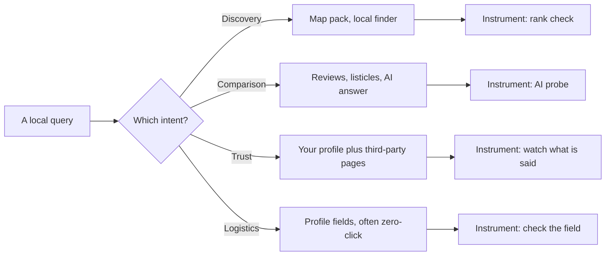

# What people actually search, and how to model it

Open almost any local SEO report and look at the tracked keywords. You will usually find the same word four times: `plumber`, `plumber near me`, `best plumber`, `plumbers in Leeds`. Four rows, four positions, four line items on the invoice — and one question being asked four ways.

Meanwhile nobody is tracking `is Acme Plumbing open on Sunday`, or `Acme Plumbing reviews`, or `Acme vs Riverside Plumbing`. Those are questions real customers type, they are closer to the money than anything on the list, and they are answered by completely different machinery.

This chapter gives you a way to sort local queries so that a keyword set covers the market instead of covering one word. It is also the chapter that stops your rank-tracking work and your AI-visibility work from being two unrelated projects, because — as you will see — they run on the same list.

## The four intents

A person searching for a local business is at one of four points in a decision. The taxonomy below is ours, not Google's: Google publishes no local query-intent classification. The four buckets are chosen because each one is answered by a different surface and fixed by a different lever, which makes them useful rather than merely tidy.

**Discovery — "I need this kind of thing near me, and I don't know who."**
`emergency dentist`, `coffee near me`, `tyre fitting hackney`. Unbranded, category-first, usually short. This is the query the entire map-pack apparatus exists to answer, and it is where relevance, distance and prominence do their work ([the three forces](../relevance-distance-prominence/index.md)). It is also the only intent most people ever track.

**Comparison — "I have candidates, and I want to pick one."**
`best sushi in shoreditch`, `cheapest emergency locksmith glasgow`, `Acme vs Riverside plumbing`. Evaluative or superlative. The searcher has already accepted that several businesses can do the job; they are now looking for a reason to choose.

Comparison queries are answered less by a three-result pack and more by whatever can produce a *judgement* — review-heavy pages, listicles, and increasingly an AI answer that names two or three businesses and says why.

**Trust — "I have a name; should I use them?"**
`Acme Plumbing reviews`, `is Acme Plumbing legit`, `Acme Plumbing complaints`. Branded and subjective. You will almost always "rank" for these — it is your name. Ranking is not the point.

What matters is what the searcher finds when they get there: your rating, your recent reviews, your replies, and whatever third-party pages carry your name. This intent is invisible to a rank tracker and decisive at the moment of purchase.

**Logistics — "I have decided; I need one fact."**
`Acme Plumbing opening hours`, `Acme Plumbing phone number`, `does Acme deliver`, `parking at Acme`. Branded and objective. These are answered directly out of your profile's structured fields, frequently with no click to anything.

You do not win a logistics query by ranking. You win it by having the field filled in, correctly, and by it being the same everywhere ([the business entity](../the-business-entity/index.md)).

## Two axes that cut across all four

Two properties cut across the taxonomy and determine what you can do about a query.

**Branded or unbranded.** For a branded query, appearing is free — you are the answer. The work is controlling the *content* of the answer. For an unbranded query, appearing is the whole contest.

**Objective or subjective.** An objective query has a fact answer that lives in a field you control: hours, phone, address, services, attributes. A subjective query is answered from other people's text — reviews, articles, directory pages — and no amount of profile editing produces it.

Put together:

| Intent | Typical form | Branded? | Objective? | Answered by | What moves it |
| --- | --- | --- | --- | --- | --- |
| Discovery | `category near me` | No | — | Map pack, local finder | Proximity, category, prominence |
| Comparison | `best category in area` | Usually not | No | Reviews, listicles, AI answers | Reputation, third-party coverage |
| Trust | `brand reviews` | Yes | No | Your profile + third-party pages | Reviews, ratings, replies |
| Logistics | `brand hours` | Yes | Yes | Profile fields, often zero-click | Profile completeness and accuracy |

> Only two of the four intents are *rank* problems at all. The other two are content and profile problems a rank tracker will never show you, which is exactly why they get neglected.

## The intent predicts the surface

Chapter 1 inventoried the surfaces a local answer can appear on ([what local SEO actually is](../what-is-local-seo/index.md)). Pair it with this chapter and you can usually predict the surface from the intent, before you search:

- Discovery pulls a map result. That is what the pack is for.
- Logistics pulls the profile panel itself, and often ends there.
- Trust pulls a mixture: your profile on one side, third-party pages on the other.
- Comparison is the one that has genuinely moved. It used to pull a listicle; it now frequently pulls a generated answer that names businesses directly.

Make the prediction explicitly: it tells you which instrument to point at each keyword. A logistics query in a rank tracker produces a permanent `#1` that means nothing. A comparison query tracked *only* by rank misses the surface that actually answers it.

---

**Next:** [Building a keyword set that spans the intents →](./building-a-spanning-keyword-set.md)
