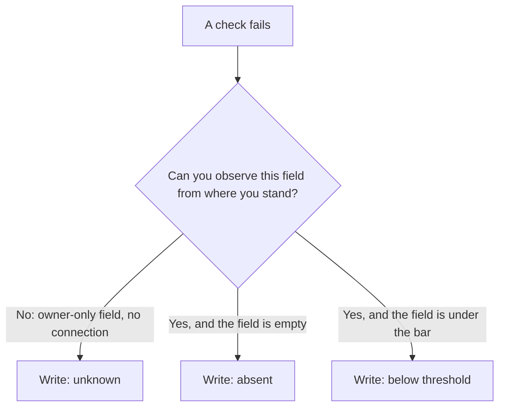

# Diagnosing a business in thirty minutes

Someone hands you a business and asks what is wrong with it. Thirty minutes later you should be able to answer in writing: a verdict in three sentences, an ordered list of work, and a dated baseline that will let you prove, in six weeks, that what you did mattered.

It is the same routine for your own coffee shop and for a prospect you are trying to win. Everything else in Part II changes one thing and re-measures it; this is the measurement you change things *against*.

One rule sits underneath it: **you never touch a profile you have not measured.** An unmeasured change is an unprovable change, and unprovable work is most of why this industry has the reputation it has.

## What a diagnostic produces

1. **A verdict.** Three or four sentences a non-specialist can read: what this business is, where it is visible, where it is not, and the single biggest constraint.
2. **An ordered work list.** Not everything that is wrong — the things worth doing, in the order you will do them.
3. **A frozen baseline.** The numbers as they were today, in a form you cannot accidentally overwrite next month.

Not on that list: a complete inventory of defects. Any local business has thirty things you could improve, and listing all thirty avoids the hard part — deciding what to do first.

## Two rubrics, and why they disagree

Two scored rubrics sit in front of you, on two screens, and beginners mash them into one impression of "the score". They measure different things, and are calibrated differently on purpose.

### The profile audit

The **Profile score** on the overview is a *completeness* audit of the profile as it can be observed: eleven pass/fail checks, each weighted, grouped into five categories. The score is the share of total weight you passed.

| Check | Category | Weight | Passes when |
| --- | --- | --- | --- |
| Phone number added | Contact | 10 | Present |
| Website linked | Contact | 9 | Present |
| Opening hours listed | Visibility | 10 | Present |
| Marked operational | Visibility | 4 | Not closed or temporarily closed |
| Business description | Content | 8 | Present |
| At least 5 photos | Content | 9 | Photos ≥ 5 |
| Rating 4.0 or higher | Reputation | 8 | Rating ≥ 4.0 |
| At least 20 reviews | Reputation | 10 | Reviews ≥ 20 |
| Accessibility info | Attributes | 7 | One or more set, *or* the category offers none |
| Payment options | Attributes | 5 | One or more set, *or* the category offers none |
| Service attributes | Attributes | 6 | One or more set, *or* the category offers none |

The eleven weights total **86**. The action plan labels each step with its raw weight, so a fix tagged `+10 pts` recovers 10 of 86 — about 11.6 percentage points, slightly more than the label suggests. The colour follows one band everywhere in the app: green from 80, amber from 50, red below.

*A 36% profile taken apart into the rows that produced it. Each step names the failing check, its category and its raw weight — the first three, phone and reviews and photos, are 29 of the 86 points on offer. This is the table above rendered as a to-do list, which is the only form in which a score is useful.*

**Two choices there are worth stealing whatever tool you use.**

- **The photo bar is modest at five** because the publicly observable photo list caps out at around ten images *(observed; Google does not document the limit)* — a stricter bar would be one the instrument cannot see over.
- **The attribute checks pass automatically** when Google's catalogue offers no options of that kind for the category. An audit that demands the impossible trains people to ignore red rows.

### The AI-readiness rubric

The **AI readiness** score on the AI Visibility screen asks a different question: how likely is an AI answer to surface this business at all. Nine all-or-nothing factors, weights totalling exactly 100.

| Factor | Weight | Passes when |
| --- | --- | --- |
| Review volume | 22 | Reviews ≥ 25 |
| Rating | 18 | Rating ≥ 4.2 |
| Website to cite | 12 | Present |
| Fresh reviews | 10 | A review inside the last 60 days |
| Rich description | 9 | Present |
| Structured attributes | 8 | One or more set, any group |
| AI-agent-ready website | 8 | Agent-readiness score ≥ 90 |
| Review engagement | 7 | Replies on ≥ 50% of reviews |
| Opening hours | 6 | Present |

Tiers: **70+ is strong, 40–69 is building, below 40 is low.**

*The same business on the AI Visibility screen — 53 of 100, in the building tier, with every factor shown as passed or failed against its weight. Review volume scores 0 of 22 on three reviews, and it is the heaviest single factor on the sheet. The three tiles at the top are **Presence**, **Recommendations** and **Authority**; the first two carry an **Example** badge until a live check is run, and nothing in any of them fed the 53.*

**Now read the two tables together.** They set different bars on the same two inputs, because they are asking different questions:

| | Profile audit | AI readiness |
| --- | --- | --- |
| Reviews bar | 20 | 25 |
| Rating bar | 4.0 | 4.2 |
| The question it asks | Is this profile complete enough to compete in the pack? | Is this reputation strong enough that a language model would name this business to a stranger? |

That is not an inconsistency to be tidied away. The second bar is higher because the AI surfaces recommend far fewer businesses than the pack lists — the subject of [how an AI assistant answers a local question](../01-foundations/how-ai-answers-a-local-question.md).

**And one line is a thesis written as arithmetic:** **22 + 18 = 40**, exactly the *building* threshold. A business passing review volume and rating and *nothing else* lands precisely on the boundary; everything else is upside.

That calibration was held deliberately when the rubric was rebalanced, and it encodes a claim you should accept or argue with:

> **Reputation is the gateway to AI answers, and no amount of structured data compensates for a thin one.**

### What neither score is

Neither predicts your ranking. Both are computed from stored profile and review data without looking at a single search result, so a business can score 100% on the audit and still not appear in the pack a mile from its door — the audit cannot see distance, and [proximity dominates at short range](../01-foundations/relevance-distance-prominence.md).

A score is a *diagnostic input*, never a finding. "Your profile score is 62%" is not a sentence a client should be sent. "Three of the eleven completeness checks fail, and the two that matter are hours and photos" is.

## Missing, or invisible?

**This is where most first-pass audits quietly lie**, and it is what separates a diagnostic from a checklist. Every field has **three** possible states, not two: present, absent, or *not observable from where you are standing*.

The public record Google exposes to search is a subset of what the owner sees, so on an unconnected business several checks report on data that was never visible to you. Three mislead constantly.

**The description.** The public place record does not carry the *owner-written* description; it is readable only through the owner connection. On an unconnected business a failing description check means *unknown*, not *missing* — and telling a prospect they have no description when they wrote one last year is an expensive way to lose the room. There is a second trap in the same field, covered where it belongs in [The profile is the product](./the-profile-is-the-product.md).

*A healthy profile, observed from outside. Step 1 of the plan is "Add a business description" — but this business is not connected, and the public record never carries the owner-written one. That row is the trap: read it as **unknown**, and note that the connect panel above it is precisely the list of things you cannot currently see.*

**Review engagement.** The readiness rubric divides the replies it has stored by Google's authoritative total review count. Without owner access you hold only a small recent sample of reviews, so that ratio is near zero by construction and measures nothing.

The response-rate ring on the overview's **Review momentum** card uses a different denominator — replies over reviews *stored* — so the two can disagree sharply on the same business. [Why two tools disagree](../03-advanced/why-two-tools-disagree.md) generalises the point.

**Owner performance.** Views, calls, direction requests and the search terms people used are owner-only. An empty performance panel means "not connected", not "no traffic".

So: when you cannot see something, write **unknown**, never "missing". A diagnostic that distinguishes the two is worth paying for; one that does not is a template with a business name pasted in.

> **Observe-only readers.** All three labs in this chapter work on a business you do not own — none of them writes anything to Google. Your verdict simply carries more `unknown` rows, and writing them honestly is the exercise. The public-versus-owner split is tabulated in [Set up your workbench](../00-start-here/set-up-your-workbench.md).

## The order of work

**Sorting by weight is the default the app gives you.** The action plan merges four sources — the failing audit checks, the two readiness factors the audit does not already cover (fresh reviews and review engagement), and any stored website and listings fixes — then tiers them by impact and orders by recoverable points inside each tier.

Only the audit rows carry points, because only they move the profile score. Take that order as a first draft, because weight is not the only axis.

**Effort.** Adding opening hours takes ninety seconds and recovers 10 of 86. Getting from 12 reviews to 20 takes a quarter and recovers the same 10. Identical on the scoreboard, nothing alike as work. Sort by weight *per unit of effort* and the real first day falls out: the fields that are simply absent.

**Latency.** Some fixes are visible the moment Google publishes them. Others cannot move for months, being aggregates of customer behaviour you influence but cannot set. Splitting the list this way turns a diagnostic into a plan:

| Horizon | Work | Why |
| --- | --- | --- |
| Today | Hours, phone, website link, attributes, description, photos | Fields you write directly |
| Weeks | Review inflow restarts, replies caught up, first posts | You act, customers respond |
| A quarter | Review volume threshold, rating movement, citation consistency | Aggregates that move slowly by construction |

Start the slow things first and do the fast things while they run. That inversion — begin the quarter-long work on day one, not after the quick wins — is the scheduling decision that most changes how a ninety-day engagement ends. [The ninety-day plan](../04-operating/the-ninety-day-plan.md) turns it into a calendar.

One caution: the list is generated from the *profile*, so it cannot contain the finding that matters most for some businesses — a hard market, or a location too far from where their customers search. That comes from a rank map, and [choosing what to track](./choosing-what-to-track.md) is where that half begins.

## What can have moved, and what cannot

Reading stored data is free; fetching new data from Google is not — the economics are in [how the labs work](../00-start-here/how-the-labs-work.md). Each domain on the overview has its own refresh button and its own price — **Refresh all**, **Refresh rankings**, **Refresh map**, **Refresh reviews**, **Refresh competitors**, **Refresh check** — separate on purpose, so you pay for the domain you asked about.

**Refresh all** re-pulls the profile fields and the reviews, plus the owner performance series on a connected business. It does **not** re-check keyword positions, re-run a grid scan, or re-fetch competitors.

So if a position on **Rankings at a glance** looks different afterwards, it did not change — you are misremembering, or reading a scan from another date. Every card that shows fetched data stamps it with the date it was fetched.

> **Read the stamp before the number, every time.**

## Freeze the baseline

You cannot see movement you did not record, and you will not remember what the numbers were. Two mechanisms do the recording, and you need both.

**The automatic one.** At most one metrics snapshot is written per business per calendar day — profile score, rating, review count, photo count, open fixes. That feeds **Profile score over time**, which is why the chart does not appear until a second snapshot exists. On day one there is nothing to draw, and a tool that drew a line anyway would be inventing one.

**The deliberate one.** A generated PDF is the human-readable freeze: generation date and last-synced date, key metrics, the profile fields as they stand, every audit check with its pass/fail and remedy, the nine readiness factors, and the merged plan. Generate it *before* you change anything, name it with the date, and never overwrite it.

By hand this takes about an hour: the profile dashboard for the fields, a spreadsheet for the twenty checks and factors, a dated copy somewhere safe. [Doing it without SEOG](../99-appendix/doing-it-without-seog.md) has the long form.

## Labs

### Lab 7.1 — Read the audit and write a cause for every failing check

> **Lab** · Where: **Overview** (`/b/{businessId}/overview`) · Cost: **free** · Time: ~15 min
>
> You need: your practice business added (Lab 0.3). Ideally [Lab 1.2](../01-foundations/what-is-local-seo.md) done, so you have a first baseline note.

1. Open the overview. Press nothing — every refresh button here fetches from Google and is priced. Everything in this lab is already stored.
2. Read the **Profile score** card. The bar underneath splits the score into the five categories — segment width is that category's share of the weight, fill is your coverage. Note the segments that are visibly unfilled.
3. Open **Action plan — your next steps**. Write every item down. Audit rows carry a `+N pts` figure — record it. Rows from the other three sources (AI visibility, Website, Listings) carry an impact tier instead and no points; record the tier and note which source label the row wears.
4. For each, write **one line naming the cause**, from exactly three: *absent* (the field is empty), *below threshold* (present but under the bar — 12 reviews against 20), or *unknown* (you cannot observe it from here). Guessing is not an option.
5. Open **AI Visibility** and read the **AI readiness** card at the bottom. Do not press **Check now**. Expand **What goes into this score** and add any failing factor the action plan did not list.
6. Write the verdict: three sentences, no numbers-as-conclusions.

**What good looks like.** Every failing item has a cause beside it, at least one is marked *unknown* if you are not connected to the profile, and the verdict is something a non-specialist could read aloud.

**If it went wrong.** The score looks unfairly low: count the *unknown* causes — the audit scores what is publicly observable, and the description is invisible without the owner connection. Cards showing a clearly-labelled **Example** preview are a to-do list, not a fault; those examples never mix with live numbers.

**What you just learned.** A score is a sum of check results, so it can always be decomposed back into checks — and the decomposition *is* the diagnosis. A score that cannot be taken apart into named, causal rows does not belong in a client report.

### Lab 7.2 — Refresh the picture, then say which numbers could have moved

> **Lab** · Where: **Overview** (`/b/{businessId}/overview`) · Cost: **paid** · Time: ~5 min
>
> You need: Lab 7.1, and your written list from it.

1. Before pressing anything, write down four numbers: profile score, rating, review count, photo count. Then two you expect *not* to change: the position on your top keyword, and the number of tracked competitors.
2. Press **Refresh all** in the page header. The price is on the button before you confirm.
3. Re-read the same six numbers. For every one that moved, write why it could. For every one that did not, write whether it *could* have.
4. Compare the timestamps on **Rankings at a glance** and **Local visibility** with the "Synced" stamp in the page header.

**What good looks like.** You can state without hedging that profile and review data were re-fetched and that ranking, grid and competitor data were not — and point at the timestamps that prove it. A rating that moved 0.1 and a review count that moved by one is a real change on Google, not an artefact.

**If it went wrong.** Nothing moved at all: the normal result on a recently-refreshed business, and information rather than a failure. A failed run is refunded automatically.

**What you just learned.** Every fetched number has a scope and an age. Reporting one without knowing which fetch produced it, and when, is how "the rankings improved" comes to mean "we looked at a different scan".

### Lab 7.3 — Freeze the baseline

> **Lab** · Where: **Overview → Reports** (`/b/{businessId}/overview`) · Cost: **paid** · Time: ~5 min
>
> You need: Lab 7.2, so the frozen picture is the freshest one.

1. Open **Reports** in the page header and press **Generate**. The price is on the button. When the report appears in the list, download it.
2. Read it end to end — it is short. Confirm the generation date and last-synced date, and check every failing row against the causes you wrote in Lab 7.1.
3. Save it with the date in the filename: `businessname-baseline-YYYY-MM-DD.pdf`, somewhere you will still have it in three months.
4. Put your verdict and work list in the same folder as a text file. The PDF is the evidence; the verdict is the argument.

**What good looks like.** A dated document whose profile-audit section reads the same as your own notes. Nothing should surprise you — if something does, your Lab 7.1 reading was incomplete.

**If it went wrong.** The performance section says the profile is not connected: expected on the observe-only path, and the report says so rather than leaving a suspicious blank. Note what the report does *not* carry: no keyword positions and no geo-grid. If a rank map belongs in the before-picture, run the scan and export the map yourself, labelled with its date, keyword and preset — [Did it work?](./did-it-work.md) covers that discipline.

**What you just learned.** A baseline is not a number you remember, it is a document you cannot edit. Same discipline as a lab notebook, and for the same reason: the version of you reporting results in six weeks has every incentive to misremember the starting point.

## Common mistakes

**Fixing during the diagnostic.** You spot a missing phone number in minute four and fix it in minute five, and your baseline now has a hole in it. It feels efficient; it costs you the ability to attribute anything. Diagnose, freeze, then fix.

**Reporting a score as a finding.** "Profile score 62%" gives a client nothing to act on and invites them to treat the number as the goal. People then optimise the score — ticking low-weight attribute boxes — instead of the business.

**Calling unobservable data missing.** The fastest way to lose credibility in a first meeting is to tell an owner they have no description when they wrote one.

**Working the list strictly top-down.** The generated order is by recoverable weight and ignores effort and latency. Taken literally it has you spend week one chasing reviews — the slowest item — while the hours field, ninety seconds of work that gates "open now" searches, sits untouched.

**Buying a fetch that stored data already answers.** Read the stamp on the card first. This is the most common way a beginner spends many times what a competent operator does for the same insight.

## Check yourself

Answer against your own practice business, with your Lab 7.1 notes open.

1. **Your profile score is 71%. Name everything that number does *not* contain.** At minimum: which checks failed, why, whether any are unobservable, and anything about your position in search.
2. **Which failing items are *unknown* rather than *missing*, and what would convert each into a fact?** If the answer is "none" and you are not connected to the profile, re-read the middle of this chapter.
3. **A business passes review volume and rating and fails the other seven readiness factors. What tier is it in, and what does that arithmetic say about how the rubric was built?**
4. **You pressed Refresh all and a rival's review count on the market strip looks different. Give two explanations, and say which one the timestamps rule out.**
5. **Thirty minutes, a prospect you have never seen, no owner access. What goes in the verdict, and what goes under "cannot be determined without access"?**

---

**Next:** [Building a tracked set that tells the truth →](./choosing-what-to-track.md)
