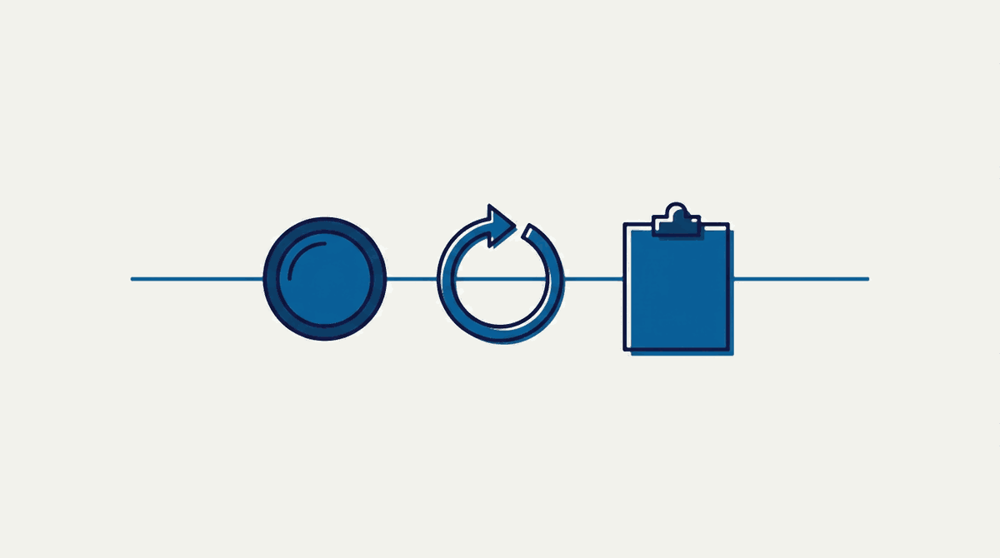
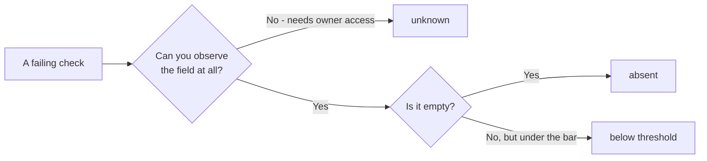

# Diagnostic labs and common mistakes

The three labs below run the whole routine once, in order: read the audit and name a cause for every failing check, refresh the picture and say what could have moved, then freeze the result as a document you cannot edit.

*The arc of this chapter, and the order matters: read what is already stored (free), re-fetch once and account for what moved (paid), then freeze the result (paid). Diagnose, freeze, then fix — a fix made before the freeze is a fix you can never take credit for.*

## Labs

### Lab 7.1 — Read the audit and write a cause for every failing check

> **Lab** · Where: **Overview** (`/b/{businessId}/overview`) · Cost: **free** · Time: ~15 min
>
> You need: your practice business added (Lab 0.3). Ideally [Lab 1.2](../../01-foundations/what-is-local-seo/index.md) done, so you have a first baseline note.

1. Open the overview. Press nothing — every refresh button here fetches from Google and is priced. Everything in this lab is already stored.
2. Read the **Profile score** card. The bar underneath splits the score into the five categories — segment width is that category's share of the weight, fill is your coverage. Note the segments that are visibly unfilled.
3. Open **Action plan — your next steps**. Write every item down. Audit rows carry a `+N pts` figure — record it. Rows from the other three sources (AI visibility, Website, Listings) carry an impact tier instead and no points; record the tier and note which source label the row wears.
4. For each, write **one line naming the cause**, from exactly three: *absent* (the field is empty), *below threshold* (present but under the bar — 12 reviews against 20), or *unknown* (you cannot observe it from here). Guessing is not an option.
5. Open **AI Visibility** and read the **AI readiness** card at the bottom. Do not press **Check now**. Expand **What goes into this score** and add any failing factor the action plan did not list.
6. Write the verdict: three sentences, no numbers-as-conclusions.

*The screen the lab runs on, with each step's target on it. Step 2 reads the segmented bar under **36%** — of its five category segments only one is filled across, and two carry no fill at all. Step 3 reads the numbered rows and their `+N pts`. And before any of it, read the header: **Not synced yet**, beside the **Refresh all** you are not pressing until Lab 7.2.*

Step 4 is the one that takes practice. Every failing row resolves to exactly one of three causes, and the route to it is mechanical:

*Only **absent** and **below threshold** are findings. **unknown** is a statement about your access, not about the business — and writing it down is what stops an observed gap from being reported as a fault.*

**What good looks like.** Every failing item has a cause beside it, at least one is marked *unknown* if you are not connected to the profile, and the verdict is something a non-specialist could read aloud.

**If it went wrong.** The score looks unfairly low: count the *unknown* causes — the audit scores what is publicly observable, and the description is invisible without the owner connection. Cards showing a clearly-labelled **Example** preview are a to-do list, not a fault; those examples never mix with live numbers.

**What you just learned.** A score is a sum of check results, so it can always be decomposed back into checks — and the decomposition *is* the diagnosis. A score that cannot be taken apart into named, causal rows does not belong in a client report.

### Lab 7.2 — Refresh the picture, then say which numbers could have moved

> **Lab** · Where: **Overview** (`/b/{businessId}/overview`) · Cost: **paid** · Time: ~5 min
>
> You need: Lab 7.1, and your written list from it.

1. Before pressing anything, write down four numbers: profile score, rating, review count, photo count. Then two you expect *not* to change: the position on your top keyword, and the number of tracked competitors.
2. Press **Refresh all** in the page header. The price is on the button before you confirm.
3. Re-read the same six numbers. For every one that moved, write why it could. For every one that did not, write whether it *could* have.
4. Compare the timestamps on **Rankings at a glance** and **Local visibility** with the "Synced" stamp in the page header.

**What good looks like.** You can state without hedging that profile and review data were re-fetched and that ranking, grid and competitor data were not — and point at the timestamps that prove it. A rating that moved 0.1 and a review count that moved by one is a real change on Google, not an artefact.

**If it went wrong.** Nothing moved at all: the normal result on a recently-refreshed business, and information rather than a failure. A failed run is refunded automatically.

**What you just learned.** Every fetched number has a scope and an age. Reporting one without knowing which fetch produced it, and when, is how "the rankings improved" comes to mean "we looked at a different scan".

### Lab 7.3 — Freeze the baseline

> **Lab** · Where: **Overview → Reports** (`/b/{businessId}/overview`) · Cost: **paid** · Time: ~5 min
>
> You need: Lab 7.2, so the frozen picture is the freshest one.

1. Open **Reports** in the page header and press **Generate**. The price is on the button. When the report appears in the list, download it.
2. Read it end to end — it is short. Confirm the generation date and last-synced date, and check every failing row against the causes you wrote in Lab 7.1.
3. Save it with the date in the filename: `businessname-baseline-YYYY-MM-DD.pdf`, somewhere you will still have it in three months.
4. Put your verdict and work list in the same folder as a text file. The PDF is the evidence; the verdict is the argument.

**What good looks like.** A dated document whose profile-audit section reads the same as your own notes. Nothing should surprise you — if something does, your Lab 7.1 reading was incomplete.

**If it went wrong.** The performance section says the profile is not connected: expected on the observe-only path, and the report says so rather than leaving a suspicious blank. Note what the report does *not* carry: no keyword positions and no geo-grid. If a rank map belongs in the before-picture, run the scan and export the map yourself, labelled with its date, keyword and preset — [Did it work?](../did-it-work/index.md) covers that discipline.

**What you just learned.** A baseline is not a number you remember, it is a document you cannot edit. Same discipline as a lab notebook, and for the same reason: the version of you reporting results in six weeks has every incentive to misremember the starting point.

## Common mistakes

**Fixing during the diagnostic.** You spot a missing phone number in minute four and fix it in minute five, and your baseline now has a hole in it. It feels efficient; it costs you the ability to attribute anything. Diagnose, freeze, then fix.

*The fix is not lost — it is out of the record. In six weeks you will be able to say the phone number is there and not that you put it there, because the only document from before it existed already has it.*

**Reporting a score as a finding.** "Profile score 62%" gives a client nothing to act on and invites them to treat the number as the goal. People then optimise the score — ticking low-weight attribute boxes — instead of the business.

**Calling unobservable data missing.** The fastest way to lose credibility in a first meeting is to tell an owner they have no description when they wrote one.

**Working the list strictly top-down.** The generated order is by recoverable weight and ignores effort and latency. Taken literally it has you spend week one chasing reviews — the slowest item — while the hours field, ninety seconds of work that gates "open now" searches, sits untouched.

**Buying a fetch that stored data already answers.** Read the stamp on the card first. This is the most common way a beginner spends many times what a competent operator does for the same insight.

## Check yourself

Answer against your own practice business, with your Lab 7.1 notes open.

1. **Your profile score is 71%. Name everything that number does *not* contain.** At minimum: which checks failed, why, whether any are unobservable, and anything about your position in search.
2. **Which failing items are *unknown* rather than *missing*, and what would convert each into a fact?** If the answer is "none" and you are not connected to the profile, re-read the middle of this chapter.
3. **A business passes review volume and rating and fails the other seven readiness factors. What tier is it in, and what does that arithmetic say about how the rubric was built?**
4. **You pressed Refresh all and a rival's review count on the market strip looks different. Give two explanations, and say which one the timestamps rule out.**
5. **Thirty minutes, a prospect you have never seen, no owner access. What goes in the verdict, and what goes under "cannot be determined without access"?**

---

**Next:** [Building a tracked set that tells the truth →](../choosing-what-to-track/index.md)
