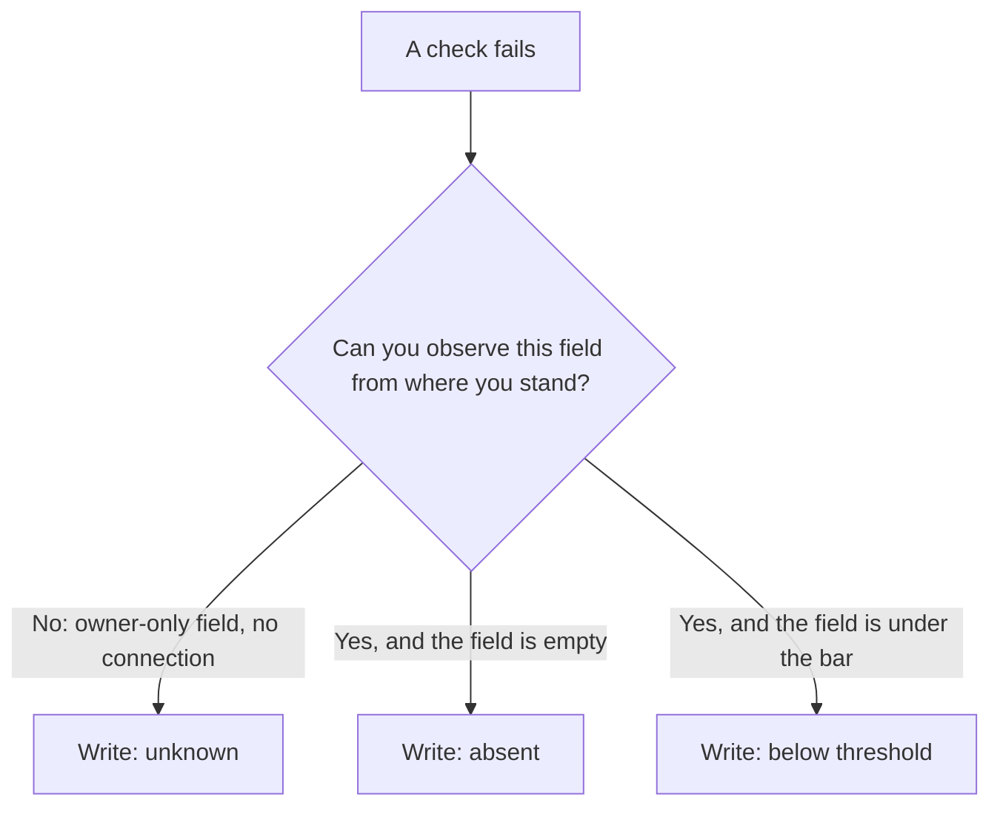

# Turning failing checks into a plan

Both rubrics are now decomposed into named checks. Before that list becomes a plan, one distinction decides whether the diagnostic is honest — and then two more decide the order you work in.

## Missing, or invisible?

**This is where most first-pass audits quietly lie**, and it is what separates a diagnostic from a checklist. Every field has **three** possible states, not two: present, absent, or *not observable from where you are standing*.

The public record Google exposes to search is a subset of what the owner sees, so on an unconnected business several checks report on data that was never visible to you. Three mislead constantly.

**The description.** The public place record does not carry the *owner-written* description; it is readable only through the owner connection. On an unconnected business a failing description check means *unknown*, not *missing* — and telling a prospect they have no description when they wrote one last year is an expensive way to lose the room. There is a second trap in the same field, covered where it belongs in [The profile is the product](../the-profile-is-the-product/index.md).

*A healthy profile, observed from outside. Step 1 of the plan is "Add a business description" — but this business is not connected, and the public record never carries the owner-written one. That row is the trap: read it as **unknown**, and note that the connect panel above it is precisely the list of things you cannot currently see.*

**Review engagement.** The readiness rubric divides the replies it has stored by Google's authoritative total review count. Without owner access you hold only a small recent sample of reviews, so that ratio is near zero by construction and measures nothing.

The response-rate ring on the overview's **Review momentum** card uses a different denominator — replies over reviews *stored* — so the two can disagree sharply on the same business. [Why two tools disagree](../../03-advanced/why-two-tools-disagree/index.md) generalises the point.

**Owner performance.** Views, calls, direction requests and the search terms people used are owner-only. An empty performance panel means "not connected", not "no traffic".

So: when you cannot see something, write **unknown**, never "missing". A diagnostic that distinguishes the two is worth paying for; one that does not is a template with a business name pasted in.

> **Observe-only readers.** All three labs in this chapter work on a business you do not own — none of them writes anything to Google. Your verdict simply carries more `unknown` rows, and writing them honestly is the exercise. The public-versus-owner split is tabulated in [Set up your workbench](../../00-start-here/set-up-your-workbench.md).

## The order of work

**Sorting by weight is the default the app gives you.** The action plan merges four sources — the failing audit checks, the two readiness factors the audit does not already cover (fresh reviews and review engagement), and any stored website and listings fixes — then tiers them by impact and orders by recoverable points inside each tier.

Only the audit rows carry points, because only they move the profile score. Take that order as a first draft, because weight is not the only axis.

**Effort.** Adding opening hours takes ninety seconds and recovers 10 of 86. Getting from 12 reviews to 20 takes a quarter and recovers the same 10. Identical on the scoreboard, nothing alike as work. Sort by weight *per unit of effort* and the real first day falls out: the fields that are simply absent.

**Latency.** Some fixes are visible the moment Google publishes them. Others cannot move for months, being aggregates of customer behaviour you influence but cannot set. Splitting the list this way turns a diagnostic into a plan:

| Horizon | Work | Why |
| --- | --- | --- |
| Today | Hours, phone, website link, attributes, description, photos | Fields you write directly |
| Weeks | Review inflow restarts, replies caught up, first posts | You act, customers respond |
| A quarter | Review volume threshold, rating movement, citation consistency | Aggregates that move slowly by construction |

Start the slow things first and do the fast things while they run. That inversion — begin the quarter-long work on day one, not after the quick wins — is the scheduling decision that most changes how a ninety-day engagement ends. [The ninety-day plan](../../04-operating/the-ninety-day-plan/index.md) turns it into a calendar.

One caution: the list is generated from the *profile*, so it cannot contain the finding that matters most for some businesses — a hard market, or a location too far from where their customers search. That comes from a rank map, and [choosing what to track](../choosing-what-to-track/index.md) is where that half begins.

## What can have moved, and what cannot

Reading stored data is free; fetching new data from Google is not — the economics are in [how the labs work](../../00-start-here/how-the-labs-work.md). Each domain on the overview has its own refresh button and its own price — **Refresh all**, **Refresh rankings**, **Refresh map**, **Refresh reviews**, **Refresh competitors**, **Refresh check** — separate on purpose, so you pay for the domain you asked about.

**Refresh all** re-pulls the profile fields and the reviews, plus the owner performance series on a connected business. It does **not** re-check keyword positions, re-run a grid scan, or re-fetch competitors.

So if a position on **Rankings at a glance** looks different afterwards, it did not change — you are misremembering, or reading a scan from another date. Every card that shows fetched data stamps it with the date it was fetched.

> **Read the stamp before the number, every time.**

## Freeze the baseline

You cannot see movement you did not record, and you will not remember what the numbers were. Two mechanisms do the recording, and you need both.

**The automatic one.** At most one metrics snapshot is written per business per calendar day — profile score, rating, review count, photo count, open fixes. That feeds **Profile score over time**, which is why the chart does not appear until a second snapshot exists. On day one there is nothing to draw, and a tool that drew a line anyway would be inventing one.

**The deliberate one.** A generated PDF is the human-readable freeze: generation date and last-synced date, key metrics, the profile fields as they stand, every audit check with its pass/fail and remedy, the nine readiness factors, and the merged plan. Generate it *before* you change anything, name it with the date, and never overwrite it.

By hand this takes about an hour: the profile dashboard for the fields, a spreadsheet for the twenty checks and factors, a dated copy somewhere safe. [Doing it without SEOG](../../99-appendix/doing-it-without-seog.md) has the long form.

---

**Next:** [Diagnostic labs and common mistakes →](./labs-and-common-mistakes.md)
