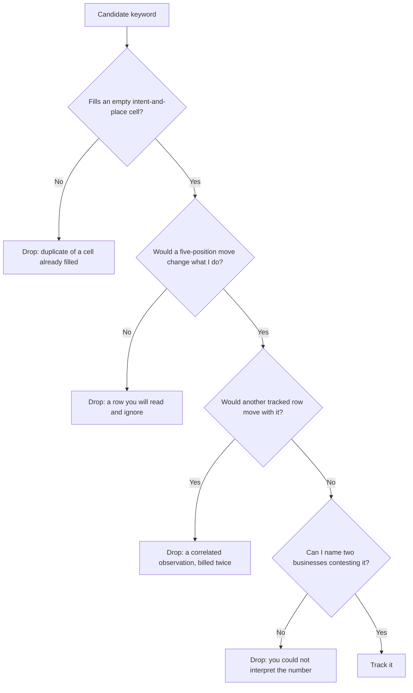

# Pruning the set and setting a cadence

You now know what a single tracked row really is, and where candidate terms come from that are not guesses. Two decisions remain: which candidates earn a slot, and how often you look at them.

## Pruning: which rows earn a slot

You now have more candidates than slots. Pruning is where a set becomes a sample instead of a pile.

**Sort them into cells rather than into a ranked list.** A cell is an intent crossed with a place: *discovery / town centre*, *discovery / north suburb*, *comparison / anywhere*, *trust / branded*.

Fill each cell once. A second row in a filled cell buys a duplicate; the first row in an empty cell buys a new fact.

Then put every survivor through three questions.

1. **If this number moved five positions, would I do anything differently?** If not, it is a row you will read and ignore. Ignoring is fine; paying to be able to ignore is not.
2. **Is any other row likely to move with it?** Near-duplicate queries return near-identical result sets and drift together *(inference — from duplicate rows in one market moving in step, not a controlled study)*. Four rows that all rose is one observation reported four times.
3. **Can I name who I am competing with on it?** If you cannot name two businesses that contest the term, you cannot interpret its number.

Six to ten rows survive this for a single-location business — an information limit rather than a budget one. Past ten, new rows are almost always synonyms, and synonyms are correlated observations that inflate confidence without adding evidence.

One last thing before you prune, because it is the mechanism by which sets flatter their owners.

> **Portfolio numbers are a function of the sample.**

The Rankings page shows a **Local visibility** card — *In top 3*, *In top 10*, *Avg position*, *Not ranked*. (The overview carries a card of the same name showing your latest grid scan; this is the portfolio one.)

Three of the four are ratios or averages over the set. So remove four branded rows you sit at `#1` for and *In top 3*, *In top 10* and *Avg position* all get worse, with nothing having changed on Google. Add four synonyms of a term you win and all three improve.

*Not ranked* is a raw count of rows, so it sits still through both — which is exactly why it is the one to read. And this is why branded terms accumulate: they are the cheapest way to make a report look like progress.

*Avg position* is computed only over rows where you were found, so a keyword dropping out of the top twenty *leaves* the average — a business can lose its hardest keyword and watch its average improve. Read the *Not ranked* count in the same glance, always.

## Cadence is a statistical decision

"How often should I check rankings?" is usually answered with a habit — weekly, because reports are weekly. It has an actual answer, from two properties of what you are measuring.

**How fast does the signal move?** Local positions drift over weeks, and the levers behind them are slower still *(inference — observed lag, not anything Google documents)*:

- A profile edit publishes quickly, but its effect on placement is not observable the same afternoon.
- Reviews accumulate over months.
- Citation corrections propagate at the pace of whoever maintains the directory.

Owner search-term data is monthly by construction and planner volume is a monthly average, so re-reading either more often cannot change the number.

**How big is the noise?** Two identical checks a day apart do not always agree; results are personalised, geographically sensitive and re-ranked continuously.

You can measure your own noise floor rather than guess at it — [Reading a geo-grid without fooling yourself](../../03-advanced/reading-a-geo-grid/index.md) runs that experiment, and it is worth doing once, early, on your own market.

Together they give the rule.

> **Sample faster than the thing changes, slower than the noise.**

A daily series on a signal that moves monthly is a chart of jitter with a monthly trend hidden inside, at fourteen times the price — cost scales linearly with observations and information does not.

A defensible starting cadence for one business:

| What | Interval | Why |
| --- | --- | --- |
| Rank check across the set | Fortnightly, or monthly | Positions drift over weeks; faster reads as noise |
| Geo-grid on one or two money keywords | Monthly, identical parameters | The comparison is the point, and parameter changes kill it |
| Owner search terms | Monthly | Google's data is monthly; asking more often returns the same window |
| Search volume | Monthly at most | It is a monthly average |
| After a change | Timed to the lever, not the calendar | See [did it work?](../did-it-work/index.md) |

Two disciplines make a cadence worth having.

**Refresh the whole set at once.** Rows sharing a timestamp are comparable. A set checked ad hoc — this one Tuesday, that one a fortnight later — cannot be read across, because a difference between two rows might be ranking or might be date.

**Identical parameters or no comparison.** Changing the origin, radius, language or grid size destroys comparability silently. The numbers still line up in a table, which is the problem, and it is the most common way a monthly report lies without anybody lying.

**The exception to a fixed interval is an event, not a faster clock.** You changed something, a competitor changed something, or a symptom suggests the listing's state has changed.

Between events, read stored data freely — most questions a beginner tries to answer with a fresh scan are answerable from last month's.

---

**Next:** [Tracking labs and common mistakes →](./labs-and-common-mistakes.md)
