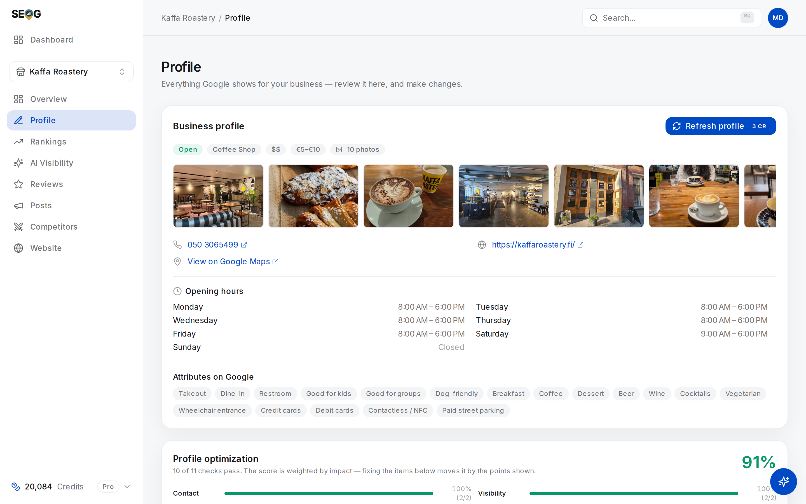
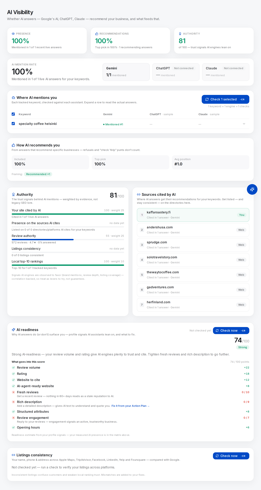

# Citations and NAP consistency

Your business exists in more places than its Google profile. Apple Maps holds a record. Facebook has a page. Yelp has a listing that somebody — possibly not you — created. Each is another system's answer to *what is this business, and where is it*.

When those answers disagree, something has to decide which is right. That decision is the subject of this chapter, and understanding it is the difference between doing citation work and buying it.

## What a citation is

A **citation** is any published record of your business's identity on a site that is not yours. Two kinds: **structured** — a directory listing with fields (Yelp, Apple Maps, Foursquare, Facebook, TripAdvisor, a trade body's member list) — and **unstructured**, a mention in prose. A local newspaper writes "Kaffa Roastery on Pursimiehenkatu" and that sentence is a citation, with no fields and no link.

**NAP** is the three identifying fields: name, address, phone. The shorthand is slightly wrong — a website and a category identify too — but it names the fields that break most often. A citation is not a backlink; most do not link to you.

## Consistency is an entity-resolution problem

Google does not award tidiness points. What Google — and Apple, and any assistant grounded in web search — has to do is **entity resolution**: take many records from many sources and decide which describe the same real-world thing. Every record has three outcomes and only one is good. **Matched**: its evidence attaches to your entity. **Discarded**: the system cannot tell it is you, so the evidence is lost. **Mis-matched**: it attaches to something else, usually a duplicate of your own business, splitting your reputation between two listings.

A record that cannot be resolved is not neutral — it is either wasted or actively harmful. That is a much better reason to care than "Google likes it", and it is the work queue implied by [the entity model](../01-foundations/the-business-entity.md).

### What a resolver actually tolerates

Because the same shop is legitimately written a dozen ways, a resolver has to be *tolerant* — demand identical strings and it matches almost nothing. Below is what the matcher behind Lab 12.1 does, so you can predict its verdicts before it produces them.

| Field | Folded together (same business) | Kept apart (different business) |
| --- | --- | --- |
| **Name** | Case, accents, punctuation, apostrophes. A dropped legal suffix — Oy, Ltd, LLC, Inc, GmbH. One name containing the other: "Starbucks" and "Starbucks Coffee". | A genuinely different trading name. |
| **Phone** | All formatting. Country code against the domestic trunk zero — `+358 9 …` and `09 …` are the same line, because the comparison runs on the national tail. | A **different line**: a call-tracking number, a superseded number, a mobile where the listing carries the landline. |
| **Address** | Street/St, Avenue/Ave, North/N. Suite, unit and floor designators, which carry no location identity. Extra detail on one side — postcode, country. | A **different house number**, an immediate no-match. Or too little overlap in the remaining tokens. |

The values on one side of every comparison come from your own profile record:

*This is what a listing gets compared against — the stored profile, not your letterhead. Google renders the phone as "050 3065499"; a directory holding "+358 50 3065499" is the same line and folds to a match, because the comparison runs on the national tail. A directory holding a different number does not, and that is the row worth your afternoon.*

Read that table twice, because it inverts what most people are told. "Ave" versus "Avenue" does not break resolution. Neither does a missing suite number, a dropped "Ltd", or a phone written with brackets. What breaks resolution is a **different fact**: a different house number, a different phone line. Those two are worth hunting; a fifty-row consistency report that does not separate them from cosmetic variance is noise wearing a suit.

> **A note on certainty.** We can describe the matcher we can read; Google's is not published and nobody outside Google knows its tolerances. But every resolver faces the same problem, and one distinction survives any sane implementation: *a different value is a break, a different rendering is not* *(inference)*.

### What actually breaks it

- **Call-tracking numbers.** One on the website, another in a paid directory, the real one on the profile — the entity now has three phone identities. If you must track calls, keep the profile number visible on the site; never put a tracking number into a directory listing.
- **A move, or a rebrand.** The old address and the old name survive on directories for years, because nobody deletes anything.
- **A listing you did not create.** Yelp, Foursquare and Apple all hold records built from data feeds — you may have a listing carrying whatever an aggregator believed in 2019.
- **A duplicate you made yourself**, by "creating" a listing on a platform that already had one. See Lab 12.4.

## How much does this actually weigh?

For the map pack, less than the industry sells. The field's long-running annual practitioner survey — [Whitespark's Local Search Ranking Factors](https://whitespark.ca/local-search-ranking-factors/), 2026 edition, published November 2025 — puts **citation signals at roughly 7% of local-pack weight**, behind profile signals (~32%), reviews (~20%), on-page signals (~19%) and links (~15%) *(the percentage table sits inside the report rather than on its landing page; these figures were cross-checked against two independent summaries of it)*. Two caveats matter more than the number. It is an **opinion survey** — 47 local search experts scoring 187 factors, which is expert consensus about a system none of the respondents can see inside — so treat it as the best available prior, not a finding. And **a small average weight is not a small effect**: citation influence looks threshold-shaped *(inference)*, invisible for most businesses and then expensive the moment there is a real contradiction.

So if citations are not how you win the map pack, why is this chapter in Part II? Because the weight moved somewhere else.

## The two things called "citations"

There is a naming collision in this field, and separating the halves is the most useful move in the chapter:

- **A local-SEO citation** — a directory listing carrying your NAP. Everything above.
- **An AI-answer citation** — a source an assistant cites when it answers a question.

They used to be unrelated. They are now connected, because the second is increasingly *made of* the first. When an assistant answers "best coffee near here" it does not consult a ranking table; it searches, retrieves pages, and writes an answer grounded in what it retrieved — and for local questions the retrieved pages are overwhelmingly directory and review pages, because that is what the web holds about small businesses.

So a directory listing is no longer only consistency evidence. It is **retrievable text about your business inside the corpus the answer is drawn from**, which reframes absence:

> Not being on a directory the assistant cites is not a lost 7%. It is a document that does not exist. The retrieval layer cannot return what is not there.

How those engines *weight* what they retrieve is not knowable from outside. What is observable, and cheap to observe, is which domains an answer cited and whether you are on them.

### Work the gap, not the list

Generic advice says "build citations" and hands you a directory list. The list is the same for every business in every market, which should be the tell. The upgrade is a join between two things you can measure on your own business: **the domains AI actually cited for *your* keywords**, aggregated over recent live answer checks, and **the listings verified to exist for you**, the output of Lab 12.1. Work only the gap.

On the **AI Visibility** page (`/b/{businessId}/ai-visibility`) those are the **Sources cited by AI** and **Listings consistency** cards, with a strip above them showing the overlap: each platform AI cited, how many answers cited it, and your listing's status there. The **Authority** card scores the same join as *Presence on the sources AI cites* — "Listed on N of M directories/platforms AI cites for your keywords" — weighting it 25 out of 100, with listings consistency a further 15. Those weights are a design choice derived from correlation evidence, not a Google fact; [Changing the answer](../03-advanced/changing-the-ai-answer.md) sets out what the evidence is and how strong it is not.

### Why the citation package fails

The 300-directory blast fails three ways: most of the 300 are scraped aggregator sites no assistant cites; they carry data you handed a vendor, wrong the day you move; and you now own 300 records you will never maintain, each a future inconsistency. Verify first, fix what contradicts, and add a listing only where an assistant demonstrably looks for businesses like yours and you will keep it current.

> **What this tool does not do.** SEOG verifies citations; it does not create them. There is no button that gets you listed on Yelp. Building a citation means going to the platform, claiming or creating the listing, and passing that platform's own review — by hand, in their dashboard.

## Four verdicts, and why "not found" is dangerous

A listing check can honestly return four things, and collapsing them is how tools cause damage:

| Verdict | Meaning |
| --- | --- |
| **Consistent** | A listing was located and its fields resolve to your profile. |
| **Mismatch** | A listing was located; at least one field is a different value. Both values are shown. |
| **Not found** | No listing was located at all. |
| **Can't verify** | A listing exists — its address on the platform is known — but its details could not be read. |

The last two must never be merged. "Can't verify" reported as "not found" tells you to create a listing that already exists; follow it and you have made a duplicate. The same discipline forbids fabrication: a checker that cannot read a listing should say so, not fill the row with your own profile's values and report all-green about listings it never saw.

### Why automated checkers report false negatives

Two mechanisms, worth knowing before you trust any tool's citation tab.

**Directory pages resist plain fetching.** Many block automated readers, or render content a simple fetch never sees, so a checker built only on fetching reports empty for listings plainly visible in a browser.

**The AI checker trap.** The modern approach asks a search-capable language model to find the listing and report its fields, demanding the answer as JSON so it can be parsed. That combination silently breaks: instructing a model to *reply with only JSON* suppresses its web search. It answers from memory, reports nothing found, and your report says "not listed on Yelp" about a business with a Yelp page and 200 reviews. The output looks like data; it is a configuration bug. The fix is two steps — ask in natural language with search enabled, then convert that answer to structured form in a **separate** call that does no searching. [AI engine probe recipes](../05-reference/ai-engine-probe-recipes.md) covers this and its relatives.

## Labs

### Lab 12.1 — Verify your listings

> **Lab** · Where: **AI Visibility** → **Listings consistency** → **Check now** (`/b/{businessId}/ai-visibility`) · Cost: **paid** · Time: ~3 min
>
> You need: a business added (Lab 0.3). Owner access is **not** required — this reads public listings and compares them against the profile data already stored.

*Where the lab starts, on a business with no owner connection because it needs none. Listings consistency sits at the very foot of the AI Visibility page, names the six platforms it will check, and reads "Not checked yet" — while the Authority card above still reports "0 of 0 listings consistent" and Sources cited by AI is empty. The percentage tiles at the top of the page carry an **EXAMPLE** badge: they are illustrations of the layout, not measurements of this business.*

1. Press **Check now** on the Listings consistency card. It checks six platforms: Apple Maps, TripAdvisor, Facebook, LinkedIn, Yelp and Foursquare.
2. Read the summary line — *N of 6 listings consistent* — then, for every **Mismatch** row, the field lines beneath it, each showing the platform's value against Google's.
3. Copy the six verdicts into a table with one extra column: **who can change this**. Some listings you control, some you must claim first, some belong to a franchisor.

**What good looks like.** Six rows, each with one of the four verdicts. A mismatch shows both values, so you see what disagrees rather than being told that something does.

**If it went wrong.** All six *Not found* usually means the profile has no stored phone or address to match on — check the business record, and verify one platform by hand before believing a clean sweep of negatives. A not-found is also sometimes correct and irrelevant: a law firm has no TripAdvisor presence to find.

**What you just learned.** Verification is a different act from listing-building, far cheaper, and it comes first. You cannot fix a contradiction you have not located.

---

### Lab 12.2 — Cross-check your own site

> **Lab** · Where: **Website** (`/b/{businessId}/website`) → the website-support block's **Check now** · Cost: **paid** · Time: ~4 min
>
> You need: a business with a website on its profile.

1. Run **Check now** on the website-support block (the lower one — the page-top button also refreshes Search Console and costs more).
2. Read three rows: **Phone matches profile**, **Address on the site**, **Business name matches**. Note anything marked **Partial** or **Could not verify**. The rest of that checklist, and how it is weighted, belongs to [the website half](./the-website-half.md); the result you buy here is stored, so re-reading it there costs nothing.
3. On a failing phone row, note which of two very different problems it is: no phone on the homepage, or the site showing a *different* number from the profile.

**What good looks like.** Three verdicts with a specific cause on each, and a fix on the failing ones.

**If it went wrong.** *Could not verify* on all three usually means the site renders with JavaScript, so a text check cannot read it — reported as unverifiable rather than counted as a failure, because a JavaScript site is not a failing site. For a pure service-area business the address row is deliberately absent: a hidden-address business has no street address to publish. See [Service-area businesses](../03-advanced/service-area-businesses.md).

**What you just learned.** Your own website is a citation, and the only one you fully control. Cheapest to fix, least defensible to have wrong.

---

### Lab 12.3 — Work the gap, not the list

> **Lab** · Where: **AI Visibility** (`/b/{businessId}/ai-visibility`) · Cost: **free** · Time: ~10 min
>
> You need: Lab 12.1, and ideally some live AI answer checks already run.

1. On the same page, scroll to **Sources cited by AI** and write down every row tagged **Directory** or **Social** with its citation count. Ignore *Reference* and *Web*.
2. Intersect that list with every platform from Lab 12.1 whose status is **not** *Consistent*, and rank the intersection by citation count. Everything else goes below a line labelled "not this month".
3. Read the **Authority** card's *Presence on the sources AI cites* row and check its "listed on N of M" figure against your own count.

**What good looks like.** A worklist of one to four items instead of thirty, each with a reason attached: *this platform is cited in N answers for my keywords and my listing there is wrong or missing.*

**If it went wrong.** *Sources cited by AI* is empty until you have run live AI answer checks — a separate, paid measurement covered in [Does the AI recommend this business?](../03-advanced/ai-visibility.md). An empty *intersection*, though, is a real result: citation work is not your bottleneck this month, and [Reviews](./reviews.md) probably is.

**What you just learned.** The difference between a checklist and a diagnosis. A checklist is the same for everyone; a diagnosis comes from this business's own measurements, and it is short.

---

### Lab 12.4 — Fix one at source, then re-verify

> **Lab** · Where: the platform's own dashboard, then **AI Visibility** → **Check now** · Cost: **paid** (the re-check) · Time: ~15 min plus a wait of days
>
> You need: Lab 12.1 with at least one **Mismatch**, and Lab 12.3's ranking.

1. Take the highest-ranked mismatch from Lab 12.3 and decide which value is *correct* before touching anything. Usually the Google profile is the source of truth — but not always; if the business moved recently, both records may be stale.
2. Search the platform by name **and** by address before editing, to confirm there is not already a second record. This is the step people skip.
3. Fix it in that platform's own dashboard, claiming the listing first if you must. Nothing you do in SEOG changes a Yelp page. Write down the date.
4. Wait — a week is realistic; Apple Maps and Yelp both moderate edits — then press **Check now** again and confirm the row turned **Consistent**.
5. Citation fixes also appear on the Action Plan on the **Overview** page, grouped under *Listings*, and clear when a later check finds the listing consistent.

**What good looks like.** One row changed status because of something you did on a platform you do not own, with a date for the change and a date for the confirmation.

**If it went wrong.** Still a mismatch after a week means the platform has not published the edit, you edited a different location record (chains and franchises hold several), or the platform regenerates your listing from a data feed you have not corrected.

**What you just learned.** Citation work has a latency measured in weeks, runs through systems you do not control, and has no undo button — the real argument for changing your NAP as rarely as you can.

> **Doing this without SEOG.** Search `"Business Name" "phone number"` and `"Business Name" "street address"` in quotes and open every result, recording what each shows. Then search your business name directly on each platform that matters in your category. Budget about an hour per business, and accept today's picture with no history and no cheap re-check. See [Doing it without SEOG](../99-appendix/doing-it-without-seog.md).

## Common mistakes

**Buying a citation package.** Tempting because it converts a vague problem into an invoice. It costs money now and maintenance forever, on records nobody cites.

**Deploying call-tracking numbers across directories.** Tempting because attribution is hard and marketing wants the data. It costs the clearest identity signal your entity has, on every surface at once.

**Auditing for formatting.** Tempting because it automates easily and produces an impressive report. It costs the attention that should have gone to the one directory carrying a number you disconnected in 2022.

**Creating a listing because a tool said "not found".** Tempting because the tool phrased it as a task. It costs a duplicate: split reviews, two records competing for resolution.

## Check yourself

Answer these against your own practice business.

1. **A directory lists you at "12 High Street, Suite 4" and your profile says "12 High St". Same or different?** Same — the abbreviation folds and the unit designator carries no location identity. Change it to "14 High Street" and it is a different business immediately: the house number is the strongest token in an address.

2. **Your checker reports "no Yelp listing found". What must you do before creating one?** Look, by hand, by name and by address. Acting on a false negative is how duplicates get made, and a duplicate is worse than the missing listing you were fixing.

3. **Citation signals sit around 7% of local-pack weight in the 2026 practitioner survey. Does that mean citations do not matter?** It means they are not how you win the map pack. They matter as retrieval material for AI answers, where absence from a cited directory is a missing document rather than a small deduction, and as the thing that stops your entity fragmenting.

4. **You are consistent on all six checked platforms, but AI answers for your keywords cite three directories not on that list. What is your worklist?** Those three, in citation-count order. Six-of-six is a good state to maintain and a bad place to keep spending.

---

**Next:** [The website half — pages, schema and Search Console →](./the-website-half.md)
