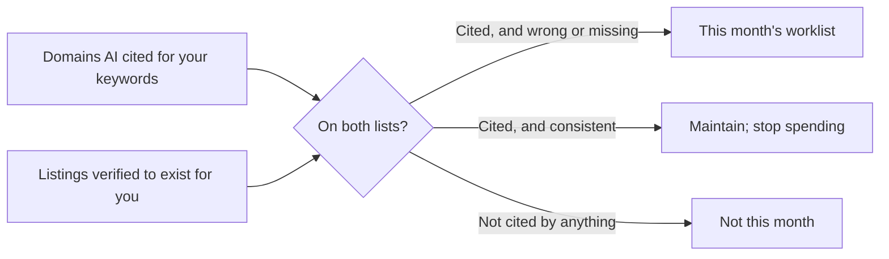

# Citations for AI answers, and the four verdicts

Citation signals are worth about 7% of local-pack weight. The reason this chapter still sits in Part II is that the same records now do a second job entirely.

## The two things called "citations"

There is a naming collision in this field, and separating the halves is the most useful move in the chapter:

- **A local-SEO citation** — a directory listing carrying your NAP. Everything above.
- **An AI-answer citation** — a source an assistant cites when it answers a question.

**They used to be unrelated.** They are now connected, because the second is increasingly *made of* the first.

When an assistant answers "best coffee near here" it does not consult a ranking table; it searches, retrieves pages, and writes an answer grounded in what it retrieved — and for local questions the retrieved pages are overwhelmingly directory and review pages, because that is what the web holds about small businesses.

So a directory listing is no longer only consistency evidence. It is **retrievable text about your business inside the corpus the answer is drawn from**, which reframes absence:

> Not being on a directory the assistant cites is not a lost 7%. It is a document that does not exist. The retrieval layer cannot return what is not there.

How those engines *weight* what they retrieve is not knowable from outside. What is observable, and cheap to observe, is which domains an answer cited and whether you are on them.

### Work the gap, not the list

**Generic advice says "build citations"** and hands you a directory list. The list is the same for every business in every market, which should be the tell.

The upgrade is a join between two things you can measure on your own business: **the domains AI actually cited for *your* keywords**, aggregated over recent live answer checks, and **the listings verified to exist for you**, the output of Lab 12.1. Work only the gap.

**Where this lives in the app.** On the **AI Visibility** page (`/b/{businessId}/ai-visibility`) those are the **Sources cited by AI** and **Listings consistency** cards, with a strip above them showing the overlap: each platform AI cited, how many answers cited it, and your listing's status there.

The **Authority** card scores the same join as *Presence on the sources AI cites* — "Listed on N of M directories/platforms AI cites for your keywords" — weighting it 25 out of 100, with listings consistency a further 15. Those weights are a design choice derived from correlation evidence, not a Google fact; [Changing the answer](../../03-advanced/changing-the-ai-answer/index.md) sets out what the evidence is and how strong it is not.

### Why the citation package fails

The 300-directory blast fails three ways:

- Most of the 300 are scraped aggregator sites no assistant cites.
- They carry data you handed a vendor, wrong the day you move.
- You now own 300 records you will never maintain, each a future inconsistency.

**Verify first, fix what contradicts**, and add a listing only where an assistant demonstrably looks for businesses like yours and you will keep it current.

> **What this tool does not do.** SEOG verifies citations; it does not create them. There is no button that gets you listed on Yelp. Building a citation means going to the platform, claiming or creating the listing, and passing that platform's own review — by hand, in their dashboard.

## Four verdicts, and why "not found" is dangerous

A listing check can honestly return four things, and collapsing them is how tools cause damage:

| Verdict | Meaning |
| --- | --- |
| **Consistent** | A listing was located and its fields resolve to your profile. |
| **Mismatch** | A listing was located; at least one field is a different value. Both values are shown. |
| **Not found** | No listing was located at all. |
| **Can't verify** | A listing exists — its address on the platform is known — but its details could not be read. |

**The last two must never be merged.** "Can't verify" reported as "not found" tells you to create a listing that already exists; follow it and you have made a duplicate.

The same discipline forbids fabrication: a checker that cannot read a listing should say so, not fill the row with your own profile's values and report all-green about listings it never saw.

### Why automated checkers report false negatives

Two mechanisms, worth knowing before you trust any tool's citation tab.

**Directory pages resist plain fetching.** Many block automated readers, or render content a simple fetch never sees, so a checker built only on fetching reports empty for listings plainly visible in a browser.

**The AI checker trap.** The modern approach asks a search-capable language model to find the listing and report its fields, demanding the answer as JSON so it can be parsed.

That combination silently breaks: instructing a model to *reply with only JSON* suppresses its web search. It answers from memory, reports nothing found, and your report says "not listed on Yelp" about a business with a Yelp page and 200 reviews. The output looks like data; it is a configuration bug.

The fix is two steps:

1. Ask in natural language with search enabled.
2. Convert that answer to structured form in a **separate** call that does no searching.

[AI engine probe recipes](../../05-reference/ai-engine-probe-recipes.md) covers this and its relatives.

---

**Next:** [Verifying and fixing listings →](./verifying-and-fixing-listings.md)
