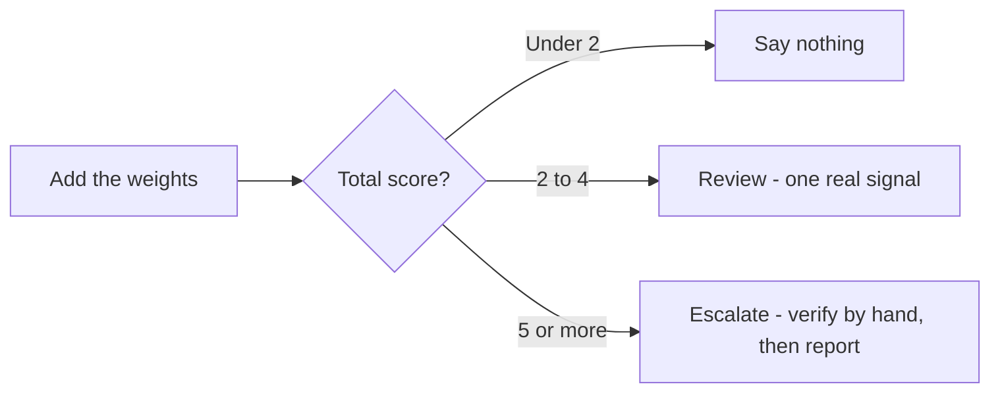

# Reading a competitor off their public data

A local competitor leaves almost their whole strategy in public. Category, review velocity, photo cadence, the attributes they claim, whether they bothered with a website — all readable, free, by anyone who looks in the right order. What is *not* readable is who "they" are, because there is no single they.

This chapter gets you an honest competitive set, teaches you to read it, and shows you how to spot a listing winning by breaking Google's rules rather than by being good.

## There is no leaderboard

**The instinct is to ask "who are my top five competitors?" and expect a list.** There isn't one, for the same reason there is no single rank: [rank is a surface, not a number](../../01-foundations/rank-is-a-map-not-a-number/index.md).

**The set is a function of the keyword and the searcher's position.** Two miles east, a different three businesses hold the pack; change `emergency plumber` to `boiler repair` and half the set changes again.

**The useful question is "who is above me, for which query, from where"** — and you have already paid for the answer. Every ranked search returns an ordered list, and the order *is* the measurement; reading who sits above your row costs nothing extra.

Position is the cheap part of local data ([what the Places API will and will not give you](../../05-reference/what-places-returns.md) explains why the rich profile fields are not).

### Three sets, not one

Conflating them is the most common analytical error here.

| Set | Who is in it | What you do with it |
| --- | --- | --- |
| **Map-pack rivals** | The businesses above you for a keyword from a point | Track formally |
| **Organic rivals** | The pages ranking for the same query, usually directories | Treat as a [citations](../citations-and-nap/index.md) problem |
| **AI-answer rivals** | The businesses an assistant names when asked | Read as a cross-check |

The overlap is smaller than people expect, because [proximity barely constrains an AI answer](../../01-foundations/how-ai-answers-a-local-question/index.md) and organic rewards pages rather than places.

## What a public listing tells you

Every rival exposes the same short list of fields. Each answers one question about their strategy.

| Field | The question it answers |
| --- | --- |
| Primary category | What Google thinks they are, and whether they contest your query on purpose |
| Rating | Whether quality is their lever |
| Review count | How long they have worked on reputation |
| Photo count | Whether anyone tends the profile at all |
| Website / no website | Whether the listing is the whole business |
| Attributes | What they claim to offer that you may not |
| Distance | Whether they are a real rival or an artefact of your radius |

Read them in that order and a strategy falls out in a sentence: *same category, half my reviews, twice my photos, no website* is a profile-only operator.

The comparison card does the arithmetic — your value, the set average, the best rival's — and **To beat them** turns each shortfall into a sentence with a number in it. The average is a realistic target; the best rival usually is not.

Attributes deserve their own line. Rivals declare amenities, accessibility and parking publicly; subtract yours from theirs and the remainder — **Competitors offer — you don't** — is the cheapest actionable output on the page, because often you *do* offer the thing and never ticked the box. Claim only what is true.

## Level is history. Slope is strategy.

**A review count is a fact about the past several years.** It says where a business got to, not what it is doing now. There is no public source for the derivative, because Google does not publish a listing's history.

> **You can only have the movement you recorded.**

**That is what snapshots are for.** A snapshot captures one rival's rating, review count and photo count at a moment. One is a level; two are a slope. Almost everything interesting here — deltas, the sparkline, the momentum term in the threat score, the activity feed — needs two.

**Hence a boring fixed cadence** rather than snapshotting when you are curious. Fortnightly is a workable default *(inference: there is no published measurement of how fast these fields move, so the value is in keeping the interval fixed, not in the interval itself)*.

**Movement also drives the activity feed**, on thresholds worth knowing. Between snapshots, it fires on:

- a rating fall of 0.3 or more (high severity);
- a rise of 0.5;
- 20 new reviews;
- 10 new photos;
- a fresh review of two stars or fewer.

**All of them are per-rival and gated on the bell** — **Alerts on** / **Muted** on each rival's card. Muting keeps the rival tracked and keeps its snapshots and metrics updating; what stops is the alerting, including the extra review fetch the review alert needs.

## Scoring the threat, published so you can argue with it

Each tracked rival carries a threat score from 0 to 100. Here is the whole formula, because a score you cannot audit is one you should not show a client:

- **Rating edge — 30 points**, all or nothing, if their rating is above yours.
- **Review volume — up to 40 points**: their review count divided by yours, times 20, capped at 40. Matching your volume scores 20; double it is the full 40.
- **Momentum — up to 30 points**, needing two snapshots: 20 if they gained more than 10 reviews since the last capture, plus 10 if their rating rose more than 0.3.

70 and above is high, 40–69 medium, below 40 low.

**Notice what it does not contain: position.** It is a prominence-and-momentum score, deliberately, because prominence is what you can read from outside and [distance is what you cannot change](../../01-foundations/relevance-distance-prominence/index.md). A rival can score 100 and be irrelevant if they sit outside the area you serve, so read the score next to the distance.

**The flags beside it are often more useful.** **Beats you** means a higher rating than yours.

**Catching up starts from a volume test** — the rival has fewer reviews than you, so rivals already bigger are excluded by design, because they are ahead, not catching up. It then fires on any one of three things:

- they gained reviews since the last snapshot;
- their rating rose;
- *or* their rating already matches or beats yours.

That last clause is why a rival can show as catching up on a single snapshot, before there is any movement to measure. That filter is the early-warning list, and the one most people never open.

## Reading a listing that is winning by breaking the rules

Sometimes the business above you is not better. It is a keyword-stuffed name on a virtual office with fourteen reviews that all arrived in March.

Detection is heuristic, so score signals rather than declare verdicts. Here is the full scoring behind the spam check, published so you can run the same reasoning by hand in any market:

| Signal | Trigger | Weight |
| --- | --- | --- |
| Duplicate listing | Near-identical name to another listing in the set, or a near-identical address paired with a related name | 3 |
| Keyword-stuffed name | A promotional term in the business name (*best*, *#1*, *cheap*, *near me*, *24/7*, *top rated*, *call now*, *100%*, ™), **or** two of: three or more separators, over 60 characters, over nine words | 3 |
| Suspicious rating | 4.8★ or higher on at least one but fewer than ten reviews | 3 |
| Thin profile | Zero reviews *and* zero photos | 2 |
| No website | No website linked | 1 |

**Add the weights.** Under 2, say nothing — a lone "no website" is not a finding. 2–4 is **Review**: one real signal, worth a look.

**5 or more is the escalation threshold**, set there because 5 cannot be reached by any single signal; it takes two independent ones. One anomaly is a business; two anomalies are a pattern.

**The weights encode how hard each signal is to explain innocently.** A duplicate pin, a stuffed name and an implausible rating are difficult to reach by accident; a thin profile is what a legitimate new business also looks like; no website is normal. Copy the table, adjust the weights if your market justifies it, but keep the two-signal rule.

**The scan cannot scan the market:** it runs over the rivals *you* track, which makes it free and blind to everything you have not added.

**And a flag is not proof** — verify by hand before reporting anything ([Spam and fake listings](../../03-advanced/spam-and-fake-listings/index.md)).

## The competitive set the AI picked

Here is the part almost nobody exploits. An AI answer check puts an unbranded local question to an assistant — *someone near this location asks "emergency plumber"; recommend specific businesses* — and the answer names several. **Every name in it but yours is a competitor the engine chose, and you have already paid for it.**

Those names are tallied as co-mentions: businesses appearing alongside (or instead of) you across recent answers, with a count and a tag for local business, chain or platform. Reading the tally is free.

**Two things make it worth more than it looks.**

**The names come only from answers that actually *recommended* somebody** — refusals, generic advice and "check Yelp" punts leave the denominator entirely ([how an AI answers a local question](../../01-foundations/how-ai-answers-a-local-question/index.md)).

**And the tally spans several runs**, because identical prompts return different lists on repeat: a name in one answer of five is noise, a name in four of five is a market fact. *(Inference: where to draw that line is judgement, not a measured constant.)*

Platform rows are not rivals. Yelp surfacing in an answer is a citations signal: it names the directory the engine reads *for your queries*, far more targeted than "build citations" ([AI visibility](../../03-advanced/ai-visibility/index.md)).

## What you cannot see, and why

- **A rival's full review history is not public.** Without owner access, the reviews readable on any business are a sample of **at most five**, sorted by relevance — Google's Places reference states the cap and the ordering outright.

  Their *count* and *rating* are exact; their review corpus is not, and nobody selling you a report has it either. Every ratio computed over that sample has a denominator of five or fewer ([What Google's reporting hides](../../05-reference/what-googles-reporting-hides.md)).

- **Their performance data is invisible.** Impressions, calls, direction requests, search terms — all require owning the profile. Anyone showing you a rival's traffic is modelling, not measuring.

- **Stored competitor data expires, and the reason is stricter than the folklore.** The rule the industry repeats — that you may cache Places data for thirty days — is not in Google's terms; the default there is **no caching of Places content at all**, with place IDs exempt and coordinates allowed for up to 30 consecutive days ([Storing Google data legally](../../05-reference/storing-google-data-legally.md)).

  Competitor history is therefore a short rolling window that any tool has to refresh or purge, not an archive it is entitled to keep. Export as you go if a report needs longer.

- **Some rivals are structurally invisible.** A pure service-area business with a hidden address never appears in the search discovery uses ([Service-area businesses](../../03-advanced/service-area-businesses/index.md)). Very new listings can be missing too, since discovery ranks by prominence — if you know the name, search for it directly.

---

**Next:** [Running the competitor analysis →](./running-the-analysis.md)
