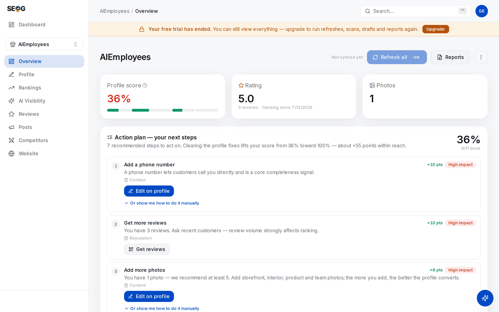

# Did it work? Closing the loop

You have changed something real: a description, a category, a set of photos, a batch of replies. Now comes the part almost everyone does badly — not because re-measuring is hard, but because the second measurement is worthless unless it was taken exactly the way the first was, and because Google's own numbers are shaped in three ways that mislead anyone reading them at face value.

This chapter closes the loop, and it is what makes the previous ten compound: a change you cannot verify is the same as a change you did not make.

## A comparison has conditions

A re-measurement is a comparison, and a comparison is valid only if one thing differs between the two readings: the world. If the *instrument* also changed, you measured your own settings.

For a geo-grid, three settings must be identical between baseline and re-scan:

- **The centre.** A grid is centred on the keyword's own search point when one is set, otherwise on the business coordinates. Editing a keyword's **Search from** moves the centre and every pin with it.
- **The detail level.** Quick, Standard and Detailed are 3×3, 5×5 and 7×7 at one-mile spacing. Different presets sample different ground.
- **The keyword row.** Keyword text, language and radius are properties of the tracked keyword, shown as chips on its detail panel. A different language chip is a different measurement.

You can watch the rule enforce itself. **Compare with previous scan** pairs the two scans' points *by coordinate* and claims movement only where both actually looked. Points the earlier scan never covered are drawn neutral — "No previous data for this point". If the two share no points at all, the strip says so outright: *These scans don't overlap — no comparable points.* That is the honest output, and exactly what a report showing confident month-over-month movement between mismatched scans is hiding.

One trap sits inside the app: the **Top-3 coverage** trend line above the map plots your most recent scans of that keyword — up to the last thirty — *at whatever detail level each was run*. It does not filter by preset. Scan Quick in January and Detailed in February and the line shows a step that is an artefact of the preset. Pick one preset per keyword and stay on it; changing it starts a new baseline, and you say so.

## Three tiers of evidence

"Did it work" is three questions wearing one coat, with different latencies, different noise levels and different proof available.

**Tier 1 — did the change land?** Binary, fast, and the only one you fully control. A profile edit is submitted, reviewed by Google, then published. Google Business Profile Help states the range plainly: *"Edits usually take up to 10 minutes to review, but sometimes it can take up to 30 days."* Plan on minutes, but never promise them — the same page gives you no way to tell in advance which edit gets the long path. Until you re-fetch you do not know where an edit landed: the app shows a *"N profile edits applied since your last refresh. Google reviews edits before they go live"* notice, and the refresh settles it. If Google rejected the edit, the re-pull restores the old value and the fix reappears in your list. That is not a bug; that is the answer.

Name, category and address are a different class of field. Google documents that editing them may cost you your verification — its category help page says that if you add or edit a category "you might be asked to verify your business again", and the same warning attaches to a name change. What is **not** documented anywhere we can find is the operational folklore attached to it: that the listing drops out of Search and Maps for hours or days while that runs. *(Open question: we have no Google source and no probe for a visibility gap during re-verification.)* The conservative practice stands either way — do not re-measure visibility in the days after a name, category or address edit, because you cannot separate an edit effect from a verification effect ([The profile is the product](./the-profile-is-the-product.md), [Suspensions and reinstatement](../03-advanced/suspensions-and-reinstatement.md)). For a review reply, tier 1 means a read-back containing your own text — a success response on the write is not publication, which [Reviews](./reviews.md) makes a standing rule.

**Tier 2 — did the scored state move?** The profile score and the AI-readiness score are computed from data *already stored*, so they move when the stored copy updates — after a refresh, not after your edit. If a rewritten description does not move the score, either the edit has not published, the field already passed that check, or the check is not weighted the way you assumed. All three are informative; none are about ranking.

*Tier 2 in one screen. The score is computed from the stored copy of the profile — note **Not synced yet** beside **Refresh all**: an edit you made ten minutes ago cannot be in this number until you re-pull. Each action-plan step carries the points it is worth, so you know in advance what the score should do if that fix lands.*

**Tier 3 — did visibility move?** Slow, noisy, and the only tier a client cares about. Nobody outside Google knows how long a local change takes to affect ranking, and anyone offering a confident number is guessing. A working rule, marked as what it is: *(inference)* profile and review changes tend to show over weeks rather than days, so re-scan fortnightly at most and judge on three readings, not two — see [Building a tracked set that tells the truth](./choosing-what-to-track.md).

## Google's owner numbers, and their three distortions

Connect a Google Business Profile and you get the owner side: how many people saw the profile and what they did next. It is the closest thing to an outcome metric local SEO has, and slipperier than it looks.

**There is no "profile views" number.** Google publishes impressions as four separate counts — desktop Maps, desktop Search, mobile Maps, mobile Search — and never a combined one; any single "views" figure is a construction whoever showed it to you performed. A report built from one of the four is a quarter of the truth, and such reports exist. The app sums all four into one **Profile views** series; if you build this yourself, sum them or say which you used.

Summing has its own edge, worth a footnote in a client report. Google defines each of those four as deduplicated per unique user per day — *"Multiple impressions by a unique user within a single day are counted as a single impression"* — but documents no deduplication *across* the four. So a customer who saw you on mobile Search and again on mobile Maps the same day plausibly counts once in each and twice in the sum *(inference from the per-metric definition; we have not probed a controlled single-user case)*. A month of "3,000 views" is at most 3,000 people-days, and fewer people. The mechanism is [What Google's reporting hides](../05-reference/what-googles-reporting-hides.md).

**Zeros at the right-hand edge are usually reporting lag, not a collapse.** The documented half first: Google's own legacy Insights reference warns that *"in some cases, the data may still be missing for days close to the request date"*, and nothing in the response marks a day as provisional — so a value read today and the same day re-read next week can differ without either being wrong. What is **not** settled is the mechanism: whether Google omits a zero-activity day from the series entirely or returns it explicitly as zero is undocumented, and we have no probe on file *(open question — [What Google's reporting hides](../05-reference/what-googles-reporting-hides.md) carries the probe that would close it)*. Either way the practice is the same: back-fill absent dates to zero, keep count of how many dates Google actually returned, and exclude the trailing few days from every total and every comparison. If the last day or two of every metric read zero while the preceding weeks look healthy, treat it as lag and check again in a week. That tail also drags each tile's trend badge, which compares roughly the first week of the window against the last. Read the sparkline, not just the percentage.

**A click-to-call is not a call.** Google's own definitions are the whole argument here: **Calls** is *"the number of times the business profile call button was clicked"*. Whether the call connected, was answered, or lasted two seconds is not in the data — Google does not report it, so no tool has it. Likewise **Direction requests** is the number of times directions were requested, not the number of people who arrived, and **Website clicks** counts clicks out, which will not match your analytics *(inference on that gap's direction: consent banners and blockers make analytics the lower number)*. **Bookings** is narrower than it sounds — Google defines it as bookings made through Reserve with Google, not every appointment you took.

The search-terms table further down the page is a separate dataset with separate rules: Google aggregates it monthly, not daily, and low-volume terms come back with the count withheld. What you get instead is a threshold — documented as *"the threshold below which the actual value falls"* — which the app renders as `<N`. Any total built from those rows is an upper bound, and it inflates most for the smallest businesses. Label it as one ([Building a tracked set that tells the truth](./choosing-what-to-track.md)).

## What you may honestly claim

Sort every observed movement into one of three buckets, out loud, in the report.

| Bucket | What qualifies | How you say it |
| --- | --- | --- |
| **Verified** | The change landed: the field reads what you wrote, the reply appears in a read-back, the schema validates. | "Done, confirmed on Google on 14 March." |
| **Plausible** | Movement is in the right direction, began after the change, and is *local to what you changed* — that keyword, those pins, that metric. | "Coverage rose 24% → 40% in the four weeks after the category change. Consistent with it; not proven by it." |
| **Unattributable** | Everything else: market shifts, seasonality, a competitor's suspension, an update — anything you cannot separate from those. | "Calls are up 30%, but the whole market moved the same way, so we are not claiming it." |

Three habits keep the middle bucket honest.

**Change one lever at a time when you can.** Ship four fixes in a week and you have bought one uninterpretable result. When the timeline will not allow it — usually — stagger by *domain*: profile this fortnight, reviews next, website after.

**Keep a dated change log.** Date, what changed, where, who did it. The app stamps its own side; it does not know you rewrote three service pages on the 9th.

**Assume the market moved too.** Rank is a sort order, so a competitor's improvement drops you with nothing happening to you. Before blaming a fall on your own work, check whether the ground moved under everyone — [Reading a competitor off their public data](./competitors.md).

And never assemble the before-picture *after* the change: the baseline you froze in [Diagnosing a business in thirty minutes](./analyzing-business-visibility.md) is your only honest anchor.

> **Without SEOG** · By hand this is a spreadsheet — one row per coordinate, one column per date, a note on every column recording that reading's conditions — plus the Performance section of the Google Business Profile dashboard. It works, slowly, and fails where discipline matters most: nobody hand-records conditions consistently for six months. See [Doing all of this without SEOG](../99-appendix/doing-it-without-seog.md).

## Labs

### Lab 17.1 — Re-scan and diff against the baseline

> **Lab** · Where: **Rankings** (`/b/{businessId}/rankings`) · Cost: **paid** · Time: ~10 min
>
> You need: the baseline grid from Lab 4.1, and at least one change you actually shipped in Part II.

1. Open **Rankings** and select the *same keyword row* you scanned before — same text, same location chip, same language chip.
2. Under **Geographic visibility**, select the *same preset* as the baseline. That level's stored scan loads free; confirm from its **Checked …** stamp that it is the baseline you expect. Then press **Check now**.
3. When the new map appears, click **Compare with previous scan**. Pins recolour by movement: green improved or newly ranked, red dropped or lost, grey unchanged.
4. Write down the summary strip — *N improved · N newly ranked · N dropped · N lost* — and check every point on the trend line above the map was run at the same preset.
5. Write one sentence naming *where* the movement is, not just how much: "the three eastern pins improved; the centre is unchanged."

*Compare mode, on a real pair of scans. The pins stop showing positions and start showing **movement**: `=` where the point did not move, a signed number where it did, and the legend underneath tells you which is which. This is the view that answers the question in the chapter title, because a single scan cannot — it shows you where you are, never whether you got there.*

*Read the trend strip above the map too. It is a running record of every scan at this keyword, and it is the honest check on your own claim: one big move followed by two flat re-measurements means something different from three steady steps, even when the endpoints match.*

**What good looks like.** Four movement counts plus a geographic statement. Lifting your weak edge and lifting your strong centre are different results, and only the map tells them apart.

**If it went wrong.**
- *"These scans don't overlap — no comparable points."* The scans share no coordinates. Almost always a moved centre — check the keyword's **Search from** chip.
- *Outer pins show a neutral dot.* This scan is larger than the last, so its outer ring has nothing to compare against. Only the inner pins are evidence.
- *No **Compare with previous scan** link.* Only one stored scan exists. This run is the baseline.

**What you just learned.** Movement is a *field*, not a number, and it is only movement where both readings sampled the same ground.

### Lab 17.2 — Read the owner metrics without misreading them

> **Lab** · Where: **Overview** (`/b/{businessId}/overview`) · Cost: **paid** · Time: ~15 min
>
> You need: a connected Google Business Profile (Lab 0.4) — owner-only data. **Observe-only readers:** skip to Lab 17.4.

1. Scroll to the **Performance** panel. If it has never been loaded it offers **Load performance data**; if a load is stored, that copy renders free and the button reads **Check now**.
2. Read the price, then load. One charged click buys the full daily history; **switching periods afterwards is free**, because the series is sliced locally, not re-fetched.
3. Set the period to **28 days** and note each tile's total. Six tiles always render — Profile views, Calls, Website clicks, Direction requests, Messages and Bookings — so a category that supports no messaging or no Reserve-with-Google booking shows a real zero, not a missing tile. Write down which of your six are structurally zero before you read any of them as a result.
4. Look at the right-hand end of any sparkline. If the last day or two sit at zero while the rest of the window is healthy, treat it as lag. Keep those days out of comparisons, and re-read the same window next week to watch them change.
5. Switch to **90 days**, then **12 months**. Each tile's total *and* its trend badge move — the badge compares roughly the first week of the window against the last, so its meaning changes with the period.
6. For each tile, write what it does **not** tell you: calls = clicks on the call button, not conversations; direction requests = intent, not arrivals; website clicks ≠ sessions in your analytics; bookings = Reserve with Google only. Then find any `<N` in the search-terms table — a withheld count, the real number somewhere below it, on a monthly rather than daily basis.

**What good looks like.** You can state your 28-day outcome numbers and, for each, the sentence that stops a client over-reading it — and you saw a trend badge change with no data changing.

**If it went wrong.**
- *A connect prompt, or a request to link a location.* Owner metrics need the connection *and* a linked location.
- *Everything is zero.* Either no activity, or no history behind the connection yet. Check 12 months first.
- *It says sample data.* A demonstration series, not your business.

**What you just learned.** Outcome metrics are the strongest evidence local SEO offers and the easiest to over-claim. Each measures an *intention*, not a result.

### Lab 17.3 — Assemble a report you can defend

> **Lab** · Where: **Overview** (`/b/{businessId}/overview`) → **Reports** · Cost: **paid** · Time: ~20 min
>
> You need: Lab 17.1, and ideally Lab 17.2. Compare against the report you froze in Lab 7.3.

1. Open **Reports** in the page header, press **Generate**, and download the PDF when it appears. Put it beside your Lab 7.3 baseline; both carry a generation date on the first page.
2. Work through it section by section — key metrics, Google performance, business profile, profile audit, AI-visibility readiness, action plan — marking every changed number **V**, **P** or **U**: verified, plausible, unattributable.
3. Notice what the report does *not* contain: your geo-grid. If a map belongs in the deliverable, export it yourself and label its date, keyword and preset. Notice too that the performance section covers a fixed recent window chosen by the report, not the period you had selected — quote a number, name its window.
4. For every **P**, write the one-line caveat you would say out loud. For every **U**, delete the number or write why it is there. Then count your **V**s: that is the proven part of the month.

**What good looks like.** A marked-up report where no unattributable number is presented as an achievement. A long **P** list with an empty **V** list means you shipped less than you thought.

**If it went wrong.**
- *Nothing to compare against.* You never froze a baseline. Generate today's, date it, start the loop properly.
- *Everything is marked P.* You changed several things at once. Say so in the report — stating the limit is what makes next month's claim credible.

**What you just learned.** Reporting is not a formatting problem. It is deciding which numbers you are willing to defend.

### Lab 17.4 — Build the change log and align it

> **Lab** · Where: **Rankings** and **Overview** (`/b/{businessId}/rankings`, `/overview`) · Cost: **free** · Time: ~15 min
>
> You need: a business you have worked on. Works without owner access.

1. Four columns: date, what changed, where, evidence it landed. Fill it from Part II — "description rewritten" is a row; "profile work" is not.
2. Beside it, collect the free measurement dates: each scan's captured date on the grid trend line, the keyword position chart, and **Profile score over time**, which has a point only for days the business was analysed.
3. For each change, name the first measurement taken *after* it. Mark changes with no later measurement — unjudged, not failed — and measurements with two or more changes before them — uninterpretable, and you now know why.

**What good looks like.** One sheet answering "when did we do that, and when did we next look?" in seconds, plus a count of how many changes are unjudged.

**What you just learned.** Attribution is a timing argument, and dates on only one side of it are not an argument.

## Common mistakes

**Re-scanning at a different preset.** The commonest way a grid comparison lies: the numbers moved because the sampled ground did.

**Reading the average without the found rate.** Carried forward from [Rank is a map, not a number](../01-foundations/rank-is-a-map-not-a-number.md), and worse in comparisons: average rank counts only points where you appear, so *vanishing from your worst pins improves it*. A rising average with a falling found rate is a decline wearing a smile.

**Treating one re-scan as a result.** A line fits any two points. Three readings are the minimum at which a trend exists, and the reproducibility of a single scan is itself an open question — [Part III has you measure it](../03-advanced/reading-a-geo-grid.md).

*The app declines to draw a trend from one reading too: **— First check** under the position, and **Run a few checks to see the trend** where the line would be. Two panels here are illustrative, not measured — the grid still carries its **Example scan** banner ("pick a detail level above and press Check now to map your real positions"), and the volume card carries a **Test data** badge.*

**Calling a screenshot of an AI answer "improved AI visibility".** Assistant answers vary run to run for the same prompt, so only a rate over a window of runs compares to an earlier rate — see [Does the AI recommend this business?](../03-advanced/ai-visibility.md).

**Claiming whichever outcome metric moved.** Six metrics move every month and one will have moved a lot. Picking the headline afterwards is how a report becomes a horoscope.

## Check yourself

1. **Your coverage went from 24% to 41%.** What three facts must be identical between the two scans before that sentence means anything? (Centre, detail level, keyword row including language.)
2. **Your average rank improved and your found rate fell.** What happened, and which number do you lead with?
3. **A client asks why your report shows fewer profile views than Google's dashboard.** Name two mechanisms that produce that gap without either side being wrong. (Impressions split across four buckets; different window boundaries plus the unreported recent days.)
4. **Calls are up 40% and you fixed the phone number three weeks ago.** Which bucket — verified, plausible, unattributable — and what would move it up one?
5. **Which of your Part II changes are still unjudged today?** If that takes more than a minute to answer, you need Lab 17.4 more than another scan.

---

**Next:** [Reading a geo-grid without fooling yourself →](../03-advanced/reading-a-geo-grid.md)
