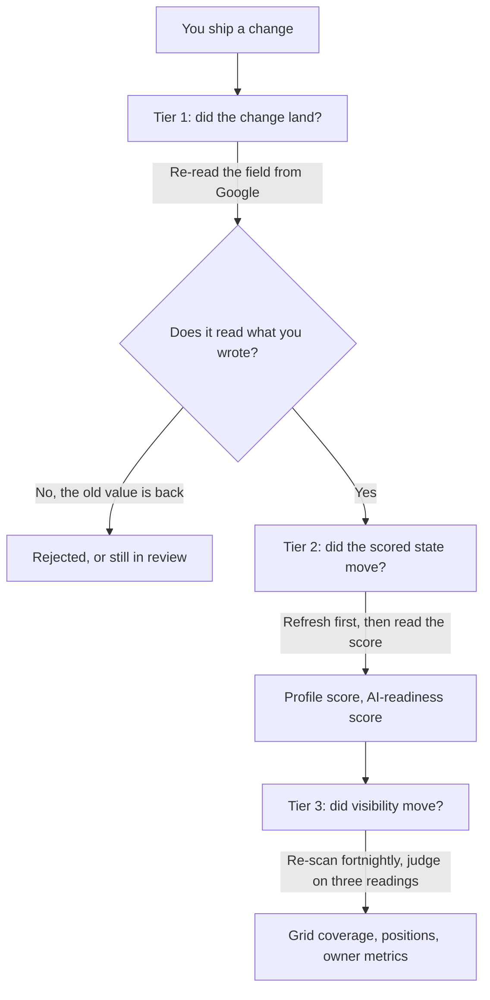

# Did it work? Closing the loop

You have changed something real: a description, a category, a set of photos, a batch of replies. Now comes the part almost everyone does badly — not because re-measuring is hard, but for two other reasons.

The second measurement is worthless unless it was taken exactly the way the first was. And Google's own numbers are shaped in three ways that mislead anyone reading them at face value.

This chapter closes the loop, and it is what makes the previous ten compound.

> **A change you cannot verify is the same as a change you did not make.**

## A comparison has conditions

A re-measurement is a comparison, and a comparison is valid only if one thing differs between the two readings: the world. If the *instrument* also changed, you measured your own settings.

For a geo-grid, three settings must be identical between baseline and re-scan:

- **The centre.** A grid is centred on the keyword's own search point when one is set, otherwise on the business coordinates. Editing a keyword's **Search from** moves the centre and every pin with it.
- **The detail level.** Quick, Standard and Detailed are 3×3, 5×5 and 7×7 at one-mile spacing. Different presets sample different ground.
- **The keyword row.** Keyword text, language and radius are properties of the tracked keyword, shown as chips on its detail panel. A different language chip is a different measurement.

You can watch the rule enforce itself. **Compare with previous scan** pairs the two scans' points *by coordinate* and claims movement only where both actually looked. Points the earlier scan never covered are drawn neutral — "No previous data for this point".

If the two share no points at all, the strip says so outright: *These scans don't overlap — no comparable points.* That is the honest output, and exactly what a report showing confident month-over-month movement between mismatched scans is hiding.

**One trap sits inside the app.** The **Top-3 coverage** trend line above the map plots your most recent scans of that keyword — up to the last thirty — *at whatever detail level each was run*. It does not filter by preset.

Scan Quick in January and Detailed in February and the line shows a step that is an artefact of the preset. Pick one preset per keyword and stay on it; changing it starts a new baseline, and you say so.

## Three tiers of evidence

"Did it work" is three questions wearing one coat, with different latencies, different noise levels and different proof available.

**Tier 1 — did the change land?** Binary, fast, and the only one you fully control. A profile edit is submitted, reviewed by Google, then published. Google Business Profile Help states the range plainly: *"Edits usually take up to 10 minutes to review, but sometimes it can take up to 30 days."*

Plan on minutes, but never promise them — the same page gives you no way to tell in advance which edit gets the long path.

Until you re-fetch you do not know where an edit landed: the app shows a *"N profile edits applied since your last refresh. Google reviews edits before they go live"* notice, and the refresh settles it. If Google rejected the edit, the re-pull restores the old value and the fix reappears in your list. That is not a bug; that is the answer.

**Name, category and address are a different class of field.** Google documents that editing them may cost you your verification — its category help page says that if you add or edit a category "you might be asked to verify your business again", and the same warning attaches to a name change.

What is **not** documented anywhere we can find is the operational folklore attached to it: that the listing drops out of Search and Maps for hours or days while that runs. *(Open question: we have no Google source and no probe for a visibility gap during re-verification.)*

The conservative practice stands either way — do not re-measure visibility in the days after a name, category or address edit, because you cannot separate an edit effect from a verification effect ([The profile is the product](../the-profile-is-the-product/index.md), [Suspensions and reinstatement](../../03-advanced/suspensions-and-reinstatement/index.md)).

For a review reply, tier 1 means a read-back containing your own text — a success response on the write is not publication, which [Reviews](../reviews/index.md) makes a standing rule.

**Tier 2 — did the scored state move?** The profile score and the AI-readiness score are computed from data *already stored*, so they move when the stored copy updates — after a refresh, not after your edit.

If a rewritten description does not move the score, either the edit has not published, the field already passed that check, or the check is not weighted the way you assumed. All three are informative; none are about ranking.

*Tier 2 in one screen. The score is computed from the stored copy of the profile — note **Not synced yet** beside **Refresh all**: an edit you made ten minutes ago cannot be in this number until you re-pull. Each action-plan step carries the points it is worth, so you know in advance what the score should do if that fix lands.*

**Tier 3 — did visibility move?** Slow, noisy, and the only tier a client cares about. Nobody outside Google knows how long a local change takes to affect ranking, and anyone offering a confident number is guessing.

A working rule, marked as what it is: *(inference)* profile and review changes tend to show over weeks rather than days, so re-scan fortnightly at most and judge on three readings, not two — see [Building a tracked set that tells the truth](../choosing-what-to-track/index.md).

---

**Next:** [Owner metrics and what you may honestly claim →](./owner-metrics-and-honest-claims.md)
