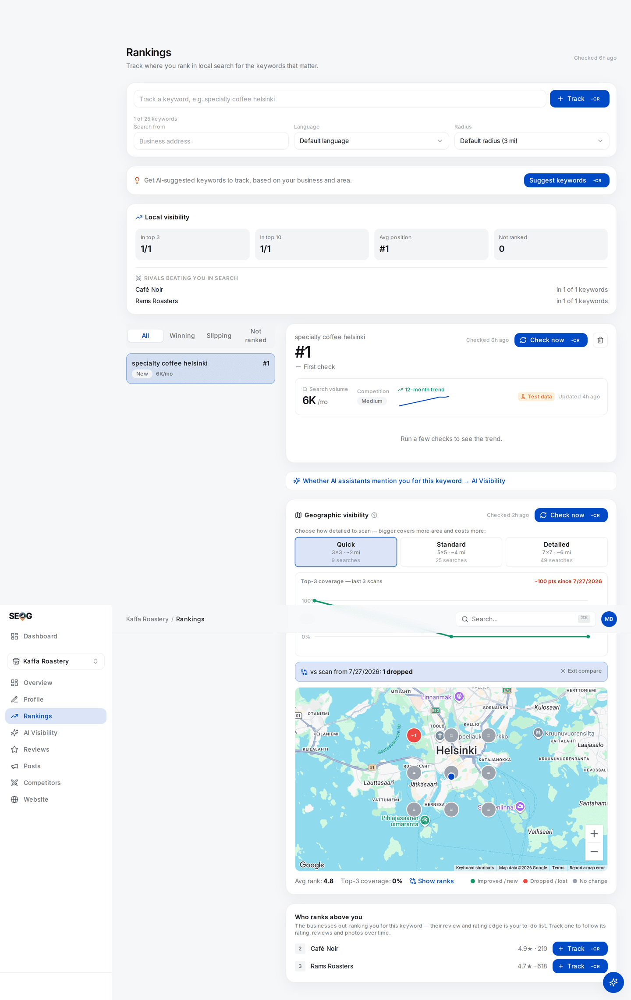
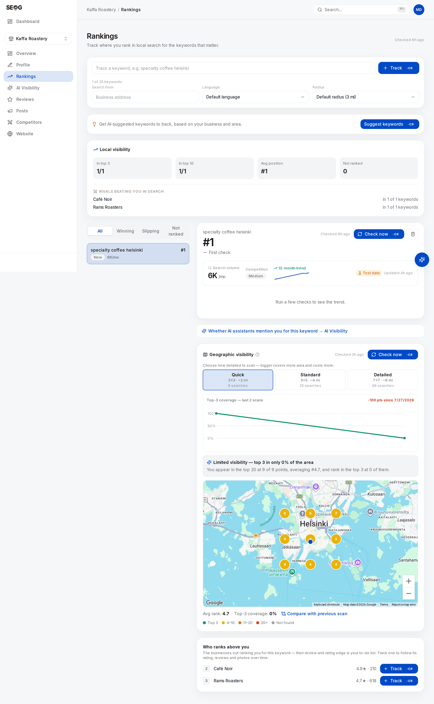

# Re-measuring in practice

The conditions, the three tiers and the three buckets are the theory. These four labs run the loop end to end on a business you have actually worked on, and the mistakes section afterwards lists the ways a comparison quietly lies to you.

## Labs

### Lab 17.1 — Re-scan and diff against the baseline

> **Lab** · Where: **Rankings** (`/b/{businessId}/rankings`) · Cost: **paid** · Time: ~10 min
>
> You need: the baseline grid from Lab 4.1, and at least one change you actually shipped in Part II.

1. Open **Rankings** and select the *same keyword row* you scanned before — same text, same location chip, same language chip.
2. Under **Geographic visibility**, select the *same preset* as the baseline. That level's stored scan loads free; confirm from its **Checked …** stamp that it is the baseline you expect. Then press **Check now**.
3. When the new map appears, click **Compare with previous scan**. Pins recolour by movement: green improved or newly ranked, red dropped or lost, grey unchanged.
4. Write down the summary strip — *N improved · N newly ranked · N dropped · N lost* — and check every point on the trend line above the map was run at the same preset.
5. Write one sentence naming *where* the movement is, not just how much: "the three eastern pins improved; the centre is unchanged."

*Compare mode, on a real pair of scans. The pins stop showing positions and start showing **movement**: `=` where the point did not move, a signed number where it did, and the legend underneath tells you which is which. This is the view that answers the question in the chapter title, because a single scan cannot — it shows you where you are, never whether you got there.*

*Read the trend strip above the map too. It is a running record of every scan at this keyword, and it is the honest check on your own claim: one big move followed by two flat re-measurements means something different from three steady steps, even when the endpoints match.*

**What good looks like.** Four movement counts plus a geographic statement. Lifting your weak edge and lifting your strong centre are different results, and only the map tells them apart.

**If it went wrong.**
- *"These scans don't overlap — no comparable points."* The scans share no coordinates. Almost always a moved centre — check the keyword's **Search from** chip.
- *Outer pins show a neutral dot.* This scan is larger than the last, so its outer ring has nothing to compare against. Only the inner pins are evidence.
- *No **Compare with previous scan** link.* Only one stored scan exists. This run is the baseline.

**What you just learned.** Movement is a *field*, not a number, and it is only movement where both readings sampled the same ground.

### Lab 17.2 — Read the owner metrics without misreading them

> **Lab** · Where: **Overview** (`/b/{businessId}/overview`) · Cost: **paid** · Time: ~15 min
>
> You need: a connected Google Business Profile (Lab 0.4) — owner-only data. **Observe-only readers:** skip to Lab 17.4.

1. Scroll to the **Performance** panel. If it has never been loaded it offers **Load performance data**; if a load is stored, that copy renders free and the button reads **Check now**.
2. Read the price, then load. One charged click buys the full daily history; **switching periods afterwards is free**, because the series is sliced locally, not re-fetched.
3. Set the period to **28 days** and note each tile's total. Six tiles always render — Profile views, Calls, Website clicks, Direction requests, Messages and Bookings — so a category that supports no messaging or no Reserve-with-Google booking shows a real zero, not a missing tile. Write down which of your six are structurally zero before you read any of them as a result.
4. Look at the right-hand end of any sparkline. If the last day or two sit at zero while the rest of the window is healthy, treat it as lag. Keep those days out of comparisons, and re-read the same window next week to watch them change.
5. Switch to **90 days**, then **12 months**. Each tile's total *and* its trend badge move — the badge compares roughly the first week of the window against the last, so its meaning changes with the period.
6. For each tile, write what it does **not** tell you: calls = clicks on the call button, not conversations; direction requests = intent, not arrivals; website clicks ≠ sessions in your analytics; bookings = Reserve with Google only. Then find any `<N` in the search-terms table — a withheld count, the real number somewhere below it, on a monthly rather than daily basis.

**What good looks like.** You can state your 28-day outcome numbers and, for each, the sentence that stops a client over-reading it — and you saw a trend badge change with no data changing.

**If it went wrong.**
- *A connect prompt, or a request to link a location.* Owner metrics need the connection *and* a linked location.
- *Everything is zero.* Either no activity, or no history behind the connection yet. Check 12 months first.
- *It says sample data.* A demonstration series, not your business.

**What you just learned.** Outcome metrics are the strongest evidence local SEO offers and the easiest to over-claim. Each measures an *intention*, not a result.

### Lab 17.3 — Assemble a report you can defend

> **Lab** · Where: **Overview** (`/b/{businessId}/overview`) → **Reports** · Cost: **paid** · Time: ~20 min
>
> You need: Lab 17.1, and ideally Lab 17.2. Compare against the report you froze in Lab 7.3.

1. Open **Reports** in the page header, press **Generate**, and download the PDF when it appears. Put it beside your Lab 7.3 baseline; both carry a generation date on the first page.
2. Work through it section by section — key metrics, Google performance, business profile, profile audit, AI-visibility readiness, action plan — marking every changed number **V**, **P** or **U**: verified, plausible, unattributable.
3. Notice what the report does *not* contain: your geo-grid. If a map belongs in the deliverable, export it yourself and label its date, keyword and preset. Notice too that the performance section covers a fixed recent window chosen by the report, not the period you had selected — quote a number, name its window.
4. For every **P**, write the one-line caveat you would say out loud. For every **U**, delete the number or write why it is there. Then count your **V**s: that is the proven part of the month.

**What good looks like.** A marked-up report where no unattributable number is presented as an achievement. A long **P** list with an empty **V** list means you shipped less than you thought.

**If it went wrong.**
- *Nothing to compare against.* You never froze a baseline. Generate today's, date it, start the loop properly.
- *Everything is marked P.* You changed several things at once. Say so in the report — stating the limit is what makes next month's claim credible.

**What you just learned.** Reporting is not a formatting problem. It is deciding which numbers you are willing to defend.

### Lab 17.4 — Build the change log and align it

> **Lab** · Where: **Rankings** and **Overview** (`/b/{businessId}/rankings`, `/overview`) · Cost: **free** · Time: ~15 min
>
> You need: a business you have worked on. Works without owner access.

1. Four columns: date, what changed, where, evidence it landed. Fill it from Part II — "description rewritten" is a row; "profile work" is not.
2. Beside it, collect the free measurement dates: each scan's captured date on the grid trend line, the keyword position chart, and **Profile score over time**, which has a point only for days the business was analysed.
3. For each change, name the first measurement taken *after* it. Mark changes with no later measurement — unjudged, not failed — and measurements with two or more changes before them — uninterpretable, and you now know why.

**What good looks like.** One sheet answering "when did we do that, and when did we next look?" in seconds, plus a count of how many changes are unjudged.

**What you just learned.** Attribution is a timing argument, and dates on only one side of it are not an argument.

## Common mistakes

**Re-scanning at a different preset.** The commonest way a grid comparison lies: the numbers moved because the sampled ground did.

**Reading the average without the found rate.** Carried forward from [Rank is a map, not a number](../../01-foundations/rank-is-a-map-not-a-number/index.md), and worse in comparisons: average rank counts only points where you appear, so *vanishing from your worst pins improves it*. A rising average with a falling found rate is a decline wearing a smile.

**Treating one re-scan as a result.** A line fits any two points. Three readings are the minimum at which a trend exists, and the reproducibility of a single scan is itself an open question — [Part III has you measure it](../../03-advanced/reading-a-geo-grid/index.md).

*The app declines to draw a trend from one reading too: **— First check** under the position, and **Run a few checks to see the trend** where the line would be. Two panels here are illustrative, not measured — the grid still carries its **Example scan** banner ("pick a detail level above and press Check now to map your real positions"), and the volume card carries a **Test data** badge.*

**Calling a screenshot of an AI answer "improved AI visibility".** Assistant answers vary run to run for the same prompt, so only a rate over a window of runs compares to an earlier rate — see [Does the AI recommend this business?](../../03-advanced/ai-visibility/index.md).

**Claiming whichever outcome metric moved.** Six metrics move every month and one will have moved a lot. Picking the headline afterwards is how a report becomes a horoscope.

## Check yourself

1. **Your coverage went from 24% to 41%.** What three facts must be identical between the two scans before that sentence means anything? (Centre, detail level, keyword row including language.)
2. **Your average rank improved and your found rate fell.** What happened, and which number do you lead with?
3. **A client asks why your report shows fewer profile views than Google's dashboard.** Name two mechanisms that produce that gap without either side being wrong. (Impressions split across four buckets; different window boundaries plus the unreported recent days.)
4. **Calls are up 40% and you fixed the phone number three weeks ago.** Which bucket — verified, plausible, unattributable — and what would move it up one?
5. **Which of your Part II changes are still unjudged today?** If that takes more than a minute to answer, you need Lab 17.4 more than another scan.

---

**Next:** [Reading a geo-grid without fooling yourself →](../../03-advanced/reading-a-geo-grid/index.md)
