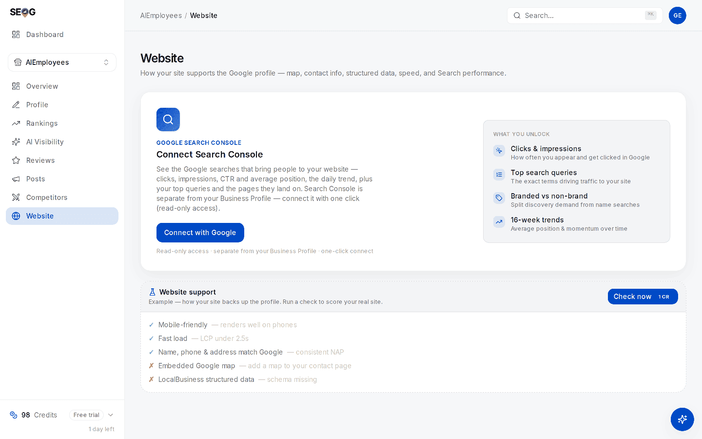

# Labs: score agent readiness and ship one fix

The three labs below read the card, decide what its dashes are worth, and then move one of them.

## Labs

The website audit needs no Google connection — it runs against your public site and the profile facts already stored. Working read-only on a business you do not own, Labs 14.1 and 14.2 work as written; 14.3 needs publish access and has an alternative below.

### Lab 14.1 — Score it

> **Lab** · Where: **Website** (`/b/{businessId}/website`) · Cost: **paid**, or **free** if the audit from Lab 13.1 is already stored · Time: ~5 min
>
> You need: a business added (Lab 0.3) with a website on its Google profile. No owner access required.

*Where this lab starts. There is no **AI agent readiness** card on the page yet — it exists only after a run, below the **Site health** card, so an empty page is not a missing feature. The checklist you can see here is the card's **Example**: placeholder rows, not this site's result.*

1. Open `/b/{businessId}/website`.
2. Press **Check now**. The top-right button refreshes the whole page (site audit plus Search Console performance); the **Check now** on the **Website support** card lower down re-runs the site audit only. Either produces the agent-readiness data, and both show their price before you confirm. If you ran [Lab 13.1](../the-website-half/site-audit-labs.md) recently, skip this step — the stored result already carries the card, and reading it is free.
3. Scroll to the **AI agent readiness** card, directly below the **Site health** card.
4. Write down the status of all six checks — tick, cross, or dash — **and then** the headline figure, in that order. The order is the point.

**What good looks like.** A card headed **AI agent readiness** with six named rows. On a typical small-business site most rows are dashes and the headline figure is high.

**If it went wrong.**
- *No card at all.* Google calls this category experimental, and it is not served by every Lighthouse host at every version — PageSpeed Insights lagged the Lighthouse release by some months. The rest of the audit still ran. SEOG shows nothing rather than inventing a figure — try again in a few days.
- *"No website on the Google profile."* The profile has no site attached. Add one there first; the website field is one of the safe fields to edit (see [the profile is the product](../the-profile-is-the-product/index.md)).
- *A warning that the site renders with JavaScript.* Some checks could not be verified and are excluded from the **Website support** score. Unverifiable is not failing.

**What you just learned.** The score is computed over the checks that applied. Until you know which ones applied, the number means nothing.

### Lab 14.2 — Treat "not applicable" as work

> **Lab** · Where: **Website** (`/b/{businessId}/website`) · Cost: **free** · Time: ~10 min
>
> You need: Lab 14.1.

1. List every check showing a dash.
2. Beside each, write the single condition that would make it apply — for `llms.txt`, "a valid file exists at the root"; for the WebMCP rows, "the site declares agent-callable actions".
3. Classify each as **do now**, **do later**, or **not for this business**, with one clause of justification. "Not for this business" is a legitimate answer; expect to use it three times.
4. Open `https://yoursite.com/robots.txt` in a browser and record whether AI crawler user agents are allowed. This card does not check it and cannot tell you.

**What good looks like.** A short table where every row carries a decision, at most two rows say *do now*, and you know your own robots policy.

**If it went wrong.** If every row reads *do now*, you have made a checklist rather than a plan. Rank by what a customer would notice.

**What you just learned.** A silent pass and a green dash look identical on a dashboard and mean opposite things. This is the general skill: any audit that hides its denominator is telling you less than it appears to.

### Lab 14.3 — Ship one fix and re-score

> **Lab** · Where: your web host, then **Website** (`/b/{businessId}/website`) · Cost: **paid** (the re-run) · Time: ~30 min
>
> You need: Lab 14.2, and the ability to publish a file at your site root.

1. Write an `llms.txt` using the shape above. Business name as the H1, one summary paragraph, the NAP and service area as plain lines, then your real service pages as links with one clause of description each.
2. Check every fact in it against the Google profile. A contradiction here is worse than no file.
3. Publish it at exactly `https://yoursite.com/llms.txt` and open that URL in a browser to confirm it loads as plain text.
4. Back on **Website**, press **Check now** on the **Website support** card — the site audit only, which is the cheaper of the two buttons. A manual re-check fetches fresh rather than re-serving the stored result.
5. Re-read the **AI agent readiness** card. The `llms.txt` row should have moved off the dash.

**What good looks like.** The `llms.txt` row now shows a tick. The category figure may have moved in *either* direction, and you can explain why.

**If it went wrong.**
- *Still a dash.* The file is not where you think. Common causes: it is one directory down, the host serves a styled *page not found* screen that still reports success, or a redirect rewrites the path. Load the exact URL yourself.
- *It now shows a cross.* The file is found but does not follow the recommended shape. The card's hint says what is missing — usually the heading, the summary, or any links at all.
- *The figure fell.* Correct behaviour. You added an applicable check and it failed, so the denominator grew. Fix the file rather than deleting it.

**Observe-only alternative.** Write the file anyway — it is the artefact you would hand a client — and get the result another way.

Lighthouse ships this category in the tool itself, so you can run it locally against any URL for free (Chrome DevTools or the Lighthouse CLI, Lighthouse 13.3 or newer, which per Google's documentation means Chrome 150 or later; an older Chrome will not show the category). The data source behind it is free to query — see [what the Places API will and will not give you](../../05-reference/what-places-returns.md).

**What you just learned.** Not-applicable is a question you have not answered yet, and answering it badly costs you more than silence did.

## Common mistakes

**Reporting the number instead of the checks.** "Agent readiness: 100" in a client report, on a site with no `llms.txt` and no declarations, is a true number and a false impression — it is 2 out of 2 wearing a percentage sign. Report the six rows, or report nothing.

**Selling `llms.txt` as a ranking factor.** It is cheap, it is scored by Google's own audit, and the evidence that it changes retrieval is weak. All three are true at once, and the practitioner who says all three is worth more than the one who picks the flattering subset.

**Fixing the accessibility tree with ARIA.** Adding `role` and `aria-label` to non-semantic markup usually produces a control that announces well and behaves badly — which an agent will try to use, and fail. Reach for the real element first.

**Building WebMCP declarations for a brochure site.** A draft standard, no measured local benefit, and a maintenance burden on every form you change. Revisit it when you sell something bookable online and are willing to be early on purpose.

**Blocking the audience you are optimising for.** A copied-in `robots.txt` that disallows AI user agents, added by a previous developer with good intentions, is invisible on every dashboard in this chapter. Check it before you buy anything else.

## Check yourself

1. Your card shows a perfect figure and you have no `llms.txt`. Explain how both statements are true, in one sentence, without using the word "bug".
2. Which of the six checks improve the experience of a human customer, and which serve only machines? Justify the split from your own card.
3. You publish an `llms.txt` and the category figure drops. What happened, mechanically?
4. Name one way an agent could be completely blocked from your site while this category still scores it as perfect.
5. Your business has 14 reviews and a 4.0 rating. Agent readiness is worth 8 readiness points; review volume 22 and rating 18. What is this month's order of work, and what do you say to the client who read an article about `llms.txt` and wants it first?

---

One durability note, because this is the newest material in the manual: Google's own documentation describes the Agentic Browsing category and its WebMCP support as **"experimental and based on proposed standards"** (checked 2026-07). The checks can change and the category can stop being served, so build your reporting such that its absence reads as *unknown*, never as *failing*.

The mirror image of this chapter — pointing an agent at a live business listing rather than at a website, where the safety questions invert — is [running local SEO with an AI agent](../../04-operating/running-local-seo-with-an-ai-agent/index.md) in Part IV. And doing this chapter without SEOG is unusually easy: run Lighthouse yourself ([doing it without SEOG](../../99-appendix/doing-it-without-seog.md)).

---

**Next:** [Posting to a Google Business Profile without rejection →](../publishing-without-getting-rejected/index.md)
