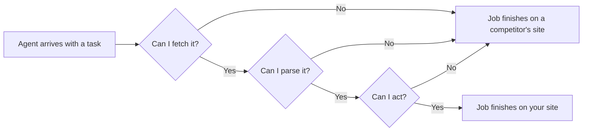

# Making the site readable by an AI agent

For twenty-five years the only non-human visitor your website had to satisfy was a crawler, and a crawler only reads. You now have a second kind of visitor, and it clicks.

It arrives holding somebody's actual intent — book a table, get a quote, check whether you open on Sunday — and it either finishes that job on your site or gives up and finishes it on a competitor's.

Being *indexable* and being *operable* are different engineering problems. Since Lighthouse 13.3 — released 7 May 2026, and the first version to carry the category in its default configuration — Google ships a first-party audit of the second one, and almost nobody in local SEO has looked at it.

## Three questions an agent asks

An agent handling a local task works through your site in three stages, and it can fail at any of them.

**Can I fetch it?** Robots policy, redirects, login walls, aggressive bot blocking. An agent that is refused at the door never reaches the other two questions.

**Can I parse it?** Not "is the HTML valid" — can it build a structured model of the page. Where are the headings, what is a navigation region, what is that thing that looks like a button, and what is it called.

**Can I act?** Fill a form, press the right control, and have the page stay still long enough for the press to land on what it aimed at.

The previous chapter, [the website half](../the-website-half/index.md), covered the fetch layer as a ranking concern: indexable, HTTPS, mobile viewport, a `tel:` link, name and address that match the profile. This chapter is about the other two.

## An agent reads the accessibility tree, not the page

This is the fact that reframes the whole subject, and it is why the work is less exotic than it sounds.

**A browsing agent does not look at your site the way you do.** Screenshots are expensive, slow and ambiguous, so the practical approach — the one the current generation of browser-driving tools takes — is to read the **accessibility tree**: the structured model the browser already builds for screen readers.

Roles, names, states, hierarchy. "Button, named 'Book appointment'." "Textbox, named 'Your email', required." *(Inference — no vendor publishes a spec for how its browsing mode reads a page, but the mainstream browser-driving libraries all expose an accessibility snapshot as the primary page representation.)*

Two consequences follow, and both are good news.

First, **agent readability is accessibility work under a different name.** A `
` styled to look like a button has no role and no accessible name. Three visitors, three experiences of it:

- **A human** sees a button.
- **A screen reader** announces nothing useful.
- **An agent** sees an unlabelled generic node it cannot safely press.

The same fix serves all three, and unlike most SEO work it has an independent justification you can defend to a client who does not care about AI at all.

Second, **spraying ARIA attributes over the markup makes it worse.** `role="button"` on a div that does not take keyboard focus produces a control an agent will try to operate and fail.

The fix is nearly always the boring one: use the element that already means what you mean, give every control a real label, and give every form field a real `<label>`.

## Layout stability is an agent problem, not just a comfort problem

Cumulative Layout Shift has been on performance checklists for years as a user-experience metric. It is now also a correctness metric.

**The failure is silent.** An agent snapshots the page, decides the thing at a given position is the control it wants, and clicks. If a late banner, a cookie bar or a web font pushes the layout down in between, it presses whatever moved into that spot. It does not notice. It reports success.

You know this failure: it is why you have tapped the wrong link on a phone. The difference is that you noticed and went back. An agent frequently does not.

## What Lighthouse actually scores

The category is called **Agentic Browsing** and it currently carries six checks. In SEOG they appear on the **Website** page as an **AI agent readiness** card, directly below the **Site health** card. *(Category contents verified 2026-07 against Google's Lighthouse agentic-browsing documentation; Lighthouse 13.3 added it to the default config, 13.4 is current.)*

| Check | What it asks | Who else benefits |
| --- | --- | --- |
| **llms.txt** | Is there a plain-language summary file at your site root, and does it follow the recommended shape | Nobody yet |
| **Accessibility tree** | Can a machine name every control and region on the page | Screen-reader users, your own automated tests |
| **Cumulative Layout Shift** | Does the page stop moving | Every human on a phone |
| **WebMCP — registered tools** | Does the page declare callable actions to an agent | Nobody yet |
| **WebMCP — form coverage** | Are the site's forms covered by those declarations | — |
| **WebMCP — schema validity** | Are the declarations well-formed | — |

Each check is pass, fail, or **not applicable**. A check counts as passed at Lighthouse's own green line — an audit score of 90 or better.

**WebMCP** is the newest and least settled of these: an emerging proposal in which a page declares named actions an agent can call — "check availability", "request a quote" — instead of the agent reverse-engineering your form.

Google's own documentation calls the category and its WebMCP support "experimental and based on proposed standards", and the WebMCP audits require the site to be registered in the WebMCP origin trial before they apply at all — which is the main reason those three rows read as dashes on ordinary sites.

It is a draft, the details are in flux, and for a five-page plumbing site it is not this quarter's work. Being told so plainly is more useful than being sold a fix.

---

**Next:** [Reading the score, and whether llms.txt is worth it →](./reading-the-score-and-llms-txt.md)
