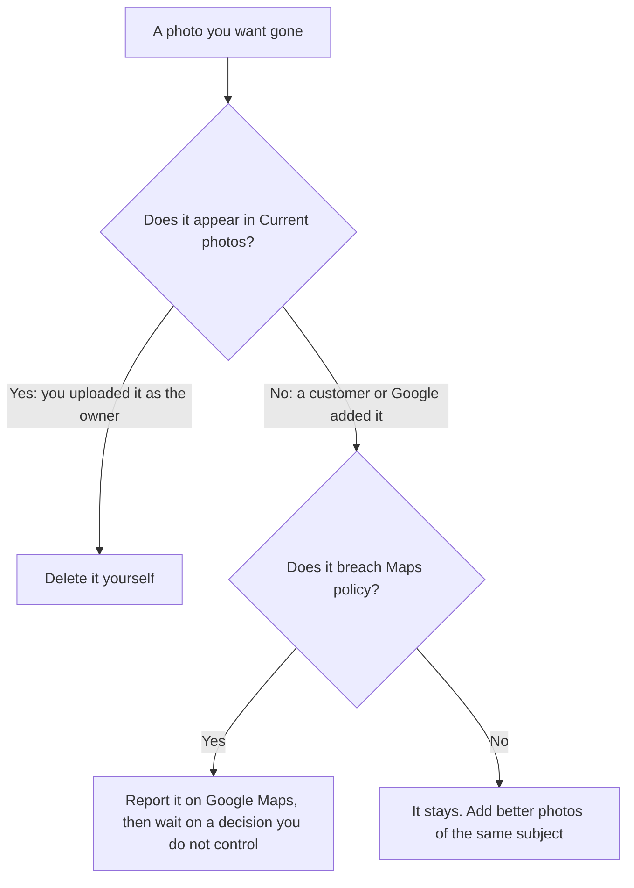
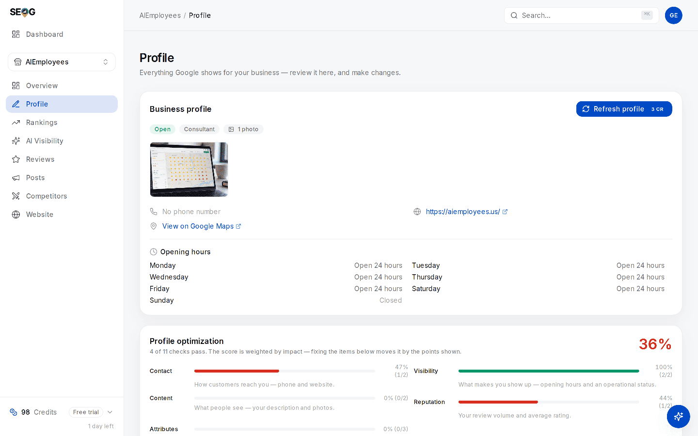

# Photos, and what you cannot do with them

The photo strip is the part of a listing a customer judges fastest and the part an owner controls least.

You can add images. You can remove the ones you added. You cannot order them, cannot swap one out in place, cannot delete the blurry shot a customer took of your bins, and cannot find out how any single image performed.

That gap between what people assume they control and what is actually controllable is where most photo advice in this industry goes wrong. This chapter is mostly about the limits, because the limits are the part nobody tells you.

## What photos are actually for

Two different jobs, and it helps to keep them separate.

**Conversion.** Three results sit in the map pack. All three are close enough, all three are open, all three have decent ratings. The photos are what makes someone tap one of them. That effect is immediate and it is the reason photos are worth work even if they never moved a ranking at all.

**Evidence.** A profile with a storefront shot, an interior, the products and the team is a profile someone maintains. Google's guidance on improving local ranking lists adding photos alongside complete data, accurate hours and review management.

But the three factors Google actually names — relevance, distance, prominence — do not include photos. See [Relevance, distance, prominence](../../01-foundations/relevance-distance-prominence/index.md) for what those three are and are not.

**So how much do photos move a position?** Nobody outside Google knows, and anyone who gives you a percentage for *ranking* is guessing.

Google does publish numbers, but they describe behaviour rather than position. Its help page *Make your Business Profile awesome* (`support.google.com/business/answer/6335804`, read 2026-07-27) states that customers are **42% more likely to request driving directions** to a business whose profile has photos, and **35% more likely to click through** to its website.

No method is published behind either figure, and the obvious confound is untouched: businesses that upload photos are businesses that maintain their profile at all. Treat it as Google's claim about conversion, not as a measurement of ranking.

The honest working model *(inference, from how the rest of the profile behaves)*: photos are completeness evidence and conversion material. Do them because the second job is certain, not because the first one is.

## The gallery is not a folder you own

Go back to [the entity model](../../01-foundations/the-business-entity/index.md). Photos sit in the *contents* group, and the contents group has more than one author.

A live gallery is fed by at least three sources:

- **You**, uploading as the owner.
- **Customers**, uploading from Maps, forever, without asking.
- **Google**, from Street View and its own imagery.

> **You have delete rights over exactly one of those.**

This is not a tooling limitation that a better product would solve — the media surface Google exposes to software only offers up owner-managed items for removal. Customer photos come down when the customer removes them, or when Google acts on a policy report. That is the whole list.

So the most common photo request an agency receives — "get rid of that one" — usually has one honest answer: *I can flag it and wait, and I cannot promise anything.*

## What you can and cannot do

| Action | Possible? | Why |
| --- | --- | --- |
| Add a photo you captured | Yes | — |
| Remove a photo you uploaded as the owner | Yes | — |
| Remove a customer's photo | **No** | Only owner-managed media is exposed for deletion. Report it and wait |
| Reorder the gallery | **No** | No ordering control exists |
| Choose which image is the cover | **Not reliably** | The Google dashboard takes a cover preference; what appears varies by surface and query *(inference — compare a listing's cover on mobile Maps and desktop Search)* |
| Replace one image in place | **No** | There is no atomic replace. Delete, then add. The gallery is briefly one photo short |
| See views for a single photo | **No** | Discontinued February 2023 (below) |
| Get a reason when an image is refused | **No** | The upload simply fails; no per-photo reason comes back |

Two of these deserve more than a table row.

**No atomic replace** means "swap the old logo for the new one" is two operations with a gap between them, and if the second fails you are down a photo.

Every upload also draws on the shared per-profile edit budget described in [the profile is the product](../the-profile-is-the-product/index.md) — ten edits a minute, spent by posts, hours changes and description edits alike — so a bulk photo run can starve a scheduled post. [Write limits and failure modes](../../05-reference/write-limits-and-failure-modes.md) has the mechanism.

**No ordering control** means any tool offering a "set cover photo" button is either driving the Google dashboard on your behalf or overstating what it does. Worth asking before you buy one.

## The photo count in every dashboard is a ceiling reading

Here is the fact that quietly breaks a lot of reporting. The public data Google exposes about a place includes a list of photos, and that list is capped — around ten entries, in every read we have taken *(verified 2026-07-13)*.

Any tool without owner access counts that list and calls the result "photos". So does SEOG, and so does every competitor comparison you will ever see.

*The pill reads exactly 10, and the strip stops there. That is the cap on the public feed, not a count of the gallery — a business with 11 photos and a business with 400 both produce this card.*

Three consequences:

1. **A count of 10 is not a count.** It means "at least ten". A business with 11 photos and a business with 400 read identically.
2. **Competitor photo averages saturate.** "You: 8. Competitors average 10." reads like a small gap. It could be a gap of hundreds.
3. **Below the cap, the number is real and useful.** A business showing 2 is genuinely showing 2, and that is a finding.

*The same card on a profile with one photo. One is far below the ceiling, so this number is real — and a single image on a live listing is a finding you can act on this afternoon.*

This is why the profile audit's photo check passes at five rather than at some impressive-sounding number: five sits below the ceiling, so it can actually be verified from public data. A tool that demanded "at least 25 photos" from public data would be scoring you against a number it cannot see.

The only place a true count exists is the owner's own Google dashboard. If the count matters to the decision, go and look there.

## You cannot measure a photo

Per-photo view counts stopped existing on **2023-02-20**. The date is Google's own, not folklore: its published deprecation schedule (`developers.google.com/my-business/content/sunset-dates`) lists the merchant and customer photo-view metrics, the photo-count metrics and the media-insights object as all discontinued that day.

The performance data that replaced them carries no photo metrics at all — no per-image views, no per-image actions *(probe-verified 2026-07-13; see [What Google's reporting hides](../../05-reference/what-googles-reporting-hides.md))*.

> **When a dashboard shows "your top-performing photo", exactly one of two things is true: it was scraped, or it was invented.**

There has been no third option since early 2023. Do not put that panel in a client report — [Reporting to a client](../../04-operating/reporting-to-a-client/index.md) covers what to promise instead.

What you *can* do is measure at the profile level, before and after: direction requests, calls and website clicks over the weeks around a gallery overhaul. A weak instrument, since everything else moved too, but an honest one. [Did it work?](../did-it-work/index.md) is about using it properly rather than fooling yourself.

---

**Next:** [The media policy, and what to shoot →](./media-policy-and-what-to-shoot.md)
