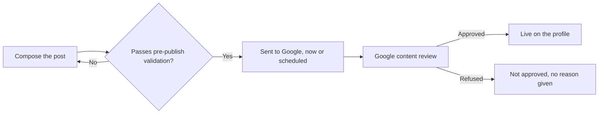

# Publishing to a Google Business Profile without getting rejected

A post is the only part of a Google Business Profile you write fresh, whenever you like, in your own words. Everything else is either a structured field you fill in once or content other people wrote about you.

Two things make posts worth a chapter. Several of the rules that decide whether a post survives Google's review are not in Google's documentation — one of them used to be and was removed. And the commonest rejection cause is something owners do deliberately, believing it helps.

## What a post actually is

A short, dated update attached to your profile. It can appear on the panel that shows when someone searches your name, and on your listing in Maps. It carries text, optionally one photo, optionally a button, and — for two of the three types — a start and end time.

Every post goes through content review before it becomes visible. Review is not instant and not always successful, so a post has a state: in review, live, or not approved. That state is the only per-post signal that exists.

**Does posting improve map-pack position?** Nobody outside Google knows, and anyone who tells you otherwise is guessing.

What is observable is narrower: a post is surface a customer can act on while looking at your listing, and it is dated, so it tells a human the business is still trading. Treat it as a conversion and freshness surface, not a ranking lever.

## The three types you can publish

Google's own interface offers more types than any tool can write for you. Through the API every tool writes through, three are available:

| Type | Requires | Optional | Button |
| --- | --- | --- | --- |
| **What's New** | Post text | Photo, button | Any one button |
| **Event** | Title, full start **and** end date and time | Post text, photo, button | Any one button |
| **Offer** | Title, full start **and** end date and time | Post text, coupon code, redeem link, terms, photo | None — Google adds "View Offer" itself |

Two rules catch people out:

- **Events and offers need a complete interval** — start date, start time, end date, end time. "Runs from Friday" is not a schedule Google accepts.
- **An offer takes no button.** Google attaches its own, so an explicit one fails.

The rest are out of reach: there is no product post type in the API's list of post topics at all, and Google's alert type is gated — its own reference describes alerts as "not always available for authoring".

For those, post by hand. (Both checked against Google's Business Profile API reference, 2026-07.) See [the capability matrix](../05-reference/gbp-capability-matrix.md).

## The limits that are no longer documented

Post text is capped at **1,500 characters**. An event or offer title is capped at **58 characters**.

Neither number appears in Google's current documentation. The 1,500 figure circulates on forums with no citation; the 58 is third-party lore.

Both are real, and both were confirmed the only way they now can be — by sending a longer value and reading the field-level error that comes back. Nothing is created when it fails. (Verified 2026-07-22; the mechanism and the exact error text are in [write limits and failure modes](../05-reference/write-limits-and-failure-modes.md).)

Fifty-eight feels arbitrary until you hit it, which you will, on your second offer post: "Half price first service for new customers in Kingsbridge" does not fit.

The 1,500 cap is not a target. A post is read on a phone, next to a map. The first line does the work.

## One photo, and it has to be yours

Post media is photos only, effectively one per post. No video, no gallery, no carousel.

**Video is not a limitation you can work around.** Google's own interface publishes video on a post; the API returns a server error for the same content — not a validation error saying video is unsupported, a deterministic internal failure (probe-verified 2026-07-22). UI parity is not API parity. Anything publishing video to a post is not doing it through the posts API.

**Use photographs you took.** Google's guidance for media posted to Maps is direct: "Use media that you captured. Upload media of a place that you captured using a camera," and "Avoid screenshots, stock photos, GIFs, collages, heavily edited or otherwise manipulated photos, or imagery created by other parties." Google's separate photo guidelines add that "the image should represent reality".

Google does not currently name AI-generated imagery in that list; our reading is that it is squarely inside "imagery created by other parties" and outside "represent reality" *(inference — this is interpretation of Google's published text, not a quoted rule, and it is not legal advice)*.

An industry is currently bolting image generation onto post publishing. Do not. Same rule as your gallery — [photos and the visual profile](./photos-and-the-visual-profile.md).

**Format.** Google's published media requirements are JPG or PNG, between 10 KB and 5 MB, minimum 250×250 and 720×720 recommended.

A tighter floor of 400×300 circulates for *post* photos specifically; it is not in Google's current documentation, and it is what the SEOG composer enforces. Frame for roughly 4:3 either way, since post thumbnails crop to about that shape *(inference — from observed rendering, not a documented spec)*.

**Assume the photo cannot be changed after publishing.** The composer offers no way to swap it: you delete the post and publish a new one, which resets its review and its date.

Whether Google's API will accept a media change on an existing post is an open question — its update reference does not say which fields are editable, and we have not probed it. Plan as though it is fixed.

## Buttons, and the phone number trap

You can attach one button: Book, Order online, Shop, Learn more, Sign up, or Call. Every one needs a link — except Call, which takes none, because it uses the verified phone number already on your profile. That exception matters more than it looks.

> **Policy** · Google's *Business Profile photos & videos policy and posts content policy*, under the heading **"Avoid 'phone stuffing'"**, states: "To avoid the risk of abuse, we do not allow your post content to include a phone number."
>
> Google's remedy is the button: attach a "Call now" button, which uses the verified phone number on the Business Profile. Quoted verbatim, checked 2026-07; our reading of it is not legal advice.

A phone number in the text is the most natural thing an owner writes — "call us on 0161 496 0000 to book" — and, in our experience, the rejection cause that bites most often *(inference: Google publishes no rejection statistics and gives no reason with a rejection, so nobody can rank these causes from data)*.

The Call button exists so you do not need to: write the offer, attach the button, and the number comes from the profile, where Google can verify it.

Validating before you publish is worth building or buying, because a rejected post cannot be repaired. SEOG treats a high-confidence phone pattern as a hard error, and a looser digit grouping — a date, a price — as a warning you can publish through.

## The rest of the rejection list

In rough order of how often they bite *(inference — our ordering, from observed rejections; Google publishes no data on this and explains no individual rejection)*:

1. **A phone number in the text.** Most of them.
2. **Regulated goods promoted with an offer or a button.** Alcohol, gambling, tobacco and vaping, firearms, pharmaceuticals, financial services. Mentioning them is not automatically fatal; wrapping them in a promotion with a call to action is what draws scrutiny.
3. **Hotels promoting anything.** The rule is wider than most people who know it think. Google's posts content policy, under **"Hotel posts"**: hotels "can't create 'offer' posts or any post that mentions or includes links to deals, promotions, special offers, or discounts" — so it is not merely that the Offer type is barred, it is that a What's New post advertising a discount is barred too.

   Google's stated reason is to keep customers from confusing organic and partner pricing on the hotel place sheet. Hotels, motels, inns, lodges and B&Bs get What's New and Event posts, with the promotional content taken out. (Quoted verbatim, checked 2026-07.)
4. **Low-quality signals.** All-capitals reads as shouting; heavy emoji use — more than about half a dozen in a short post — reads as gimmicky. Neither is a documented threshold; both correlate with rejection *(inference — from observed rejections and Google's low-quality content guidance)*, so treat them as warnings and rewrite.
5. **Chain-detected locations, refused wholesale.** Some locations are refused from posting entirely, with a specific error saying posting is disabled there. The repeated "more than ten locations" threshold is community lore, not contract — detection is Google-internal, with no way to test before trying. Never sell a posting retainer to a multi-location client before publishing one test post on one of their locations ([multi-location and franchise](../03-advanced/multi-location-and-franchise.md)).

A rejected post is not explained. You get the state and nothing else — which is why the checklist runs before publishing.

## Scheduling is Google's job

Scheduling is native. When you publish, you can hand Google the time you want the post to appear, and Google holds it and publishes it itself (probe-verified 2026-07-22). No queue runs on your side. If your tool is offline or your laptop is shut, the post still goes out. Deleting it before its time is what cancels it.

Two consequences, and the second is undocumented.

**A publisher queue is unnecessary.** Any scheduler that holds your posts and publishes them itself has added a subsystem that can fail: a missed run is a missed post, and you hear about it from the client. Handing the time to Google removes that subsystem rather than making it more reliable.

This is a design fact about where the queue lives, not a claim about any particular product — ask whichever tool you use which side it schedules on.

**Google reviews scheduled posts up front.** A post scheduled for next Tuesday can be marked not approved today. This is the real answer to "my scheduled post was rejected before it went live", which sounds impossible and is ordinary. So checking states after scheduling a batch is not optional.

## What you can measure afterwards: almost nothing

**Per-post analytics do not exist.** Google removed per-post views and clicks when it retired the old Insights dashboard on 20 February 2023, and the profile performance reporting that replaced it carries no post-level metrics.

No views, no clicks, no button taps, per post, from any legitimate source. What remains is the state and a link to the post on Google.

**Be blunt about this with clients and vendors.** If a dashboard shows views per post, those numbers did not come from Google's reporting — ask where they came from.

Evaluate posting at the profile level over time, using the metrics Google does report plus your tracked keywords ([did it work?](./did-it-work.md)). Full inventory: [what Google's reporting hides](../05-reference/what-googles-reporting-hides.md).

One more constraint before any bulk edit: Google caps how many edits a profile accepts per minute, and it is one budget shared across every kind of edit — posts, hours, description, photos, attributes. A bulk hours update can push a post publish into a refusal ([write limits and failure modes](../05-reference/write-limits-and-failure-modes.md)).

## Labs

### Lab 15.1 — Compose against the real limits

> **Lab** · Where: **Posts** (`/b/{businessId}/posts`) · Cost: **free** · Time: ~10 min
>
> You need: Lab 0.3 (a practice business). A connected profile is *not* required — validation runs before anything touches Google, so observe-only readers can do all of it.

*Almost every rule in this chapter is enforced on this one screen: the three type tabs, the character counter above **Post text**, one **Button** selector, one photo — with the rule spelled out in the small print, "your own photos (AI/stock images get rejected)" — and the **Schedule this post** toggle that hands the timing to Google.*

1. Open **Posts**. The composer sits at the top with three type tabs — **What's New**, **Event**, **Offer** — and your posts below.
2. In **Post text**, paste a block longer than 1,500 characters. The counter turns red, an error says the text must be at most 1,500 characters, and **Publish to Google** goes disabled. Trim back under the cap and watch it clear.
3. Switch to **Event**. In **Title**, keep typing past 58 characters: the field stops accepting them and the counter parks at 58/58. The other undocumented Google cap, enforced at a different moment — the text cap lets you overshoot and then blocks publishing, the title cap simply refuses the keystroke.
4. Leave the dates empty and press **Publish to Google**. Nothing is spent — the missing-field errors appear instead, saying Google requires full start and end dates and times.
5. Type a phone number into **Post text**. A hard error tells you to use the **Call** button instead. Delete it, then pick **Call** in the **Button** selector: the link field disappears, because Call uses your profile's verified phone.
6. Switch to **Offer** and look for the button selector. It is gone.

**What good looks like.** Four different blocks fired without spending anything, and you can state both caps from memory.

**If it went wrong.** An untouched composer stays quiet by design, and "you have not filled this in" errors only appear once you attempt to publish — that is what step 4 is for.

**What you just learned.** The caps and type rules are real, enforced by Google, and mostly absent from its documentation. Pre-publish validation is not a convenience: skip it and you get a rejected post you cannot un-publish and cannot get an explanation for.

### Lab 15.2 — Draft, edit, publish

> **Lab** · Where: **Posts** (`/b/{businessId}/posts`) · Cost: **paid** (the AI draft and the publish are each metered) · Time: ~10 min
>
> You need: Lab 0.4 — a connected profile with owner access. Without one the page shows a connect card; do Lab 15.1 instead and return when you have owner access.

*The same page without owner access. The connect card comes first, and the composer still renders below it — publishing is the part that needs the connection, composing and validating are not.*

1. On **What's New**, pick a template under **Start from a template**. *Helpful tip* is the safest first post: no offer, no dates.
2. Press **Draft with AI**. The draft is written from the business's own details plus the template you chose, and fills the post text.
3. **Edit it.** Cut anything not true of this business, any phone number, and anything that sounds machine-written, because it was.
4. Press **Add a photo** and upload a real photograph you took — JPEG or PNG, at least 400×300, roughly 4:3. Staging it costs nothing.
5. Press **Publish to Google**, then read the state chip on the new card. Expect **In review** first.

**What good looks like.** A card with your text and photo, an **In review** chip that becomes **Live on Google**, and a **View on Google** link that opens the post on the real listing.

**If it went wrong.** A prompt to connect your profile means it is not linked with owner access. A refusal saying Google has disabled posting for this location is the chain rule — retrying changes nothing. A "Google limits profile edits" message means the profile's shared edit budget went on something else; wait a minute and republish.

**What you just learned.** Publishing is a write that Google then reviews. A tool reporting success means Google accepted the request, not that it approved the content.

### Lab 15.3 — Schedule one, and prove Google holds it

> **Lab** · Where: **Posts** (`/b/{businessId}/posts`) · Cost: **paid** · Time: ~5 min now, one minute later
>
> You need: Lab 15.2.

1. Compose a second short What's New post — write these two sentences yourself.
2. Turn on **Schedule this post**. A date and time field appears, defaulted to tomorrow at 10:00 local. Note the line beside it: Google publishes at this time, and deleting the post before then cancels it.
3. Try a time one minute from now. It is refused — a scheduled time must be far enough ahead to survive the round trip.
4. Set a time a day or two out and press **Schedule on Google**; the button relabelled itself when you flipped the toggle. The card now reads **Scheduled for** your chosen date and time.
5. Close the tab and do nothing until the time passes.

**What good looks like.** The post appears at the time you chose, with your tool closed and your account logged out. Nothing on your side ran.

**If it went wrong.** A chip reading **Not approved** *before* the publish time is the up-front review in action — Google rejected a post it had not published yet. Work the rejection list, fix the text, schedule a replacement.

**What you just learned.** The scheduling queue belongs to Google. Any layer between you and it — a cron job, a worker, a subscription that must stay live — is added risk, not added capability.

### Lab 15.4 — Refresh the state, then remove the test post

> **Lab** · Where: **Posts** (`/b/{businessId}/posts`) · Cost: **paid** (both re-reading states and deleting go to Google) · Time: ~3 min
>
> You need: Lab 15.2, and ideally Lab 15.3.

1. Press **Check statuses**, top right. It only appears once you have at least one post.
2. Read the notice underneath — a count of statuses updated from Google, or a confirmation they are current. This is the entirety of per-post telemetry.
3. See what changed on the cards: In review may have become Live on Google, or Not approved.
4. Delete the Lab 15.2 post with the bin icon, then check the live profile: it is gone from Google too.
5. If the Lab 15.3 post has not published yet, delete it and watch it never arrive.

**What good looks like.** You can state precisely what Google tells you about a post: its state, and a link to it. Nothing about who saw it.

**If it went wrong.** A chip saying the status is unknown means the stored copy and Google have drifted — check again. A card labelled as simulated means no live profile is connected.

**What you just learned.** Deletion is permanent and immediate on Google as well as in your tool, and it doubles as the only way to cancel a scheduled post or replace a published photo.

## Doing this without SEOG

You can write posts directly in Google's Business Profile interface, and you should know how, because it does things no tool can: video, product posts, editing a published post's photo. What you give up is validation against undocumented limits, a record of what you published and when, and working a portfolio without logging into each profile ([doing it without SEOG](../99-appendix/doing-it-without-seog.md)).

## Common mistakes

**Putting the phone number in the post so people can call.** Tempting, because it is the point of the post. It is the biggest cause of rejection, and the Call button works better anyway — one tap, using the number Google has already verified.

**Publishing the AI draft as written.** A draft removes the blank page. Shipped unedited it reads like every other business in the category, and it occasionally invents a service you do not offer. Generated *images* are worse: a policy violation and a real rejection cause.

**Not knowing whose queue you are trusting.** If a tool holds your posts and publishes them itself, every outage on its side is a missing post on a client's profile. Google will hold the post natively; find out whether the thing you use takes that offer, because the answer changes what can go wrong.

**Selling a posting retainer to a chain before testing one location.** Chain-detected locations are refused wholesale, with no advance check. One test post tells you whether the service is deliverable at all.

## Check yourself

**1. Your tool reported a successful publish. The post never appeared. What do you check first, and what did that success message prove?**
Check the post's state and refresh it from Google. Success means Google accepted the write, not that it approved the content — in review and not approved both follow a successful publish.

**2. A client asks for views and clicks per post. What do you tell them, and what do you offer instead?**
That per-post metrics were discontinued in February 2023 and no legitimate source has them. Offer profile-level performance across the posting period plus your tracked keywords, and say explicitly that you measure the profile, not the post.

**3. You schedule four weeks of posts on the 1st. When is the earliest a rejection can arrive?**
The same day — Google reviews scheduled posts up front, so a post set for the 28th can be rejected on the 1st.

**4. A hotel client wants an offer post reading "20% OFF ROOMS — CALL 555-0148 TO BOOK!". Name every reason it fails, then rewrite it.**
Four reasons:

- hotels may not publish offer posts at all;
- there is a phone number in the text;
- the text is all capitals;
- and an offer post cannot carry a Call button anyway.

The trap in the rewrite is that switching type does not save it — Google's hotel rule also bars a What's New post that mentions a discount.

The publishable version drops the promotion entirely: a sentence-case What's New or Event post about something real and non-promotional (a refurbished floor, a Sunday brunch sitting), with the Call button attached and no number in the text. If the client's whole ask is the discount, the honest answer is that this channel cannot carry it and Hotel Ads can.

---

Posts are the last thing you *write* on the profile. The next chapter turns the instruments outward, onto the businesses ranking above you.

---

**Next:** [Reading a competitor off their public data →](./competitors.md)
