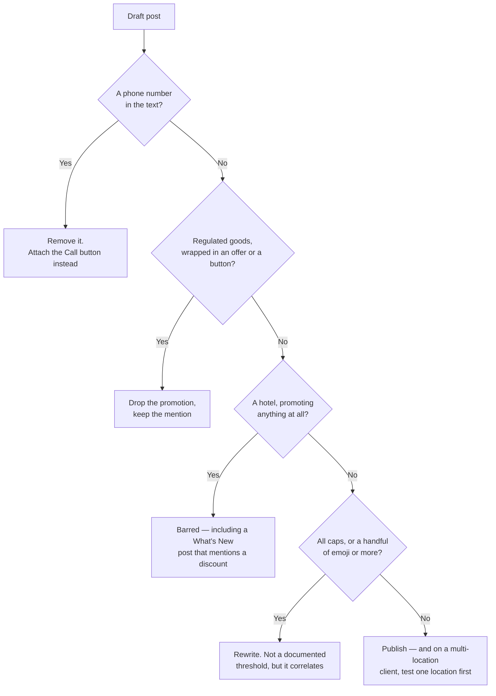

# Buttons, rejections and scheduling

Type, text and photo settled, one composing decision is left — the button — and it is the one that most often gets a post refused.

## Buttons, and the phone number trap

You can attach one button: Book, Order online, Shop, Learn more, Sign up, or Call. Every one needs a link — except Call, which takes none, because it uses the verified phone number already on your profile. That exception matters more than it looks.

> **Policy** · Google's *Business Profile photos & videos policy and posts content policy*, under the heading **"Avoid 'phone stuffing'"**, states: "To avoid the risk of abuse, we do not allow your post content to include a phone number."
>
> Google's remedy is the button: attach a "Call now" button, which uses the verified phone number on the Business Profile. Quoted verbatim, checked 2026-07; our reading of it is not legal advice.

A phone number in the text is the most natural thing an owner writes — "call us on 0161 496 0000 to book" — and, in our experience, the rejection cause that bites most often *(inference: Google publishes no rejection statistics and gives no reason with a rejection, so nobody can rank these causes from data)*.

The Call button exists so you do not need to: write the offer, attach the button, and the number comes from the profile, where Google can verify it.

Validating before you publish is worth building or buying, because a rejected post cannot be repaired. SEOG treats a high-confidence phone pattern as a hard error, and a looser digit grouping — a date, a price — as a warning you can publish through.

## The rest of the rejection list

In rough order of how often they bite *(inference — our ordering, from observed rejections; Google publishes no data on this and explains no individual rejection)*:

1. **A phone number in the text.** Most of them.
2. **Regulated goods promoted with an offer or a button.** Alcohol, gambling, tobacco and vaping, firearms, pharmaceuticals, financial services. Mentioning them is not automatically fatal; wrapping them in a promotion with a call to action is what draws scrutiny.
3. **Hotels promoting anything.** The rule is wider than most people who know it think. Google's posts content policy, under **"Hotel posts"**: hotels "can't create 'offer' posts or any post that mentions or includes links to deals, promotions, special offers, or discounts" — so it is not merely that the Offer type is barred, it is that a What's New post advertising a discount is barred too.

   Google's stated reason is to keep customers from confusing organic and partner pricing on the hotel place sheet. Hotels, motels, inns, lodges and B&Bs get What's New and Event posts, with the promotional content taken out. (Quoted verbatim, checked 2026-07.)
4. **Low-quality signals.** All-capitals reads as shouting; heavy emoji use — more than about half a dozen in a short post — reads as gimmicky. Neither is a documented threshold; both correlate with rejection *(inference — from observed rejections and Google's low-quality content guidance)*, so treat them as warnings and rewrite.
5. **Chain-detected locations, refused wholesale.** Some locations are refused from posting entirely, with a specific error saying posting is disabled there. The repeated "more than ten locations" threshold is community lore, not contract — detection is Google-internal, with no way to test before trying. Never sell a posting retainer to a multi-location client before publishing one test post on one of their locations ([multi-location and franchise](../../03-advanced/multi-location-and-franchise/index.md)).

A rejected post is not explained. You get the state and nothing else — which is why the checklist runs before publishing:

*Run it in that order: the top branch is the one that bites most often, and it is the only rejection cause with a documented remedy sitting right beside it.*

## Scheduling is Google's job

Scheduling is native. When you publish, you can hand Google the time you want the post to appear, and Google holds it and publishes it itself (probe-verified 2026-07-22). No queue runs on your side. If your tool is offline or your laptop is shut, the post still goes out. Deleting it before its time is what cancels it.

Two consequences, and the second is undocumented.

**A publisher queue is unnecessary.** Any scheduler that holds your posts and publishes them itself has added a subsystem that can fail: a missed run is a missed post, and you hear about it from the client. Handing the time to Google removes that subsystem rather than making it more reliable.

This is a design fact about where the queue lives, not a claim about any particular product — ask whichever tool you use which side it schedules on.

**Google reviews scheduled posts up front.** A post scheduled for next Tuesday can be marked not approved today. This is the real answer to "my scheduled post was rejected before it went live", which sounds impossible and is ordinary. So checking states after scheduling a batch is not optional.

## What you can measure afterwards: almost nothing

**Per-post analytics do not exist.** Google removed per-post views and clicks when it retired the old Insights dashboard on 20 February 2023, and the profile performance reporting that replaced it carries no post-level metrics.

No views, no clicks, no button taps, per post, from any legitimate source. What remains is the state and a link to the post on Google.

**Be blunt about this with clients and vendors.** If a dashboard shows views per post, those numbers did not come from Google's reporting — ask where they came from.

Evaluate posting at the profile level over time, using the metrics Google does report plus your tracked keywords ([did it work?](../did-it-work/index.md)). Full inventory: [what Google's reporting hides](../../05-reference/what-googles-reporting-hides.md).

One more constraint before any bulk edit: Google caps how many edits a profile accepts per minute, and it is one budget shared across every kind of edit — posts, hours, description, photos, attributes. A bulk hours update can push a post publish into a refusal ([write limits and failure modes](../../05-reference/write-limits-and-failure-modes.md)).

---

**Next:** [Labs: compose, publish, schedule and clean up →](./publishing-labs.md)
