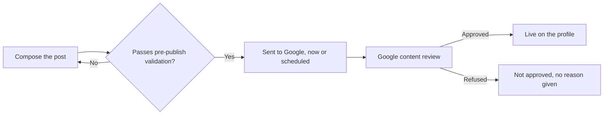

# Posting to a Google Business Profile without rejection

A post is the only part of a Google Business Profile you write fresh, whenever you like, in your own words. Everything else is either a structured field you fill in once or content other people wrote about you.

Two things make posts worth a chapter. Several of the rules that decide whether a post survives Google's review are not in Google's documentation — one of them used to be and was removed. And the commonest rejection cause is something owners do deliberately, believing it helps.

## What a post actually is

A short, dated update attached to your profile. It can appear on the panel that shows when someone searches your name, and on your listing in Maps. It carries text, optionally one photo, optionally a button, and — for two of the three types — a start and end time.

Every post goes through content review before it becomes visible. Review is not instant and not always successful, so a post has a state: in review, live, or not approved. That state is the only per-post signal that exists.

**Does posting improve map-pack position?** Nobody outside Google knows, and anyone who tells you otherwise is guessing.

What is observable is narrower: a post is surface a customer can act on while looking at your listing, and it is dated, so it tells a human the business is still trading. Treat it as a conversion and freshness surface, not a ranking lever.

## The three types you can publish

Google's own interface offers more types than any tool can write for you. Through the API every tool writes through, three are available:

| Type | Requires | Optional | Button |
| --- | --- | --- | --- |
| **What's New** | Post text | Photo, button | Any one button |
| **Event** | Title, full start **and** end date and time | Post text, photo, button | Any one button |
| **Offer** | Title, full start **and** end date and time | Post text, coupon code, redeem link, terms, photo | None — Google adds "View Offer" itself |

Two rules catch people out:

- **Events and offers need a complete interval** — start date, start time, end date, end time. "Runs from Friday" is not a schedule Google accepts.
- **An offer takes no button.** Google attaches its own, so an explicit one fails.

The rest are out of reach: there is no product post type in the API's list of post topics at all, and Google's alert type is gated — its own reference describes alerts as "not always available for authoring".

For those, post by hand. (Both checked against Google's Business Profile API reference, 2026-07.) See [the capability matrix](../../05-reference/gbp-capability-matrix.md).

## The limits that are no longer documented

Post text is capped at **1,500 characters**. An event or offer title is capped at **58 characters**.

Neither number appears in Google's current documentation. The 1,500 figure circulates on forums with no citation; the 58 is third-party lore.

Both are real, and both were confirmed the only way they now can be — by sending a longer value and reading the field-level error that comes back. Nothing is created when it fails. (Verified 2026-07-22; the mechanism and the exact error text are in [write limits and failure modes](../../05-reference/write-limits-and-failure-modes.md).)

Fifty-eight feels arbitrary until you hit it, which you will, on your second offer post: "Half price first service for new customers in Kingsbridge" does not fit.

The 1,500 cap is not a target. A post is read on a phone, next to a map. The first line does the work.

## One photo, and it has to be yours

Post media is photos only, effectively one per post. No video, no gallery, no carousel.

**Video is not a limitation you can work around.** Google's own interface publishes video on a post; the API returns a server error for the same content — not a validation error saying video is unsupported, a deterministic internal failure (probe-verified 2026-07-22). UI parity is not API parity. Anything publishing video to a post is not doing it through the posts API.

**Use photographs you took.** Google's guidance for media posted to Maps is direct: "Use media that you captured. Upload media of a place that you captured using a camera," and "Avoid screenshots, stock photos, GIFs, collages, heavily edited or otherwise manipulated photos, or imagery created by other parties." Google's separate photo guidelines add that "the image should represent reality".

Google does not currently name AI-generated imagery in that list; our reading is that it is squarely inside "imagery created by other parties" and outside "represent reality" *(inference — this is interpretation of Google's published text, not a quoted rule, and it is not legal advice)*.

An industry is currently bolting image generation onto post publishing. Do not. Same rule as your gallery — [photos and the visual profile](../photos-and-the-visual-profile/index.md).

**Format.** Google's published media requirements are JPG or PNG, between 10 KB and 5 MB, minimum 250×250 and 720×720 recommended.

A tighter floor of 400×300 circulates for *post* photos specifically; it is not in Google's current documentation, and it is what the SEOG composer enforces. Frame for roughly 4:3 either way, since post thumbnails crop to about that shape *(inference — from observed rendering, not a documented spec)*.

**Assume the photo cannot be changed after publishing.** The composer offers no way to swap it: you delete the post and publish a new one, which resets its review and its date.

Whether Google's API will accept a media change on an existing post is an open question — its update reference does not say which fields are editable, and we have not probed it. Plan as though it is fixed.

---

**Next:** [Buttons, rejections and scheduling →](./buttons-rejections-and-scheduling.md)
