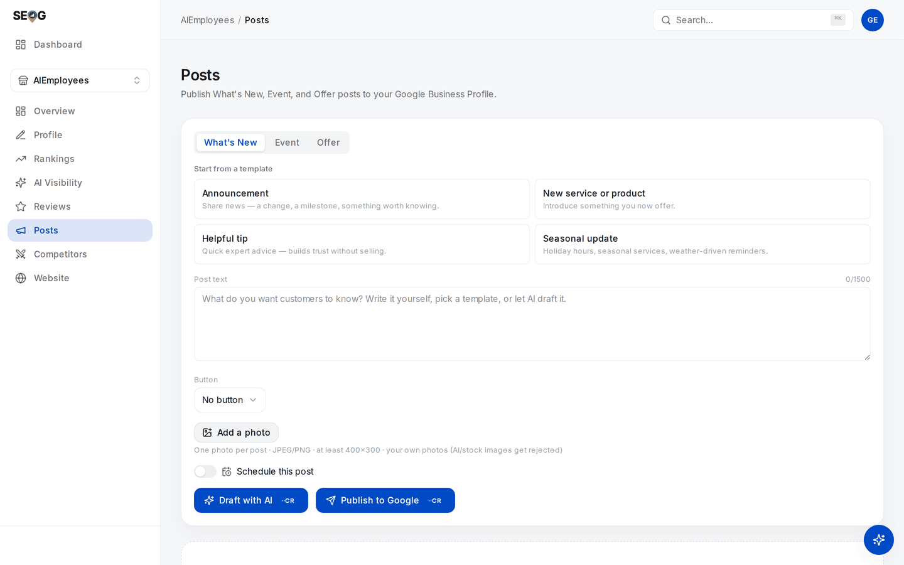

# Labs: compose, publish, schedule and clean up

Four labs, in publishing order: validate against the caps, publish, hand the timing to Google, then clean up after yourself.

## Labs

### Lab 15.1 — Compose against the real limits

> **Lab** · Where: **Posts** (`/b/{businessId}/posts`) · Cost: **free** · Time: ~10 min
>
> You need: Lab 0.3 (a practice business). A connected profile is *not* required — validation runs before anything touches Google, so observe-only readers can do all of it.

*Almost every rule in this chapter is enforced on this one screen: the three type tabs, the character counter above **Post text**, one **Button** selector, one photo — with the rule spelled out in the small print, "your own photos (AI/stock images get rejected)" — and the **Schedule this post** toggle that hands the timing to Google.*

1. Open **Posts**. The composer sits at the top with three type tabs — **What's New**, **Event**, **Offer** — and your posts below.
2. In **Post text**, paste a block longer than 1,500 characters. The counter turns red, an error says the text must be at most 1,500 characters, and **Publish to Google** goes disabled. Trim back under the cap and watch it clear.
3. Switch to **Event**. In **Title**, keep typing past 58 characters: the field stops accepting them and the counter parks at 58/58. The other undocumented Google cap, enforced at a different moment — the text cap lets you overshoot and then blocks publishing, the title cap simply refuses the keystroke.
4. Leave the dates empty and press **Publish to Google**. Nothing is spent — the missing-field errors appear instead, saying Google requires full start and end dates and times.
5. Type a phone number into **Post text**. A hard error tells you to use the **Call** button instead. Delete it, then pick **Call** in the **Button** selector: the link field disappears, because Call uses your profile's verified phone.
6. Switch to **Offer** and look for the button selector. It is gone.

**What good looks like.** Four different blocks fired without spending anything, and you can state both caps from memory.

**If it went wrong.** An untouched composer stays quiet by design, and "you have not filled this in" errors only appear once you attempt to publish — that is what step 4 is for.

**What you just learned.** The caps and type rules are real, enforced by Google, and mostly absent from its documentation. Pre-publish validation is not a convenience: skip it and you get a rejected post you cannot un-publish and cannot get an explanation for.

### Lab 15.2 — Draft, edit, publish

> **Lab** · Where: **Posts** (`/b/{businessId}/posts`) · Cost: **paid** (the AI draft and the publish are each metered) · Time: ~10 min
>
> You need: Lab 0.4 — a connected profile with owner access. Without one the page shows a connect card; do Lab 15.1 instead and return when you have owner access.

*The same page without owner access. The connect card comes first, and the composer still renders below it — publishing is the part that needs the connection, composing and validating are not.*

1. On **What's New**, pick a template under **Start from a template**. *Helpful tip* is the safest first post: no offer, no dates.
2. Press **Draft with AI**. The draft is written from the business's own details plus the template you chose, and fills the post text.
3. **Edit it.** Cut anything not true of this business, any phone number, and anything that sounds machine-written, because it was.
4. Press **Add a photo** and upload a real photograph you took — JPEG or PNG, at least 400×300, roughly 4:3. Staging it costs nothing.
5. Press **Publish to Google**, then read the state chip on the new card. Expect **In review** first.

**What good looks like.** A card with your text and photo, an **In review** chip that becomes **Live on Google**, and a **View on Google** link that opens the post on the real listing.

**If it went wrong.** A prompt to connect your profile means it is not linked with owner access. A refusal saying Google has disabled posting for this location is the chain rule — retrying changes nothing. A "Google limits profile edits" message means the profile's shared edit budget went on something else; wait a minute and republish.

**What you just learned.** Publishing is a write that Google then reviews. A tool reporting success means Google accepted the request, not that it approved the content.

### Lab 15.3 — Schedule one, and prove Google holds it

> **Lab** · Where: **Posts** (`/b/{businessId}/posts`) · Cost: **paid** · Time: ~5 min now, one minute later
>
> You need: Lab 15.2.

1. Compose a second short What's New post — write these two sentences yourself.
2. Turn on **Schedule this post**. A date and time field appears, defaulted to tomorrow at 10:00 local. Note the line beside it: Google publishes at this time, and deleting the post before then cancels it.
3. Try a time one minute from now. It is refused — a scheduled time must be far enough ahead to survive the round trip.
4. Set a time a day or two out and press **Schedule on Google**; the button relabelled itself when you flipped the toggle. The card now reads **Scheduled for** your chosen date and time.
5. Close the tab and do nothing until the time passes.

**What good looks like.** The post appears at the time you chose, with your tool closed and your account logged out. Nothing on your side ran.

**If it went wrong.** A chip reading **Not approved** *before* the publish time is the up-front review in action — Google rejected a post it had not published yet. Work the rejection list, fix the text, schedule a replacement.

**What you just learned.** The scheduling queue belongs to Google. Any layer between you and it — a cron job, a worker, a subscription that must stay live — is added risk, not added capability.

### Lab 15.4 — Refresh the state, then remove the test post

> **Lab** · Where: **Posts** (`/b/{businessId}/posts`) · Cost: **paid** (both re-reading states and deleting go to Google) · Time: ~3 min
>
> You need: Lab 15.2, and ideally Lab 15.3.

1. Press **Check statuses**, top right. It only appears once you have at least one post.
2. Read the notice underneath — a count of statuses updated from Google, or a confirmation they are current. This is the entirety of per-post telemetry.
3. See what changed on the cards: In review may have become Live on Google, or Not approved.
4. Delete the Lab 15.2 post with the bin icon, then check the live profile: it is gone from Google too.
5. If the Lab 15.3 post has not published yet, delete it and watch it never arrive.

**What good looks like.** You can state precisely what Google tells you about a post: its state, and a link to it. Nothing about who saw it.

**If it went wrong.** A chip saying the status is unknown means the stored copy and Google have drifted — check again. A card labelled as simulated means no live profile is connected.

**What you just learned.** Deletion is permanent and immediate on Google as well as in your tool, and it doubles as the only way to cancel a scheduled post or replace a published photo.

## Doing this without SEOG

You can write posts directly in Google's Business Profile interface, and you should know how, because it does things no tool can: video, product posts, editing a published post's photo. What you give up is validation against undocumented limits, a record of what you published and when, and working a portfolio without logging into each profile ([doing it without SEOG](../../99-appendix/doing-it-without-seog.md)).

## Common mistakes

**Putting the phone number in the post so people can call.** Tempting, because it is the point of the post. It is the biggest cause of rejection, and the Call button works better anyway — one tap, using the number Google has already verified.

**Publishing the AI draft as written.** A draft removes the blank page. Shipped unedited it reads like every other business in the category, and it occasionally invents a service you do not offer. Generated *images* are worse: a policy violation and a real rejection cause.

**Not knowing whose queue you are trusting.** If a tool holds your posts and publishes them itself, every outage on its side is a missing post on a client's profile. Google will hold the post natively; find out whether the thing you use takes that offer, because the answer changes what can go wrong.

**Selling a posting retainer to a chain before testing one location.** Chain-detected locations are refused wholesale, with no advance check. One test post tells you whether the service is deliverable at all.

## Check yourself

**1. Your tool reported a successful publish. The post never appeared. What do you check first, and what did that success message prove?**
Check the post's state and refresh it from Google. Success means Google accepted the write, not that it approved the content — in review and not approved both follow a successful publish.

**2. A client asks for views and clicks per post. What do you tell them, and what do you offer instead?**
That per-post metrics were discontinued in February 2023 and no legitimate source has them. Offer profile-level performance across the posting period plus your tracked keywords, and say explicitly that you measure the profile, not the post.

**3. You schedule four weeks of posts on the 1st. When is the earliest a rejection can arrive?**
The same day — Google reviews scheduled posts up front, so a post set for the 28th can be rejected on the 1st.

**4. A hotel client wants an offer post reading "20% OFF ROOMS — CALL 555-0148 TO BOOK!". Name every reason it fails, then rewrite it.**
Four reasons:

- hotels may not publish offer posts at all;
- there is a phone number in the text;
- the text is all capitals;
- and an offer post cannot carry a Call button anyway.

The trap in the rewrite is that switching type does not save it — Google's hotel rule also bars a What's New post that mentions a discount.

The publishable version drops the promotion entirely: a sentence-case What's New or Event post about something real and non-promotional (a refurbished floor, a Sunday brunch sitting), with the Call button attached and no number in the text. If the client's whole ask is the discount, the honest answer is that this channel cannot carry it and Hotel Ads can.

---

Posts are the last thing you *write* on the profile. The next chapter turns the instruments outward, onto the businesses ranking above you.

---

**Next:** [Reading a competitor off their public data →](../competitors/index.md)
