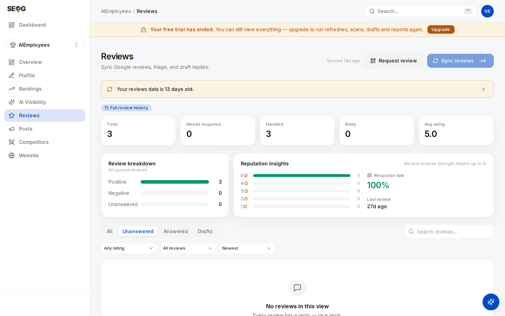

# Reviews: getting them, and answering them

Reviews are the heaviest thing a business owner controls. They feed the map pack, the click-through of a result you already hold, and the reputation signals an AI assistant reaches for.

They also carry the most rules and the most out-of-date advice: in April 2026 Google banned two practices that had been standard agency guidance for a decade. And publishing a reply has a failure mode almost nobody checks for — the write succeeds and the reply never appears.

## Why reviews weigh so much

Google documents almost nothing about local ranking. Reviews get an explicit sentence. From Google Business Profile Help, *Tips to improve your local ranking on Google* (read 2026-07-27):

> "More reviews and positive ratings can help your business's local ranking."

No weight, no threshold, no mechanism. Reviews sit inside **prominence**, the third of the [three forces](../01-foundations/relevance-distance-prominence.md), which orders businesses that already qualify. Distance you cannot change; relevance you fix once and it stays fixed. Reviews are the one lever you keep pulling.

The second reason is newer. An assistant answering "who should I call near me" runs no distance sort; it assembles an answer from entity and reputation signals ([how that works](../01-foundations/how-ai-answers-a-local-question.md)). The AI-readiness rubric used in this manual's labs scores nine factors out of 100 — the full table and its calibration are in [Diagnosing a business in thirty minutes](./analyzing-business-visibility.md). Four of the nine are reviews:

| Factor | Weight | Passes at |
| --- | --- | --- |
| Review volume | 22 | 25 or more reviews |
| Average rating | 18 | 4.2 or higher |
| Review recency | 10 | a review within the last 60 days |
| Review engagement | 7 | you have replied to at least half |

Fifty-seven points of a hundred. Volume plus rating alone total exactly 40 — where the rubric flips from "low" to "building".

> **Read that honestly.** Those weights are our model, built from published correlation research — not Google's, not any assistant's. A prioritisation rubric, not a measurement of an engine's internals. [Does the AI recommend this business?](../03-advanced/ai-visibility.md) has the evidence.

Four separate dimensions: a business can be excellent at one and failing the other three. Two calibrations worth stealing as client targets — **50 reviews saturates volume**, and a review inside **30 days counts double one at 90 days**.

## What you can actually see

**Without owner access**, the public place data every non-owner tool reads returns **at most about five reviews per business**, ranked by Google's own relevance rather than by date *(observed against live responses, 2026-07; Google does not document the ordering)*. That is the ceiling for any tool at any price. **With owner access** — the Business Profile connection from [Lab 0.4](../00-start-here/set-up-your-workbench.md) — you get the full history plus Google's authoritative total count and average rating.

*No owner connection, nothing synced: every stat card reads zero, and the cards under the dashed strip are labelled "Example reviews" — placeholders showing the layout, not this business's reviews. The panel on the right is the honest list of what connecting adds, and "Full review history" is the line that changes every number on this page.*

So **competitor review analysis is structurally shallow**: anyone selling "full sentiment analysis of a competitor's reviews" is either scraping, which Google's terms prohibit ([Storing Google data legally](../05-reference/storing-google-data-legally.md)), or reading five reviews and rounding up ([competitors](./competitors.md)).

## Getting reviews without getting your ratings stripped

The rules changed recently, invalidating advice still in wide circulation. This section is our reading of published policy, not legal advice.

Google's *Maps user contributed content policy* (support.google.com/contributionpolicy, read 2026-07-27) prohibits, under **Fake engagement** and **Rating manipulation**:

> "Content that has been posted due to an incentive offered by a business - such as payment, discounts, free goods and/or services."

> "Content that is based on a conflict of interest. A conflict of interest may include current or former employment, a contractual or consultory relationship, or other professional or personal affiliations … (such as industry competitors, familial relationships, etc.)."

> "Discourage or prohibit negative reviews, or selectively solicit positive reviews from customers"

> "Merchants should not require or pressure users to leave ratings or write reviews while on the premises, nor should they request that specific content be included."

Added on **17 April 2026** — first spotted by Amy Toman, a Google Product Expert, and [reported by PPC Land](https://ppc.land/google-tightens-maps-review-policy-staff-names-and-quotas-now-banned/) — two further prohibited practices under Rating manipulation:

> "merchants requesting that staff solicit a certain number of reviews"

> "merchants requesting that staff solicit reviews that include specific content, including content that identifies a staff member"

The permission, from the same document:

> "solicit or encourage the posting of content that does represent a genuine experience, without offering incentives"

The interpretation, kept separate from the text:

| Practice | Verdict | Clause |
| --- | --- | --- |
| Ask every customer after the job, same link for all | Allowed | genuine experience, no incentive |
| Ask only the customers you know are happy | Prohibited | selective solicitation |
| A form routing 5-star answers to Google and 1-star answers to a private inbox | Prohibited | selective solicitation — review gating |
| Discount, prize draw or loyalty points for a review | Prohibited | incentive |
| Staff, family or your agency writing reviews | Prohibited | conflict of interest |
| "Each technician brings in five reviews a month" | **Prohibited since April 2026** | staff quota |
| "Ask the customer to mention your name" | **Prohibited since April 2026** | staff name |
| A customer naming the technician unprompted | Allowed | no solicitation occurred |

The last two rows carry the change. A review naming the technician is *good* — specific, credible, exactly what the next reader wants. What is prohibited is **asking** for it. Because the ask is invisible in the resulting review, enforcement runs on patterns: a cluster of reviews naming the same three staff members is the signature. Reviews get removed and the rating can be stripped, with no appeal.

> **The compliant ask, in one line.** Give every customer the same link the moment the work is finished, and say nothing about what to write or what rating to leave. In SEOG, **Reviews → Request review** builds Google's own "write a review" link plus a downloadable QR for invoices and receipts. Free, and nothing you could not do by hand from the place ID.

That means asking unhappy customers too — by design. A 4.6 with 200 reviews outsells a 5.0 with 11, and a rating with no negatives reads as filtered.

## Answering: the manual-first default

**The default is that you write the reply.** AI drafting is an opt-in — for two independent reasons.

### The policy reason

Google's *Business Profile APIs policies* (developers.google.com/my-business/content/policies, last updated 2025-08-28) say, under Third-party policy > Reviews:

> "Business owners have the ability to respond to reviews of their business on Google. If you respond to reviews on behalf of your end-client, you must receive their authorization first. All responses to reviews must follow Google's Prohibited and restricted content policies."

And under abusive behaviours:

> "You may not use the Business Profile APIs to engage in abusive behaviors, which includes but isn't limited to fraudulent, abusive, or otherwise invalid activity. For example, you must not automate or trigger review replies, Q&As, listing creations, listing edits, or other actions without the user's prior specific and express consent."

Read the second one slowly; a whole product category sits on top of it. **Automated review replies are prohibited without prior specific and express consent** — not discouraged, named as abusive behaviour. A tool that watches for new reviews and posts an AI reply without that consent is outside the policy, and the merchant's account carries the risk.

This manual documents auto-reply as a constraint; it does not recommend it. A human approving each reply is fine, which is why every lab below has one. Agencies: the first clause binds you too ([what you inherit with a client](../04-operating/what-you-inherit-with-a-client.md)).

### The quality reason

A reply is not for the reviewer, who has moved on. It is for the next person reading reviews while deciding whether to call you — and that person can tell. An unedited AI draft has a texture: it thanks, it validates, it invites the customer to reach out, and says nothing that could only have been written about this business.

A good reply, in four lines or fewer: **name the specific thing** ("the bathroom fitting on Tuesday" beats "your recent experience"); **say what changed**, not an apology loop; **include no personal data**, because this is public; **do not litigate**, because the audience is not the reviewer.

For 1–2 star reviews, resist replying immediately — the composer shows an escalation checklist for exactly this. Draft it, have a second person read it, follow up privately, then fix the process.

## The read-back rule

**A success response on the write is not proof of publication.** Google can accept a reply — cleanly, no error — that never appears on the profile. Two known causes: the profile is not in good standing (unverified, suspended, not publishing), or the reply went to the right location under the wrong owning account, an easy mistake because Google's two generations of business APIs name locations differently. Both look like success.

The only trustworthy confirmation is a **read-back**: fetch the review again and require *your own reply text* to be present. Not "the write returned success", not "our database says published" — your text, coming back out of Google. Allow one short retry; propagation is usually instant but not always.

And **confirmation decays** — a reply confirmed in March can be gone in July, because replies disappear with the reviews they hang from. It is an observation, not a state. Re-check before you put "we respond to 100% of reviews" in a client report.

In SEOG this is wired in: a publish that cannot be confirmed is reported as a failure and refunded rather than shown as a success. Each reply then carries **Confirmed on Google** with a timestamp, or an unconfirmed warning, plus a **Re-check on Google** button. See [Write limits and failure modes](../05-reference/write-limits-and-failure-modes.md) for the mechanism.

Evaluating someone else's tooling? Ask one question: *how do you know the reply published?* "The API returned success" is the wrong answer.

## Labs

### Lab 11.1 — Sync, then find the reviews that need work

> **Lab** · Where: **Reviews** (`/b/{businessId}/reviews`) · Cost: **paid** (the sync), then **free** · Time: ~15 min
>
> You need: Lab 0.3 — a business added. Owner access ([Lab 0.4](../00-start-here/set-up-your-workbench.md)) gets full history; without it, the five-review sample — the lab works either way.

1. Open **Reviews** and press **Sync reviews**. Watch the pill beside it: **"Synced full history from Google"** means the owner archive, **"Synced N recent reviews"** the public sample. Note which — it changes what every number below means.
2. Read the five stat cards — **Total**, **Needs response**, **Handled**, **Risky** (1–2 star, or a safety concern), **Avg rating** — then **Reputation insights**: response rate, last review date, star distribution.
3. Use the filters properly. Four **orthogonal** axes, not one list: a status tab (**All / Unanswered / Answered / Drafts**), a **rating** filter, a **comment** filter (**All reviews / With comment / Rating only**), and a **sort**. Run these three and note each count:
   - `Unanswered` + `Low (1–2★)` + `Newest` — the queue costing you money today.
   - `Unanswered` + `With comment` — the ones a reply can be written for.
   - `All` + `Rating only` — bare stars, nothing to answer. Know this before promising 100%.
4. Every filter is in the URL, so the view is shareable. On an unanswered review, read the credibility badge — **Credible**, **Questionable** or **Suspicious**, reason on hover. A triage aid, not a verdict.

**What good looks like.** Three counts, a clear answer to "which review do I answer first", and a one-sentence diagnosis: volume, rating, recency or engagement.

*The same page with owner access. The pill above the stat cards marks the sync as full history rather than the five-review sample, so Total 3 is Google's own count — a real number, and a small one. Read it as the four dimensions: rating 5.0 and engagement 100% are fine, volume is the problem, and the amber banner says the whole picture is 13 days stale.*

**If it went wrong.** Nothing synced: no Google place linked, or no reviews exist. Expected hundreds, got five: you are on the public sample.

**What you just learned.** "Unanswered" alone is not a work queue — it mixes silent 5-star ratings with this morning's complaint.

---

### Lab 11.2 — Write and publish one reply by hand

> **Lab** · Where: **Reviews** → an unanswered review → **Respond** (`/b/{businessId}/reviews`) · Cost: **paid** · Time: ~10 min
>
> You need: Lab 11.1, and owner access to publish. Without a connected profile the composer is draft-only and steps 1–4 still work.

1. Pick a review with text, ideally a middling one (3–4 stars). Press **Respond**.
2. The composer opens on **Write it myself** — the default on purpose. **Draft with AI** is the other tab, used in Lab 11.4.
3. Write two to four sentences following the four rules above: name the specific thing, say what changed, no personal data, no arguing.
4. Read it back as a stranger comparing three businesses. If it would fit under any review of any business, it is not finished.
5. Tick the **I understand this reply publishes publicly on Google** gate — required, because editing later cannot un-say what was published — then press **Publish to Google**.

**Observe-only alternative** (no owner access): read three competitors' owner replies in Google Maps, classify each as specific, generic or defensive, then write the reply you would publish for their worst one.

**What good looks like.** The card shows your reply with **Confirmed on Google** and a timestamp. Confirmed is the operative word — Lab 11.3 explains why.

**If it went wrong.** *Publishing needs a connected Business Profile* — draft-only mode; **Save draft** and come back. *Sync reviews first* — the review came from the public sample, so it has no reply target. Or Google accepted the reply and it has not appeared: the read-back failing. Retry shortly.

**What you just learned.** Publishing to a live profile is a public act with a gate in front of it — and the manual path is not the slow path. Four minutes, most of it thinking.

---

### Lab 11.3 — Prove the reply is actually on Google

> **Lab** · Where: **Reviews** → a review carrying a published reply (`/b/{businessId}/reviews`) · Cost: **paid** · Time: ~3 min
>
> You need: Lab 11.2, or any review that already has a reply.

1. Find a reply block showing **Confirmed on Google** or the unconfirmed warning. Replies published elsewhere — the Google dashboard, another tool, or before verification existed — show as unconfirmed. Not a bug; nobody ever checked.
2. Press **Re-check on Google**, which reads the review back from Google now.
3. Record what changed: a fresh confirmation timestamp, or one that has gone away. Re-check a reply published a month or more ago too.

**What good looks like.** A confirmation timestamp from today on a reply you can also see with your own eyes on the live profile. Check it in another tab — once. After that, trust the read-back.

**If it went wrong.** If the check cannot reach Google it reports an inconclusive result and no charge applies — never a verdict either way. If a previously-confirmed reply comes back unconfirmed, the reply or the review is gone: a finding, not an error.

**What you just learned.** This generalises past reviews: for any write to a system you do not control, the response is a receipt, not evidence. Evidence is reading the thing back and finding your own content.

---

### Lab 11.4 — Compare a draft against what you would sign

> **Lab** · Where: **Reviews** → a second unanswered review → **Respond** → **Draft with AI** (`/b/{businessId}/reviews`) · Cost: **paid** · Time: ~10 min
>
> You need: Lab 11.2, so you have your own hand-written reply to compare against.

1. Open a different unanswered review, press **Respond**, switch to **Draft with AI**.
2. Pick a tone — **apologetic**, **professional**, **grateful** or **firm but polite**. The default follows the rating: apologetic for 1–2 stars, grateful above.
3. Press **Generate with AI**. The draft lands in the editor from Lab 11.2.
4. Edit until you would put your own name on it. Delete every sentence that could appear under any review of any business.
5. Count what survived. Under half the words means the draft was a prompt, not a reply — a perfectly good use of it.
6. Publish it (paid, same gate as Lab 11.2) or **Save draft** for a colleague to approve.

**What good looks like.** A reply shorter and more specific than the draft, plus an honest opinion about whether generating it saved time. For a detailed complaint, usually not. For the twelfth "great service, thanks!", usually yes.

**If it went wrong.** A bland draft usually means a bare rating with no text, which gives a model nothing. Changing tone and pressing **Regenerate** is a new draft, charged again.

**What you just learned.** AI drafting is a keystroke saver on low-stakes replies and a liability on high-stakes ones — which is why it sits behind a tab, and why a human ships the text.

---

> **Without SEOG.** All of this works in the Google Business Profile dashboard: reviews, replies, the "write a review" link. What you lose is the read-back — the dashboard shows your reply because it wrote it — plus chartable history and a filter crossing status with rating. [Long version](../99-appendix/doing-it-without-seog.md).

## Common mistakes

**Review gating dressed up as a survey.** The "how did we do?" flow routing happy customers to Google and unhappy ones to a private form is the most common violation in the category, and it is sold as reputation management. It is the "selectively solicit positive reviews" clause verbatim, and easy to detect because the resulting distribution is impossible.

**Running last year's playbook.** Per-technician review targets and "ask them to mention you by name" were normal advice until 17 April 2026. Enforcement removes reviews without warning.

**Treating "posted" as "published".** A reply Google accepted and never showed is invisible to everyone including you, and sits in your reporting as handled.

**Optimising the star average instead of the flow.** One new review barely moves an average past a hundred; recency and response rate move immediately.

## Check yourself

Answer these against your own practice business, in writing.

1. **Which of the four dimensions is weakest — volume, rating, recency or engagement?** A defensible answer names numbers: "31 reviews at 4.6, last one 74 days ago, replied to 20% — recency and engagement."
2. **A staff member asks whether they can tell customers to mention them by name. What do you say, and which clause?** (No, since 17 April 2026: "merchants requesting that staff solicit reviews that include specific content, including content that identifies a staff member." Unprompted is fine.)
3. **Your tool says the reply posted. Name two ways it could still not be on Google.** (The profile is not in good standing; or it went under the wrong owning account.)
4. **You can see five reviews for a competitor. What can you conclude, and what can you not?** (Tone and recurring complaints, not volume or trend — the sample is relevance-ranked, not random.)
5. **Why is an automatic reply to every new review a policy problem, not a productivity win?** (Named as abusive behaviour without prior specific and express consent — and the merchant's account carries the consequence.)

---

**Next:** [Citations and NAP consistency →](./citations-and-nap.md)
