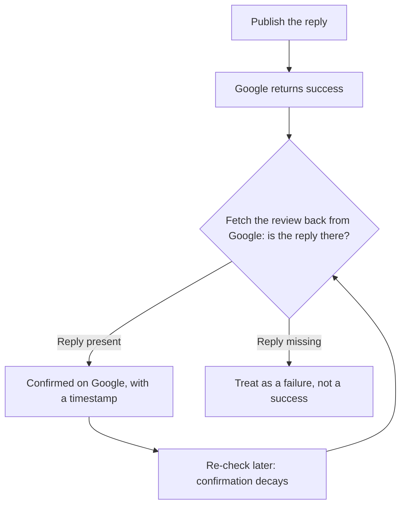

# Answering reviews, and proving the reply published

Getting reviews is half the work. The other half is what you write underneath them — and whether what you wrote is really there.

## Answering: the manual-first default

**The default is that you write the reply.** AI drafting is an opt-in — for two independent reasons.

### The policy reason

Google's *Business Profile APIs policies* (developers.google.com/my-business/content/policies, last updated 2025-08-28) say, under Third-party policy > Reviews:

> "Business owners have the ability to respond to reviews of their business on Google. If you respond to reviews on behalf of your end-client, you must receive their authorization first. All responses to reviews must follow Google's Prohibited and restricted content policies."

And under abusive behaviours:

> "You may not use the Business Profile APIs to engage in abusive behaviors, which includes but isn't limited to fraudulent, abusive, or otherwise invalid activity. For example, you must not automate or trigger review replies, Q&As, listing creations, listing edits, or other actions without the user's prior specific and express consent."

Read the second one slowly; a whole product category sits on top of it. **Automated review replies are prohibited without prior specific and express consent** — not discouraged, named as abusive behaviour.

A tool that watches for new reviews and posts an AI reply without that consent is outside the policy, and the merchant's account carries the risk.

This manual documents auto-reply as a constraint; it does not recommend it. A human approving each reply is fine, which is why every lab below has one. Agencies: the first clause binds you too ([what you inherit with a client](../../04-operating/what-you-inherit-with-a-client/index.md)).

### The quality reason

A reply is not for the reviewer, who has moved on. It is for the next person reading reviews while deciding whether to call you — and that person can tell.

**An unedited AI draft has a texture**: it thanks, it validates, it invites the customer to reach out, and says nothing that could only have been written about this business.

A good reply, in four lines or fewer:

- **Name the specific thing** — "the bathroom fitting on Tuesday" beats "your recent experience".
- **Say what changed**, not an apology loop.
- **Include no personal data**, because this is public.
- **Do not litigate**, because the audience is not the reviewer.

For 1–2 star reviews, resist replying immediately — the composer shows an escalation checklist for exactly this. Draft it, have a second person read it, follow up privately, then fix the process.

## The read-back rule

**A success response on the write is not proof of publication.** Google can accept a reply — cleanly, no error — that never appears on the profile. Two known causes, and both look like success:

1. **The profile is not in good standing** — unverified, suspended, not publishing.
2. **The reply went to the right location under the wrong owning account** — an easy mistake, because Google's two generations of business APIs name locations differently.

The only trustworthy confirmation is a **read-back**: fetch the review again from Google, after the write, and require a reply to actually be there. Not "the write returned success", not "our database says published" — the reply itself, coming back out of Google. Allow one short retry; propagation is usually instant but not always.

And **confirmation decays** — a reply confirmed in March can be gone in July, because replies disappear with the reviews they hang from. It is an observation, not a state. Re-check before you put "we respond to 100% of reviews" in a client report.

In SEOG this is wired in: a publish that cannot be confirmed is reported as a failure and refunded rather than shown as a success. Each reply then carries **Confirmed on Google** with a timestamp, or an unconfirmed warning, plus a **Re-check on Google** button. See [Write limits and failure modes](../../05-reference/write-limits-and-failure-modes.md) for the mechanism.

> **Evaluating someone else's tooling? Ask one question: *how do you know the reply published?*** "The API returned success" is the wrong answer.

---

**Next:** [Working a review queue →](./working-a-review-queue.md)
