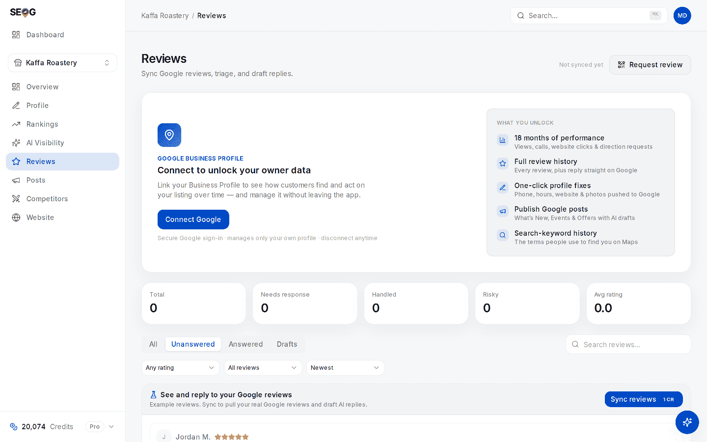

# Reviews: getting them, and answering them

Reviews are the heaviest thing a business owner controls. They feed the map pack, the click-through of a result you already hold, and the reputation signals an AI assistant reaches for.

They also carry the most rules and the most out-of-date advice: in April 2026 Google banned two practices that had been standard agency guidance for a decade. And publishing a reply has a failure mode almost nobody checks for — the write succeeds and the reply never appears.

## Why reviews weigh so much

Google documents almost nothing about local ranking. Reviews get an explicit sentence. From Google Business Profile Help, *Tips to improve your local ranking on Google* (read 2026-07-27):

> "More reviews and positive ratings can help your business's local ranking."

No weight, no threshold, no mechanism. Reviews sit inside **prominence**, the third of the [three forces](../../01-foundations/relevance-distance-prominence/index.md), which orders businesses that already qualify. Distance you cannot change; relevance you fix once and it stays fixed. Reviews are the one lever you keep pulling.

**The second reason is newer.** An assistant answering "who should I call near me" runs no distance sort; it assembles an answer from entity and reputation signals ([how that works](../../01-foundations/how-ai-answers-a-local-question/index.md)).

The AI-readiness rubric used in this manual's labs scores nine factors out of 100 — the full table and its calibration are in [Diagnosing a business in thirty minutes](../analyzing-business-visibility/index.md). Four of the nine are reviews:

| Factor | Weight | Passes at |
| --- | --- | --- |
| Review volume | 22 | 25 or more reviews |
| Average rating | 18 | 4.2 or higher |
| Review recency | 10 | a review within the last 60 days |
| Review engagement | 7 | you have replied to at least half |

Fifty-seven points of a hundred. Volume plus rating alone total exactly 40 — where the rubric flips from "low" to "building".

> **Read that honestly.** Those weights are our model, built from published correlation research — not Google's, not any assistant's. A prioritisation rubric, not a measurement of an engine's internals. [Does the AI recommend this business?](../../03-advanced/ai-visibility/index.md) has the evidence.

Four separate dimensions: a business can be excellent at one and failing the other three.

**Two more calibrations are worth stealing as client targets.** These come from a *different* model, the review sub-score inside the AI-visibility authority pillar, not from the table above: **50 reviews saturates volume**, and a review inside **30 days counts double one at 90 days**.

## What you can actually see

**Without owner access**, the public place data every non-owner tool reads returns **at most five reviews per business**, ranked by relevance rather than by date.

Neither half of that is folklore: Google's Places API reference states that a maximum of five reviews can be returned, and that they are sorted by relevance (read 2026-07-27). That is the ceiling for any tool at any price.

**With owner access** — the Business Profile connection from [Lab 0.4](../../00-start-here/set-up-your-workbench.md) — you get the full history plus Google's authoritative total count and average rating.

*No owner connection, nothing synced: every stat card reads zero, and the cards under the dashed strip are labelled "Example reviews" — placeholders showing the layout, not this business's reviews. The panel on the right is the honest list of what connecting adds, and "Full review history" is the line that changes every number on this page.*

So **competitor review analysis is structurally shallow**: anyone selling "full sentiment analysis of a competitor's reviews" is either scraping, which Google's terms prohibit ([Storing Google data legally](../../05-reference/storing-google-data-legally.md)), or reading five reviews and rounding up ([competitors](../competitors/index.md)).

## Getting reviews without getting your ratings stripped

The rules changed recently, invalidating advice still in wide circulation. This section is our reading of published policy, not legal advice.

### The rules, in Google's words

Google's *Prohibited & restricted content* page, in the Maps user-generated content policy help (`support.google.com/contributionpolicy/answer/7400114`, read 2026-07-27), prohibits, under **Fake engagement** and **Rating manipulation**:

> "Content that has been posted due to an incentive offered by a business - such as payment, discounts, free goods and/or services."

> "Content that is based on a conflict of interest. A conflict of interest may include current or former employment, a contractual or consultory relationship, or other professional or personal affiliations … (such as industry competitors, familial relationships, etc.)."

> "Discourage or prohibit negative reviews, or selectively solicit positive reviews from customers"

> "Merchants should not require or pressure users to leave ratings or write reviews while on the premises, nor should they request that specific content be included."

Added in **April 2026**, alongside Google's own 16 April announcement of a new wave of Maps review protections, and spotted in the policy text on **17 April** by Amy Toman, a Google Diamond Product Expert, and [reported by PPC Land](https://ppc.land/google-tightens-maps-review-policy-staff-names-and-quotas-now-banned/) — two further prohibited practices under Rating manipulation:

> "merchants requesting that staff solicit a certain number of reviews"

> "merchants requesting that staff solicit reviews that include specific content, including content that identifies a staff member"

The permission, from the same document:

> "solicit or encourage the posting of content that does represent a genuine experience, without offering incentives"

### The interpretation

Kept separate from the text:

| Practice | Verdict | Clause |
| --- | --- | --- |
| Ask every customer after the job, same link for all | Allowed | genuine experience, no incentive |
| Ask only the customers you know are happy | Prohibited | selective solicitation |
| A form routing 5-star answers to Google and 1-star answers to a private inbox | Prohibited | selective solicitation — review gating |
| Discount, prize draw or loyalty points for a review | Prohibited | incentive |
| Staff, family or your agency writing reviews | Prohibited | conflict of interest |
| "Each technician brings in five reviews a month" | **Prohibited since April 2026** | staff quota |
| "Ask the customer to mention your name" | **Prohibited since April 2026** | staff name |
| A customer naming the technician unprompted | Allowed | no solicitation occurred |

**The last two rows carry the change.** A review naming the technician is *good* — specific, credible, exactly what the next reader wants. What is prohibited is **asking** for it.

**Enforcement runs on patterns**, because the ask is invisible in the resulting review: a cluster of reviews naming the same three staff members is the signature. In the days after the change, practitioners reported review counts dropping — sometimes by dozens, including short five-star reviews naming an employee *(secondary reporting via PPC Land, not a Google statement)*.

Whether a merchant has any appeal route once reviews come down on these grounds is an **open question**; we have not traced one to a Google source.

> **The compliant ask, in one line.** Give every customer the same link the moment the work is finished, and say nothing about what to write or what rating to leave. In SEOG, **Reviews → Request review** builds Google's own "write a review" link plus a downloadable QR for invoices and receipts. Free, and nothing you could not do by hand from the place ID.

That means asking unhappy customers too — by design. A 4.6 with 200 reviews outsells a 5.0 with 11, and a rating with no negatives reads as filtered.

---

**Next:** [Answering reviews, and proving the reply published →](./answering-reviews.md)
