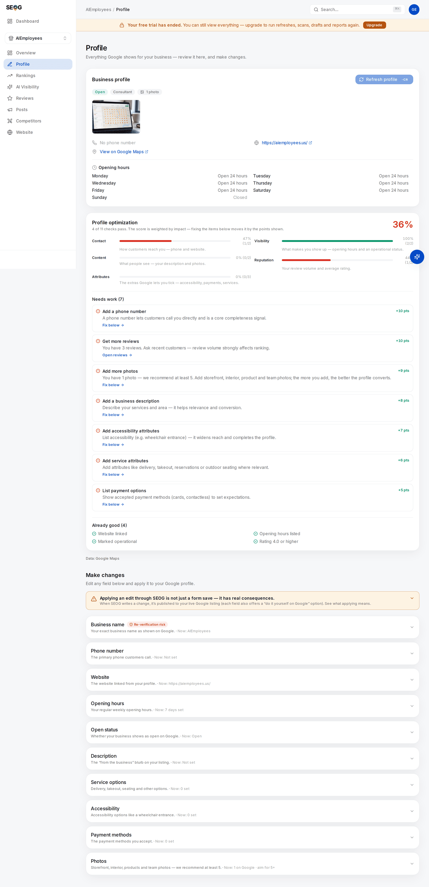

# The profile is the product

Your Google Business Profile is not a marketing page describing the business. It is the record Google ranks, and its fields are the raw material every local ranking decision is made from. Edit a field and you are editing the thing itself, live, in front of customers.

That makes this the highest-leverage chapter in Part II and the one with the sharpest edges. Some fields you can change on a Tuesday afternoon with no consequence beyond a ten-minute wait. Three of them can take your listing off Google for days. Nobody tells you which is which until it happens.

## The fields, in order of leverage

| Field | What it does | How fast it moves |
| --- | --- | --- |
| Primary category | Decides which queries you are a candidate for at all | Immediately, once published |
| Additional categories | Widen candidacy — and dilute the primary signal | Same |
| Name | Identity; also a keyword surface people abuse | Same |
| Services | Fill out relevance under the category | Slow, small |
| Description | Conversion and machine-readability | No direct ranking effect |
| Hours | Eligibility for "open now" filtering | Immediately |
| Attributes | Structured facts: delivery, step-free entrance, card payments | Immediately |
| Photos | Conversion, and a completeness signal | Slow |

### Primary category decides candidacy

Category does most of the work, because it is the only field where you pick from Google's own fixed vocabulary instead of typing prose. It answers "what kind of thing is this" in a form a machine does not have to interpret. [The three forces](../01-foundations/relevance-distance-prominence.md) covers the mechanism; the operational point is that a wrong primary category is not a small loss of relevance, it is exclusion. You are not ranked badly for the query — you are not a candidate for it. Lab 3.3 had you compare yours against the pack's. If that produced a mismatch, fix it before anything else in this chapter.

Additional categories are the tempting part. Each one is another set of queries you become a candidate for, which sounds free. It is not: it dilutes what the profile is *about*, and a category describing something you do not provide is a guidelines violation with a real enforcement path. Add one only where a customer could walk in and buy that thing today.

### The name field, and the keyword temptation

Your name field must be your real-world business name — the one on the signage, the invoices, the door. Adding a keyword to it ("Smith Plumbing | Emergency Plumber Tampere") works, which is exactly why it is one of the most-reported spam patterns in local search and the easiest thing for a competitor to file a redressal about. Both halves are true and beginners collapse them: stuffed names do rank better *(observed constantly, in every market)*, and they are against the guidelines and get reported. [Spam and fake listings](../03-advanced/spam-and-fake-listings.md) covers the reporting machinery from both sides.

### Services: small, real, cheap

Below category the evidence thins out. The best controlled measurement published — Sterling Sky's, cited in [The three forces](../01-foundations/relevance-distance-prominence.md) — put filling in the Services fields at roughly 2–5% of ranking impact. Small, nearly free, twenty minutes: a good use of a Tuesday and a bad thing to build a strategy on. Services are edited in Google's own profile editor; SEOG's editor does not cover them, and this manual is not going to pretend otherwise.

### Description: not a ranking field

The 750-character description does not appear to move rankings *(inference — no controlled test has shown it does, and Google has never claimed it)*. It does two other jobs: it converts, because it is the only place on the listing where you speak in your own voice, and it is machine-readable text about what you do and where, which matters more every quarter as assistants assemble local answers from entity data rather than from a ranked list ([How an AI assistant answers a local question](../01-foundations/how-ai-answers-a-local-question.md)).

A trap most tools do not surface. **The description in a public place record is not the one the owner wrote.** The public data feed carries a summary Google generates itself; the owner's text lives on the owner side of the profile and needs an authenticated connection to read back. *(Verified against Google's public place data and the owner-side profile read, July 2026.)* So you cannot audit a competitor's description from public data, and a tool refreshing from public data alone will show you a description you did not write. SEOG re-reads the owner's real text when the profile is connected — one of the concrete things [connecting Google](../00-start-here/set-up-your-workbench.md) buys.

### Hours are a ranking field in disguise

Hours look like housekeeping. They are a filter: "open now" is one of the most-used refinements in Maps, and a profile with no hours cannot satisfy it. Missing hours also read as an abandoned listing. Holiday hours matter more than regular ones for one week a year, and that week is usually when demand peaks.

### Attributes are a catalog you do not control

Attributes are the tickable facts — wheelchair-accessible entrance, accepts cards, offers delivery. Two things about them are not obvious.

**The available set is decided by your category, not by you.** Google publishes a different attribute catalog for a dental clinic than for a taqueria, and for some categories a whole group is simply empty. If your category offers no accessibility attributes, no amount of effort adds one, and any audit demanding you "add accessibility info" is asking for the impossible. SEOG reads the live catalog for your category and marks the group not applicable when it comes back empty — you will see that in Lab 9.1 if your category is one of them.

*Look at the Attributes on Google row. The owner chose which of those chips to tick; they did not choose which chips exist. Every one comes from Google's catalog for Coffee Shop, and a dental clinic's card has a different set.*

**Removing an attribute is a different operation from leaving it out.** The underlying write distinguishes "this is false" from "no value set", and clearing one requires naming it explicitly. In practice: untick and re-apply, rather than applying a shorter list and assuming the rest vanished. The mechanism is in [Write limits and failure modes](../05-reference/write-limits-and-failure-modes.md).

## The sensitivity taxonomy

This is the part nobody publishes, and it is the difference between a routine edit and a week you will remember.

Profile edits fall into two classes with completely different risk profiles.

| Class | Fields | What happens when you save |
| --- | --- | --- |
| **Ordinary** | Phone, website, hours, open status, description, attributes, photos | Passes through Google's review and usually publishes in about ten minutes. Occasionally longer. Can be rejected. |
| **Critical** | Name, primary category, address | May force **re-verification**. The listing can go pending or be temporarily unpublished for hours to days, drop out of Search and Maps entirely while it is pending, and in rare cases trigger a suspension needing manual reinstatement. |

*(The two-class split is our operating model, not a Google document. Google's help pages confirm that some changes can require re-verification without enumerating them; name, category and address are the three the industry consistently reports, and the three SEOG's own editor gates behind an acknowledgement. Well-evidenced, not official. Last reviewed 2026-07-27.)*

Three rules follow.

**Never make a critical edit on a Friday, or in your busiest week.** If it goes to re-verification you are invisible until it resolves, and Google's timeline is not yours.

**Never batch a critical edit with anything else.** If the listing goes pending after you changed name, category and hours together, you cannot tell which one did it and you cannot cleanly revert.

**A rejected edit is silent.** Google does not email you to say no; the old value simply stays. That is why the verification step in every lab below is "re-read the field from Google", not "the tool said Applied".

## The write budget nobody budgets for

Google caps profile edits at **ten per minute, per profile**. The number is fixed — not a quota you can raise by asking, and not per tool or per API key.

The part that catches people: it is one shared allowance across *every* kind of write. Description patches, hours changes, attribute updates, photo uploads and Google Posts all drain the same ten. A bulk holiday-hours update can therefore starve a scheduled post run in the same minute, from a completely different tool, and the failure looks like an unrelated bug.

Manage one business and you will never notice. Run a multi-location account and script anything, and this is the ceiling you hit first — the reason bulk profile work is paced rather than parallelised. [Multi-location and franchise work](../03-advanced/multi-location-and-franchise.md) plans around it; [Write limits and failure modes](../05-reference/write-limits-and-failure-modes.md) is the reference entry.

## A procedure for changing one field

Every safe profile edit is the same five steps.

1. **Write down the current value.** Verbatim, in a file, before you touch anything. Your undo of last resort, and it costs nothing.
2. **Change one field.** One. Then stop.
3. **Wait out the review window.** About ten minutes for an ordinary edit; longer for anything critical, and check whether the listing went pending.
4. **Re-read the field from Google**, not from your tool's cached copy.
5. **If it reverted, it was rejected.** That is information: the value conflicted with something Google believes about you. Do not re-apply it harder.

The labs below run that loop three times.

## Labs

### Lab 9.1 — Read what Google will and will not let you change

> **Lab** · Where: **Profile** (`/b/{businessId}/profile`) · Cost: **paid** · Time: ~15 min
>
> You need: Lab 0.3 (a business added) and Lab 0.4 (its Google Business Profile connected — the editing half of the page is gated on it).

1. Open **Profile**. Read the **Business profile** card and the **Profile optimization** card under it. Note the score and the **Needs work** list — each row carries the points it is worth, so the list is already sorted by leverage.
2. Scroll to **Make changes** and expand the yellow banner beginning "Applying an edit through SEOG is not just a form save". Read all five consequences.
3. Count the editable fields: business name, phone, website, opening hours, open status, description, service options, accessibility, payment methods, photos. Note what is *not* there — category, address and services. Those are edited in Google's own profile editor, and the manual is not going to pretend a button exists.
4. Expand **Business name**. Note the **Re-verification risk** badge, the red panel and the checkbox you must tick before the editor appears. Do not tick it. Then expand **Phone number** and compare: one line of warning, no gate. That is the sensitivity taxonomy, in the interface.
5. Expand **Service options** and press **Choose options** — this fetches the live attribute catalog Google publishes *for your category*. Do the same for **Accessibility** and **Payment methods**.

*The whole lab on one page, on a profile scoring 36%. Two things to notice: each Needs work row carries the points it is worth, so the list is already sorted by leverage; and in Make changes, Business name is the only field wearing a Re-verification risk badge while Phone number wears none. Category, address and services are not in the list at all.*

**What good looks like.** Three checklists whose contents differ and which you did not choose — Google's category catalog, not a SEOG list. Write down how many options each group offers.

**If it went wrong.** "Google offers no options of this kind for your business category" is a real answer, not a failure: the check is marked not applicable and stops counting against your score. If **Make changes** shows a connect card instead of fields, the profile is not connected as owner — do Lab 0.4 first.

**Observe-only path.** No owner access? Read the attribute chips on the listing in Google Maps, then read a business in a *different* category. The catalogs differ. Same finding, no connection.

**What you just learned.** What you are allowed to say about a business is decided by its category. Category is not one field among many; it determines which other fields exist.

---

### Lab 9.2 — Write a description and verify it published

> **Lab** · Where: **Profile → Description** (`/b/{businessId}/profile`) · Cost: **paid** · Time: ~20 min, plus a ten-minute wait
>
> You need: Lab 9.1.

1. Expand **Description** and copy whatever is under **Currently on Google** into a scratch file. If it says "Not set", write that down — it is still your baseline.
2. Choose a path: **Write it myself** opens the editor free; **Write it for me** drafts one with a model first, which is paid. Either way you edit the text yourself before it goes anywhere.
3. Write until you have plain sentences naming what you do, where, and for whom. Watch the counter — 750 characters is Google's cap. Do not stuff keywords: this field converts humans and feeds assistants, and neither rewards a list.
4. Apply it. **Apply for me** writes it to the live profile. Or press **Copy**, open your Business Profile on Google and paste it into About yourself — same result, no charge, three more minutes.
5. Go to **Overview**. A notice should read *N profile edits applied since your last refresh*.
6. Wait ten minutes, then press **Refresh business info** on that notice — a paid re-pull from Google — and return to **Profile**.
7. Read **Currently on Google** again: your text, or the old value.

**What good looks like.** Your text read back from Google after a refresh, and the pending-edits notice gone. That round trip — write, wait, re-read from the source — is the only proof an edit published.

**If it went wrong.** If the old value came back, Google rejected the edit; the usual causes are promotional language, a phone number or URL in the text, or claims Google cannot square with the rest of the profile. Rewrite plainly rather than resubmitting. If the field is blank after a refresh on an *unconnected* profile, you are reading the public feed, which does not carry the owner's description at all.

**What you just learned.** "Applied" means accepted for review, not published. Skipping the verification step is how fixes get reported to clients that never went live.

---

### Lab 9.3 — Practise the undo before you need it

> **Lab** · Where: **Profile** (`/b/{businessId}/profile`) · Cost: **paid** · Time: ~10 min
>
> You need: Lab 9.2.

1. Pick the **Website** field — ordinary, publicly visible, trivially reversible. Copy the current URL into your scratch file.
2. Expand it, stay on the **Apply with SEOG** tab, change the URL to another page on the same site (services, contact), and press **Save to Google**.
3. The panel turns green: *Applied — Google usually reviews edits for ~10 minutes before they show publicly*, with an **Undo** button beside it.
4. Press **Undo**. It replays the write with the previous value, so it is a real edit against Google and is priced like one.
5. Reload and read **Currently on Google**. Then wait ten minutes, run **Refresh business info** from the overview, and read it once more.

**What good looks like.** The original URL is back, confirmed by a refresh rather than by the local copy. You have done a full write–revert cycle on a live listing and know where the button is.

**If it went wrong.** Two real traps. **Undo is a write, not a rollback** — it spends your ten-per-minute budget and goes through the same review, so an undo can itself sit pending. And the undo baseline is only as good as what was recorded: undoing your *first* **Opening hours** edit clears the hours rather than restoring the previous ones, because the earlier value cannot be reconstructed from the public copy. Record hours by hand before you touch them. That is a genuine limitation of the tool, not a step you missed.

**A gap worth naming.** The description has no one-click undo in the editor. You revert it by re-applying the text you saved in Lab 9.2 step 1 — the entire reason step 1 exists.

**What you just learned.** Undo in local SEO is not `Ctrl+Z`. It is another edit, with the same review, budget and delay. The reliable undo is the value you wrote down before you started.

---

> **Without SEOG.** Every edit here is available in Google's own profile editor at business.google.com, and for a single location that is a perfectly reasonable way to work — each field card carries a **Do it myself on Google** tab with the exact click path. What you lose is the record: no log of what changed and when, no undo baseline, no way to answer "what did we change in March" three months later. [Doing it without SEOG](../99-appendix/doing-it-without-seog.md) has the full comparison.

## Common mistakes

**Editing the category to "test" it.** Category is a critical field, and the test can cost days of visibility. Read the pack's categories first (Lab 3.3) — free, and it answers the same question.

**Batching a profile overhaul into one session.** Ten fields changed in an afternoon, then the listing goes pending: nothing is attributable and nothing is cleanly revertible. Sequence ordinary edits first, verify them, then do critical ones one at a time — [The first ninety days](../04-operating/the-ninety-day-plan.md) lays out the order.

**Trusting "Applied" as "published".** The tool is reporting that the write was accepted. Google reviews it afterwards, silently, and a rejection just leaves the old value in place.

**Auditing a competitor's description from a tool.** What you are reading is Google's own generated summary, not their copy. Open the listing in Maps and read "From the business" if you want the real thing.

## Check yourself

Answer these against your own business, in writing.

1. **Which of your profile fields could take your listing off Google if you edited it today?** (Name, primary category, address. Everything else in the editor is an ordinary edit that publishes in roughly ten minutes.)
2. **Your attribute picker shows nothing under Accessibility. What does that mean, and what should you do?** (Your category's catalog offers no attributes in that group. Nothing — the check is not applicable and should stop counting against your score. Any audit demanding you add one is wrong.)
3. **You applied a new phone number an hour ago and it still shows the old one. Which two explanations, and how do you separate them?** (Still in review, or rejected. Re-pull from Google: if the old value persists well past the review window, it was rejected.)
4. **Why can a bulk hours update break a scheduled post?** (Both spend the same ten-writes-per-minute per-profile budget. Hours across a week plus a post in the same minute can exceed it, and the post is what fails.)
5. **You want a competitor's own description. Where do you look, and where do you not?** (Their listing in Maps, "From the business". Not a tool's description field — that carries Google's generated summary, not the owner's text.)

---

**Next:** [Photos, and what you cannot do with them →](./photos-and-the-visual-profile.md)
