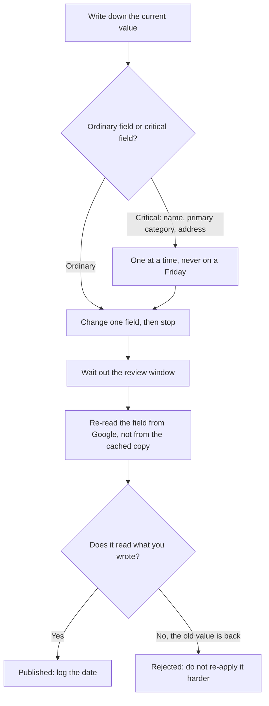

# Which edits are safe, and how to make one

Knowing what each field does is half the job. The other half is knowing what happens the moment you save one — which fields pass quietly through review, which can take the listing off Google, and how much writing Google will accept at all.

## The sensitivity taxonomy

This is the part nobody publishes, and it is the difference between a routine edit and a week you will remember.

Profile edits fall into two classes with completely different risk profiles.

| Class | Fields | What happens when you save |
| --- | --- | --- |
| **Ordinary** | Phone, website, hours, open status, description, attributes, photos | Passes through Google's review. Google's own wording: edits "usually take up to 10 minutes to review, but sometimes it can take up to 30 days". Can be rejected. |
| **Critical** | Name, primary category, address | May force **re-verification**. The listing can go pending or be temporarily unpublished for hours to days, drop out of Search and Maps entirely while it is pending, and in rare cases trigger a suspension needing manual reinstatement. |

*(The two-class split is our operating model, not a Google document. The review window in the top row is quoted from Google Business Profile Help, "Understand what happens to your Business Profile edits".)*

*(The re-verification behaviour in the bottom row is not from Google: its help pages tie full editing to a verified profile without enumerating which later edits re-trigger verification, so **treat the specific list — name, primary category, address — as an open question.** It is what the industry consistently reports and what SEOG's own risk badge encodes. Well-evidenced, not official. Last reviewed 2026-07-27.)*

*(Of the three, the one you can actually edit inside SEOG — the business name — is gated behind an explicit acknowledgement. Category and address are not editable in SEOG at all.)*

Three rules follow.

**Never make a critical edit on a Friday, or in your busiest week.** If it goes to re-verification you are invisible until it resolves, and Google's timeline is not yours.

**Never batch a critical edit with anything else.** If the listing goes pending after you changed name, category and hours together, you cannot tell which one did it and you cannot cleanly revert.

**A rejected edit can be silent.** Google's documented position is that it "might not approve changes if it can't confirm its accuracy" and that you "might be able to appeal rejected business information edits" — so a rejection path exists, but Google does not commit to notifying you.

In practice the first evidence is usually that the old value simply stayed. Assume no notification. That is why the verification step in every lab below is "re-read the field from Google", not "the tool said Applied".

## The write budget nobody budgets for

Google publishes exactly one number here, and it is worth memorising:

> **edits, 10 per minute per Business Profile — cannot be increased.**

That is verbatim from Google's own quota page for the Business Profile APIs, so it is fixed, it is per *profile* rather than per tool or per API key, and asking nicely does not move it. *(Google Business Profile APIs, quotas and limits; checked 2026-07-27.)*

**What Google does not say is how wide that allowance is.** The quota is listed against the API that writes profile *information* — descriptions, hours, contact details, attributes. Whether photo uploads and Google Posts, which go through different APIs, also drain the same ten is **an open question**: Google's quota page does not address it, and we have found no primary source that does.

SEOG treats them as one shared budget, deliberately, because the conservative reading is the only one that cannot cost a customer a failed write. Plan the same way and you are never wrong; assume they are separate and you may be.

The consequence, if the shared reading is right: a bulk holiday-hours update can starve a scheduled post run in the same minute, from a completely different tool, and the failure looks like an unrelated bug.

**Manage one business and you will never notice either way.** Run a multi-location account and script anything, and this is the ceiling you hit first — the reason bulk profile work is paced rather than parallelised.

[Multi-location and franchise work](../../03-advanced/multi-location-and-franchise/index.md) plans around it; [Write limits and failure modes](../../05-reference/write-limits-and-failure-modes.md) is the reference entry, and the place to check whether the open question above has since been closed.

## A procedure for changing one field

Every safe profile edit is the same five steps.

1. **Write down the current value.** Verbatim, in a file, before you touch anything. Your undo of last resort, and it costs nothing.
2. **Change one field.** One. Then stop.
3. **Wait out the review window.** Usually about ten minutes for an ordinary edit — but Google's own ceiling is 30 days, so a value that has not appeared by lunchtime is not yet evidence of rejection. Longer for anything critical, and check whether the listing went pending.
4. **Re-read the field from Google**, not from your tool's cached copy.
5. **If it reverted, it was rejected.** That is information: the value conflicted with something Google believes about you. Do not re-apply it harder.

The labs below run that loop three times.

---

**Next:** [Profile editing labs and common mistakes →](./labs-and-common-mistakes.md)
