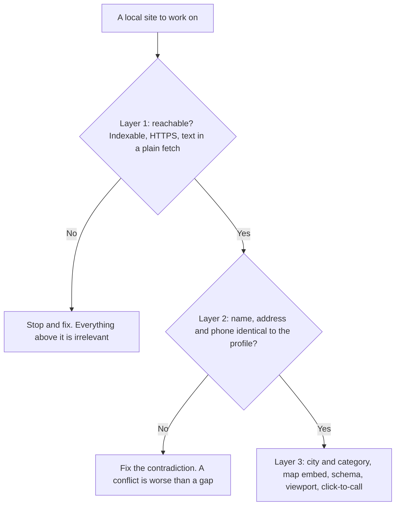

# The website half — pages, schema and Search Console

The map pack ranks a *profile*, not a page. That is true, it is the single most useful thing a classic SEO can learn about local, and within about a week it gets over-applied into "so the website doesn't matter".

**The website matters.** It just does a different job than you are used to: it is the corroborating document — the business-controlled page that agrees with the profile, carries the words customers type, and gets cited by machines that answer questions without showing a map at all.

This chapter is about doing that job deliberately, and about reading Search Console in a way that will not embarrass you in front of a client.

## The four jobs a local website does

**1. It corroborates the entity.** Google is deciding whether the thing at that address, with that phone number, under that name, is one real business ([the business entity](../../01-foundations/the-business-entity/index.md)). Your site is the highest-trust source of that agreement. A footer that disagrees with the profile is not neutral — it is evidence against you.

**2. It carries relevance evidence.** Distance you cannot change and prominence moves slowly, but relevance is largely words ([the three forces](../../01-foundations/relevance-distance-prominence/index.md)). Saying what you do and where you do it, in the title and the first heading, is the cheapest relevance work available.

**3. It is the other half of the results page.** Below the three-pack sit ordinary web results, localised. Those are pages, ranked as pages; a business that wins the pack with nothing underneath it occupies one slot on a page that offers ten.

**4. It is the document AI engines cite.** When an assistant answers "best dentist in Leeds", it reads pages, and yours is the only one where you write the sentences ([how an AI assistant answers a local question](../../01-foundations/how-ai-answers-a-local-question/index.md)). In the readiness rubric from that chapter, 20 of the 100 points are website points — 12 for having one on the profile, 8 for being readable by an agent, which is [the next chapter](../making-the-site-readable-by-agents/index.md).

What it does not do: **it does not move you closer**. No on-page work changes proximity, so a site fix shows up as a change in the *shape* of a grid rather than a jump at every pin. Set that expectation before you start.

## Three layers, in order of how badly failure hurts

Local on-page work is usually taught as a checklist of equals. It is not — the failures are not the same size.

**Layer 1 — reachability.** A `noindex` directive, a plain-HTTP site, a page that times out, a homepage that is a JavaScript shell serving no text to a plain fetch. If this layer fails, everything above it is irrelevant. Rare, catastrophic, and the first thing to check on a site you inherit.

**Layer 2 — agreement.** Does the site repeat the profile's name, address and phone *identically*? A wrong phone number is worse than no phone number: absence is a gap, contradiction is a conflict. ([Citations and NAP](../citations-and-nap/index.md) does the off-site half.)

**Layer 3 — local relevance and legibility.** City and category in the title and H1. A tappable phone link. An embedded map on the contact page. LocalBusiness structured data. A viewport tag. The ordinary wins, worth doing once the layers below hold.

Here is the weighting one audit uses, published so you can reproduce it by hand or argue with it. It reads the homepage the profile points to, after redirects.

| Check | Weight | Layer |
| --- | --- | --- |
| LocalBusiness structured data | 16 | 3 |
| Google map integrated | 12 | 3 |
| Phone matches profile | 10 | 2 |
| Address on the site | 10 | 2 |
| City + category in title/headline | 10 | 3 |
| Served over HTTPS | 8 | 1 |
| Page is indexable | 7 | 1 |
| Business name matches | 6 | 2 |
| Mobile viewport | 6 | 3 |
| Click-to-call link | 5 | 3 |
| Language declared / favicon / social share tags | 2 each | 3 |

Two structural points.

**A service-area business is scored on fewer checks.** One that hides its address on Google is not scored on the address check or the map embed at all; they are dropped, not failed, because demanding a pin for a location the business deliberately does not publish would be wrong ([service-area businesses](../../03-advanced/service-area-businesses/index.md)).

**The table is *one page*.** Location pages are not audited individually, which is why the next section matters.

## Location pages

With more than one location, the correct structure is one page per location, and each location's Google profile points its website field at *its own page* — not at the shared homepage. Most implementations get this wrong in the same two ways.

**Pointing every profile at the homepage.** Then every location corroborates one document naming one address, and the corroboration is worth roughly nothing for the others. Fix it on each profile's website field.

**Doorway pages.** Somebody notices that "plumber in Croydon" is a query, generates forty city pages by find-and-replace, and ships them.

Google's spam policies name this directly, under the heading *doorway abuse*: "Doorway abuse is when sites or pages are created to rank for specific, similar search queries. They lead users to intermediate pages that are not as useful as the final destination." One of its own examples is "multiple domains or pages targeted at specific regions or cities that funnel users to one page". (Google Search Essentials, spam policies; checked 2026-07.)

> **The line is not whether the page carries a city name. It is whether the page describes something that exists.**

A real address, real staff, real service details, real photos, real hours. *(Inference: local practitioners report this as one of the patterns that most often draws manual action. Google publishes no enforcement rates, so treat the frequency as anecdote and the policy as fact.)* [Multi-location and franchise](../../03-advanced/multi-location-and-franchise/index.md) does the structure at scale.

A location page that earns its place carries:

- The NAP block matching the profile exactly.
- An embedded map centred on that location.
- The hours.
- The services offered *at that site*.
- Text a human working there could have written.

A service-area business substitutes its served areas for the address.

---

**Next:** [Schema, honest scores and Search Console →](./schema-scores-and-search-console.md)
