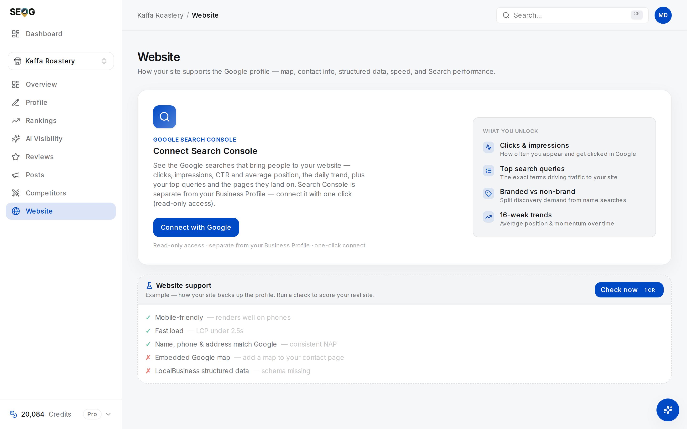

# Labs: audit the site, ship schema, reconcile Search Console

Three labs, in the order the layers run: audit the site, ship the markup, then reconcile the numbers.

## Labs

> **Note** · All three work by hand too — view-source plus Google's Rich Results Test, and Search Console itself. [Doing it without SEOG](../../99-appendix/doing-it-without-seog.md) is the long form.

### Lab 13.1 — Run the site audit and work the failing checks

> **Lab** · Where: **Website** (`/b/{businessId}/website`) · Cost: **paid** · Time: ~15 min
>
> You need: a business added (Lab 0.3) with a website on its profile. This audit needs **no** Google Business Profile connection — it runs on the public site plus the profile facts already stored, so it works on a business you do not own.

*This is the screen before you press anything. The five ticked and crossed rows under **Website support** are the card's own **Example** — its subtitle says so — and they are placeholders, not a measurement of this site. Note the price on the **Check now** button: you see it before you spend it.*

1. Open **Website**. Before any analysis you see an **Example** card with five sample rows — an illustration, not your site.
2. There are two **Check now** buttons and they are not the same action. The one in the page header refreshes everything, including Search Console; the one inside the **Website support** card runs the site audit alone.

   Use the card's, and read the price on it before pressing. Search Console gets its own lab further down. If you already ran this audit in [Lab 12.2](../citations-and-nap/index.md), its result is stored — read the checklist for free and press **Check now** only when you want a fresh run.
3. Wait, and expect it to feel slow — a manual check forces a fresh Lighthouse run rather than re-serving a cached one, and those take tens of seconds. The checklist and the **Site health** panel arrive together when it finishes.
4. Read the **Website support** ring and its tier — **Weak**, **Fair** or **Strong**. Hover the ring: it gives points earned out of points *verifiable*.
5. Count three numbers: green rows, red rows, and rows saying **Could not verify**. That third one is what people skip.
6. Work the red rows top-down — they are ordered by weight. Where a row offers a **Ready to paste** block, copy it.

**What good looks like.** A score with a tier, a list in which every failing row names a fix, and a clear answer to what the score is *out of*.

**If it went wrong.**
- *"The site blocked our check (bot protection)"* — a firewall refused an automated fetch. Google's crawlers are usually allow-listed; third-party checkers are not.
- *"The site took longer than 10 seconds to respond"* — a finding, not a tool error.
- *A banner saying the site renders with JavaScript* — expect several **Could not verify** rows, and check those by hand in the browser.
- *No website on the profile* — fix that first.

**What you just learned.** A local site audit is a *comparison between two documents* — the site and the profile — not a generic SEO score. That is why its fixes are specific to your business, and why the NAP rows come first.

### Lab 13.2 — Ship the LocalBusiness schema

> **Lab** · Where: **Website** (`/b/{businessId}/website`) plus your site's editor · Cost: **paid** (the re-run) · Time: ~20 min
>
> You need: Lab 13.1, and edit access to the website. No site access? Do the observe-only version at the end.

1. In the check list, find **LocalBusiness structured data**. If it fails, it offers a **Ready to paste** block already filled in with your business's real name, address, phone and coordinates.
2. Copy it. Paste it into the homepage `<head>` — or anywhere in the HTML; JSON-LD is position-independent. Publish.
3. Re-run the audit from the **Website support** card. The row should now pass or go partial, and report how many of the eight key fields it found.
4. Add the missing fields by hand. `openingHoursSpecification` and `image` are the two most commonly absent. Re-run and confirm the count moved.

**What good looks like.** The row reports 6/8 or better, and you can name the fields you are still missing and why.

**If it went wrong.** If the row still fails after a correct paste: the snippet landed on a page other than the one the profile links to; the JSON has a trailing comma and does not parse (malformed blocks are skipped silently, by us and by Google); or the CMS escaped it into visible text. View source and look.

**Observe-only version.** Run the generated snippet through Google's public Rich Results Test, then view-source on two competitors from your map pack and compare their markup against the eight fields. Most local sites have none, and the ones with complete markup are usually winning at everything else — precisely the correlation problem above.

**What you just learned.** Structured data is a disambiguation device you can ship in ten minutes, and its value is proportional to how completely you fill it in.

### Lab 13.3 — Connect Search Console and reconcile the totals

> **Lab** · Where: **Website** (`/b/{businessId}/website`) · Cost: **paid** · Time: ~15 min
>
> You need: verified Search Console access to the site, with the same Google account you will connect. Observe-only readers: use any site you do control — a personal blog is fine — and do steps 5–6 inside Search Console itself, free.

1. At the top of **Website**, press **Connect with Google** on the **Connect Search Console** card. Access is read-only, and it is a separate connection from the Business Profile.
2. On return, the tool matches your site to one of your properties automatically, preferring the domain property.
3. If you get *"none of your Search Console properties match this website"*, it is nearly always one of three: a URL-prefix variant that does not match the profile's website URL, an unverified property, or the wrong Google account.
4. Once matched, the connect card disappears and a **Search performance** card takes its place. Press its **Check now** and read the four tiles — clicks, impressions, CTR, average position — over the last 16 weeks.
5. Open Search Console itself, set the same 16-week range, and compare all four numbers.
6. Switch between the **Queries** and **Pages** tabs. Count how many top queries carry the **brand** tag, and write down the branded-to-unbranded click ratio.

**What good looks like.** The four totals agree with Search Console's own, and you can state your branded share. That share is a diagnosis: mostly branded traffic means people who already know you are finding you, and the discovery half of the market is not yours.

**If it went wrong.**
- *The totals are close but one side is consistently lower* — check the date range, then reread the reconciliation section above. Fresh versus final is the usual answer.
- *No queries returned* — most often genuinely low traffic, sometimes the wrong property.
- *Average position looks nothing like your tracked rank* — correct. They measure different things.

**What you just learned.** Search Console is the demand source, not a rank tracker, and reconciling it against Google's own interface is a five-minute habit that protects every report you send. Edit your keyword list against this data rather than a guess.

## Common mistakes

**Generating city pages.** Fast, looks like progress, and among the most reliably penalised patterns in local SEO. If the page does not describe something that exists, it should not exist.

**Quoting Search Console's average position as your rank.** It mixes surfaces, devices and locations, putting a defensible-looking number next to an indefensible claim. In a client report, this is the kind of error that gets found.

**Reading a site score without asking what it is out of.** A 62 that counted unverifiable checks as failures and a 62 that excluded them describe different sites. Always ask for the denominator — including from tools you like.

## Check yourself

Answer these against your own site, not from memory.

1. **Does the phone number on your site match the profile digit for digit?** If the site shows a call-tracking number and the profile the real one, is that worth fixing?
2. **What is your website support score out of?** Not the percentage: the number of verifiable points. If you cannot answer, you do not know what the audit could and could not see.
3. **Your client's Search Console shows 1,240 clicks; your report says 1,190.** Name the most likely cause before you accuse anyone of anything.
4. **Your business has three locations.** Read the website field on all three profiles. Do they point at three different pages? What would you change first?
5. **A tool reports your INP as 210 ms and your site gets about forty visitors a week.** What do you conclude about the tool?

---

**Next:** [Making the site readable by an AI agent →](../making-the-site-readable-by-agents/index.md)
