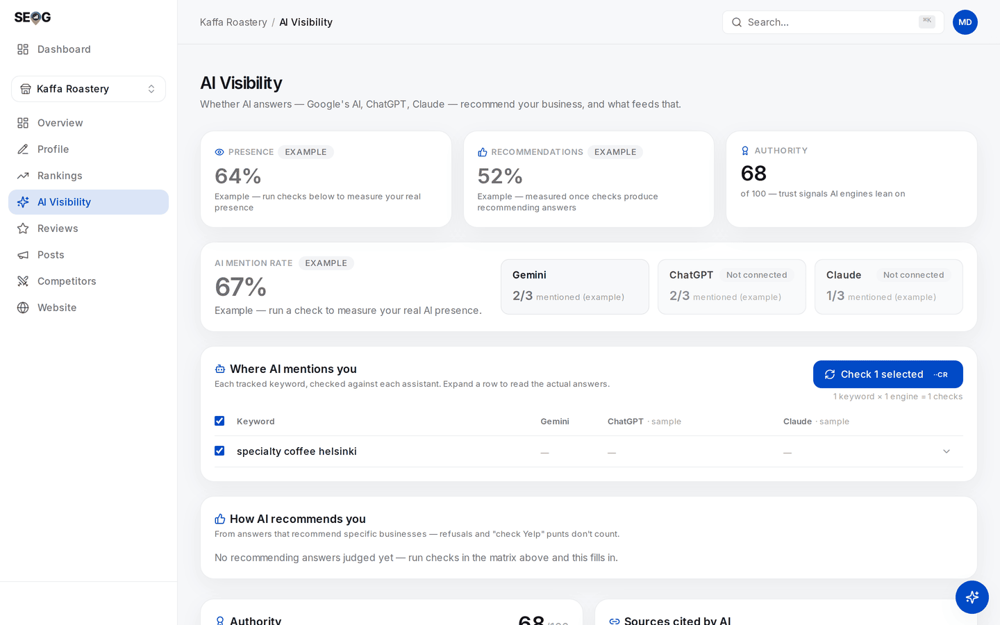

# Labs: running a uniform matrix

The method becomes real in three labs, run in order: design the probe set, run every cell the same number of times, then read the rates without over-reading them.

## Labs

### Lab 20.1 — Design the probe set and anchor it

> **Lab** · Where: **Rankings** (`/b/{businessId}/rankings`) · Cost: **paid** · Time: ~15 min
>
> You need: a tracked keyword set (Lab 8.2), and ideally [Lab 5.3](../../01-foundations/how-ai-answers-a-local-question/index.md) done by hand.

1. On paper, write the probe set: three to six unbranded questions, spanning at least one transactional term and one conversational phrasing.
2. Check them against your tracked keywords — anything active is already a probe row, since the AI check runs on active tracked keywords. Add what is missing with **Track**; the price is on the button.
3. Now the anchor. Add one of those questions a *second* time with a different **Search from** value — a neighbourhood or nearby town, not your own address. It saves as a separate row because the location is part of its identity.
4. Before running anything, write down what you expect the twin to do differently. A prediction you record is a test; one made afterwards is a story.

**What good looks like.** A written probe set, every row unbranded, one question present twice with two anchors, and a stated cell count: probes × connected engines.

**If it went wrong.** The twin will not save — same keyword, same location label and same language is the same row, so it needs a different **Search from** value. At your keyword quota: prune first, because a probe set you cannot afford to run five times is not a probe set.

**What you just learned.** The probe set is a design artefact, fixed before measurement rather than discovered during it. Changing the questions mid-series destroys comparability exactly as changing the instrument would.

### Lab 20.2 — Run a uniform matrix

> **Lab** · Where: **AI Visibility** (`/b/{businessId}/ai-visibility`) · Cost: **paid** · Time: ~20 min
>
> You need: Lab 20.1. Note which engines show **Not connected** — those produce clearly-labelled sample rows, and samples never count toward any rate.

*What the page shows when no keyword is tracked yet. The three engine tiles sit in the **AI mention rate** band; two of them read **Not connected** — unmeasured columns, not zeros — and the fractions beside them are labelled *(example)*. Below the band, the card reads **See if AI recommends you**: its rows are engines rather than your probes, and it says **Example** on its own subtitle. It is a fixture — the real **Where AI mentions you** matrix from step 1 replaces it the moment one keyword is tracked.*

1. Scroll to **Where AI mentions you**. Every tracked keyword is a row, every engine a column.
2. Select your Lab 20.1 probes with the row checkboxes. The bar reads `N keywords × M engines = K checks` — your cell count for one pass — and the projected price is on the button.
3. Press **Check N selected** and wait for the batch counter. Do not leave the page: the batch stops when you navigate away.
4. Repeat, same selection, nothing else changed — four more times, so every cell has five runs. Space them out if you like, but record the date of each pass; the window counts runs, not days.

**What good looks like.** Five passes, an identical selection each time, and a note of the dates. The uniformity is what makes consistency interpretable.

**If it went wrong.** A cell shows **Sample**: that engine is not connected, its rows are fixture data excluded from every rate, and the column is unmeasured rather than zero. A pass returns fewer results than expected: checks can fail without stopping the batch, so re-run rather than scoring a miss.

**What you just learned.** The expensive part of this method is the repetition, and it is not optional. Budget for `n`, or do not claim a rate.

### Lab 20.3 — Read the rates, then put an error bar on them

> **Lab** · Where: **AI Visibility** (`/b/{businessId}/ai-visibility`) · Cost: **free** · Time: ~20 min
>
> You need: Lab 20.2 complete, with the same number of runs in every cell.

1. Read the **Presence** tile: the mention rate, and beneath it "mentioned in X of Y recent live answers" — your denominator. Write both down.
2. Open **Sources cited by AI** and find your own domain, pinned at the top with a **You** badge and a count of answers citing it. That count over the same Y is your citation rate — two numbers the screen never puts side by side.
3. Read **How AI recommends you**: **Included**, **Top pick**, **Avg position**, **Framing**. Write down how many *recommending answers* the denominator holds — smaller than your check count, and the difference is refusals and unparseable answers.
4. Write every cell as a fraction — `3/5`, not `60%` — with its worst-case error bar. Take the two cells with the largest apparent gap and ask whether their intervals overlap; if they do, strike the comparison out before someone else does.
5. Tally consistency yourself: how many cells had all five runs agree. It is on no screen, and it tells you whether the rest is signal.
6. Expand one row and read the actual answer on each engine. Check by eye: is the name match real, is the assigned stance the one you would assign, and is your domain genuinely in the source list or is it a directory page carrying your name.
7. Write the finding in three sentences carrying their denominators: *"Across N probes on three engines, five runs each, between DATE and DATE: mentioned in X of Y answers; own domain cited in Z. Absent on every engine for QUERY."*

**What good looks like.** A finding sentence carrying its own denominators and dates, and at least one comparison struck out for overlapping intervals. Striking one out is the exercise succeeding.

**If it went wrong.** The recommendations card says nothing has been judged: every answer refused or named no specific business — itself a strong finding, so record it. The tiles show an **Example** pill: no live checks have landed, and none of those numbers are about your business.

**What you just learned.** The discipline is not producing the rate, it is refusing to over-read it. "This movement is inside the error bar", said in front of a client, is the most credibility-building sentence available in this field.

## Common mistakes

**Reporting a percentage on five runs.** "60% AI visibility" reads as precision and is a 3/5 with a 65-point interval. Report fractions — they carry their own sample size. Same for averaging engines: 4/5 on one and 1/5 on another is two findings, not a mean.

**Running more checks on the probes you are winning.** Entirely natural, and it corrupts both the overall rate and the consistency tally. Uniform `n` across cells, including the humiliating ones.

**Treating a refusal as a loss.** An answer naming no businesses did not reject you, it left the question: in the mention-rate denominator, out of the recommendation denominator. Collapsing that is how "the AI never recommends us" gets said about an engine that recommends nobody.

**Re-measuring immediately after a change.** The index has not caught up and the window still holds pre-change runs. Change, wait, then run a full uniform pass.

## Check yourself

1. **Your mention rate is 12/24 and your own domain is cited in 2 of those 24. Say what is happening, and where the work goes.** (The engines are learning about you from other people's pages. Work the sources they cite, not your blog.)
2. **A cell moved from 1/5 to 3/5 after a month of review work. What are you entitled to say?** Name the interval, name the confounds, and say what would make the claim defensible.
3. **You tally consistency at 55%. What must you know about your run counts before that means anything?**
4. **You are absent on every engine for one probe and present on all three for another. Which finding is about the engines, and which about the business?**
5. **A client wants one number for AI visibility. Give them one — then name the three things that must travel with it, or it is not a measurement.** (Denominator, date range, engine split.)

---

**Next:** [Changing the AI answer →](../changing-the-ai-answer/index.md)
