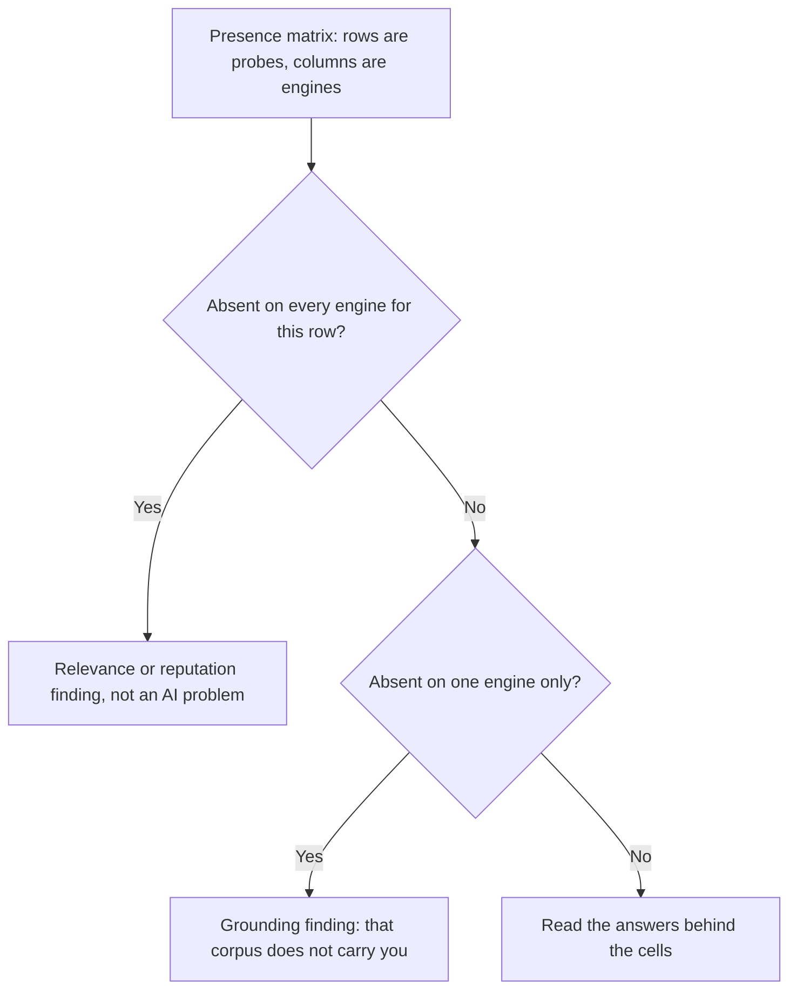

# Reading the presence matrix

The rates and the error bars from the first half of this chapter arrive on one screen as a presence matrix. This half reads it, calibrates the judgements behind it, and says what it still cannot prove.

## The presence matrix

A presence matrix is the method on one screen: **rows are probes, columns are engines, cells are rates over runs**. Read it in three passes, in this order.

**Rows first.** A probe where you are absent on every engine is not an AI problem. Three independently-grounded systems reading three different corpora all concluded you are not a plausible answer — a relevance or reputation finding, which no prompt work fixes.

**Then columns.** Present on two engines and absent on the third is a *grounding* finding: that engine's corpus does not carry you. The cited-sources list under it usually names the corpus, and that is where the work goes — the same phenomenon as [why two tools disagree](../why-two-tools-disagree/index.md), from the other direction.

**Then cells, by reading the answers.** Every rate here is a count of judgements about text, made by string matching and a classifier that are fallible in ways you only see by reading.

Two warnings specific to this instrument, both of them the chapter's own thesis arriving on one screen.

A cell shows the **latest** check's verdict while the **Presence** tile shows a **rate over the window**, so they will disagree — a business at 3/5 reads "Not mentioned" whenever the most recent run missed. Tile for the rate, cell for the last observation, never one as the other.

And the page carries *two* mention rates over *two* denominators. **Presence** is computed over the rolling window — up to five checks per keyword × engine. The larger **AI mention rate** band beneath it, with the per-engine fractions, counts only the **latest** live check in each cell, so its denominator is one-per-cell.

Run five uniform passes and Presence sits on 120 observations while the band below it sits on 24. They are both correct and they are not the same number; quote the one whose denominator you can state.

Before any of it has been run, the page gives you the shape of the instrument and none of its readings.

*The method's cards in page order, cold. Read the pills, not the numbers: **Presence** and **Recommendations** carry an **Example** pill and so does the **AI mention rate** band — those three figures are the interface's own placeholders. **Authority** does not, because it is a real score computed from stored data (here, reviews alone). Under them, **See if AI recommends you** is a fixture whose rows are engines rather than this business's keywords. **Sources cited by AI** is empty because a source list only exists after a paid check, and **How AI recommends you** has judged nothing. Neither score at the foot is a measurement of AI answers *in this state*: the page's own footnote calls the readiness figure an estimate from profile signals, and every Authority row that depends on live answers reads "no data yet".*

## Calibrating the instrument

Every automated verdict is an approximation, and defensible measurement means knowing which way each errs. These three are properties of the SEOG implementation, verified against the code on **2026-07-27**; your own tooling has equivalents, so go and find them.

**Three different matchers decide three different things, and only one of them is strict.**

| What it decides | How it matches | What that does to your numbers |
| --- | --- | --- |
| *Named* — the mention axis | A plain case-insensitive substring test: does the answer text contain your business name | *The Coffee Shop* scores a mention off a sentence containing "the coffee shop", whoever it meant; short or generic names inflate the rate |
| The self-match behind the recommendations card and the "#N" beside a cell | Looser still: containment in *either* direction | A longer or shorter variant of your name counts |
| Your own-domain count on the sources table | The strict one — a domain-equality test | A cited page titled "Joe Coffee — Yelp" is filed as *Yelp* there and not as you |

Read the sources table, not the cell, when the question is "did the engine read *my site*".

**The "#N" beside a mentioned cell is a position in the source list, not a rank.** The expanded row calls it "source #N" and the cell does not. A business named in the prose but absent from the sources is inserted at the top of that list, so "#1" usually means "named in the answer".

The genuine ordering figure is **Avg position** on the recommendations card — position among the businesses named. Two things called position on one screen; only one is about competitive standing.

**The stance classifier is itself a model.** Answers it cannot parse are dropped rather than guessed — the correct failure mode, since it shrinks the denominator honestly instead of inventing a verdict, but it means your recommendation denominator is smaller than your check count and must be reported as the number it actually is.

## What this method cannot tell you

State these out loud in any deliverable, or a client will discover them for you.

**It is not causal.** You changed something and the rate moved; so did the index, possibly the model version, possibly the retrieval configuration — none announced, versioned or visible.

The nearest available control is the same probe set run against a comparable business you did *not* work on, both movements reported side by side. Not a trial. Far better than nothing.

**The window is counted, not dated.** Five runs might span an afternoon or a year and the rate cannot tell. Fix it in the procedure: run every cell in one batch, on a fixed cadence, and record the date.

**Engines change under you.** OpenAI shipped opt-in device-location sharing in ChatGPT on **26 March 2026**, on iOS and web first, off by default and enabled per user; measurements taken before it were of an engine that frequently had no reliable idea where the user was. *(Verified 2026-07-27 against OpenAI's release and contemporaneous trade coverage; re-check before citing.)*

Any series longer than a few months holds undocumented discontinuities — treat a step change as a suspect before a result.

**Your probes are not your customers.** You are sampling a distribution of your own construction; nothing here is a traffic number. [Did it work?](../../02-core-practice/did-it-work/index.md) is where measurement meets outcomes.

Without SEOG this is a spreadsheet, the geo-anchored prompt from [chapter 5](../../01-foundations/how-ai-answers-a-local-question/index.md), and the discipline to run every cell the same number of times and paste every answer in. Slow, and completely valid. [Doing it without SEOG](../../99-appendix/doing-it-without-seog.md) has the long form.

---

**Next:** [Labs: running a uniform matrix →](./labs-uniform-matrix.md)
