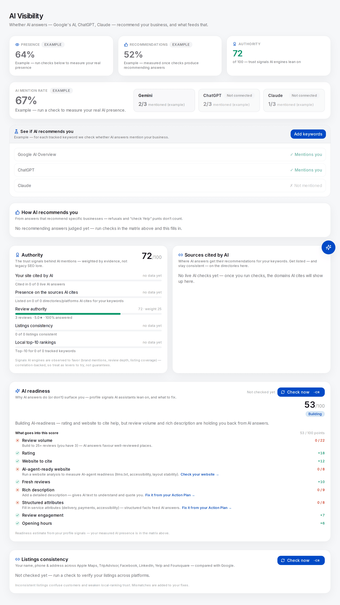

# Changing the AI answer

You have a mention rate now. It is 20%, or it is zero, and someone wants to know what you are going to do about it on Monday. This chapter answers that, and then the harder half: how you will tell, in six weeks, whether it was you.

Local AI visibility has been a saleable service for roughly eighteen months and already ships in packages. Some of what is in those packages reaches the machine, and you can watch it happen. Some of it cannot work, mechanically. Most has never been tested by anyone in either direction. Sorting the three is the whole job.

## There are only three places to intervene

An assistant answering a local question retrieves documents and writes prose grounded in them — the four steps are in [How an AI assistant answers a local question](../01-foundations/how-ai-answers-a-local-question.md). You control none of the model, the sampling, the retrieval weighting or the query it decides to issue. What is left is the corpus, and the corpus has exactly three attackable properties:

1. **Which documents exist, and what they say about you.** Your profile, directory records, third-party pages about your market, your own site.
2. **Whether the machine can tell they are all about one business.** Entity resolution — the subject of [citations and NAP consistency](../02-core-practice/citations-and-nap.md).
3. **What those documents say about your quality.** Reviews, ratings, and the language other people use about you.

Every lever with evidence behind it is one of these three. Hold a vendor proposal against the list and ask which one each line item is. A line mapping to none of them is either a misunderstanding of the mechanism or a content package with a new label on it.

## Read the source list; that is your intervention plan

Every answer arrives with a bibliography, and it is free to read once a check has been paid for. The **Sources cited by AI** card on `/b/{businessId}/ai-visibility` aggregates the cited domains across your recent live answers, ranked by how many cite each, and tags every row: **You**, **Directory**, **Social**, **Reference** or **Web**. Directory and social rows carry the note *You can influence this*, because those are records you can claim and correct. A Wikipedia row is a *Reference*; a "12 best plumbers in Leeds" listicle lands in *Web*.

Two disciplines make the card useful rather than decorative.

**It is per-market and per-keyword.** The claim "ChatGPT gets its local data from *[some platform]*" circulates constantly with no traceable source, and even if it held in somebody's market it would not hold in yours. A dental practice in Manchester and a taqueria in Austin share almost nothing in that table. Read your own.

**Named and cited are separate wins.** Your name in the answer is the customer-visible outcome. Your *domain* in the source list is evidence the model read your own content rather than someone's page about you. The common case is named-but-not-cited: the engine read a directory record and a listicle, named you off those, and cited them. When that is your pattern, the lever is a document you do not own — and no amount of work on your own site changes it.

## The ladder, graded by evidence

Four grades, and the grade matters more than the position.

- **Visible mechanism** — you can see the transmission path in the output: the document is named in the source list, you can change what it says, and you can re-probe. Not proof of causation for any single answer, but the strongest evidence this discipline currently offers.
- **Correlational** — vendor studies report co-occurrence. Where several have looked the *ordering* has been reproduced; the magnitudes have not, and the methods are only partly published.
- **Untested** — plausible mechanism, no published controlled test either way. Honest to try, dishonest to sell.
- **Non-signal** — reasoned or measured not to move retrieval. Several are still worth doing, for other reasons.

| Lever | Grade | The honest note |
| --- | --- | --- |
| Presence and correctness on the directory/social domains **your own probes cite** | Visible mechanism | The cited set is the shortlist; the rest is speculation |
| Reviews — volume, rating, recency, replies | Visible mechanism | Reaches Maps-grounded engines directly, web-grounded ones through the pages that sort on it |
| Being named on the third-party pages that get cited | Visible mechanism | Hardest lever, least worked, rules attached |
| Entity consistency across those documents | Untested, strong mechanism | Practitioner surveys put citation signals near 7% of *map-pack* weight; the AI case is a mechanism argument |
| Unlinked brand mentions and branded search volume | Correlational | Ordering reproduced across vendors; magnitudes unknown |
| Depth and specificity of your own site's content | Correlational for **cited**, untested for **named** | Wins the axis you were probably not measuring |
| Profile completeness beyond the basics | Untested | Transmits to Maps-grounded engines only *(inference)* |
| Schema markup | Correlational | Do it for rich results, which is a real reason |
| Google Business Profile posts | Untested | No published evidence they enter AI retrieval either way |
| `llms.txt` | Non-signal for retrieval | Scored by a first-party Google audit; twenty minutes, then stop |
| Domain authority and backlink counts | Non-signal here | Reported correlations for classic authority metrics sit near noise for AI mentions |
| Copy written to be quoted, or instructions hidden for the model | Non-signal, plus risk | The retrieval system reads pages *about* you, not your prose |
| Paid placement in an assistant's local recommendations | Nothing to buy | No published mechanism for buying a local recommendation slot as of **2026-07**. If a vendor says otherwise, ask which product and read its documentation |

Three rows deserve more than a table cell.

**Reviews are the heaviest lever, and the rubrics say so out loud.** In the AI-readiness score, review volume and rating are worth 22 and 18 of 100 — enough together to reach the middle tier ([diagnosing a business in thirty minutes](../02-core-practice/analyzing-business-visibility.md)). In the Authority pillar on the same page, review authority is worth 25 of 100 and is itself a blend: 30% volume (full marks around 50 reviews), 30% rating (scaled from 3.0 to 5.0), 20% recency (full marks inside 30 days, half inside 90), 20% reply share. Which says something a bare review count hides: **200 old unanswered reviews score worse than 60 recent ones that get replies.**

**The listicle layer is the under-worked one.** When your probes cite three "best X in *[your city]*" pages and a local news round-up, those pages are functionally the ranking. Being added is ordinary outreach: find who wrote it, show them why the omission is wrong, ask. What you may not do is buy placement without disclosure, spin up your own directory to cite yourself, or seed recommendations in forums under an assumed identity — the last is against every major platform's rules and gets discovered publicly.

**Our own instrument excludes two popular levers by construction.** The Authority pillar weights own-citation share 25, coverage of the cited domains 25, reviews 25, listings consistency 15 and local top-10 rankings 10. `llms.txt` and domain-authority metrics are deliberately absent — not unmeasured, *excluded*, because no published work supports them as AI retrieval signals. A rubric's exclusions are a claim, and a claim you can argue with beats a score you cannot take apart. If evidence lands, the rubric should change and this paragraph should be dated as wrong.

*The Authority pillar with its weights showing. Only **Review authority** scores — 72, at weight 25, off three reviews rated 5.0★ with every one answered — while **Your site cited by AI**, **Presence on the sources AI cites**, **Listings consistency** and **Local top-10 rankings** all read "no data yet" until the checks that feed them have been run. Note also what has no row at all: no `llms.txt`, no domain authority. Lower down the same page, the readiness breakdown gives this three-review profile full marks for recency and reply share while volume costs it 0 of 22.*

## The same fix does not reach every engine

Three engines, three grounding stacks, and the same work transmits differently down each. Google's grounded answer reads Google Search and Google's own place data, so profile fields and reviews reach it most directly. The other assistants call a general web-search tool; your profile reaches them only insofar as pages *about* you exist and get retrieved. *(Inference from each vendor's published product behaviour — none publishes its retrieval weighting, and none should be assumed stable.)*

The consequence is one sentence: **"we rewrote the profile and ChatGPT still does not mention us" is the expected result, not a failure of the work.** The per-engine tiles exist so you notice that instead of averaging it away. A cross-engine average hides the only thing you can act on differently.

## Now the hard part: proving it was you

[Measuring AI visibility](./ai-visibility.md) settled what a single rate is worth: at five runs per cell the standard error is around ±22 points, a cell that went from 2/5 to 3/5 did not detectably move, and the whole-matrix rate is a summary rather than a precise figure. Comparing *two* rates is harder than reporting one, and five disciplines carry it.

**Freeze the probe set before you start.** The pooled matrix rate is a weighted average over your tracked keywords, so it is comparable across time only if the set did not change. Add three keywords mid-experiment and the aggregate moves for reasons unrelated to your work. Freeze it, and say in the report that you did.

**Hold out a control set.** Split your keywords: some you work on, some you deliberately do not. If the untouched ones move by the same amount in the same direction, the engine moved, not your business. The previous chapter's variant — the same probes run against a comparable business you did not touch — is stronger where you can get it; a held-out keyword set is the version you can always afford. Almost nobody does either, because it means paying to measure things you are not optimising.

**Change one thing, and date it.** A review campaign, three directory fixes and a site rewrite in one fortnight buys an uninterpretable result. Stagger by domain and keep the dated change log from [Did it work?](../02-core-practice/did-it-work.md).

**Watch the denominator drift.** Answers that refuse, generalise, or punt to a platform ("check Yelp") are excluded from the recommendation rate by design — not misses, they left the question. So a shift in how often an engine punts moves your rate with nothing happening to your business. Read the *recommending answers* count on the **How AI recommends you** card beside the percentage, both times.

**Expect wins the mention rate cannot show.** Stance is a separate axis: *hedged* to *recommended*, or third mention to top pick, is a real improvement a named/not-named rate is blind to. The stance mix and average position sit on the same card.

And one thing nobody can give you: **latency**. Nobody has published how long a corrected directory record or a batch of new reviews takes to change what an assistant says. Our working assumption is weeks rather than days *(inference, consistent with map-pack latency and untested for AI specifically)*. Anyone quoting a figure is guessing.

## Two levers you must not pull

Both look like efficient lever-pulling, and both are against policy.

**Automated review replies.** Review engagement is 20% of the review-authority factor, so automating replies is an obvious way to move a score. Google's *Business Profile APIs policies* (developers.google.com/my-business/content/policies, last updated 2025-08-28) say, under Third-party policy: *"you must not automate or trigger review replies, Q&As, listing creations, listing edits, or other actions without the user's prior specific and express consent."* This is our reading of published terms, not legal advice — but the clause names the practice as abusive behaviour, and the merchant's account carries the risk. Draft with a model if you like; a human reads and sends. [Reviews](../02-core-practice/reviews.md) has the full treatment.

**AI-generated profile imagery.** Google's media policy asks for *"media that you captured"* and rules out *"imagery created by other parties"* (help-centre guidelines, read 2026-07-22). Generated images are, on any plain reading, both — cosmetic upside, and the downside lands on a live listing ([photos and the visual profile](../02-core-practice/photos-and-the-visual-profile.md)).

## Labs

These three form one experiment, run in order over three to six weeks. Doing 21.3 a day after 21.2 measures nothing.

### Lab 21.1 — Write the experiment card before you spend anything

> **Lab** · Where: **AI Visibility** (`/b/{businessId}/ai-visibility`) · Cost: **free** · Time: ~20 min
>
> You need: at least one round of live checks already run ([Does the AI recommend this business?](./ai-visibility.md)), and your tracked keyword set from Lab 8.2.

1. Open **Sources cited by AI**. Write down every **Directory** and **Social** row with its citation count, then every **Web** row — usually listicles and local press, and the rows people ignore.
2. Pick **one** lever from the ladder above. One. Write its grade beside it in your own words.
3. Split your tracked keywords into a **test set** (the ones this lever plausibly affects) and a **control set** (at least three you will not touch). Write both lists down. This is the freeze.
4. Write the prediction: which axis moves — *named*, *cited*, *stance* or *position* — by roughly how much, on which engines. Check it against the granularity table. If your predicted effect is smaller than the noise floor for the runs you can afford, the experiment cannot answer its own question. Redesign it, or say so now.
5. Write two dates: when you make the change, and when you re-measure.

**What good looks like.** One page — lever, grade, test set, control set, predicted axis and size, two dates. Nothing spent, and the experiment already either sound or visibly not.

**If it went wrong.** The sources card is empty: no live checks have run, so there is nothing to read yet — the previous chapter's work. Every row is *Reference* or *Web* with no directories: a real finding, meaning your lever is editorial outreach rather than listings hygiene.

**What you just learned.** An experiment whose predicted effect is smaller than its measurement noise is not a cheap experiment. It is an expensive way to produce a number you will misread.

### Lab 21.2 — Establish the baseline window, on both sets

> **Lab** · Where: **AI Visibility** → **Where AI mentions you** (`/b/{businessId}/ai-visibility`) · Cost: **paid** · Time: ~20 min
>
> You need: Lab 21.1, and the engine tiles showing at least one engine that is not marked **Not connected**.

1. In the matrix, select every keyword in **both** sets. The run button reads **Check N selected** and shows the projected number of checks; the price is on it before you confirm.
2. Run it, then run the same selection again on a different day. One pass gives one observation per cell; a rate is made of repeats.
3. Record four dated numbers: the pooled mention rate over the matrix, the rate for the test and control sets separately, and the per-engine split from the tiles.
4. From the **How AI recommends you** card, record *Included*, *Top pick*, *Avg position*, the framing mix and — critically — the **recommending answers** count. That is your denominator.
5. Copy the **Who AI recommends alongside (or instead of) you** list into your notes. It is a competitor set the engine chose, and the thing you will diff most usefully later.

**What good looks like.** A dated block of numbers with a denominator beside every rate, test and control separate. If you cannot say how many live checks a rate is built from, it is not yet a measurement.

**If it went wrong.** Cells show **Sample**: that engine is not connected, and sample rows never count toward any rate — exclude them and note which engines you measured. A batch that stops early: leaving the page halts the run deliberately, so you are not charged for checks nobody is waiting for.

**What you just learned.** A baseline for a stochastic measurement is not a snapshot, it is a window — and building one costs real money, which is why people skip it and then cannot defend anything.

### Lab 21.3 — Ship the lever, re-measure, and try to rule yourself out

> **Lab** · Where: wherever the lever lives, then **AI Visibility** · Cost: **paid** (the re-check) · Time: ~30 min, three weeks later
>
> You need: Lab 21.2, and the change actually shipped and verified as landed.

1. Ship the one lever, and verify it landed — the corrected record reads right in a browser, the replies appear on Google, the page names you. A change you cannot see is not a change ([Did it work?](../02-core-practice/did-it-work.md), tier 1).
2. Wait. Three weeks is a reasonable minimum *(inference — latency here is undocumented)*.
3. Re-run the **identical** selection, both sets, the same number of passes. If you added a keyword in between, the pooled comparison is void; report per-cell rates and say why.
4. Build the four-way comparison — test before/after, control before/after — then answer in writing: did the test set move *more than* the control, and is the difference bigger than your window's granularity?
5. Check the source list again. Did the domain you worked on appear more often, appear at all, or move up? That is the mechanism check, separate from the outcome.
6. Classify the result **verified**, **plausible** or **unattributable** using the buckets from [Did it work?](../02-core-practice/did-it-work.md). Most honest results are *plausible*.

**What good looks like.** A short paragraph a sceptic cannot dismantle: what moved, by how much, against a control, over how many observations, with the mechanism check supporting it or not. "Unattributable" beats a confident *plausible* you cannot defend.

**If it went wrong.** Both sets moved equally — the engine changed, not your business, and you know that only because you paid for a control. Nothing moved anywhere: three weeks may be short, the lever weak on these engines, or the window too coarse. All three are reportable; one experiment does not settle which.

**What you just learned.** The control set converts an anecdote into a claim. It costs money and produces no client-facing improvement, which is exactly why its presence in a report tells you who wrote it.

## Common mistakes

**Optimising the website when the answers cite directories.** The expensive one, and it survives because website work is what agencies are set up to sell. If your source list is four directory pages and no business sites, another blog post is not the lever. The list is on screen, free, after checks you already paid for.

**Reading a cell instead of the matrix.** A single keyword × engine rate over five runs moves in 20-point steps. People screenshot that step and call it a trend.

**Buying "AEO" that is a content package with a new label.** Hold the proposal against the three intervention points. If every line item is "AI-optimised content on your own site" and your engines never cite your domain, it is aimed at the wrong corpus.

**Reporting the mention rate and ignoring stance.** *Hedged* to *recommended* at the same mention rate is a real improvement, and a rate-only report throws it away — then next month claims a win from a single run flipping.

## Check yourself

Answer against your own business, with the AI Visibility page open.

1. **Your probes cite two directories, one national listicle and Wikipedia; your own domain never appears.** Which axis are you losing, which lever does the source list point at, and what would "success" look like as a number?
2. **A cell went from 20% to 40% after your work.** How many runs is that built on, and what is the smallest honest sentence you can write about it?
3. **The pooled mention rate rose six points and so did your control set.** What do you tell the client, and what did the control cost you to learn it?
4. **A vendor offers guaranteed placement in ChatGPT's local recommendations.** Name the two questions that end the conversation. (Which product, with documentation; and what happens to the guarantee when the model changes.)
5. **Which lever will you run next, and what is its grade?** If you cannot name the grade, you are about to spend a client's money on folklore.

---

**Next:** [Why two tools disagree →](./why-two-tools-disagree.md)
