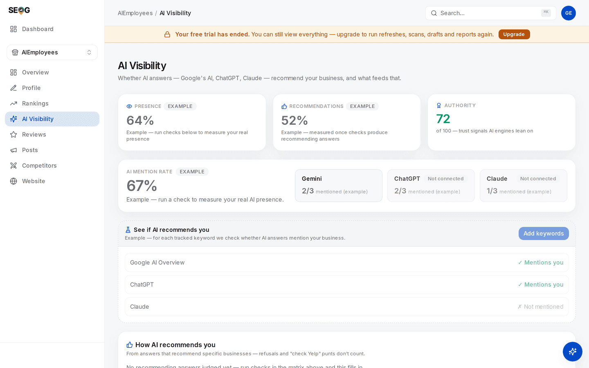
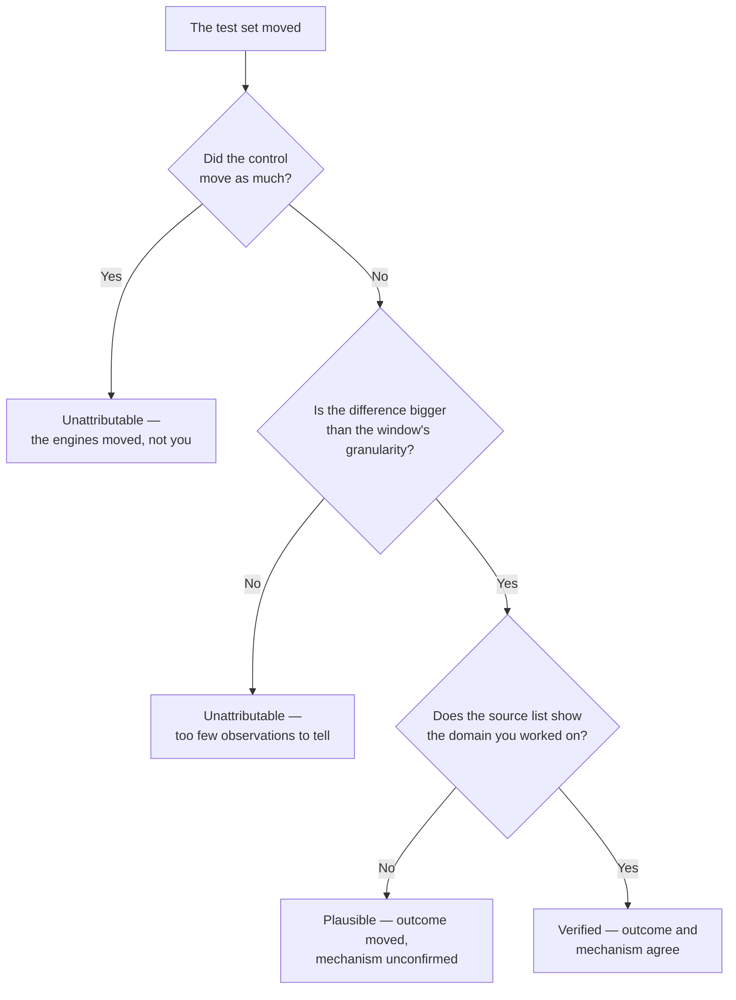

# Labs: running the experiment

The ladder gives you a lever. The labs below turn pulling it into an experiment somebody else could take apart.

## Labs

These three form one experiment, run in order over three to six weeks. Doing 21.3 a day after 21.2 measures nothing.

*The page as it looks before you have paid for anything — and every headline figure on it carries an **Example** badge, because no live check has run on this business. Read it as the shape of the instrument, not as a reading: the tiles tell you which engines are connected at all (here, one of three), and "no recommending answers judged yet" is the empty denominator Lab 21.2 exists to fill.*

### Lab 21.1 — Write the experiment card before you spend anything

> **Lab** · Where: **AI Visibility** (`/b/{businessId}/ai-visibility`) · Cost: **free** · Time: ~20 min
>
> You need: at least one round of live checks already run ([Does the AI recommend this business?](../ai-visibility/index.md)), and your tracked keyword set from Lab 8.2.

1. Open **Sources cited by AI**. Write down every **Directory** and **Social** row with its citation count, then every **Web** row — usually listicles and local press, and the rows people ignore.
2. Pick **one** lever from the ladder above. One. Write its grade beside it in your own words.
3. Split your tracked keywords into a **test set** (the ones this lever plausibly affects) and a **control set** (at least three you will not touch). Write both lists down. This is the freeze.
4. Write the prediction: which axis moves — *named*, *cited*, *stance* or *position* — by roughly how much, on which engines. Check it against the granularity table. If your predicted effect is smaller than the noise floor for the runs you can afford, the experiment cannot answer its own question. Redesign it, or say so now.
5. Write two dates: when you make the change, and when you re-measure.

**What good looks like.** One page — lever, grade, test set, control set, predicted axis and size, two dates. Nothing spent, and the experiment already either sound or visibly not.

**If it went wrong.** The sources card is empty: no live checks have run, so there is nothing to read yet — the previous chapter's work. Every row is *Reference* or *Web* with no directories: a real finding, meaning your lever is editorial outreach rather than listings hygiene.

**What you just learned.** An experiment whose predicted effect is smaller than its measurement noise is not a cheap experiment. It is an expensive way to produce a number you will misread.

### Lab 21.2 — Establish the baseline window, on both sets

> **Lab** · Where: **AI Visibility** → **Where AI mentions you** (`/b/{businessId}/ai-visibility`) · Cost: **paid** · Time: ~20 min
>
> You need: Lab 21.1, and the engine tiles showing at least one engine that is not marked **Not connected**.

1. In the matrix, select every keyword in **both** sets. The run button reads **Check N selected** and shows the projected number of checks; the price is on it before you confirm.
2. Run it, then run the same selection again on a different day. One pass gives one observation per cell; a rate is made of repeats.
3. Record four dated numbers: the pooled mention rate over the matrix, the rate for the test and control sets separately, and the per-engine split from the tiles.
4. From the **How AI recommends you** card, record *Included*, *Top pick*, *Avg position*, the framing mix and — critically — the **recommending answers** count. That is your denominator.
5. Copy the **Who AI recommends alongside (or instead of) you** list into your notes. It is a competitor set the engine chose, and the thing you will diff most usefully later.

**What good looks like.** A dated block of numbers with a denominator beside every rate, test and control separate. If you cannot say how many live checks a rate is built from, it is not yet a measurement.

**If it went wrong.** Cells show **Sample**: that engine is not connected, and sample rows never count toward any rate — exclude them and note which engines you measured. A batch that stops early: leaving the page halts the run deliberately, so you are not charged for checks nobody is waiting for.

**What you just learned.** A baseline for a stochastic measurement is not a snapshot, it is a window — and building one costs real money, which is why people skip it and then cannot defend anything.

### Lab 21.3 — Ship the lever, re-measure, and try to rule yourself out

> **Lab** · Where: wherever the lever lives, then **AI Visibility** · Cost: **paid** (the re-check) · Time: ~30 min, three weeks later
>
> You need: Lab 21.2, and the change actually shipped and verified as landed.

1. Ship the one lever, and verify it landed — the corrected record reads right in a browser, the replies appear on Google, the page names you. A change you cannot see is not a change ([Did it work?](../../02-core-practice/did-it-work/index.md), tier 1).
2. Wait. Three weeks is a reasonable minimum *(inference — latency here is undocumented)*.
3. Re-run the **identical** selection, both sets, the same number of passes. If you added a keyword in between, the pooled comparison is void; report per-cell rates and say why.
4. Build the four-way comparison — test before/after, control before/after — then answer in writing: did the test set move *more than* the control, and is the difference bigger than your window's granularity?
5. Check the source list again. Did the domain you worked on appear more often, appear at all, or move up? That is the mechanism check, separate from the outcome.
6. Classify the result **verified**, **plausible** or **unattributable** using the buckets from [Did it work?](../../02-core-practice/did-it-work/index.md). Most honest results are *plausible*.

*Two of the five endings are **unattributable**, and one of those is only reachable because you paid for a control set. That is the cost of being able to tell the difference — and the reason a report full of confident wins is a report that never ran this branch.*

**What good looks like.** A short paragraph a sceptic cannot dismantle: what moved, by how much, against a control, over how many observations, with the mechanism check supporting it or not. "Unattributable" beats a confident *plausible* you cannot defend.

**If it went wrong.** Both sets moved equally — the engine changed, not your business, and you know that only because you paid for a control. Nothing moved anywhere: three weeks may be short, the lever weak on these engines, or the window too coarse. All three are reportable; one experiment does not settle which.

**What you just learned.** The control set converts an anecdote into a claim. It costs money and produces no client-facing improvement, which is exactly why its presence in a report tells you who wrote it.

## Common mistakes

**Optimising the website when the answers cite directories.** The expensive one, and it survives because website work is what agencies are set up to sell. If your source list is four directory pages and no business sites, another blog post is not the lever. The list is on screen, free, after checks you already paid for.

**Reading a cell instead of the matrix.** A single keyword × engine rate over five runs moves in 20-point steps. People screenshot that step and call it a trend.

**Buying "AEO" that is a content package with a new label.** Hold the proposal against the three intervention points. If every line item is "AI-optimised content on your own site" and your engines never cite your domain, it is aimed at the wrong corpus.

**Reporting the mention rate and ignoring stance.** *Hedged* to *recommended* at the same mention rate is a real improvement, and a rate-only report throws it away — then next month claims a win from a single run flipping.

## Check yourself

Answer against your own business, with the AI Visibility page open.

1. **Your probes cite two directories, one national listicle and Wikipedia; your own domain never appears.** Which axis are you losing, which lever does the source list point at, and what would "success" look like as a number?
2. **A cell went from 20% to 40% after your work.** How many runs is that built on, and what is the smallest honest sentence you can write about it?
3. **The pooled mention rate rose six points and so did your control set.** What do you tell the client, and what did the control cost you to learn it?
4. **A vendor offers guaranteed placement in ChatGPT's local recommendations.** Name the two questions that end the conversation. (Which product, with documentation; and what happens to the guarantee when the model changes.)
5. **Which lever will you run next, and what is its grade?** If you cannot name the grade, you are about to spend a client's money on folklore.

---

**Next:** [Why two tools disagree →](../why-two-tools-disagree/index.md)
