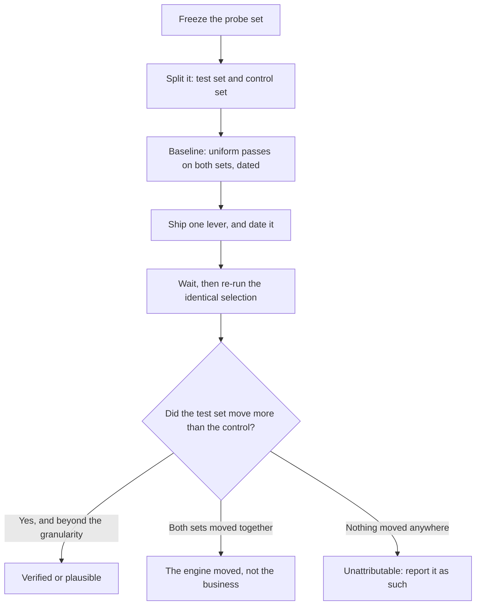

# Proving the change was you

The ladder tells you what to pull. This half is about where a pull lands, how you will tell in six weeks whether it was you, and the two levers you must leave alone.

## The same fix does not reach every engine

Three engines, three grounding stacks, and the same work transmits differently down each.

| Engine family | How your work reaches it |
| --- | --- |
| Google's grounded answer | Reads Google Search and Google's own place data, so profile fields and reviews reach it most directly |
| The other assistants | Call a general web-search tool; your profile reaches them only insofar as pages *about* you exist and get retrieved |

*(Inference from each vendor's published product behaviour — none publishes its retrieval weighting, and none should be assumed stable.)*

The consequence is one sentence: **"we rewrote the profile and ChatGPT still does not mention us" is the expected result, not a failure of the work.** The per-engine tiles exist so you notice that instead of averaging it away. A cross-engine average hides the only thing you can act on differently.

## Now the hard part: proving it was you

[Measuring AI visibility](../ai-visibility/index.md) settled what a single rate is worth: at five runs per cell the standard error is around ±22 points, a cell that went from 2/5 to 3/5 did not detectably move, and the whole-matrix rate is a summary rather than a precise figure.

Comparing *two* rates is harder than reporting one, and five disciplines carry it.

**Freeze the probe set before you start.** The pooled matrix rate is a weighted average over your tracked keywords, so it is comparable across time only if the set did not change. Add three keywords mid-experiment and the aggregate moves for reasons unrelated to your work. Freeze it, and say in the report that you did.

**Hold out a control set.** Split your keywords: some you work on, some you deliberately do not. If the untouched ones move by the same amount in the same direction, the engine moved, not your business.

The previous chapter's variant — the same probes run against a comparable business you did not touch — is stronger where you can get it; a held-out keyword set is the version you can always afford. Almost nobody does either, because it means paying to measure things you are not optimising.

**Change one thing, and date it.** A review campaign, three directory fixes and a site rewrite in one fortnight buys an uninterpretable result. Stagger by domain and keep the dated change log from [Did it work?](../../02-core-practice/did-it-work/index.md).

**Watch the denominator drift.** Answers that refuse, generalise, or punt to a platform ("check Yelp") are excluded from the recommendation rate by design — not misses, they left the question.

So a shift in how often an engine punts moves your rate with nothing happening to your business. Read the *recommending answers* count on the **How AI recommends you** card beside the percentage, both times.

**Expect wins the mention rate cannot show.** Stance is a separate axis: *hedged* to *recommended*, or third mention to top pick, is a real improvement a named/not-named rate is blind to. The stance mix and average position sit on the same card.

And one thing nobody can give you: **latency**. Nobody has published how long a corrected directory record or a batch of new reviews takes to change what an assistant says. Our working assumption is weeks rather than days *(inference, consistent with map-pack latency and untested for AI specifically)*. Anyone quoting a figure is guessing.

## Two levers you must not pull

Both look like efficient lever-pulling, and both are against policy.

**Automated review replies.** Review engagement is 20% of the review-authority factor, so automating replies is an obvious way to move a score.

Google's *Business Profile APIs policies* (developers.google.com/my-business/content/policies, last updated 2025-08-28) say, under **Prohibited practices → Automated use of your Business Profile project**: *"You may not use the Business Profile APIs to engage in abusive behaviors… For example, you must not automate or trigger review replies, Q&As, listing creations, listing edits, or other actions without the user's prior specific and express consent."*

This is our reading of published terms, not legal advice — but the clause files the practice under abusive behaviour, and the merchant's account carries the risk. Draft with a model if you like; a human reads and sends. [Reviews](../../02-core-practice/reviews/index.md) has the full treatment. *(Quote and date verified 2026-07-27.)*

**AI-generated profile imagery.** Google's *Tips for posting media to Maps*, part of the Maps user-generated-content policy, says *"Use media that you captured"* — specifically *"media of a place that you captured using a camera"* — and tells you to *"avoid screenshots, stock photos, GIFs, collages, heavily edited or otherwise manipulated photos, or imagery created by other parties."*

Generated images are, on any plain reading, caught by that: cosmetic upside, and the downside lands on a live listing ([photos and the visual profile](../../02-core-practice/photos-and-the-visual-profile/index.md)). *(Quotes verified 2026-07-27.)*

---

**Next:** [Labs: running the experiment →](./labs-running-the-experiment.md)
