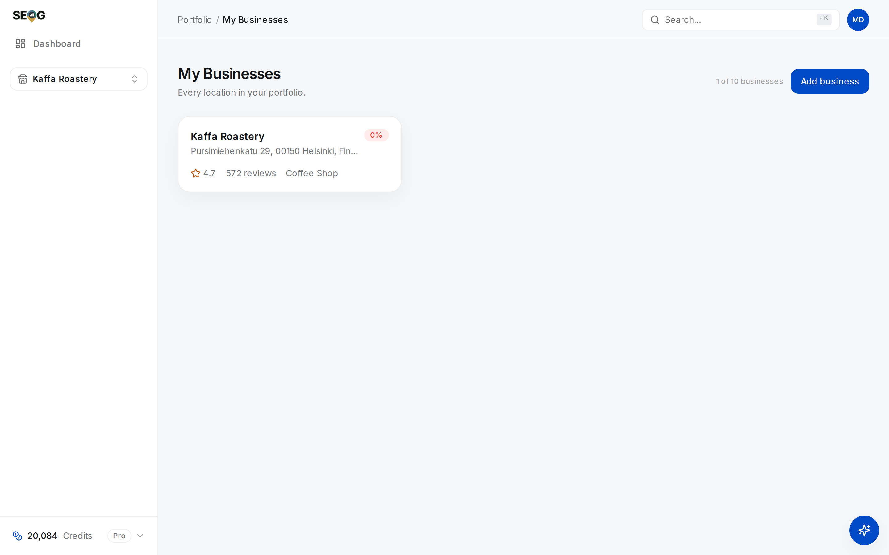

# Running more than one location

Ten locations is not one location ten times. Three things change in kind: the portfolio average stops being a fact about any location, your own branches start competing with each other while every instrument you own reports that as ordinary competition, and the work stops fitting in the week.

Everything in Part II still applies per location. What this chapter adds is the discipline that keeps the numbers defensible when the unit you *manage* and the unit you *report on* stop matching.

## The unit of measurement is still one location

A chain does not rank. A location ranks. There is no query for which Google returns "Acme Plumbing" — it returns a specific profile at a specific address, chosen against a specific searcher coordinate. Having forty entities changes none of that.

So what is a portfolio number *for*? Look at what the four rollups on the account dashboard are:

| Rollup | How it is computed | What it can honestly support |
| --- | --- | --- |
| Businesses | Count of non-deleted locations | A fact |
| Total reviews | Sum of per-location review counts | A fact — reviews are additive |
| Avg profile score | Mean of the per-location audit scores | Triage only |
| Avg rating | Unweighted mean of the per-location ratings | Triage only, and read the warning below |

An average profile score of 74 across eight locations is consistent with all eight at 74, and equally consistent with seven at 82 and one at 18. Same number, different job. You cannot recover the distribution from the mean, and the distribution is the finding.

Average rating is the sharper trap: the mean is taken **across locations, not across reviews**. A branch with six reviews at 4.9 counts exactly as much as a flagship with nine hundred at 4.1. That is a deliberate property of a rollup — it answers "how are my locations doing", not "what does a customer see" — but it is not the number a customer would compute, and it does not belong in a client report without that sentence attached.

The rule that follows is the spine of this chapter:

> **A portfolio number is legitimate for triage and illegitimate as a finding.** Use it to decide where to look. Never use it to describe what you found.

## What Google thinks a chain is

Each location is a separate entity with its own profile, reviews, prominence and rank map — [the business entity](../01-foundations/the-business-entity.md), applied N times.

Google's own grouping constructs are **administrative**. A business group — previously called a *business account*, not a location group — is a container for sharing management of locations across several users, and the unit the bulk tooling works on. No ranking documentation mentions group membership and no public controlled test of it exists, so treat groups as a filing system, not a lever *(inference)*.

Two administrative facts are worth knowing before you plan an engagement, and both go stale:

- Google documents a **bulk verification** path for chains — as of 2026-07, for ten or more profiles of the same business, submitted on one spreadsheet and reviewed together rather than verified one at a time. A business group is *not* required for it; an individual account qualifies on the same threshold. Check the current help-centre page before building a timeline on it; this threshold has changed before.
- Google also documents **bulk upload** by spreadsheet for a business group — the right tool for changing a field across many locations at once. Nothing in SEOG does it: if sixty profiles need the same hours change this week, Google's own dashboard is the right instrument and this one is not.

What is *not* allowed matters more. A second profile at the same address for the same business is a duplicate, and duplicates are a guideline violation rather than a clever trick — see [spam and fake listings](./spam-and-fake-listings.md) and [suspensions and reinstatement](./suspensions-and-reinstatement.md). Practitioner listings carry their own rules: if a client has fourteen dentists and one surgery, settle what the entities *are* before measuring anything.

## Your branches compete, and your tools call it competition

This is a measurement problem before it is a strategy problem.

At any given searcher coordinate, the map pack very rarely shows two branches of the same brand for the same query *(inference — a consistent observation across grid scans and query samples; Google has never published how affiliated listings are filtered)*. Whatever the mechanism, the consequence is firm: **where two of your branches both compete, one branch's win is the other's absence.** Zero-sum between them, and not zero-sum against an unaffiliated rival.

Geography decides how much overlap exists, and a geo-grid measures it directly. Grid points sit a mile apart, so reach follows detail level: a 3×3 covers roughly two miles across, a 5×5 roughly four, a 7×7 roughly six. Two branches four miles apart share most of a Standard scan's area and all of a Detailed one's. Run the same keyword at the same level from each branch: in the overlap, the branch that is green is why the other is grey. [Reading a geo-grid](./reading-a-geo-grid.md) is the prerequisite for that picture.

The metric that survives scrutiny is **union coverage**: across both grids, in how many distinct places does *some* branch of yours reach the top three? Adding the two percentages double-counts the overlap and can exceed the territory you hold. Reporting the sum is the most common way a multi-location rankings report inflates itself.

Then the instrument trap. Competitor discovery drops two things from its candidate list: the business you ran it from, and anything you already track. Your other branch is neither — a separate profile, not yet on the list — so it comes back as an ordinary candidate and can be tracked like any rival. Sometimes that is exactly what you want — it keeps the overlap visible. It is also how a client report ends up naming a business's own branch as its top competitor. Decide deliberately, and label it either way.

One caution on the response. The instinct on finding cannibalisation is to de-optimise a branch — spending effort to be less visible — and it is almost always wrong. The productive responses are differentiation (distinct primary categories where the businesses genuinely differ, distinct services, distinct landing pages) and accepting that two branches inside one catchment share it. Total overlap is a property of the estate, not something a profile can fix.

## Per-location pages

Each profile's website link should point at **that location's page**, not the shared homepage. A homepage serving as the destination for eleven profiles cannot be the canonical answer for any of them, and it makes every citation, every AI answer and every "which branch is this" question ambiguous. No other structural decision on a multi-location site has more downstream consequences.

A location page earns its place when it does three things:

1. **Carries that location's name, address and phone exactly as the profile does.** Not approximately — [citations and NAP consistency](../02-core-practice/citations-and-nap.md) explains why formatting drift is the whole game.
2. **Says something only true of that location.** Its staff, its parking, its neighbourhood, its actual photographs.
3. **Is readable by an agent** — machine-readable location data, one entity per page, no ambiguity about which branch it describes. That is [making the site readable by agents](../02-core-practice/making-the-site-readable-by-agents.md), where multi-location sites most often fail silently.

The failure mode is generating forty pages from one template with the town name swapped. Google's Search spam policies name *scaled content abuse* as a violation — read the current wording yourself rather than my summary, and note it is a **Search** policy, so the consequence lands on your pages, not the profiles. The practical test is simpler: delete the town name; could a reader still tell which branch the page described? If not, it is not a location page.

## Where the limits actually bite

Four budgets constrain a portfolio, and they scale differently.

**Money and time.** Every fetch is per-location. A grid scan is one live search per grid point, so a Detailed scan of one keyword at one branch is dozens of searches — multiply by keywords, then by locations. A portfolio's tracked set must be designed as a portfolio: two or three keywords per location on a real cadence beats fifteen scanned once and never again. [Choosing what to track](../02-core-practice/choosing-what-to-track.md) is the method; at scale it becomes a budget.

**Writes.** Google enforces a ceiling on profile edits per minute, and it is **per profile** — not per account, not per group. That cuts both ways: one field across thirty branches is not limited in aggregate, while a long fix list on *one* branch will hit it. The numbers are in [write limits and failure modes](../05-reference/write-limits-and-failure-modes.md); the shape says parallelise across locations rather than slow down globally.

**Owner access.** One connected Google account can hold many accounts and many locations, and the import picker walks all of them. The list is long and you import one at a time. There is no "import all".

**Quota.** Your plan caps how many locations the portfolio holds — a counter sits beside **Add business** on `/businesses` — and tracked keywords and competitors have hard ceilings *per location*. Neither bites with one business; both shape the design with twenty.

Three things this tool does not do, said plainly:

- **No groups.** The portfolio is a flat list. Run forty locations across six clients and the grouping lives in your notes.
- **No bulk edit.** Every profile write is one location at a time. Use Google's bulk upload for real bulk changes.
- **No portfolio report.** Reports are per location; a chain-level deliverable is assembled by you — [reporting to a client](../04-operating/reporting-to-a-client.md).

*The portfolio in this capture holds one location, and two of the constraints are already on the screen: the plan's location counter sits beside **Add business**, and the estate is a flat list of cards — there is no grouping control anywhere on the page.*

## Triage instead of monitoring

You cannot look at forty locations weekly. Trying is how the two branches that needed attention get the same fifteen seconds as the thirty-eight that were fine.

The account dashboard sorts the portfolio worst-first on a composite score computed from stored data — no calls to Google, so opening it is free and repeatable. Its inputs:

| Signal | Contribution |
| --- | --- |
| Profile score below 80 | 1 point per point of deficit |
| Open fixes | 6 per fix |
| Unanswered reviews | 5 per review |
| Tracked keywords that slipped since the last check | 12 each |
| Website score below 50 | 20 |
| Never synced, or last synced over 14 days ago | 15 |

Each card shows only the chips that are actionable — *N fixes*, *N to answer*, *N slipping*, *Profile weak*, a website score — and a healthy location renders as **All quiet**. That principle is worth stealing whatever you use: a triage board must stay silent about locations that are fine, or the reader learns to skim it.

Now the caveats, because heuristics are what Part III is for. The score is not evidence. It is blind to market difficulty and to distance, so a location comprehensively beaten in a hard market while holding a spotless profile sits near the bottom looking quiet. It also weights *staleness* alongside *health*, so a location you have not refreshed climbs without anything being wrong. Read the chips, not the ordering.

## Labs

### Lab 25.1 — Rebuild the triage ordering by hand

> **Lab** · Where: **Dashboard** (`/dashboard`) and **My Businesses** (`/businesses`) · Cost: **free** · Time: ~15 min
>
> You need: at least two businesses in your portfolio. With one, read the lab and run it the first time you inherit a second.

1. Open the dashboard. Write down the four rollups, and mark each as a *fact* or a *triage signal* using the table above. Two of the four are facts.
2. Read the cards in order. For each, copy the chips it shows — fixes, to answer, slipping, profile weak, website score — or **All quiet**.
3. Using the weights table, compute each location's score in a spreadsheet and sort by it.
4. Compare your ordering with the page's. They should match; if not, find out why. The usual answer is a staleness contribution you forgot.
5. Now the part the score cannot do: for the top two, write one sentence saying whether it points at a *problem* or at *neglect*. A location high only because nothing has been synced for a month is neglect.

**What good looks like.** Your spreadsheet reproduces the app's ordering, and you can name a location whose position is an artefact of staleness rather than health.

**If it went wrong.** Every number is slightly off: the profile contribution is a *deficit* against 80, not the score, and it floors at zero. A location shows no slipping keywords despite worse rankings: movement needs two rank checks to exist. A card shows a website chip *and* **All quiet**: the quiet label is computed from fixes, unanswered reviews, slipping keywords and profile score only — the website score feeds the ordering but is not one of the inputs to "quiet".

**What you just learned.** A triage ordering you cannot reproduce by hand is a black box, and a black box cannot be defended to a client asking why their branch was ignored. Decomposing the ordering *is* the audit of it.

### Lab 25.2 — Measure the overlap between two branches

> **Lab** · Where: **Rankings** (`/b/{businessId}/rankings`), run twice · Cost: **paid** · Time: ~20 min
>
> You need: two locations of the same business within about four miles of each other, both in your portfolio, and [reading a geo-grid](./reading-a-geo-grid.md).

1. Choose one keyword both branches genuinely compete for. The same string for both — a different keyword makes the maps incomparable.
2. On branch A, add the keyword if it is not tracked, open it, and under **Geographic visibility** select the **Standard** preset. Press **Check now**; the price is on the button.
3. Record top-3 coverage, average rank and the capture timestamp.
4. Switch to branch B with the business switcher — it keeps you on Rankings — and repeat with the identical keyword and preset.
5. Put the heatmaps side by side. In the region where both grids have points, count where A is top-3, where B is, and where both are.
6. Compute the **sum** of the two coverage percentages and the **union** — the share of distinct map area where at least one branch is top-3. Record both with date, keyword and preset.

**What good looks like.** The union is meaningfully smaller than the sum, and the "both top-3" count is low or zero. You can point at a part of the map and name the branch that owns it.

**If it went wrong.** The grids barely overlap: your branches are further apart than the preset reaches. Write "no measurable cannibalisation at this radius" and stop, rather than escalating to a larger preset to manufacture one. Both branches are grey across the overlap: a prominence problem, not a cannibalisation one.

**What you just learned.** Coverage does not add. Two branches are two overlapping claims on one territory, and the only defensible number counts each piece of ground once.

### Lab 25.3 — Find your own branch in the competitor list

> **Lab** · Where: **Competitors** (`/b/{businessId}/competitors`) · Cost: **paid** · Time: ~10 min
>
> You need: Lab 25.2, and the two branches from it.

1. Open Competitors on branch A. In the **Add a competitor** panel, press **Discover nearby**.
2. Read the candidates and look for branch B. If the branches are close and share a category, it is usually there.
3. Do not track it yet. Write the decision first: are you tracking it to *measure the overlap*, or would it only produce a row a client misreads?
4. If you track it, write the report sentence now — "Riverside branch is listed to measure catchment overlap, not as a third-party competitor."
5. Mark any other affiliated business in the list: a sister brand, a franchisee of the same chain, a business at the same address.

**What good looks like.** A written decision with a reason, and — if you tracked the branch — a labelling sentence that exists before the first report does.

**If it went wrong.** Branch B is absent: you may already track it (discovery hides everything on your competitor list), or it sits outside the discovery radius, or it is in a different primary category — the last two are findings about how differentiated your branches already are. Discovery returns almost nothing: check the optional **Area** field and the profile's category first.

**What you just learned.** An instrument's definition of "competitor" is whatever it was built to exclude — here, one place. Read every automated list as the client will read it, not as the tool intended.

## Common mistakes

**Reporting the portfolio average as a result.** "Average rating across the estate is 4.4" reads as reassurance and hides the branch at 3.6 with eleven reviews. The mean is over locations, not reviews. Report the distribution and the worst location.

**Adding coverage across branches.** Two grids at 40% top-3 coverage do not make 80%. Where they overlap you count the same ground twice, and the sum can exceed the territory you hold. Union, always.

**Letting a sister branch sit unlabelled in a competitor list.** It arrives honestly, and everyone who did not add it reads it as a rival. Label it when you track it, not when someone asks.

**Cloning location pages.** Forty pages from one template with the town swapped is fast, and it is the pattern Google's scaled-content policy exists to catch. It also makes each page a weaker citation for the location it names — the opposite of why you built them.

**Treating the triage board as monitoring.** The score is blind to market difficulty and rewards recency, so a comprehensively-beaten location with a clean profile sits quietly at the bottom. Triage decides where you look this week; it does not decide what is wrong.

## Check yourself

Answer against a real portfolio.

1. **Your dashboard shows an average profile score of 74 across eight locations. Name three portfolios that produce exactly that number and need completely different work.**
2. **Two branches each show 40% top-3 coverage on the same keyword. What is the largest and smallest possible union coverage, and what does each case say about the estate?**
3. **Your competitor list for the Northside branch has the Riverside branch in third place. Bug, finding, or reporting hazard?** All three are defensible; say which applies to *your* report and why.
4. **Which of the four budgets — money, writes, owner access, quota — bites first if you go from three locations to thirty tomorrow, and what would you change in your tracked set first?**
5. **A location sits at the bottom of the triage board marked "All quiet" and has not appeared in the pack for its main keyword in six months. Explain how both are true at once, and name the measurement that would have caught it.**

---

**Next:** [Reporting to a client →](../04-operating/reporting-to-a-client.md)
