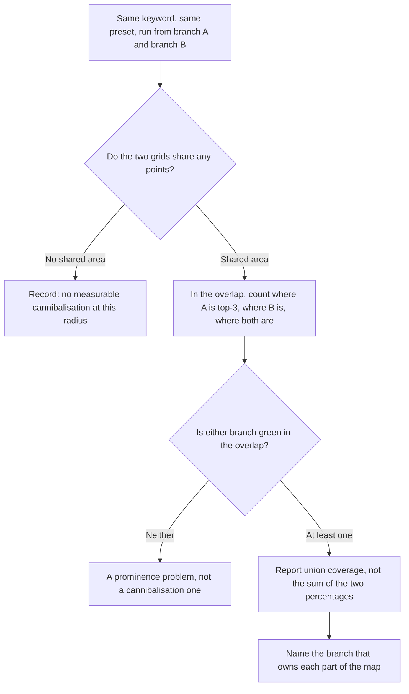

# Running more than one location

Ten locations is not one location ten times. Three things change in kind: the portfolio average stops being a fact about any location, your own branches start competing with each other while every instrument you own reports that as ordinary competition, and the work stops fitting in the week.

Everything in Part II still applies per location. What this chapter adds is the discipline that keeps the numbers defensible when the unit you *manage* and the unit you *report on* stop matching.

## The unit of measurement is still one location

A chain does not rank. A location ranks. There is no query for which Google returns "Acme Plumbing" — it returns a specific profile at a specific address, chosen against a specific searcher coordinate. Having forty entities changes none of that.

So what is a portfolio number *for*? Look at what the four rollups on the account dashboard are:

| Rollup | How it is computed | What it can honestly support |
| --- | --- | --- |
| Businesses | Count of non-deleted locations | A fact |
| Total reviews | Sum of per-location review counts | A fact — reviews are additive |
| Avg profile score | Mean of the per-location audit scores | Triage only |
| Avg rating | Unweighted mean of the per-location ratings | Triage only, and read the warning below |

**The mean hides the distribution.** An average profile score of 74 across eight locations is consistent with all eight at 74, and equally consistent with seven at 82 and one at 18. Same number, different job. You cannot recover the distribution from the mean, and the distribution is the finding.

**Average rating is the sharper trap.** The mean is taken **across locations, not across reviews**. A branch with six reviews at 4.9 counts exactly as much as a flagship with nine hundred at 4.1.

That is a deliberate property of a rollup — it answers "how are my locations doing", not "what does a customer see". But it is not the number a customer would compute, and it does not belong in a client report without that sentence attached.

The rule that follows is the spine of this chapter:

> **A portfolio number is legitimate for triage and illegitimate as a finding.** Use it to decide where to look. Never use it to describe what you found.

## What Google thinks a chain is

Each location is a separate entity with its own profile, reviews, prominence and rank map — [the business entity](../../01-foundations/the-business-entity/index.md), applied N times.

**Google's own grouping constructs are administrative.** A business group — previously called a *business account*, not a location group — is a container for sharing management of locations across several users, and the unit the bulk tooling works on.

No ranking documentation mentions group membership and no public controlled test of it exists, so treat groups as a filing system, not a lever *(inference)*.

Two administrative facts are worth knowing before you plan an engagement, and both go stale:

- Google documents a **bulk verification** path for chains — as of 2026-07, for ten or more profiles of the same business, submitted on one spreadsheet and reviewed together rather than verified one at a time. A business group is *not* required for it; an individual account qualifies on the same threshold. Check the current help-centre page before building a timeline on it; this threshold has changed before.
- Google also documents **bulk upload** by spreadsheet for a business group — the right tool for changing a field across many locations at once. Nothing in SEOG does it: if sixty profiles need the same hours change this week, Google's own dashboard is the right instrument and this one is not.

**What is *not* allowed matters more.** A second profile at the same address for the same business is a duplicate, and duplicates are a guideline violation rather than a clever trick — see [spam and fake listings](../spam-and-fake-listings/index.md) and [suspensions and reinstatement](../suspensions-and-reinstatement/index.md).

Practitioner listings carry their own rules: if a client has fourteen dentists and one surgery, settle what the entities *are* before measuring anything.

## Your branches compete, and your tools call it competition

This is a measurement problem before it is a strategy problem.

**One brand, one slot.** At any given searcher coordinate, the map pack very rarely shows two branches of the same brand for the same query *(inference — a consistent observation across grid scans and query samples; Google has never published how affiliated listings are filtered)*.

Whatever the mechanism, the consequence is firm: **where two of your branches both compete, one branch's win is the other's absence.** Zero-sum between them, and not zero-sum against an unaffiliated rival.

**Geography decides how much overlap exists**, and a geo-grid measures it directly. Grid points sit a mile apart, so reach follows detail level:

| Preset | Covers roughly | Two branches 4 miles apart |
| --- | --- | --- |
| 3×3 | 2 miles across | no shared area |
| 5×5 | 4 miles across | **most** of the scan overlaps |
| 7×7 | 6 miles across | **all** of it overlaps |

Run the same keyword at the same level from each branch. In the overlap, the branch that is green is why the other is grey. [Reading a geo-grid](../reading-a-geo-grid/index.md) is the prerequisite for that picture.

**Report union coverage, never the sum.** Across both grids, in how many *distinct* places does some branch of yours reach the top three? Adding the two percentages double-counts the overlap and can exceed the territory you actually hold — which is the most common way a multi-location rankings report inflates itself.

### The instrument trap

Competitor discovery drops two things from its candidate list: the business you ran it from, and anything you already track. **Your other branch is neither.** It is a separate profile, not yet on the list, so it comes back as an ordinary candidate and can be tracked like any rival.

Sometimes that is exactly what you want — it keeps the overlap visible. It is also how a client report ends up naming a business's own branch as its top competitor. Decide deliberately, and label it either way.

### Do not de-optimise a branch

The instinct on finding cannibalisation is to spend effort making one branch *less* visible. It is almost always wrong. The productive responses are:

- **Differentiate** — distinct primary categories where the businesses genuinely differ, distinct services, distinct landing pages.
- **Accept the overlap** — two branches inside one catchment share it, and that is a property of the estate rather than something a profile can fix.

---

**Next:** [Location pages, limits, and triaging a portfolio →](./pages-limits-and-triage.md)
