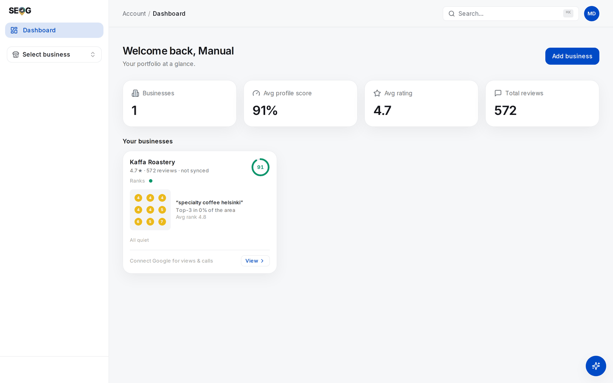
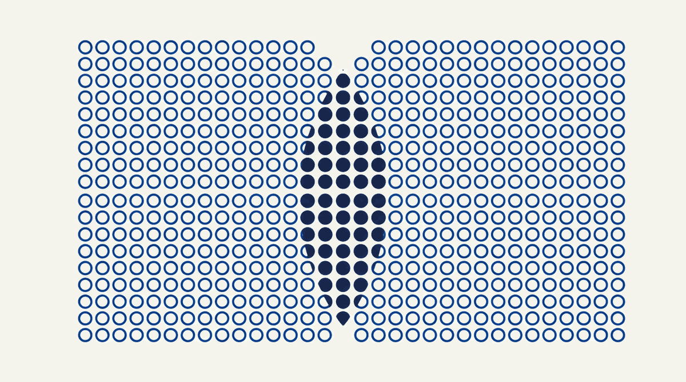
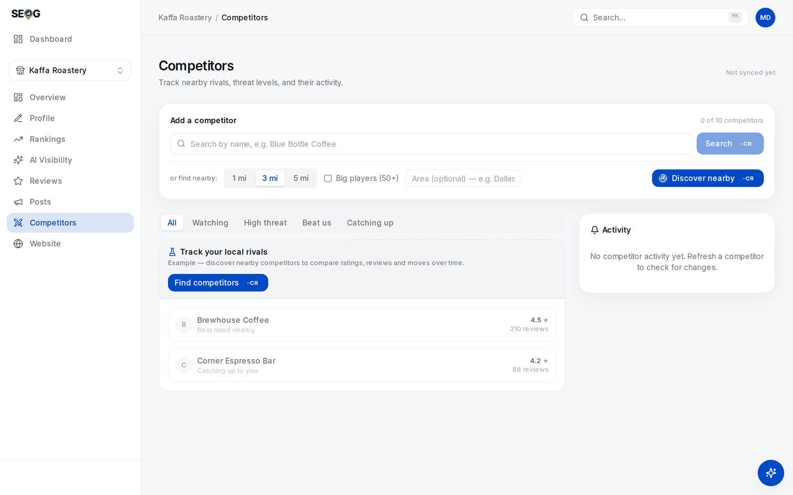

# Labs: triage ordering, branch overlap, and self-competition

Three sittings against a real portfolio: rebuild the ordering the board gave you, measure where two of your branches claim the same ground, and decide deliberately what to do when one of them appears in the other's competitor list.

## Labs

### Lab 25.1 — Rebuild the triage ordering by hand

> **Lab** · Where: **Dashboard** (`/dashboard`) and **My Businesses** (`/businesses`) · Cost: **free** · Time: ~15 min
>
> You need: at least two businesses in your portfolio. With one, read the lab and run it the first time you inherit a second.

1. Open the dashboard. Write down the four rollups, and mark each as a *fact* or a *triage signal* using the table above. Two of the four are facts.
2. Read the cards in order. For each, copy the chips it shows — fixes, to answer, slipping, profile weak, website score — or **All quiet**.

*The board steps 1 and 2 read, here with a single location so the parts are visible. The four tiles across the top are the rollups — two of them facts, two of them triage signals, and the table above says which is which. The card carries what step 2 asks you to copy: the mini grid with its keyword and coverage, and in this case **All quiet** rather than a chip. With a real portfolio these cards stack, and their order is the thing you are about to reproduce by hand.*
3. Using the weights table, compute each location's score in a spreadsheet and sort by it.
4. Compare your ordering with the page's. They should match; if not, find out why. The usual answer is a staleness contribution you forgot.
5. Now the part the score cannot do: for the top two, write one sentence saying whether it points at a *problem* or at *neglect*. A location high only because nothing has been synced for a month is neglect.

**What good looks like.** Your spreadsheet reproduces the app's ordering, and you can name a location whose position is an artefact of staleness rather than health.

**If it went wrong.** Every number is slightly off: the profile contribution is a *deficit* against 80, not the score, and it floors at zero. A location shows no slipping keywords despite worse rankings: movement needs two rank checks to exist.

A card shows a website chip *and* **All quiet**: the quiet label is computed from fixes, unanswered reviews, slipping keywords and profile score only — the website score feeds the ordering but is not one of the inputs to "quiet".

**What you just learned.** A triage ordering you cannot reproduce by hand is a black box, and a black box cannot be defended to a client asking why their branch was ignored. Decomposing the ordering *is* the audit of it.

### Lab 25.2 — Measure the overlap between two branches

> **Lab** · Where: **Rankings** (`/b/{businessId}/rankings`), run twice · Cost: **paid** · Time: ~20 min
>
> You need: two locations of the same business within about four miles of each other, both in your portfolio, and [reading a geo-grid](../reading-a-geo-grid/index.md).

1. Choose one keyword both branches genuinely compete for. The same string for both — a different keyword makes the maps incomparable.
2. On branch A, add the keyword if it is not tracked, open it, and under **Geographic visibility** select the **Standard** preset. Press **Check now**; the price is on the button.
3. Record top-3 coverage, average rank and the capture timestamp.
4. Switch to branch B with the business switcher — it keeps you on Rankings — and repeat with the identical keyword and preset.
5. Put the heatmaps side by side. In the region where both grids have points, count where A is top-3, where B is, and where both are.
6. Compute the **sum** of the two coverage percentages and the **union** — the share of distinct map area where at least one branch is top-3. Record both with date, keyword and preset.

*What step 6 is counting. The solid points are claimed by both branches; in the sum they are counted twice, in the union once. The gap between the two figures is the size of the overlap — and it is the only one of the two that describes ground the estate actually holds.*

**What good looks like.** The union is meaningfully smaller than the sum, and the "both top-3" count is low or zero. You can point at a part of the map and name the branch that owns it.

**If it went wrong.** The grids barely overlap: your branches are further apart than the preset reaches. Write "no measurable cannibalisation at this radius" and stop, rather than escalating to a larger preset to manufacture one. Both branches are grey across the overlap: a prominence problem, not a cannibalisation one.

**What you just learned.** Coverage does not add. Two branches are two overlapping claims on one territory, and the only defensible number counts each piece of ground once.

### Lab 25.3 — Find your own branch in the competitor list

> **Lab** · Where: **Competitors** (`/b/{businessId}/competitors`) · Cost: **paid** · Time: ~10 min
>
> You need: Lab 25.2, and the two branches from it.

1. Open Competitors on branch A. In the **Add a competitor** panel, press **Discover nearby**.

*The panel step 1 uses. **Discover nearby** searches around the business at the selected radius — 3 mi here — and the optional **Area** field is the one the "if it went wrong" note sends you back to when discovery returns almost nothing. The two rows below are the screen's labelled **Example**, not rivals of this business; on a real run they are replaced by what Google actually returns near branch A, which is where you look for branch B.*
2. Read the candidates and look for branch B. If the branches are close and share a category, it is usually there.
3. Do not track it yet. Write the decision first: are you tracking it to *measure the overlap*, or would it only produce a row a client misreads?
4. If you track it, write the report sentence now — "Riverside branch is listed to measure catchment overlap, not as a third-party competitor."
5. Mark any other affiliated business in the list: a sister brand, a franchisee of the same chain, a business at the same address.

**What good looks like.** A written decision with a reason, and — if you tracked the branch — a labelling sentence that exists before the first report does.

**If it went wrong.** Branch B is absent: you may already track it (discovery hides everything on your competitor list), or it sits outside the discovery radius, or it is in a different primary category — the last two are findings about how differentiated your branches already are. Discovery returns almost nothing: check the optional **Area** field and the profile's category first.

**What you just learned.** An instrument's definition of "competitor" is whatever it was built to exclude — here, one place. Read every automated list as the client will read it, not as the tool intended.

## Common mistakes

**Reporting the portfolio average as a result.** "Average rating across the estate is 4.4" reads as reassurance and hides the branch at 3.6 with eleven reviews. The mean is over locations, not reviews. Report the distribution and the worst location.

**Adding coverage across branches.** Two grids at 40% top-3 coverage do not make 80%. Where they overlap you count the same ground twice, and the sum can exceed the territory you hold. Union, always.

**Letting a sister branch sit unlabelled in a competitor list.** It arrives honestly, and everyone who did not add it reads it as a rival. Label it when you track it, not when someone asks.

**Cloning location pages.** Forty pages from one template with the town swapped is fast, and it is the pattern Google's scaled-content policy exists to catch. It also makes each page a weaker citation for the location it names — the opposite of why you built them.

**Treating the triage board as monitoring.** The score is blind to market difficulty and rewards recency, so a comprehensively-beaten location with a clean profile sits quietly at the bottom. Triage decides where you look this week; it does not decide what is wrong.

## Check yourself

Answer against a real portfolio.

1. **Your dashboard shows an average profile score of 74 across eight locations. Name three portfolios that produce exactly that number and need completely different work.**
2. **Two branches each show 40% top-3 coverage on the same keyword. What is the largest and smallest possible union coverage, and what does each case say about the estate?**
3. **Your competitor list for the Northside branch has the Riverside branch in third place. Bug, finding, or reporting hazard?** All three are defensible; say which applies to *your* report and why.
4. **Which of the four budgets — money, writes, owner access, quota — bites first if you go from three locations to thirty tomorrow, and what would you change in your tracked set first?**
5. **A location sits at the bottom of the triage board marked "All quiet" and has not appeared in the pack for its main keyword in six months. Explain how both are true at once, and name the measurement that would have caught it.**

---

**Next:** [Reporting to a client →](../../04-operating/reporting-to-a-client/index.md)
