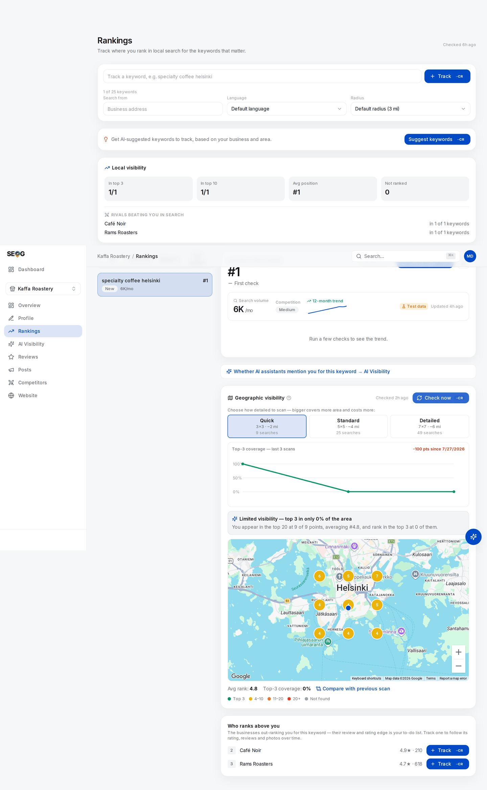

# Reading a geo-grid without fooling yourself

A grid gives you nine, twenty-five or forty-nine numbers where you had one, and draws them on a map. That is a real upgrade with a real hazard: twenty-five numbers and a coloured picture feel like *data* in a way one number never did, so nobody audits them. Two summary figures get quoted, a month later two more get quoted beside them, and the difference gets called a result.

This chapter is the audit — what the two figures hide, how much a grid disagrees with *itself* when nothing has changed, and how large a movement must be before you may call it one. You should finish able to say to a client: *"That change is inside our measurement noise, so we are not counting it."*

## Two figures, two denominators

The app prints two numbers under the map. They are not two views of one thing.

| Figure | Numerator | Denominator | Therefore |
| --- | --- | --- | --- |
| **Avg rank** | Sum of your positions | Points where you **appeared** | Grey pins are deleted before the arithmetic |
| **Top-3 coverage** | Points where you ranked 1–3 | **All** points scanned | Grey pins count against you |

One excludes the missing data, the other counts it as failure, so the two can move in opposite directions on the same scan and both be correct.

The consequence is the mechanism by which grids flatter people, and it deserves to be a rule: **average rank improves when you disappear from your worst points.** Vanish from three pins where you sat at #18 and the average climbs. Nothing improved — the instrument stopped looking at your bad neighbourhoods.

A third figure makes the other two safe. The plain-language paragraph above the map states it: *"You appear in the top 20 at 9 of 25 points."* That is the **found rate**, the denominator information the average threw away. Quote it every time, first.

*The whole argument on one screen, and a real scan — **Check now** at the Quick preset ran nine live searches, one per point, and each pin carries the position that point returned.*

*Read the three figures in order and watch them disagree. The plain-language line first: found in the top 20 at **9 of 9** points — perfect coverage, nothing missing. Then **Avg rank 4.7**, which sounds like a mid-table result. Then **Top-3 coverage 0%**, which sounds like a catastrophe. All three describe the same nine numbers.*

*They diverge because they answer different questions. The average is computed over found pins and is blind to thresholds. Top-3 coverage is computed over all nine and is nothing **but** a threshold — #4 scores exactly the same as #40. A business one position outside the pack everywhere reads as a total failure on one metric and an unremarkable middle on another, and neither is lying. This is why the found rate goes first, every time.*

*(The search-volume card higher up the page carries a **Test data** badge — those figures are placeholders, not market data.)*

## Rank is ordinal, and an average of ordinals is not a distance

Position is a rank label: only the order is real, the gaps are not. Arithmetic does not know that. To a mean, #1 → #2 and #11 → #12 are the same one-position event; in the world the first moves you inside the only box most people see and the second moves you from invisible to invisible.

You may average ordinals — everyone does, and this app does — but not believe the answer without saying what you did to get it. Three summaries survive scrutiny better: the **found rate** (appeared at R of N points), the **top-3 count** (ranked 1–3 at T of N, the only threshold that pays), and **the distribution** — pins per band, four counts summing to N, carrying everything the mean carries plus the shape it destroyed. The map already colours those bands.

## A grey pin is censored, not bad

A grey pin does not mean rank 21. It means the scan reads twenty deep and you were not in it, so your true position is *somewhere worse than 20* — 22, or 400, or not eligible for that query at that point at all. The instrument cannot tell those apart. (The legend of a finished scan carries a red **20+** band, but the scan asks for twenty results and stops, so nothing can come back holding a position past twenty and that band never fills; the grey pins themselves print `20+` as a label, which reads like a position and is not one. Only the *example* panel fills the red band, because it draws its one unranked point there instead of grey.)

Statisticians call this right-censoring, and there is no clever fix. Every summary must do *something* with those pins, and each choice produces a different number from the same measurements. Watch one worked example travel — illustrative figures, not a real business. Twenty-five points; you appear at nine, at positions 1, 2, 2, 3, 5, 7, 11, 14, 19; sixteen grey.

| Scoring choice | Arithmetic | "Average rank" |
| --- | --- | --- |
| **Exclude the grey pins** — what the app prints | 64 ÷ 9 | **7.1** |
| **Impute 21** — one past the depth, the least bad value consistent with the fact | (64 + 16×21) ÷ 25 | **16.0** |
| **Impute 50** — a guess at how far outside they really are | (64 + 16×50) ÷ 25 | **34.6** |
| **Do not average** | — | Found at 9 of 25; top 3 at 4 of 25 |

Same scan, same twenty-five searches, and an "average rank" of 7.1, 16.0 or 34.6 depending on an assumption nobody in the room knows you made. The first row is what every grid dashboard shows, and the most flattering by a factor of five. The fourth row is the answer: it assumes nothing about the censored pins, which is correct, because you know nothing about them.

The app itself makes the "impute 21" choice in one place: the compass sentence averages by direction and counts a missing pin as 21, and claims a direction only when best and worst are at least two positions apart. So *no direction claimed* means "not a big enough gap", not "no gradient".

The panel shows you all of this before you have run anything, using stand-in numbers:

*Placeholders, and the app says so: the banner reads **Example scan — pick a detail level above and press Check now to map your real positions**. Do not read 32% or #7 as a measurement of anything. What is real here is the furniture, and it is the furniture this chapter is about — the two figures on different denominators (top 3 in **32% of the area**, over all 25 points; **avg rank 7**, over the 24 where the business appeared), the colour bands the pins are drawn from, and the compass sentence, "strongest to the west and weakest to the south-east", which is the one place a missing point silently becomes a 21. Two details of the example are not how a finished scan behaves: it labels the coverage figure **Visibility** where a real result says **Top-3 coverage**, and it draws its one unranked point in the red **20+** band where a real result would show grey **Not found** — the distinction the next section is entirely about.*

## The centre is not a neutral place to stand

A grid centres on the keyword's search point when one is set, otherwise on the business coordinates — sensible, and a structural bias. The business address is where your distance term is zero and every competitor's is not: the most flattering coordinate on the map ([Rank is a map, not a number](../01-foundations/rank-is-a-map-not-a-number.md)). A symmetric lattice around it over-samples your best neighbourhood, so **an area average from a business-centred grid is biased upward** against the same area sampled from a centre chosen without reference to you.

One reading hazard follows from that, and it is in the picture rather than the arithmetic: the map drops a blue dot at the middle of the lattice and labels it *Your business*. When you set a **Search from** location the lattice moves and the dot moves with it, so the dot marks the centre of the scan, not necessarily the address. Check which of the two you are looking at before you narrate a gradient "away from the shop".

That makes the grid a *self-centred* estimator rather than a useless one: fine while every comparison uses the same centre, lethal the moment two centres differ.

## The grid is not a sample of your customers

A lattice weights every point equally: a pin over a reservoir, a motorway junction and a housing estate of four thousand people each contribute 1/N. So coverage is a share of **ground**, not of **demand** — which makes "we are visible to 40% of the city" wrong twice, since ground is not people and appearing in the pack is not being seen. Nor is coverage comparable between businesses on different terrain: fifteen pins over farmland and fifteen over tenements are not the same measurement in different clothes.

The repair is editorial, not statistical: decide which pins matter before you read them. Where do this client's customers come from — bookings, delivery addresses, catchment? Name those four or five pins, read those, report the rest as context. *(Inference — no tool the manual is aware of, this one included, weights grid points by demand.)*

## How much does a grid disagree with itself?

Here is the question nobody selling grid scans answers: **run the same grid twice, an hour apart, having changed nothing — how different is the second result?**

If the answer is four pins, a report claiming a four-pin improvement is reporting nothing — and you cannot know which side of that line you are on until you measure it. Expect it to be non-zero *(inference, from the mechanism rather than a published study)*: rank is a sort order over frequently near-tied scores, so a small recomputation reorders businesses, and Google's index changes continuously.

Two properties of a grid scan narrow the field, though. It runs server-side with no logged-in user, no history and no device, so **the personalisation you get on your own phone — your account, your search history, your handset — is not in play here**. And every point is an explicit coordinate rather than an inferred location, so the searcher's position is exactly reproducible. What varies is Google's answer, not the question. *(Open question: Google publishes nothing about whether its place results vary between otherwise identical server-side callers. "No personalisation" is what the absence of a user session implies, not a documented guarantee — which is another reason to measure the variation rather than assume it away.)*

Nobody outside Google can tell you how large that variation is on your market, this month; a general reliability figure for local grids is a figure nobody measured on your data. Lab 18.2 measures yours, and its output — your **noise floor** — goes into every report you write afterwards.

## Minimum detectable effect

With a noise floor you can state the smallest change your instrument can honestly detect. Two things set it; take the larger.

**Granularity.** Coverage is a count over a fixed denominator, so it moves in steps of 1/N.

| Preset | Points | One pin is worth |
| --- | --- | --- |
| Quick | 9 | 11.1 percentage points |
| Standard | 25 | 4.0 percentage points |
| Detailed | 49 | 2.0 percentage points |

On a Quick grid, "coverage rose 11 points" is the smallest non-zero change that can exist. It is one pin — and one pin flipping is the most ordinary event this instrument produces.

**The noise floor.** Whatever Lab 18.2 gave you. If two identical back-to-back scans differed by two pins, a two-pin difference next month carries no information.

> **Your minimum detectable effect is the larger of one pin and your measured noise floor. Anything smaller is not a result, whatever direction it points in.**

Now the part that surprises people. Normally you shrink an error bar by increasing the sample size. **Here you cannot**: all three presets scan at the same one-mile spacing and differ only in how far out they reach — the buttons say so, `3×3 · ~2 mi`, `5×5 · ~4 mi`, `7×7 · ~6 mi`. A Detailed scan is therefore a same-density reading of roughly nine times the ground a Quick scan covers, not a sharper reading of the same ground ([Lab 4.2](../01-foundations/rank-is-a-map-not-a-number.md)). Increasing n changes the estimand instead of sharpening the estimate — finer granularity of a *different quantity*, over ground that may be irrelevant.

## Three traps that survive good statistics

**Regression to the mean.** An unusually bad reading is what prompts you to act; you act, re-scan, and part of the recovery is the noise returning to centre. Intervening *because* of an extreme reading guarantees an apparent improvement even from a change that did nothing. Baseline on a schedule, and judge on three readings, not two.

**Multiple comparisons.** Ten tracked keywords, three figures each, plus a compass direction, is thirty-odd numbers a month, and one will have moved impressively. Picking it afterwards is a horoscope with coordinates. The defence costs nothing: **name the keyword and the figure before you run the scan.**

**A chart with no time axis.** The **Top-3 coverage** line above the map plots scan number, **not time**, so two scans an hour apart and two a year apart sit the same distance apart — and it draws each scan at whatever preset it was run at. A steep-looking line can be one afternoon of scanning, or a change of preset.

> **Without SEOG** · The arithmetic is identical by hand: one row per coordinate, one column per scan date, four band counts per column, and a note recording the preset, centre and keyword for every column. The labour is where discipline slips, not the mathematics. See [Doing all of this without SEOG](../99-appendix/doing-it-without-seog.md).

## Labs

### Lab 18.1 — Score one grid four ways

> **Lab** · Where: **Rankings** (`/b/{businessId}/rankings`) · Cost: **free** · Time: ~15 min
>
> You need: a stored grid scan — [Lab 4.1](../01-foundations/rank-is-a-map-not-a-number.md). Re-reading a stored scan never re-fetches, so this costs nothing however long you take.

1. Open **Rankings**, select the keyword, and let the stored scan load under **Geographic visibility**. Note the **Checked …** stamp so you know which scan you are reading.
2. Count the pins into four bands by colour: top 3 (green), 4–10 (yellow), 11–20 (orange), not found (grey). The four must sum to your point count. (The legend lists a fifth band, red **20+**; on a finished scan it is always empty, for the reason above.)
3. Compute the found rate — ranked pins ÷ all pins — and check it against the plain-language paragraph above the map, which states it in words.
4. Compute "average rank" three ways: over found pins only; with every grey pin imputed at 21; with every grey pin imputed at 50. Write all three side by side, then find which one the app's **Avg rank** matches. It is the first.
5. The fourth way is to refuse the average. Write the sentence you would actually put in a report: it must carry the found rate and the top-3 count, and must not carry an unqualified mean.

**What good looks like.** Three numbers differing by a factor of two or more, from one unchanged scan. If yours are close together your found rate is high — good news about the business, poor as a demonstration; repeat on a weaker keyword.

**If it went wrong.** Your bands do not sum to the point count: you are probably in compare mode, whose pins are coloured by movement rather than position — press **Show ranks**. **Avg rank** shows `—`: you appeared nowhere, so the found-only mean has no denominator and the app declines to print a zero. That dash is honest output.

**What you just learned.** A summary over censored data is a statement about the data *plus* an assumption about what is missing, and the assumption is invisible. Reporting counts instead of a mean is not coyness — it is refusing to smuggle an assumption into a client's inbox.

### Lab 18.2 — Measure your noise floor

> **Lab** · Where: **Rankings** (`/b/{businessId}/rankings`) · Cost: **paid** · Time: ~20 min
>
> You need: one tracked keyword. This runs **two** grid scans and is charged twice — use the **Quick** preset, and do it once rather than as a habit. The result is reusable for months.

1. Pick a keyword where the business is genuinely competitive — some green pins, some grey. A uniform grid cannot show movement and reports a comforting, meaningless zero.
2. Change nothing today: no profile edits, no posts, no replies. This is a null experiment, and any action invalidates it.
3. Select **Quick** (`3×3 · ~2 mi`, `9 searches`) and press **Check now**. Record the found rate, top-3 coverage and the four band counts.
4. Wait about an hour, then press **Check now** again at the **same preset**, so this pair is the newest two and the comparison pairs the scans you intend.
5. Click **Compare with previous scan** and read the strip: *N improved · N newly ranked · N dropped · N lost*. Every non-zero count there is **noise** — nothing changed in the world between the runs.
6. Write down three figures — how many of the nine pins moved at all, the largest single move in positions, the change in top-3 coverage — then your noise floor as a sentence to reuse: *"Two identical scans an hour apart differed at X of 9 points and by Y coverage points. We do not report movements below that."*

**What good looks like.** Three results, all valid. Zero pins moved — encouraging, and one observation rather than proof. Two or three moved by a position each — the ordinary case, and now you know it. Coverage moved 11 points with the pins otherwise stable — one pin crossed the top-3 line, and the smallest possible change looked like a double-digit gain.

**If it went wrong.**
- *No **Compare with previous scan** link.* Only one stored scan exists — confirm the first completed before you ran the second.
- *"These scans don't overlap — no comparable points."* The centre moved between runs; check the location chip beside the keyword, which shows whatever was typed into **Search from** when it was added. Nothing else produces that on two back-to-back runs.
- *Outer pins show a neutral dot.* You changed preset, so only the shared inner pins are evidence. Re-run at one preset. And if both scans came back entirely grey, you measured nothing — pick a keyword the business competes for.

**What you just learned.** Reliability is measured, not assumed, and it is cheap. One honest "that is inside our noise" in a client meeting is worth more than a year of green arrows.

### Lab 18.3 — Set the effect size before you look

> **Lab** · Where: **Rankings** (`/b/{businessId}/rankings`) · Cost: **free** · Time: ~15 min
>
> You need: Lab 18.2, and the change log from [Lab 17.4](../02-core-practice/did-it-work.md).

1. Write your minimum detectable effect: the larger of one pin at your preset (11.1 / 4.0 / 2.0 coverage points for 3×3 / 5×5 / 7×7) and your noise floor.
2. Choose **one** keyword as the primary outcome for the next re-scan and **one** figure on it — found rate or top-3 coverage. Write both down, dated, before any scan runs. Everything else next month is secondary and is labelled so.
3. On a map of the actual town, mark the four or five grid points over places the client's customers really come from. That is your weighted reading; record your position at each.
4. State the decision rule in advance: *"If [figure] on [keyword] moves by more than [MDE] in the direction we predict, we call it plausible. Otherwise we report no change."* A rule that accepts movement either way is not a rule.
5. Diary the re-scan — fortnightly at most for profile and review work *(inference — see [Did it work?](../02-core-practice/did-it-work.md))*, on the calendar rather than in reaction to a bad reading.

**What good looks like.** A dated half-page, written before the evidence exists, that a sceptical colleague could hold you to. When next month disappoints, it is what stops you going looking for a number that did move.

**If it went wrong.** Your MDE exceeds any change you realistically expect — common on a Quick grid, where one pin is 11 coverage points. That is information, not failure: either move to a larger preset, accepting that you are now measuring a bigger area, or drop coverage as the primary outcome and use the found rate and band counts.

**What you just learned.** Deciding what counts as success *before* seeing the data is the whole difference between measurement and storytelling, and it costs one paragraph.

## Common mistakes

**Quoting the average without the found rate.** Carried forward from Part I because it will not die. A business found at two of twenty-five points can print a better average than one found at twenty — arithmetic on your best neighbourhood, labelled as your market.

**Treating a coverage step as a percentage.** "Up 11 points" on a Quick grid is one pin; "up 4 points" on a Standard grid is one pin. Percentage-point language makes the smallest possible event sound like a trend, and nobody has to be dishonest for it to happen.

**Reading the compare deltas as magnitudes.** A `+3` from #15 to #12 changed nothing anyone experiences; a `+3` from #4 to #1 changed the business. Count band crossings — pins entering or leaving the top 3, and the found set — not the sum of the arrows.

**Calling coverage "market share".** It is a share of lattice points, on one keyword, on one surface, at one moment, read twenty deep. Not people, not queries, not customers.

## Check yourself

Answer against your own scan, with your Lab 18.1 counts in front of you.

1. **Average rank improved from 8.2 to 6.4 while the found rate fell from 14/25 to 9/25. What happened, and what do you report?** (You lost five of your worst points; deleting them from the denominator raised the mean. Lead with the found rate and call it a decline.)
2. **Top-3 coverage went from 20% to 24% on a 5×5 grid. How many pins is that, and can you defend it?** (One. Only if your measured noise floor is below one pin. Note also that on 25 points the figure can only ever land on a multiple of four — a quoted 22% or 26% did not come from a Standard grid.)
3. **You want a more precise reading of the same three square miles. Which preset gets it?** (None. All three scan at one-mile spacing and buy extent, not resolution; a sharper reading of the same ground would need tighter spacing, which the presets do not offer.)
4. **Name every assumption inside "our average rank is 5.9".** At minimum: grey pins excluded; positions treated as an interval scale; grid centred on the business; every point weighted equally regardless of who lives there; one keyword, one surface, one moment, depth twenty.

---

**Next:** [Why map-pack rank tracking cannot work for service-area businesses →](./service-area-businesses.md)
