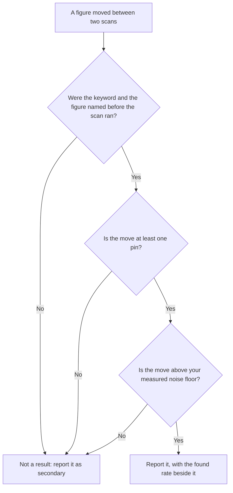

# Bias, noise, and the smallest change worth reporting

The two summary figures and the censored pins are only half of what a grid hides. The instrument also has a preferred place to stand, an unequal relationship with the ground it covers, and a measurable disagreement with itself.

## The centre is not a neutral place to stand

A grid centres on the keyword's search point when one is set, otherwise on the business coordinates — sensible, and a structural bias. The business address is where your distance term is zero and every competitor's is not: the most flattering coordinate on the map ([Rank is a map, not a number](../../01-foundations/rank-is-a-map-not-a-number/index.md)).

A symmetric lattice around it over-samples your best neighbourhood, so **an area average from a business-centred grid is biased upward** against the same area sampled from a centre chosen without reference to you.

One reading hazard follows from that, and it is in the picture rather than the arithmetic: the map drops a blue dot at the middle of the lattice and labels it *Your business*.

**The dot marks the scan, not the shop.** When you set a **Search from** location the lattice moves and the dot moves with it, so the dot marks the centre of the scan, not necessarily the address. Check which of the two you are looking at before you narrate a gradient "away from the shop".

That makes the grid a *self-centred* estimator rather than a useless one: fine while every comparison uses the same centre, lethal the moment two centres differ.

## The grid is not a sample of your customers

A lattice weights every point equally: a pin over a reservoir, a motorway junction and a housing estate of four thousand people each contribute 1/N.

So coverage is a share of **ground**, not of **demand** — which makes "we are visible to 40% of the city" wrong twice, since ground is not people and appearing in the pack is not being seen. Nor is coverage comparable between businesses on different terrain: fifteen pins over farmland and fifteen over tenements are not the same measurement in different clothes.

The repair is editorial, not statistical: decide which pins matter before you read them. Where do this client's customers come from — bookings, delivery addresses, catchment? Name those four or five pins, read those, report the rest as context. *(Inference — no tool the manual is aware of, this one included, weights grid points by demand.)*

## How much does a grid disagree with itself?

Here is the question nobody selling grid scans answers: **run the same grid twice, an hour apart, having changed nothing — how different is the second result?**

If the answer is four pins, a report claiming a four-pin improvement is reporting nothing — and you cannot know which side of that line you are on until you measure it.

**Expect it to be non-zero** *(inference, from the mechanism rather than a published study)*: rank is a sort order over frequently near-tied scores, so a small recomputation reorders businesses, and Google's index changes continuously.

Two properties of a grid scan narrow the field, though. It runs server-side with no logged-in user, no history and no device, so **the personalisation you get on your own phone — your account, your search history, your handset — is not in play here**.

And every point is an explicit coordinate rather than an inferred location, so the searcher's position is exactly reproducible. What varies is Google's answer, not the question.

*(Open question: Google publishes nothing about whether its place results vary between otherwise identical server-side callers. "No personalisation" is what the absence of a user session implies, not a documented guarantee — which is another reason to measure the variation rather than assume it away.)*

Nobody outside Google can tell you how large that variation is on your market, this month; a general reliability figure for local grids is a figure nobody measured on your data. Lab 18.2 measures yours, and its output — your **noise floor** — goes into every report you write afterwards.

## Minimum detectable effect

With a noise floor you can state the smallest change your instrument can honestly detect. Two things set it; take the larger.

**Granularity.** Coverage is a count over a fixed denominator, so it moves in steps of 1/N.

| Preset | Points | One pin is worth |
| --- | --- | --- |
| Quick | 9 | 11.1 percentage points |
| Standard | 25 | 4.0 percentage points |
| Detailed | 49 | 2.0 percentage points |

On a Quick grid, "coverage rose 11 points" is the smallest non-zero change that can exist. It is one pin — and one pin flipping is the most ordinary event this instrument produces.

**The noise floor.** Whatever Lab 18.2 gave you. If two identical back-to-back scans differed by two pins, a two-pin difference next month carries no information.

> **Your minimum detectable effect is the larger of one pin and your measured noise floor. Anything smaller is not a result, whatever direction it points in.**

That gives you a test you can run on any movement before it reaches a client:

**Now the part that surprises people.** Normally you shrink an error bar by increasing the sample size. **Here you cannot**: all three presets scan at the same one-mile spacing and differ only in how far out they reach — the buttons say so, `3×3 · ~2 mi`, `5×5 · ~4 mi`, `7×7 · ~6 mi`.

A Detailed scan is therefore a same-density reading of roughly nine times the ground a Quick scan covers, not a sharper reading of the same ground ([Lab 4.2](../../01-foundations/rank-is-a-map-not-a-number/index.md)). Increasing n changes the estimand instead of sharpening the estimate — finer granularity of a *different quantity*, over ground that may be irrelevant.

## Three traps that survive good statistics

**Regression to the mean.** An unusually bad reading is what prompts you to act; you act, re-scan, and part of the recovery is the noise returning to centre. Intervening *because* of an extreme reading guarantees an apparent improvement even from a change that did nothing. Baseline on a schedule, and judge on three readings, not two.

**Multiple comparisons.** Ten tracked keywords, three figures each, plus a compass direction, is thirty-odd numbers a month, and one will have moved impressively. Picking it afterwards is a horoscope with coordinates. The defence costs nothing: **name the keyword and the figure before you run the scan.**

**A chart with no time axis.** The **Top-3 coverage** line above the map plots scan number, **not time**, so two scans an hour apart and two a year apart sit the same distance apart — and it draws each scan at whatever preset it was run at. A steep-looking line can be one afternoon of scanning, or a change of preset.

> **Without SEOG** · The arithmetic is identical by hand: one row per coordinate, one column per scan date, four band counts per column, and a note recording the preset, centre and keyword for every column. The labour is where discipline slips, not the mathematics. See [Doing all of this without SEOG](../../99-appendix/doing-it-without-seog.md).

---

**Next:** [Labs: score a grid, measure noise, set the effect size →](./grid-audit-labs.md)
