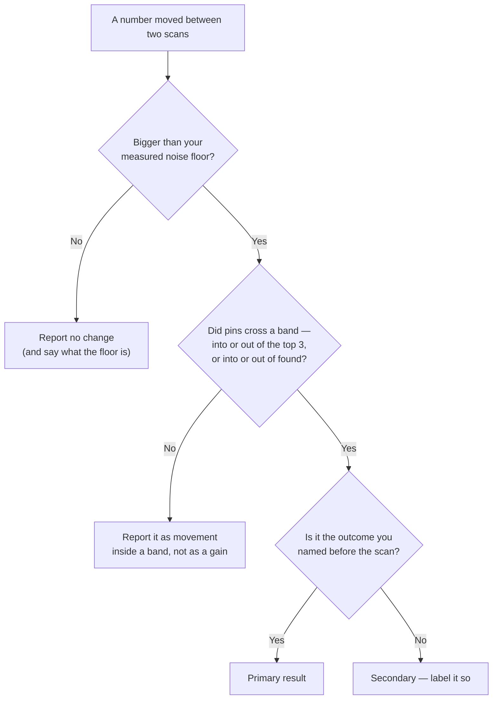

# Labs: score a grid, measure noise, set the effect size

The three labs below turn the preceding argument into numbers you own: one stored scan scored four ways, your own noise floor, and your own effect size written down before the evidence exists.

## Labs

### Lab 18.1 — Score one grid four ways

> **Lab** · Where: **Rankings** (`/b/{businessId}/rankings`) · Cost: **free** · Time: ~15 min
>
> You need: a stored grid scan — [Lab 4.1](../../01-foundations/rank-is-a-map-not-a-number/index.md). Re-reading a stored scan never re-fetches, so this costs nothing however long you take.

1. Open **Rankings**, select the keyword, and let the stored scan load under **Geographic visibility**. Note the **Checked …** stamp so you know which scan you are reading.
2. Count the pins into four bands by colour: top 3 (green), 4–10 (yellow), 11–20 (orange), not found (grey). The four must sum to your point count. (The legend lists a fifth band, red **20+**; on a finished scan it is always empty, for the reason above.)
3. Compute the found rate — ranked pins ÷ all pins — and check it against the plain-language paragraph above the map, which states it in words.
4. Compute "average rank" three ways: over found pins only; with every grey pin imputed at 21; with every grey pin imputed at 50. Write all three side by side, then find which one the app's **Avg rank** matches. It is the first.
5. The fourth way is to refuse the average. Write the sentence you would actually put in a report: it must carry the found rate and the top-3 count, and must not carry an unqualified mean.

**What good looks like.** Three numbers differing by a factor of two or more, from one unchanged scan. If yours are close together your found rate is high — good news about the business, poor as a demonstration; repeat on a weaker keyword.

**If it went wrong.** Your bands do not sum to the point count: you are probably in compare mode, whose pins are coloured by movement rather than position — press **Show ranks**. **Avg rank** shows `—`: you appeared nowhere, so the found-only mean has no denominator and the app declines to print a zero. That dash is honest output.

**What you just learned.** A summary over censored data is a statement about the data *plus* an assumption about what is missing, and the assumption is invisible. Reporting counts instead of a mean is not coyness — it is refusing to smuggle an assumption into a client's inbox.

### Lab 18.2 — Measure your noise floor

> **Lab** · Where: **Rankings** (`/b/{businessId}/rankings`) · Cost: **paid** · Time: ~20 min
>
> You need: one tracked keyword. This runs **two** grid scans and is charged twice — use the **Quick** preset, and do it once rather than as a habit. The result is reusable for months.

1. Pick a keyword where the business is genuinely competitive — some green pins, some grey. A uniform grid cannot show movement and reports a comforting, meaningless zero.
2. Change nothing today: no profile edits, no posts, no replies. This is a null experiment, and any action invalidates it.
3. Select **Quick** (`3×3 · ~2 mi`, `9 searches`) and press **Check now**. Record the found rate, top-3 coverage and the four band counts.
4. Wait about an hour, then press **Check now** again at the **same preset**, so this pair is the newest two and the comparison pairs the scans you intend.
5. Click **Compare with previous scan** and read the strip: *N improved · N newly ranked · N dropped · N lost*. Every non-zero count there is **noise** — nothing changed in the world between the runs.
6. Write down three figures — how many of the nine pins moved at all, the largest single move in positions, the change in top-3 coverage — then your noise floor as a sentence to reuse: *"Two identical scans an hour apart differed at X of 9 points and by Y coverage points. We do not report movements below that."*

**What good looks like.** Three results, all valid.

- *Zero pins moved* — encouraging, and one observation rather than proof.
- *Two or three moved by a position each* — the ordinary case, and now you know it.
- *Coverage moved 11 points with the pins otherwise stable* — one pin crossed the top-3 line, and the smallest possible change looked like a double-digit gain.

**If it went wrong.**
- *No **Compare with previous scan** link.* Only one stored scan exists — confirm the first completed before you ran the second.
- *"These scans don't overlap — no comparable points."* The centre moved between runs; check the location chip beside the keyword, which shows whatever was typed into **Search from** when it was added. Nothing else produces that on two back-to-back runs.
- *Outer pins show a neutral dot.* You changed preset, so only the shared inner pins are evidence. Re-run at one preset. And if both scans came back entirely grey, you measured nothing — pick a keyword the business competes for.

**What you just learned.** Reliability is measured, not assumed, and it is cheap. One honest "that is inside our noise" in a client meeting is worth more than a year of green arrows.

### Lab 18.3 — Set the effect size before you look

> **Lab** · Where: **Rankings** (`/b/{businessId}/rankings`) · Cost: **free** · Time: ~15 min
>
> You need: Lab 18.2, and the change log from [Lab 17.4](../../02-core-practice/did-it-work/index.md).

1. Write your minimum detectable effect: the larger of one pin at your preset (11.1 / 4.0 / 2.0 coverage points for 3×3 / 5×5 / 7×7) and your noise floor.
2. Choose **one** keyword as the primary outcome for the next re-scan and **one** figure on it — found rate or top-3 coverage. Write both down, dated, before any scan runs. Everything else next month is secondary and is labelled so.
3. On a map of the actual town, mark the four or five grid points over places the client's customers really come from. That is your weighted reading; record your position at each.
4. State the decision rule in advance: *"If [figure] on [keyword] moves by more than [MDE] in the direction we predict, we call it plausible. Otherwise we report no change."* A rule that accepts movement either way is not a rule.
5. Diary the re-scan — fortnightly at most for profile and review work *(inference — see [Did it work?](../../02-core-practice/did-it-work/index.md))*, on the calendar rather than in reaction to a bad reading.

**What good looks like.** A dated half-page, written before the evidence exists, that a sceptical colleague could hold you to. When next month disappoints, it is what stops you going looking for a number that did move.

**If it went wrong.** Your MDE exceeds any change you realistically expect — common on a Quick grid, where one pin is 11 coverage points. That is information, not failure: either move to a larger preset, accepting that you are now measuring a bigger area, or drop coverage as the primary outcome and use the found rate and band counts.

**What you just learned.** Deciding what counts as success *before* seeing the data is the whole difference between measurement and storytelling, and it costs one paragraph.

Put together, the three labs leave you with one rule you can apply to any scan that lands from now on:

*Every branch that leads away from "primary result" still produces a sentence for the client. That is the point: the rule is not a filter that hides work, it is what stops one pin of drift being sold as a quarter's progress.*

## Common mistakes

**Quoting the average without the found rate.** Carried forward from Part I because it will not die. A business found at two of twenty-five points can print a better average than one found at twenty — arithmetic on your best neighbourhood, labelled as your market.

**Treating a coverage step as a percentage.** "Up 11 points" on a Quick grid is one pin; "up 4 points" on a Standard grid is one pin. Percentage-point language makes the smallest possible event sound like a trend, and nobody has to be dishonest for it to happen.

**Reading the compare deltas as magnitudes.** A `+3` from #15 to #12 changed nothing anyone experiences; a `+3` from #4 to #1 changed the business. Count band crossings — pins entering or leaving the top 3, and the found set — not the sum of the arrows.

**Calling coverage "market share".** It is a share of lattice points, on one keyword, on one surface, at one moment, read twenty deep. Not people, not queries, not customers.

## Check yourself

Answer against your own scan, with your Lab 18.1 counts in front of you.

1. **Average rank improved from 8.2 to 6.4 while the found rate fell from 14/25 to 9/25. What happened, and what do you report?** (You lost five of your worst points; deleting them from the denominator raised the mean. Lead with the found rate and call it a decline.)
2. **Top-3 coverage went from 20% to 24% on a 5×5 grid. How many pins is that, and can you defend it?** (One. Only if your measured noise floor is below one pin. Note also that on 25 points the figure can only ever land on a multiple of four — a quoted 22% or 26% did not come from a Standard grid.)
3. **You want a more precise reading of the same three square miles. Which preset gets it?** (None. All three scan at one-mile spacing and buy extent, not resolution; a sharper reading of the same ground would need tighter spacing, which the presets do not offer.)
4. **Name every assumption inside "our average rank is 5.9".** At minimum: grey pins excluded; positions treated as an interval scale; grid centred on the business; every point weighted equally regardless of who lives there; one keyword, one surface, one moment, depth twenty.

---

**Next:** [Why rank tracking cannot work for service-area businesses →](../service-area-businesses/index.md)
