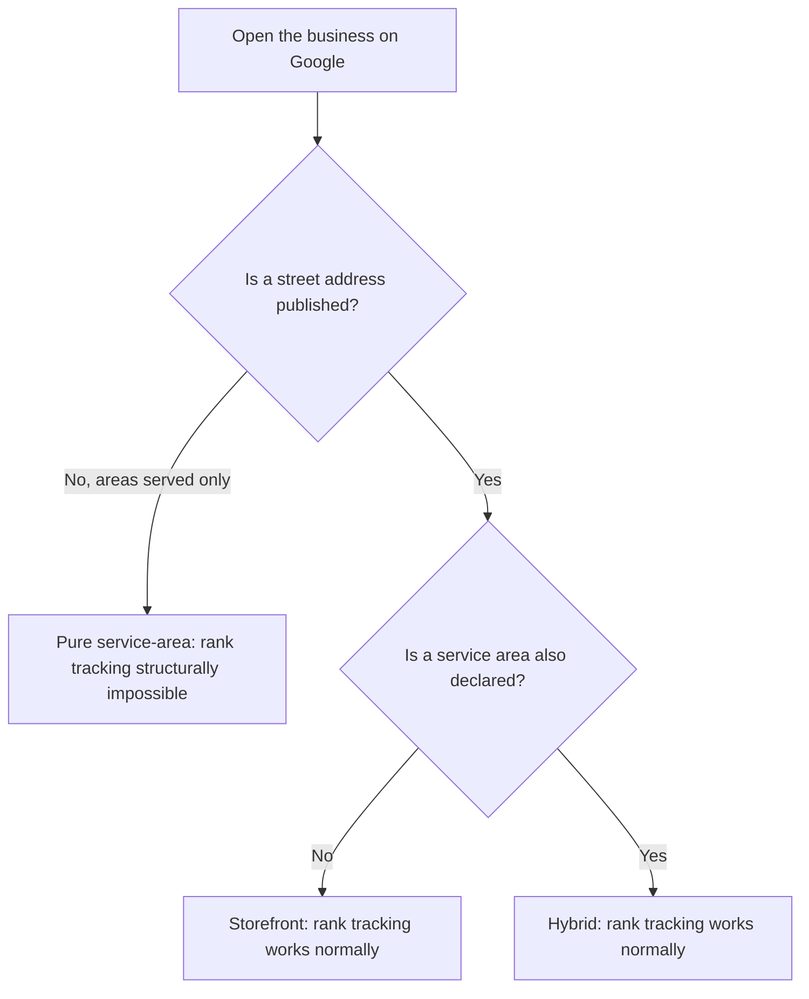

# Why map-pack rank tracking cannot work for service-area businesses

> **This chapter indicts the tool it is written in.** On a hidden-address business, SEOG will let you run a geo-grid scan, return an all-grey map, and then advise growing reviews — advice that cannot help, because the absence is structural rather than competitive. At the time of writing the product does not say so on screen.
>
> We are publishing the explanation before the fix because a practitioner being sold this metric today needs it today, and because a manual that only criticises other people's tools is marketing.
>
> If you are reading this after the in-product warning ships, the argument below still stands: the limitation is Google's, not ours, and no vendor can engineer around it.

A plumber with no shopfront can sit in the map pack all day and be permanently invisible to the instruments that measure the map pack. Not ranking badly — unmeasurable. Every grid you run for that business comes back the same colour whatever you do to the profile, and the two numbers underneath it are arithmetic on an empty set.

This is the manual's cleanest example of a measurement that produces output and means nothing. The previous chapter taught you to audit a grid you can trust; this one teaches you to spot the case no careful reading rescues.

## Three shapes of business, and only one is the problem

Google's owner-side record holds an address and a service area as two independent things. Their combination is the classification — and the classification, not the industry, decides whether any of this applies.

| Shape | Address on Google | Service area | Public coordinate | Rank tracking |
| --- | --- | --- | --- | --- |
| **Storefront** | Published | None | Yes | Works normally |
| **Hybrid** | Published | Declared | Yes | Works normally |
| **Pure service-area** | Hidden | Declared | **No** | Structurally impossible |

A hybrid — a tyre shop that also comes to you, a bakery that also caters — publishes a street address, so it has a public pin and Part II applies to it unchanged.

**Do not let a client's *self-description* decide this:** "we're mobile" is said by plenty of businesses that publish an address. Classify by what Google shows, which is Lab 19.1.

**Google's own guidance puts the pure case squarely inside the rules:** *"If you're a service-area business, you should hide your business address from customers"*, with the worked example of a plumber running the business from a residential address ([Guidelines for representing your business on Google](https://support.google.com/business/answer/3038177), verified 2026-07-27; the address help page phrases the same rule as *"You should only choose to not show your address if your business is a service-area business"*).

Note the register — Google writes *should*, not *must*, and states separately that it reserves the right to suspend profiles that violate the guidelines.

So the pure case is not an exotic misconfiguration. It is the state Google asks for from a mobile locksmith, a house cleaner, an emergency plumber, and in several trades it is the majority.

## What a rank check is actually doing

Strip the map off and the mechanism is four steps.

1. Choose a coordinate.
2. Ask Google's place data for the ranked local results there.
3. Look for your business's identifier in the returned list.
4. Your rank is the index where you found it. A grid repeats this over a lattice.

Two hard requirements, then: an identifier that *appears in the results*, and a defensible centre for the lattice. A pure service-area business fails both, independently. Either failure alone would be fatal.

## The first wall: the public record does not contain the business

Google's public place search leaves pure service-area businesses out of its results by default.

A request option exists to include them, and Google's own reference is explicit about what that buys you: such businesses *"do not have a physical address or location on Google Maps"*, and Places *"will not return"* the location-related fields for them (Places API text-search reference, verified 2026-07-27 — the option and the exact withheld field list are in [the GBP capability matrix](../../05-reference/gbp-capability-matrix.md)).

The record that comes back is not a place; it is a business that declines to be one.

SEOG's rank paths do not ask for that option — deliberately, because a result with no coordinate cannot be placed on a lattice anyway.

So step 3 never succeeds. The identifier is not in the list at any coordinate, ever, for any query. Twenty-five points, twenty-five misses, twenty-five grey pins.

Now read what that does to the two summary figures from [the previous chapter](../reading-a-geo-grid/index.md). They are computed on different denominators, so the *same* empty measurement comes out looking two completely different ways.

| Figure | Denominator | What it prints on an all-grey scan | How it reads |
| --- | --- | --- | --- |
| **Avg rank** | points where you appeared — **none** | undefined, so the app shows a dash | Honestly: "no data" |
| **Top-3 coverage** | **all** points scanned | a confident **0%** | Dishonestly: "you are nowhere" |

One of those is a measurement. The other is a division by an empty set wearing a percentage sign.

**The trap is that this looks exactly like a genuinely uncompetitive storefront.** A new coffee shop with four reviews also produces twenty-five grey pins. No statistic computed from the grid separates the two cases — only the classification does, which is why Lab 19.1 comes before every other measurement decision for this kind of client.

And the cruellest part:

> The business is not invisible to *customers*. A hidden-address plumber appears in the pack on a phone, gets called, and takes the job. The absence is in the data layer rank tools read, not in the result the searcher sees.

You are watching a real business win real work through an instrument that reports nothing.

## The second wall: there is no centre to draw from

Suppose the first wall vanished tomorrow and Google returned these businesses in ranked results, coordinates and all. The grid would still not mean what a grid means.

A rank map's whole content is *rank as a function of searcher location*. The gradient is the finding: green near the pin, fading outward, because [proximity dominates at short range](../../01-foundations/relevance-distance-prominence/index.md). For a storefront the centre is not an arbitrary choice — it is the building, the same point Google measures distance to.

A pure service-area business has no such point, so a centre has to be manufactured. SEOG manufactures one: with no usable coordinate on the profile it walks the declared service areas in order and takes the point of the first one that resolves — a town or district centroid.

**That anchor is honest engineering**, and it is what makes competitor discovery and AI probes work at all here. It is not a location of the business, and a gradient drawn from it answers "how does my rank vary with distance from the middle of Austin" — a question nobody asked.

Worse, nobody outside Google knows what Google substitutes for distance when ranking a business with no point. Whether the declared service area acts as a boundary, a weight, or nothing is undocumented.

*(Inference from absence: Google's local-ranking guidance defines the factor only as "Distance refers to how far each business is from the customer who's searching" and does not address businesses without a physical location at all — [Improve your local ranking on Google](https://support.google.com/business/answer/7091), read 2026-07-27.)*

Even a perfect rank-versus-location measurement here would measure a mechanism you cannot name.

[The centre is not a neutral place to stand](../reading-a-geo-grid/bias-noise-and-detectable-change.md) is true of every grid. For this one it is not even a place.

---

**Next:** [What to measure instead of a rank →](./what-to-measure-instead.md)
