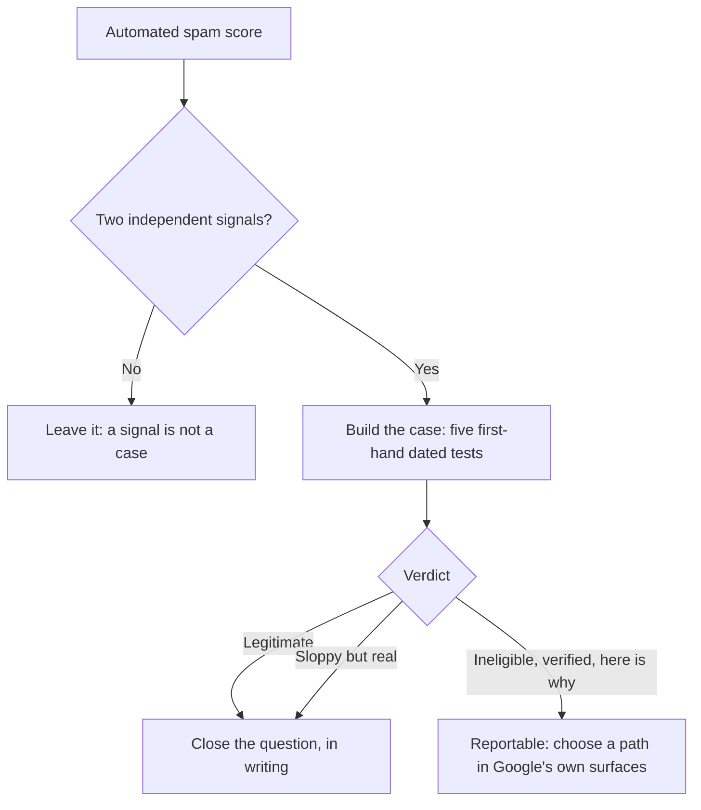

# Spam, fake listings, and the market you are measured against

The listing above you may be a mailbox with a keyword-stuffed name and forty reviews that arrived in one week. Everyone treats that as a fairness problem, and it is one.

It is also a measurement problem, and almost nobody treats it as that: your position, the local average, the target you set for a client — every one of those is computed against a market that includes businesses which do not exist.

This chapter is about detecting that to a standard you could defend, reporting it without losing a week, and knowing what it does to your numbers.

## What is actually out there

Google publishes removal figures annually. From its 2025 Trust and Safety summary, [published 16 April 2026](https://blog.google/products-and-platforms/products/maps/new-ways-were-protecting-businesses-on-maps/), for 2025:

- "over 13 million fake Business Profiles" removed
- "over 292 million policy-violating reviews" blocked or removed
- restrictions on "more than 782,000 policy-violating accounts"
- "79 million inaccurate or unverified edits" blocked

**Read what those numbers are before quoting them.** They are **removals, not prevalence**. Thirteen million removed says nothing about how many remain, and a rising count is equally consistent with more spam and with better enforcement. Anyone selling you a "% of listings are fake" figure has estimated it.

**The nearest thing to a prevalence measurement is old and narrow.** Sterling Sky's [Google Maps spam study](https://www.sterlingsky.ca/google-maps-spam-study/) (published 11 April 2022) worked through 5,306 listings across 16 industries over a four-year period, measuring for each trade the share of listings Google removed after they were reported.

It found wildly different rates by trade — garage-door repair worst at 87.6%, then junk cars and personal-injury law; funeral services, realtors and dentists at the bottom, all under 13%. How listings were selected is not fully published, so treat **the ordering as the finding and the percentages as indicative**.

**Spam concentrates in high-ticket, urgent, one-off services** where the customer never returns and cannot tell providers apart. Assume contamination in every set you measure there.

The same announcement added something owners should watch their inbox for: Google said it would begin emailing verified, active owners about significant profile edits **before those edits publish**, so a suggested change can be reviewed rather than discovered.

## Five families, and the clause each one breaks

Quotations are from Google's *Guidelines for representing your business on Google* (support.google.com/business/answer/3038177, read 2026-07-27). This is our reading of published policy, not legal advice.

**1. Keyword-stuffed names.** `Best 24/7 Emergency Plumber Leeds | Boiler Repair` is not a business name. It is a query with a company attached.

> "Including unnecessary information in your business name isn't permitted, and could result in the suspension of your Business Profile."

**2. Ineligible addresses.** Virtual offices, mail centres, unstaffed co-working desks, pins dropped in a field to catch a suburb.

> "P.O. boxes or mailboxes located at remote locations aren't acceptable."

> "If your business rents a physical mailing address but doesn't operate out of that location, also known as a virtual office, that location isn't eligible for a Business Profile."

> "Businesses can't list an office at a co-working space unless that office maintains clear signage, receives customers at the location during business hours, and is staffed during business hours by your business staff."

Note the precision of the last clause: signage **and** customers received **and** your own staff present. Written that way because "we have a desk there" was the standard defence.

**3. Duplicates.** One real business, several pins, each catching a different neighbourhood.

> "Do not create more than one page for each location of your business, either in a single account or multiple accounts."

**4. Lead-generation networks.** The hardest family and the most damaging. The listing looks ordinary; the phone routes to a call broker who sells your emergency to whichever contractor bids. There may be no company behind the name — only a number and a domain.

Google's complaint form treats this as first-class, offering **Phone number** and **Website** alongside title and address, because the fraud is in the routing rather than the façade.

**5. Review manipulation.** Gating, incentives, staff quotas, outright purchase — the verbatim policy text is in [Reviews](../../02-core-practice/reviews/index.md). This is the family you are **least** able to detect on somebody else.

## Why this is a measurement problem

**Rank is relative, so a contaminated pack contaminates your rank.** If two of the five listings above you are ineligible, "we are #6" and "we are #4 among businesses that meet Google's own criteria" are both true and answer different questions.

> Neither is dishonest. Reporting one without saying which you meant is.

**Spam sets the target you are chasing.** The competitor comparison averages rating, review count and photos across the rivals *you* chose to track, then turns the gaps into instructions — *get N more reviews to reach the average*.

Track one listing with 400 purchased reviews and that instruction is set by fraud. The arithmetic is correct and the target is wrong. Membership of the set is your judgement, and the one most people never make consciously.

**Removals and reinstatements move your rank with no action from you.** The most common false positive in the discipline. You file a report in March, a listing vanishes in April, your position improves, and the April report says the campaign worked.

It might have. You cannot tell unless the removal date sits in your change log — the discipline in [Did it work?](../../02-core-practice/did-it-work/index.md).

**A geo-grid cannot be audited for this.** A grid scan stores a position per point and nothing else: no names, no ratings, no identities. It can show visibility collapsing on the north side of town and never tell you the cause was one mailbox.

Names come only from per-keyword rank checks, so keep those running where contamination is plausible in your trade ([reading a geo-grid](../reading-a-geo-grid/index.md)).

**And competitor review fraud is mostly invisible to you.** Without owner access, public place data returns about five reviews per business, ordered by relevance rather than date. Exact count, exact average, a sample of five — enough to notice an implausible ratio, nowhere near enough to characterise a corpus.

Anyone offering fake-review analysis of a competitor is extrapolating from five, or scraping, which Google's terms prohibit ([storing Google data legally](../../05-reference/storing-google-data-legally.md)).

## Signal, case, verdict

**Automated detection produces signals.** The scoring behind the spam check — stuffed name, duplicate, implausible rating, thin profile, no website, needing two independent signals before anything escalates — is published in full in [Reading a competitor off their public data](../../02-core-practice/competitors/index.md), so you can run it by hand in any market.

It is a triage instrument: cheap, stored-data-only, blind to everything you have not tracked.

A **case** is something else: first-hand dated observation, about half an hour per listing.

| Test | What you do | What a failure looks like |
| --- | --- | --- |
| **Name** | The exact name in quotes in a web search; then the storefront photos | Appears on Google and nowhere else — no site, no invoices, no van, no door |
| **Address** | Street View the pin; then the address string in quotes | A mail centre, a residential door, a lock-up; or a suite shared by thirty company names |
| **Phone** | Call in stated hours as a customer, ask for the company by name and a visitable address; then the number in quotes | A generic greeting that cannot name the company; one number attached to eleven names across four towns |
| **Registry** | Company registry, plus the trade licence where the trade needs one | No entity, or an entity elsewhere under a different name |
| **Reviewer** | Open a few reviewer profiles | Accounts whose whole history is a handful of reviews in one week across the same few businesses |

The reviewer test is the one most likely to convince you of something false, because you are working from five reviews Google chose for relevance. Corroboration only.

A **verdict** is what you write after the case, and only three are worth having: *legitimate*, *sloppy but real*, or *ineligible, verified, here is why*. Only the third is reportable. "Looks spammy" is not a verdict; it is a feeling with a screenshot.

## Reporting, and what it is actually worth

There is no report button in SEOG, and there should not be — reporting happens in Google's own surfaces, tied to your own Google account, and both paths are free.

### The two paths

**Suggest an edit**, on the profile in Maps, is the light path: correct a stuffed name back to the real one, or use the removal option for a place that does not exist. It is also reversible in ten seconds — a verified owner changes the name straight back from their dashboard — so expect a loop rather than a fix.

**The Business Redressal Complaint Form** is the heavy path, for documented, repeated or networked cases. It asks for:

- who you are, and the affected organisation
- the type of malicious content — title, address, phone number, website, or *this business doesn't exist*
- the public Maps URL
- a written explanation, with a spreadsheet upload for multiple listings

Before spending an evening on one, read the form's own sentence about what happens next (support.google.com/business/contact/business_redressal_form, read 2026-07-27):

> "We cannot guarantee that any action will be taken on your complaint after you complete and submit this form. After we receive your complaint, you will not be updated on its status."

**That should set your time budget:** you are filing evidence into a process with no receipt, no status and no appeal.

Sterling Sky's [guide to fighting Maps spam](https://www.sterlingsky.ca/ultimate-guide-fighting-spam-google-maps/) (updated 29 August 2025), the most detailed public account, puts the Redressal Form's turnaround at "about two weeks", warns separately that a reported listing which was *verified* may simply be put back — "be prepared for someone at Google My Business (GMB) to incorrectly reinstate the listing. It happens all the time" — and concludes that spam fighting is usually not a long-term strategy in its own right.

Fake reviews are a third path — flag the review, not the listing.

### How much time this deserves

So: **time-box it.** Pick a fixed budget — an hour a month is defensible — spend it on the one or two strongest cases sitting directly above you for a keyword that matters, log them, stop.

Every hour beyond that is one not spent on reviews, completeness and content, which compound and cannot be reinstated away from you.

**And do not report a rival because they beat you:** a frivolous complaint costs the spammer nothing and costs you the ability to say honestly that your reports are evidenced.

---

**Next:** [Auditing a market, from signal to filed report →](./auditing-a-market.md)
